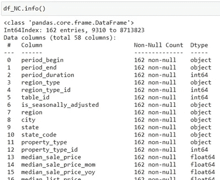
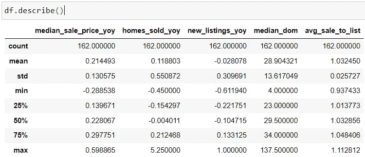
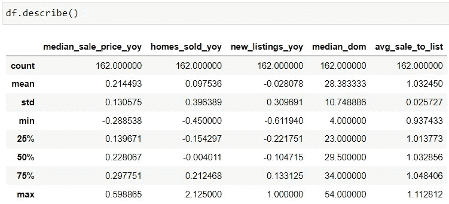
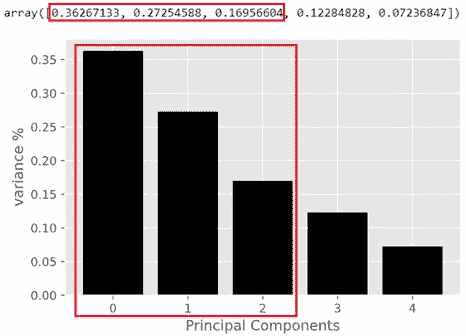
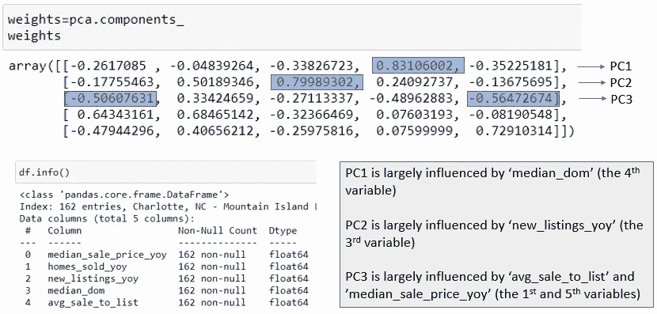
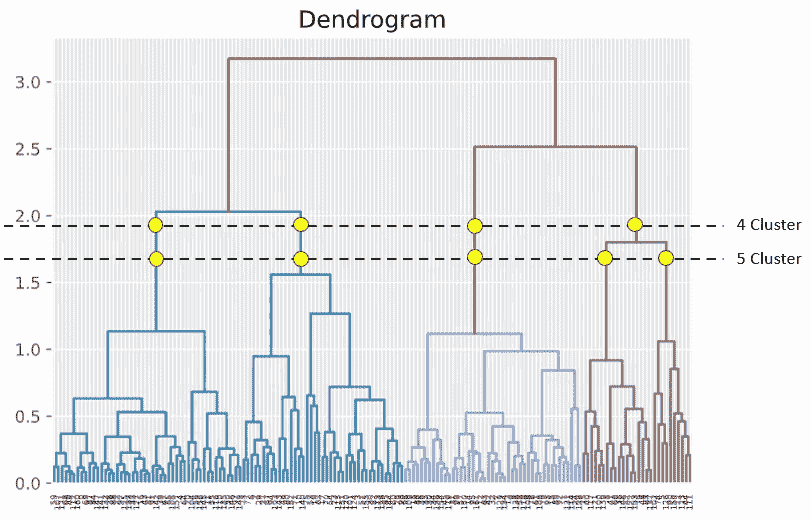
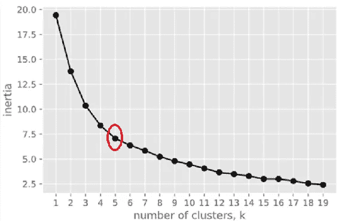
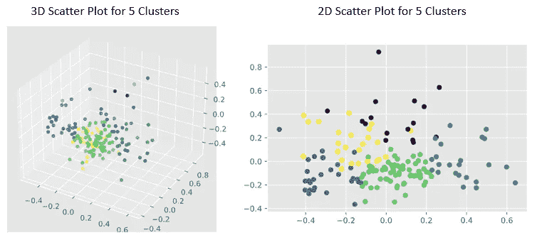
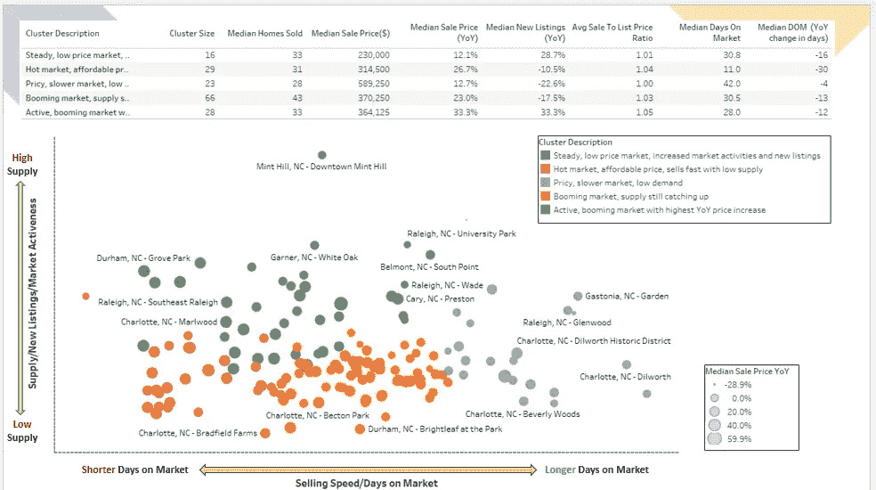

# 通过这个真实世界的房地产市场聚类分析来提高你的机器学习技能

> 原文：<https://towardsdatascience.com/sharpen-your-machine-learning-skills-with-this-real-world-housing-market-cluster-analysis-f0e6b06f6ba0?source=collection_archive---------17----------------------->

## 这是一个实践项目，结合了主成分分析、层次聚类和 K-means 来提供最佳的聚类解决方案

来自 [Pexels](https://www.pexels.com/photo/assorted-color-wall-paint-house-photo-1370704/?utm_content=attributionCopyText&utm_medium=referral&utm_source=pexels) 的[杰西卡·布莱恩特](https://www.pexels.com/@jessica-bryant-592135?utm_content=attributionCopyText&utm_medium=referral&utm_source=pexels)的照片

无论您是一名经验丰富的数据科学家，还是一名刚刚开始分析之旅的人，请相信我，在您职业生涯的某个阶段，您一定遇到过或将要遇到至少一个涉及细分/聚类分析的项目。作为一名数据科学家，这可能是最受欢迎和最重要的机器学习技能之一。

在本教程中，我将带您浏览我最近做的聚类分析，这完全是由我作为一名数据科学家对北卡罗来纳州住房市场见解的好奇心所驱使的(为什么是北卡罗来纳州？嗯，那是我住的地方，它是近年来蓬勃发展的地区，房地产市场势头强劲😉).

在这个动手项目中，您将分析从北卡罗来纳州 162 个社区收集的住房市场数据，并使用无监督的 ML 模型，根据这些社区在一些关键指标上的相似性和差异来识别这些社区的聚类。原始数据来自 [Redfin 数据中心](https://www.redfin.com/news/data-center/)，可以免费下载。

你准备好了吗？我们走吧！

# 聚类分析简介

在我们开始编码之前，让我们先回顾一下关于聚类分析的知识。聚类分析是一种非常流行的机器学习技术，广泛用于许多应用，例如客户细分、图像处理、推荐系统等。

一般来说，聚类分析属于无监督机器学习模型的范畴。顾名思义，无监督 ML 模型不是使用训练数据集进行监督的。换句话说，该算法没有为训练数据提供任何预先分配的标签(例如，聚类标签)。相反，模型从给定的数据本身中发现隐藏的模式和见解。因此，它在本质上非常具有探索性和‘好奇性’。

聚类分析实例(图片来源:[维基百科](https://en.wikipedia.org/wiki/Cluster_analysis#/media/File:KMeans-Gaussian-data.svg))

存在不同类型的聚类方法，例如基于连接的方法、基于质心的方法、基于密度的方法、基于分布的方法等等，每种方法都有其自身的优点和缺点，并且适合于不同的目的和使用情况。

在我们的项目中，我们主要关注使用上面提到的两种聚类技术:层次聚类(基于连通性)和 k-means(基于质心)。这两种无监督的 ML 技术都基于邻近性(使用距离度量)。它们很简单，但在许多集群任务中非常有效和强大。

# 下载、读取和准备数据

首先，让我们去 [Redfin 的数据中心](https://www.redfin.com/news/data-center/)，向下滚动到“它如何工作”部分，并下载“邻居”级别的区域数据。这是一个开放的数据集(。gz 文件),可以免费下载和使用。

来源:Redfin 住房市场数据(【https://www.redfin.com/news/data-center/】T2)

接下来，让我们打开 Jupyter 笔记本，导入所有必需的库，并读入数据。这是一个相当大的邻域级数据集，所以读入 python 可能需要一些时间。

这是一个庞大的数据集，因此为了简化分析和便于演示，我们只关注最近 3 个月(2021 年 7 月至 9 月)在北卡罗来纳州出售的“独栋住宅”房产。我们还会过滤掉在此期间出售少于 20 处房产的社区。

原始数据如下表所示，共有 58 列。列“区域”是邻域名称。

图片由作者提供

图片由作者提供

对于我们的聚类分析，我们不需要所有这些列。我们将基于五个要素创建聚类，因此我们使用以下代码仅保留数据框中感兴趣的字段。

具有五个特征的聚类分析数据框(图片由作者提供)

# 数据清理(缺失值、异常值等。)

在进行分析之前，让我们快速检查一下是否有任何缺失值或异常值需要处理。

图片由作者提供

数据看起来已经相当不错了。所有列都没有缺失值。看起来特征“median_dom”和“homes_sold_yoy”可能具有潜在的较大异常值，但其余特征似乎在相当合理的范围内。

使用箱线图检查异常值(图片由作者提供)

让我们通过使用以下代码将最大值限制在 99%来处理‘median _ DOM’和‘homes _ sold _ yoy’的异常值。

异常值处理后的数据框(图片由作者提供)

# 执行 PCA(主成分分析)

在我们将我们的特征输入聚类算法之前，我总是建议您首先对您的数据执行 PCA。PCA 是一种降维技术，允许您只关注能够代表数据中大部分信息和差异的几个主要成分。

在聚类分析的背景下，特别是在我们没有大量特征的情况下，执行 PCA 的主要优势实际上更多的是可视化。执行 PCA 将帮助我们识别前 2 或 3 个主成分，以便我们可以在 2 或 3 维图表中可视化我们的聚类。

为了进行 PCA，让我们首先将我们所有的特征归一化到相同的尺度，因为 PCA 和基于距离的聚类方法对异常值和不同的尺度/单位很敏感。

接下来，让我们执行 PCA 分析，并使用下面的代码显示解释数据中大部分差异的主要成分。

您可以看到，前 3 个主成分加在一起解释了数据中约 80%的方差。因此，我们可以只使用前 3 个主成分进行聚类，而不是使用我们模型的所有 5 个特征。

图片由作者提供

最后，让我们看看每个原始变量在这些主成分上的权重，以便我们可以很好地了解哪些变量对哪些主成分影响最大，或者换句话说，我们可以推导出这些主成分的一些意义。

图片由作者提供

这个看着挺有意思的！PC1 在很大程度上受“median_dom”(市场中值天数)的影响，因此这个主成分代表了一个社区的房产销售速度。我们可以称之为“销售速度”。

PC2 在很大程度上受“new_listings_yoy”(与去年同期相比，新上市数量的增加)的影响，因此这一项代表库存数量或新上市数量的同比变化。我们可以称之为“供应/需求/新上市”。

PC3 在很大程度上受“avg_sale_to_list”(销售价格除以标价的比率)和“median_sale_price_yoy”(销售价格中值的年变化)的影响，这两者都与价格有关。我们可以给 PC3 贴上“销售价格变化”的标签。

# 执行分层聚类

我们已经准备好将数据输入到聚类算法中了！首先，我们将尝试分层聚类。分层集群最棒的一点是，它允许您构建一个集群树(称为“树状图”)来可视化集群步骤。然后，您可以水平分割树，根据树结构选择最有意义的集群数量。

图片由作者提供

在上面的树状图中，我们可以看到，根据您放置水平线的位置，您会得到不同数量的聚类。看起来 4 集群或 5 集群都是合理的解决方案。让我们用散点图绘制 4 集群解决方案，看看它是什么样子。

图片由作者提供

这并不坏，它让我们对这个数据中可能存在多少个可能的聚类以及这些聚类在散点图中的样子有了一个基本的了解。然而，层次聚类的结果似乎并不理想，因为我们可以看到，有一些“有问题”的数据点可能被分配到错误的聚类中。

分层聚类虽然在通过树结构可视化聚类过程方面非常有帮助，但也有一些缺点。例如，分层聚类只对数据进行一次遍历。这意味着在流程早期错误分配或指派的记录不能在随后重新指派。

因此，我们很少使用层次聚类解决方案来停止分析，而是使用它来“直观地”了解聚类可能的样子，然后使用迭代方法(例如，k-means)来改进和完善聚类解决方案。

# 执行 K 均值聚类

K-means 是一种非常流行的聚类方法，通过该方法，我们指定所需的聚类数 k，并将每个记录分配给 k 个聚类中的一个，以便最小化聚类内的离差度量。

这是一个迭代过程，它分配和重新分配数据点，以最小化每个记录到其分类质心的距离。在每次迭代结束时，都会实现一些改进，并重复该步骤，直到改进非常小。

要执行 k-means 聚类，我们需要首先指定 k(聚类数)。我们可以通过几种方式做到这一点:

1.  使用我们的领域知识或过去的经验指定 k
2.  执行层次聚类，以初步了解可以尝试多少个聚类
3.  用“肘”法确定 k

从上一步的树状图中，我们已经知道 k=4(或 k=5)似乎工作得很好。我们还可以用‘肘’的方法再检查一遍。下面的代码绘制了“肘”图，告诉我们最佳集群数量的转折点在哪里。

图片由作者提供

看起来结果与我们从树状图中得到的非常一致:4 和 5 都是合理的聚类数目，所以让我们尝试 k=5。下面的代码生成 5 个聚类的三维散点图。

图片由作者提供

# 描述集群并获得洞察力

现在我们有了我们的聚类，让我们将聚类标签添加回我们的原始数据框(df_NC ),将其导出到一个. csv 文件并从中获得见解。

我使用我最喜欢的仪表板工具 Tableau 来可视化这些集群的特征、相似性和差异。我在二维散点图中绘制聚类，就像我们在 Python 中所做的一样。

x 轴是我们称为“销售速度”的第一个主成分。y 轴是我们标记为“供应/新上市”的第二个主成分。圆圈的大小代表第三个主要成分，即“价格变化/销售额与价目表比率”。在这个控制面板中，您还可以将鼠标悬停在每个圆圈上，查看哪些是热门市场区域，工具提示中会提供更多详细信息。

图片由作者提供

祝贺您跟随教程，并通过这个动手项目提升您的机器学习技能！我希望你喜欢这篇文章。快乐学习！

[*你可以通过这个推荐链接报名 Medium 支持我。通过这个链接注册，我将收到你的会员介绍费的一部分。谢谢大家！*](https://medium.com/@insightsbees/membership)