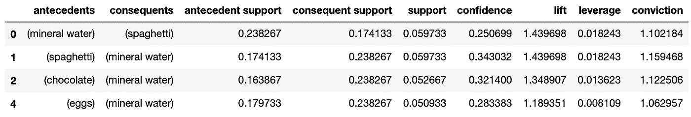

# Python 中的商店订单分析

> 原文：<https://towardsdatascience.com/shop-order-analysis-in-python-ff13615404e0?source=collection_archive---------15----------------------->

## 用 Apriori 算法进行产品分析


照片由[杰玛](https://unsplash.com/@_gemmajade?utm_source=medium&utm_medium=referral)在 [Unsplash](https://unsplash.com?utm_source=medium&utm_medium=referral) 上拍摄

Apriori 算法用于数据挖掘，以识别数据集中的频繁项和关联规则学习。本文将关注一个实用且常见的用例，商店订单分析。例如，订购哪些产品比其他产品更频繁，以及订购哪些不相关的产品是订购另一种产品的结果。换句话说，也许购物者在买牙刷的时候会买牙膏，或者买面包的时候会买黄油。他们没有直接的联系，但是在两者之间找到联系并不是没有道理的。Apriori 算法有助于识别这些关联规则。

本文将提供一个非数学的演练，演示它如何使用 Python mlxtend 库工作。对于进一步的阅读，我推荐彼得·哈灵顿**的《机器学习在行动** 》中的**第 11 章**。

[](https://www.manning.com/books/machine-learning-in-action) [## 机器学习在行动

### 行动中的机器学习是独特的书，融合了机器学习的基础理论与实践…

www.manning.com](https://www.manning.com/books/machine-learning-in-action) 

## 准备

我将使用一个 [**Jupyter 笔记本**](https://jupyter.org/) 来演示这一点。如果你的本地系统上没有安装 [**Jupyter 笔记本**](https://jupyter.org/) 你也可以使用 [**Google Colab**](https://colab.research.google.com/) ，它有免费的云版本。

我将使用用于 Python 的"[**mlx tend**](http://rasbt.github.io/mlxtend/)" Apriori 库。如果你没有安装它，你可以通过命令行或通过 Jupiter 笔记本直接安装。

```
# from the command line
$ **python3 -m pip install pandas mlxtend ploty matplotlib networkx**# or, from Jupyter notebooks
**!python3 -m pip install pandas mlxtend ploty matplotlib networkx**
```

像往常一样，Jupyter 笔记本的第一步是加载所需的库。

```
import pandas as pdimport networkx as nx
import plotly.express as px
import matplotlib.pyplot as plt
plt.style.use('default')from mlxtend.frequent_patterns import apriori
from mlxtend.frequent_patterns import association_rules
```

## 数据收集

出于本演练的目的，我将使用我在 [Kaggle](https://www.kaggle.com/) 上找到的一个数据集，名为“[购物篮优化](https://www.kaggle.com/roshansharma/market-basket-optimization)”。该数据集在订单中有一个很好的产品组合，但不是以一种清晰的方式呈现的。我不得不进行一些预处理以使其可行。

```
df_orders = pd.read_csv('Market_Basket_Optimisation.csv')
df_orders.shape
**(7500, 20)**
```

我们的数据集有 7500 行和 20 个特征。


作者图片

我不太确定为什么数据集的作者会这样展示数据。

第一步是创建一个求反的正则表达式。用下划线替换所有非字母数字字符和换行符。

```
df_orders = df_orders.replace(r'[^A-z0-9\n]+','_', regex=True)
```

然后，我们需要创建一个名为“ **combined** 的新特性，它的每一行都有一个 CSV 格式的列。

```
x = df_orders.to_string(header=False, index=False, index_names=False).split('\n')
vals = [','.join(e.split()) for e in x]
df_orders['combined'] = [','.join(e.split()) for e in x]
```

现在的问题是 NaN 词条也是这样收录的:
汉堡，肉丸，鸡蛋，NaN，NaN，NaN 等。

我们删除这些条目的方法是使用正则表达式。

```
df_orders_tmp = df_orders[['combined']].replace(to_replace=r',NaN.*$', value='', regex=True)
```

因此，第一行的“**组合**功能现在看起来像:
汉堡、肉丸、鸡蛋

我还想包括一个订单号功能，它只是复制索引号。

```
df_orders_tmp['orderId'] = df_orders_tmp.index
```

我们现在用逗号将每个订单分成单独的行。

```
df_orders_tmp = df_orders_tmp.assign(combined=df_orders_tmp.combined.str.split(',')).explode('combined').reset_index(drop=True)
```

我们现在想用空格替换上面的临时下划线。

```
df_orders_tmp = df_orders_tmp.replace(r'_',' ', regex=True)
```

如果您想知道为什么要这样做，数据集中的一些意外字符会导致“**内爆**过程出现问题。解决方案是将它们全部替换为下划线，执行拆分，并将空格放回原处。

我们需要订单中购买的每个项目的数量。这看起来很简单，因为每一列都是购买的一件商品，所以我将对每一行反映 1。

```
df_orders_tmp['itemQuantity'] = 1
```

用我们需要的有意义的名称的列来完成我们的新数据框架。

```
df = df_orders_tmp[['orderId','combined','itemQuantity']]
df.columns = ['orderId','itemDescription','itemQuantity']
```

让我们来看看…

```
df
```


作者图片

## (英)可视化(= visualization)

```
df_table = df.copy()
df_table['all'] = 'all'fig = px.treemap(df_table.head(30), path=['all', "itemDescription"], values='itemQuantity', color=df_table["itemQuantity"].head(30), hover_data=['itemDescription'], color_continuous_scale='Blues')fig.show()
```


作者图片

```
df.value_counts()
```


作者图片

另一个非常好的可视化是一个网络图，显示订单中的前 15 个产品。

```
df_network = df.copy()
df_network_first = df_network.groupby("itemDescription").sum().sort_values("itemQuantity", ascending=False).reset_index()
df_network_first["itemType"] = "groceries"
df_network_first = df_network_first.truncate(before=-1, after=15) # top 15plt.rcParams['figure.figsize']=(20,20)
first_choice = nx.from_pandas_edgelist(df_network_first, source='itemType', target="itemDescription", edge_attr=True)
pos = nx.spring_layout(first_choice)
nx.draw_networkx_nodes(first_choice, pos, node_size=12500, node_color="lavender")
nx.draw_networkx_edges(first_choice, pos, width=3, alpha=0.6, edge_color='black')
nx.draw_networkx_labels(first_choice, pos, font_size=18, font_family='sans-serif')
plt.axis('off')
plt.grid()
plt.title('Top 15 Products', fontsize=25)
plt.show()
```


作者图片

为了继续，我们需要汇总同一订单中的多个产品。

```
df_grouped = df.groupby(['orderId','itemDescription']).sum()['itemQuantity']
```


作者图片

现在，我们需要拆分已分组的数据帧。

```
df_basket = df_grouped.unstack().reset_index().fillna(0).set_index('orderId')
```


作者图片

现在需要将矩阵中的值编码为 1 和 0。我们的方法是，如果值小于或等于 0，则将值设置为 0，如果值大于或等于 1，则将值设置为 1。

```
def encode_units(x):
    if x <= 0:
        return 0
    if x >= 1:
        return 1basket_sets = df_basket.applymap(encode_units)
basket_sets.head()
```


作者图片

## Apriori 算法

我们将使用函数" **apriori** "，从" **mlxtend** "库打开，" **basket_sets** "创建一个数据框架，"**frequency _ items sets**"，并支持每一项。我们将把参数设置为“**先验**”到“**最小支持= 0.05** ”和“**使用列名=真**”。

**重要术语**

*   **前件** ( **if** )是 Apriori 算法的第一部分。将在数据集中找到该商品或产品。我们说“**如果**”是因为“**如果**”存在，那么很可能“**的结果**也将存在，“**然后**”。
*   **后件** ( **then** )是 Apriori 算法的第二部分。结合“**先行词**”找到的商品或产品。
*   关联规则是从由两个或更多项目组成的数据集(例如商店订单)中计算出来的。
*   **支持度**表示该商品在数据集中出现的频率，例如某产品在商店中的受欢迎程度
*   置信度表示该规则被发现为正确的频率。它表明该规则有多可靠。有人在购买牙刷时会购买牙膏的可能性有多大
*   **Lift** 是一种度量标准，用于测量产品在统计上独立的情况下同时出现的置信比率。例如，当购买一个产品时购买另一个产品的可能性有多大，同时控制另一个产品有多受欢迎。提升分数接近 1 表示前提和结果是独立的，前提的出现对结果的出现没有影响。提升分数大于 1 表明前因和后果相互依赖，且前因的出现对后果的出现有积极影响。提升分数小于 1 表明前因和后果是相互替代的，这意味着前因的存在对后果有负面影响，反之亦然。
*   **信念**从统计独立性来衡量规则的隐含强度。信念得分是一个比率，它是一种产品在没有另一种产品的情况下出现的概率与一种产品在没有另一种产品的情况下存在的实际概率之间的比率。例如，如果(橙子)→(苹果)关联的信念得分为 1.5；如果两者之间的关联是完全独立的，则该规则错误的几率会增加 1.5 倍(增加 50%)。

```
frequent_itemsets = apriori(basket_sets, min_support=0.05, use_colnames=True).sort_values(by=['support'], ascending=False)
frequent_itemsets.head()
```


作者图片

这是在告诉我们“**矿泉水**”、“**鸡蛋**”、“**意大利面**”是这家店最受欢迎的商品。“ **min_support** ”参数需要根据数据集进行微调。0.05 在这里工作得很好，但如果你尝试其他数据集，你可能需要在某些情况下将其降低到 0.01。

使用函数，" **association_rules** " from，" **mlxtend** "创建 dataframe from，"**frequency _ items ets**"使用参数度量，" **lift** "。

```
rules = association_rules(frequent_itemsets, metric="lift")
rules.head()
```


作者图片

重申一下，“**前因**是正在购买的产品，“**后果**是经常购买的产品，以及它们相关的可能性。

理想情况下，我们寻找提升和信心都很高的参赛作品。类似于" **lift** "大于等于 6，以及" **confidence** "大于等于 0.8。简单重述一下，“ **lift** ”是“**实际置信度**”和“**预测置信度**”之间的比值。大于 1.0 的升力比意味着两个产品之间的关系比如果两个集合是独立的所预期的更重要。升力比越大，关联越显著。“置信度”是规则被发现为正确的频率。换句话说，这个规则作为百分比有多可靠。

我们寻找的是“**提升**”和“**信心**”最高的规则。这在熊猫身上很容易过滤。至少我们希望"**升力**"大于 1，但尽可能高。对于“**置信度**”我将规则设置为等于或高于 25%。

```
rules[ (rules['lift'] > 1) & (rules['confidence'] >= 0.25) ]
```



作者图片

这告诉我们，在这家商店，如果有人买了“**意大利面**”，他们也有 34%的可能会买“**矿泉水**”。

## 最后

Apriori 算法在数据挖掘中非常有用。最常见的使用案例是零售市场、推荐系统、营销活动、用户行为分析等。

# 迈克尔·惠特尔

*   ***如果你喜欢这个，请*** [***跟我上媒***](https://whittle.medium.com/)
*   ***更多有趣的文章，请*** [***关注我的刊物***](https://medium.com/trading-data-analysis)
*   ***有兴趣合作吗？*** [***我们上 LinkedIn***](https://www.linkedin.com/in/miwhittle/) 连线吧
*   ***支持我和其他媒体作者*** [***在此报名***](https://whittle.medium.com/membership)
*   ***请别忘了为文章鼓掌:)←谢谢！***