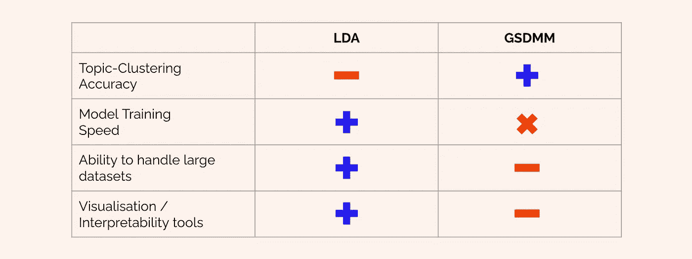

# 短文本主题建模:LDA 与 GSM

> 原文：<https://towardsdatascience.com/short-text-topic-modelling-lda-vs-gsdmm-20f1db742e14?source=collection_archive---------2----------------------->

## 使用阿拉伯推特数据对短文本文档的两种自然语言处理主题建模方法的比较分析

通过 iStock 向作者许可的图像

在本文中，我对应用于短文本文档的两种主题建模方法进行了比较分析，例如推特:**潜在狄利克雷分配** (LDA)和 **Gibbs 抽样狄利克雷多项式混合**(GSM)。我解释了算法中的主要差异，提供了它们如何在幕后操作的直观性，解释了每种算法的预处理要求，并评估了它们在聚类不同数量的短文本文档时的比较性能。

*这篇文章是* [*一个更大的项目*](/identifying-arabic-language-political-misinformation-on-twitter-3a614c489c00) *的副产品，在这个项目中，我使用了主题建模和聚类来从 3600 万条阿拉伯语推特中识别政治错误信息内容。*

[在领英上跟我来](https://www.linkedin.com/in/richard-pelgrim/)获取常规数据科学内容。

# 差异

很可能您在登录本页之前就已经听说过 LDA 了。这是目前最流行的主题建模算法。然而，GSM 并不享有同样的地位。这是一种鲜为人知的主题建模算法，因此也没有得到广泛的实施。有点像贾斯汀比伯和他同母异父的兄弟杰克森。

图像通过[giphy.com](https://giphy.com/gifs/teamcoco-conan-obrien-3oFzm733B3O1nHHQek)

撇开流行明星评级不谈，这两种方法的主要区别在于，LDA 假设每个文档(在我们的案例中是推特)都由多个主题组成，并计算每个主题对文档的贡献。另一方面，GSM 专门针对检测较小文档中的主题，并假设**每个文档只有一个主题。**这就是为什么[有人认为](/a-unique-approach-to-short-text-clustering-part-1-algorithmic-theory-4d4fad0882e1)更适合推特这样的微博内容的话题建模。

这两种方法之间的另一个区别是，LDA 要求预先设置主题的数量，而 GSM 只要求一个上限(max。主题的数量)并将从那里工作以从数据推断主题的数量。

# LDA 是如何工作的

## 直觉

[这篇文章](/light-on-math-machine-learning-intuitive-guide-to-latent-dirichlet-allocation-437c81220158#:~:text=Topic%20modelling%20refers%20to%20the,describes%20a%20set%20of%20documents.&text=And%20the%20goal%20of%20LDA,captured%20by%20those%20imaginary%20topics.)提供了一个关于 LDA 如何在幕后工作的很好的介绍性解释(如果你愿意的话，还会探究这一切背后的数学)。简而言之，LDA 假设**每个文档由主题分布组成，每个主题又由单词分布组成**。既然我们已经有了我们的文档(tweets)和我们的文字，那么 LDA 算法的任务就是构建连接两者的隐藏(“潜在”)层:主题。

因为 LDA 假设每个文档有多个主题，所以模型将返回每个主题对文档的百分比贡献的概率分布，例如 **0.3 *主题 _1，0.7 *主题 _2** 。这意味着 30%的文档包含属于主题 1 的单词，剩余的 70%包含属于主题 2 的单词。反过来，主题被定义为单词簇，这些单词簇也具有百分比贡献。所以 Topic_1 可能由 0.3 *面粉、0.2 *黄油、0.2 *奶油、0.1 *苹果、0.1 *樱桃、0.1 *黑莓组成……这意味着 Topic_1 很可能是不同种类的水果派食谱的集合。

图片由瑞切尔·亨特通过[giphy.com](https://giphy.com/gifs/foxadhd-artists-on-tumblr-rachael-hunt-ZGvR8iThPE5Xi)拍摄

一旦建立了 LDA 模型，您就可以选择提取最主要的主题(即，具有最大百分比贡献的主题)或者将您的文档建模为主题的分布，这取决于您的用例。

## 为 LD 惊人的成功设置您的数据

下面是使用 **gensim** python 库建立 LDA 模型所需的预处理的分步脚本。请注意，我过滤掉了字典中的一些极端情况(经常出现或很少出现的单词，因此可能会扭曲数据)，并且我使用 LDA 的**多核**实现来允许本地并行处理，以加快模型构建。

在我的机器上，当对 615 万条推文建模时，每个 LDA 实例需要大约 1 小时来完成。这意味着，根据数据的大小，可以相对容易地运行 LDA 模型的多个实例，以查看哪些数量的主题和其他超参数在捕获数据中的一致主题方面做得最好。

为了让您了解默认情况下和 LDA 模型的输出，下面是我的 Jupyter 笔记本的截图:

正如你所看到的，每个主题都被打印成单词和它们对主题的贡献百分比的“等式”。这让我们对每个主题的内容有了很好的第一印象。

## 想象你惊人的结果

使用流行库的好处之一是，肯定会有一些很酷的其他库与您创建的输出很好地融合在一起。一个例子是 pyLDAvis 库，它出色地完成了 LDA 的粗略输出(见上图),并将其融入到 magic sauce 中，以创建输出的交互式 HTML 可视化报告。

正如你在下面的 quick-n-dirty 截屏中看到的，pyLDAvis 报告在左侧的主题间距离图上绘制了主题(在我们的例子中是 5 个，参见上面脚本中的 **num_topics** )。在右侧，报告列出了与每个主题最相关的前 30 个单词。你会发现一旦你选择了右边的一个单词，左边的圆圈就会移动。选择一个单词将显示该单词出现在哪个主题(一个或多个)中。圆圈将根据所选单词对特定主题的贡献百分比而增大。这确实有助于我们理解潜在主题层的内容和架构。

# GSDMM 的工作原理

## 直觉

虽然 LDA 在较大的文本(> 50 个单词左右)上表现很好，但在尝试对较短文本的主题进行建模时，它的性能往往会下降，原因很明显，一个简短的文本(如一条推文或一个论坛问题的标题)可能只涉及一个主题。

进入 GSDMM:一个替代的主题建模算法，正是从这个假设出发。

图片来自 giphy.com

为了理解 GSDMM 是如何工作的，理解一个类似的概率过程是有帮助的，这个过程通常被称为**电影组过程**。我将从 Matyas Amrouche *的这篇文章中复制一个简单的叙述式解释:

> “想象一下，一群学生在一家餐馆里，随机坐在 K 张桌子旁。他们都被要求在纸上写下他们最喜欢的电影(但必须是一个简短的名单)。目标是以这样一种方式将他们聚集在一起，使得同一组中的学生分享相同的电影兴趣。为此，学生必须根据以下两条规则逐一选择新的桌子:
> 
> 规则一:选择学生多的桌子。这个规则提高了完整性，所有对同一部电影感兴趣的学生都被分配到同一个桌子上。
> 
> 规则 2:选择一张桌子，让学生分享相似电影的兴趣。这条规则旨在增加同质性，我们只希望成员们在同一张桌子上分享对同一部电影的兴趣。
> 
> 重复这个过程后，我们预计一些表格会消失，另一些会变得更大，最终会有一群学生符合他们对电影的兴趣。这就是 GSDMM 算法所做的事情！"

## 为 gsdm 的巨大成功设置您的数据

正如我前面提到的，GSDMM 在 Python 库中的实现远不如它流行的表亲 LDA。在尝试了一些不同的实现之后，我选定了这个 Python 包(T0 ),您可以使用以下命令直接从 Github repo 安装它:

**pip 安装 git+https://github . com/rwalk/GSD mm . git**

下面是一个将数据预处理成所需格式的脚本:

注意，GSDMM 只需要两个输入变量:numpy 数组形式的文档和字典/词汇表的长度。我们还创建了一个 **bow_corpus** ，因为稍后计算主题连贯性时它会派上用场。

拟合模型将生成如下所示的输出；您的模型在第一次迭代中被初始化为您指定的最大主题数( **K** )。然后，它总共运行 **n_iters** 次迭代，并试图将文档混洗到少于 K 个簇中。

在我的机器上，**只用了 17 分钟就完成了 10 万条推文的子集**(来自原始的 615 万条数据集)。

现在我们有了我们的 GSDMM 模型，我们可以使用下面的代码片段检查主题，该代码片段改编自 [this Kaggle notebook](https://www.kaggle.com/ptfrwrd/topic-modeling-guide-gsdm-lda-lsi#GSDMM-for-the-topic-modeling:) 。

这将生成一个集群总数的列表，其中包含前 20 个(在本例中)最常出现的单词，以及前 20 个单词在主题中出现的次数。

据我所知，不幸的是，没有办法像显示 LDA 输出那样显示 GSDMM 输出。相反，我所做的是使用主题中的单词及其计数，格式化为 python 字典，为每个主题生成一个单词云。请参见下面的示例代码和输出。

我的 GSDMM 主题群之一的输出示例

# 比较性能

现在我们知道了如何设置两种算法来输出我们的文档作为主题，是时候看看比伯兄弟中谁真的“比其他人漂亮得多”。

为了比较这两种主题建模方法的性能，我选择关注 3 个关键参数:

*   运行时间
*   建模主题的连贯性和一致性
*   话题连贯性得分

## 关于评估主题模型的一个注记

主题建模不是一门精确的科学。语境——就我而言，还有翻译——构成了一个可能含义的复杂网络，人眼通常比计算机更容易梳理出来(至少在经过适当训练之前)。这就是为什么我主要依靠对主题模型的视觉检查来评估每个模型的质量。

我们将使用主题连贯性的客观测量作为额外的检查来验证这些目测检查。虽然主题连贯性可以给你的评估表现带来一种(诱人的)客观性错觉，但我发现用[Stack Overflow thread](https://stackoverflow.com/questions/54762690/what-is-the-meaning-of-coherence-score-0-4-is-it-good-or-bad)的一些发人深省的怀疑来平衡这一点很有帮助:

*   0.3 是不好的
*   0.4 很低
*   0.55 没问题
*   0.65 可能是最好的结果了
*   0.7 就不错了
*   0.8 不太可能
*   0.9 很可能是错的

## 运行时间

您可能已经注意到，在上面对 GSDMM 的描述中，我在一个 100K 文档的子集上运行了这个模型(大约是我的总数据集的 1.67%)。如果你一直在阅读，脑海里不停地萦绕着一个问题，关于我为什么要那样做……答案就在这里！

GSDMM 无法处理我总共 615 万条推文的数据集。至少在 48 小时的运行时间内没有。).

图片来自 giphy.com

这意味着，就运行时间而言，LDA 远远优于 GSDMM(它在大约 1 小时内处理了完整的 6M 数据集)。不仅如此，出于所有实际目的，我们可以说 GSDMM 不能处理非常大的数据集，至少不能一次处理完。

这对 LDA 来说是一次重大胜利。

*注意:截至 2021 年 6 月，GSDMM 还不能被并行化，尽管* [*本文*](https://ojs.aaai.org/index.php/AAAI/article/view/4325/4203) *似乎暗示有一个正在开发的版本可以。*

## 主题建模质量:目视检查

然而，实际考虑和可行性只是故事的一面。因为当我们在短文本文档上查看主题建模输出的质量时，我毫不怀疑 GSDMM 比 LDA 做得更好。在我构建的所有 9 次迭代中，GSDMM 能够从我的项目的其余部分中一致地提取政治推文，而 LDA 的输出在每次迭代中变化很大，总体上更加混乱。

GSDMM 大获全胜。

1–1.

## 主题建模质量:连贯性得分

话题连贯得分是一个客观的衡量标准，它植根于语言学的分布假设:意思相似的词往往出现在相似的语境中。如果所有或大部分单词密切相关，则认为主题是连贯的。更多细节见[这篇科学文章](http://www.saf21.eu/wp-content/uploads/2017/09/5004a165.pdf)。

我们可以使用 gensim 库中的 **CoherenceModel** 实例轻松计算主题一致性分数。对 LDA 来说，很简单:

GSDMM 的实现需要多做一点工作，因为我们首先必须将主题中的单词作为列表列表(变量**主题**)获取，然后将其输入 gensim CoherenceModel。注意，这是我们使用之前创建的 **bow_corpus** 变量的地方。

在我的例子中，计算主题连贯性分数证实了我的眼球观察所观察到的:就其输出主题的连贯性和一致性而言，GSDMM 远远优于 LDA。

# 最终裁决

那么…哪个比伯兄弟今晚会和我们一起回家？

嗯，在数据科学和机器学习的世界里，这完全取决于你的醉酒程度，我指的是你的用例。你想要一个速度快、对最终结果不那么模糊的比伯，还是一个愿意花时间(而不是以一种友好、自由的方式)一次处理一小部分数据的比伯？

总结一下，这里有一个表格，列出了每种方法的利与弊:

如果你和我一样，你当然会想要两个世界最好的东西。两个比一个好，是我的人生格言。具体来说，对于我的项目，我想要由 GSDMM 提供的细粒度、连贯的主题输出，但是我有一个最后期限，真的没有时间等 48 个小时以上。

所以我建了一个变通办法。我将 615 万条推文的完整数据集输入 LDA 模型，作为对数据的第一次粗略传递。然后，我删除了那些被分配到我绝对确定与我感兴趣的话题(政治内容)无关的话题的推文。这使得推文数量减少到 35 万条(约 17%)。然后，我将这个粗略过滤的子集输入到一个 GSDMM 模型中，得到了我正在寻找的高质量主题建模输出。

关于我如何做到这一点的完整实现代码，请点击这里查看我的项目的 Jupyter 笔记本。

所以也许根本不用选。

谢谢你能走到这一步！为了表达我的感激之情，我将留给你最后一个令人痛心的流行参考:

点击它…我谅你也不敢！

感谢您的阅读！[在 LinkedIn](https://www.linkedin.com/in/richard-pelgrim/) 上关注我，了解常规的数据科学和 NLP 更新和技巧。

请考虑成为支持写作社区的媒体成员:

<https://richardpelgrim.medium.com/membership> 