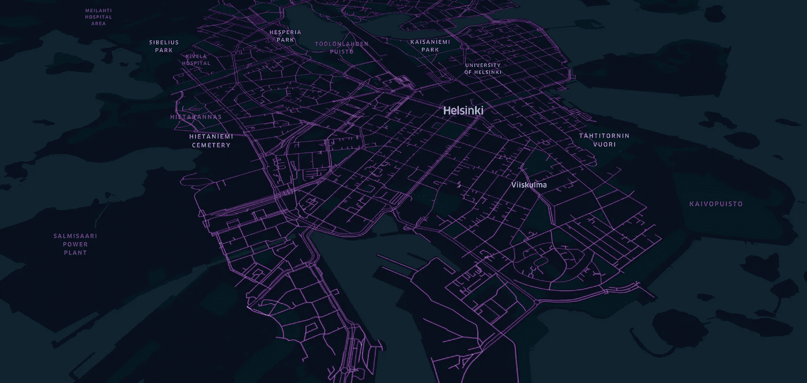
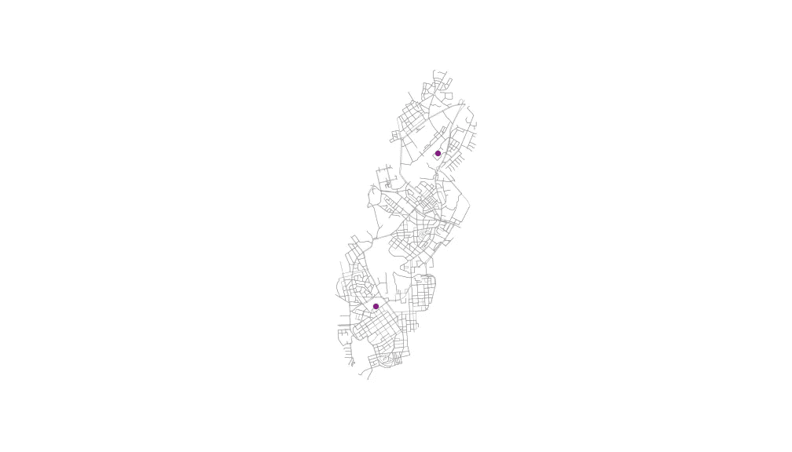
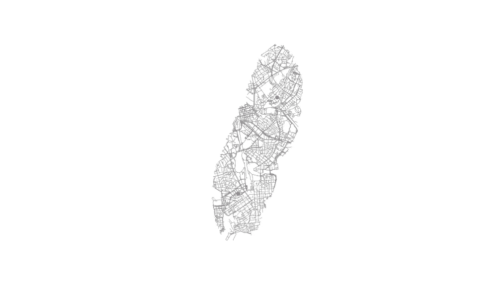
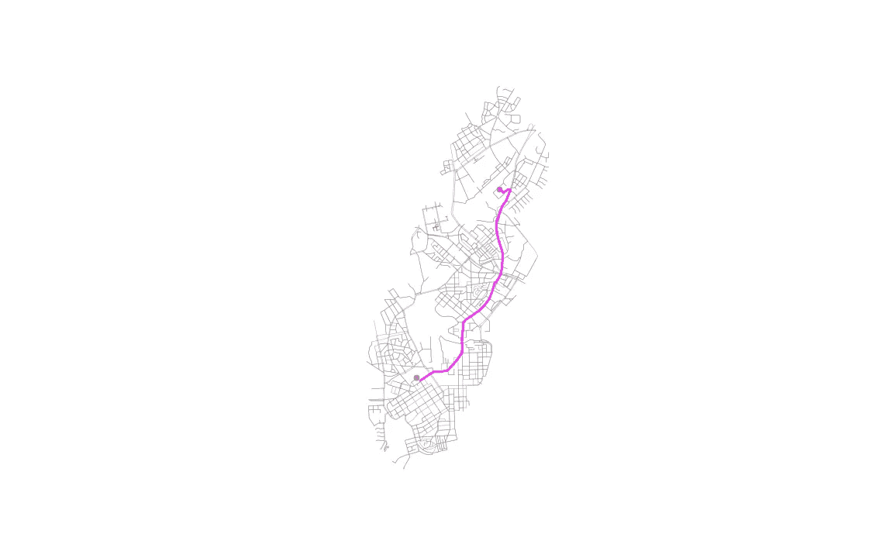
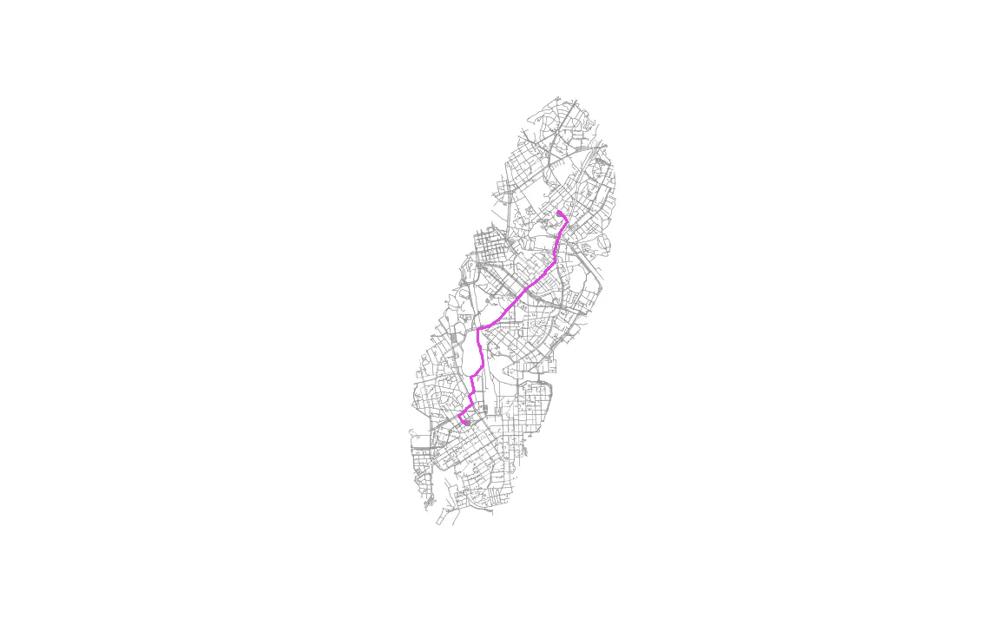
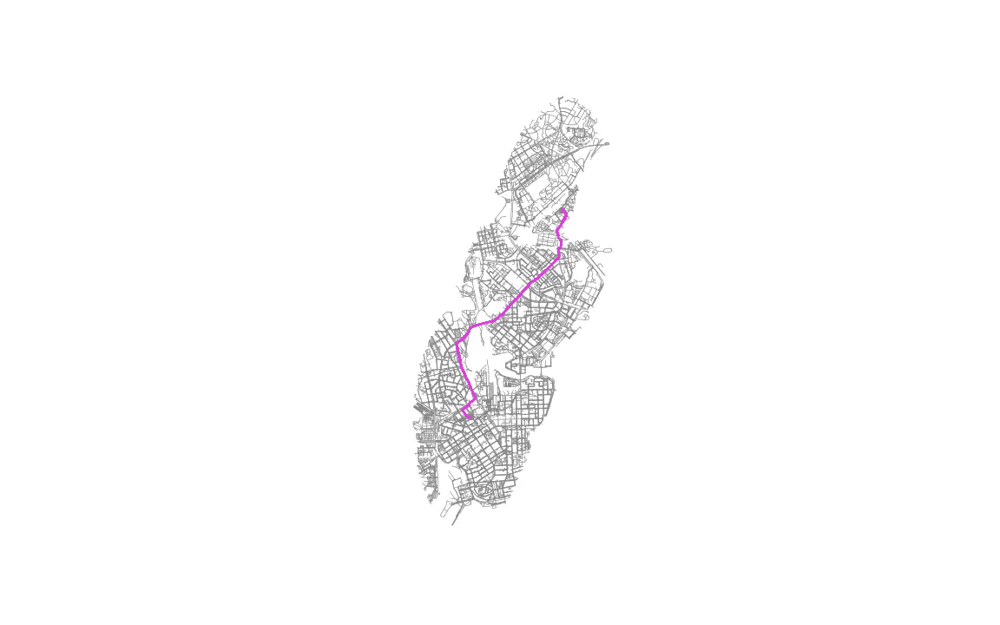

# 最短路径算法在 OSM 街道网中的应用

> 原文：<https://towardsdatascience.com/shortest-path-algorithm-used-in-osm-street-network-33e0f864f34b?source=collection_archive---------9----------------------->

## 针对汽车、自行车和行人的最短路径分析的 GIS 自动化提示



图片由作者提供。赫尔辛基骑行 OSM 网络

今年秋天，我有机会作为 T2 的研究助理，参加了赫尔辛基大学的自动化 GIS 课程。本课程旨在使用 Python 实现地理空间分析的自动化，并提供大量使用 geopandas、shapely、mapclassify、folium、OSMnx 等库以及 GIS 中其他常用库的精彩材料。我在研讨会上与学生分享了我的一些编码技巧，看到地理学家如何用 Python 接管 GIS 自动化，我获得了灵感。

在上次与 [OSMnx](https://geoffboeing.com/2020/09/osmnx-summer-wrap-up/#more-5122) 相关的研讨会中，我刚刚回忆了 OSM 数据在城市地区最短路径算法应用中的用法是多么有趣。我发现令人感兴趣的是，如何将汽车、自行车和行人等网络类型归结为最短路径。您还可以使用不同的权重变量，如最短距离或最短时间。最短路径算法的使用直接返回与汽车、自行车或行人网络重叠的 LineString 对象。

> 那么，我所说的 GIS 自动化是什么呢？

Python 是地理空间分析中非常有用的编码语言，尤其是在使用函数时。在本文中，我想分享我在多个起点和终点之间创建最短路径的技巧，使用网络类型(汽车、自行车或行人)并按最短距离加权。准备好加载了 OSMnx 库的 python GIS 环境，让我们开始编码练习。

> 这里有代码库:[带 OSM 的最短路径](https://github.com/bryanvallejo16/shortest-path-osm)

# OSM 数据许可证

*   **打开街道地图数据。**根据[开放数据共享开放数据库许可证(ODbl)](https://opendatacommons.org/licenses/odbl/) 或归属许可证获得许可。用户可以自由复制、分发、传输和改编这些数据，只要这些数据像 [OpenStreetMap](https://www.openstreetmap.org/copyright) 贡献者一样属于作者。

# GIS 自动化

众所周知。让我们开始导入所需的库。

```
**import** pandas **as** pd
**import** geopandas **as** gpd
**from** shapely.geometry **import** LineString, Point
**import** osmnx  **as** ox
**import** networkx **as** nx
**import** matplotlib.pyplot **as** plt
```

正如我所建议的那样，从简单的函数开始，然后继续努力总是好的。从你所拥有的简单开始，在你的函数中返回最新的一步，继续下去，直到你可以返回你正在寻找的东西。

在这种情况下，我只是创建两个点。我选择 Kamppi 购物中心作为起点，Kumpula 校园的 Physicum 大楼作为终点。这两个点都位于赫尔辛基。我要为自动化创建的函数必须与多个起点和终点一起工作，这就是自动化 GIS 过程的要点。

```
**# Kamppi shopping center as Origin**
origin = gpd.GeoDataFrame(columns = [‘name’, ‘geometry’], crs = 4326, geometry = ‘geometry’)
origin.at[0, ‘geometry’] = Point(24.933260, 60.169111)
origin.at[0, ‘name’] = ‘Kamppi’**# Physicum**
destination = gpd.GeoDataFrame(columns = [‘name’, ‘geometry’], crs = 4326, geometry = ‘geometry’)
destination.at[0, ‘geometry’] = Point(24.962608, 60.205301)
destination.at[0, ‘name’] = ‘Physicum’
```

请注意，在 CRS 4326 中使用起点和终点作为<geodataframe>时，这种自动化实践是可行的。</geodataframe>

# OSM 数据提取

运行最短路径算法之前的第一部分是在提取的 OSM 数据上可视化起点和终点。默认情况下，该函数用于行驶网络类型，但您可以将其更改为自行车或步行。

```
def **osm_network**(origin, destination, network = ‘drive’):
 '''
**origin and destination <geodataframe>, 
network <str> drive, bike, walk
RETURN OSM network as <GeoDataFrame>**
 '''

 **# creating a boundary for fetching OSM data**
    combined = origin.append(destination)

    convex = combined.unary_union.convex_hull

    graph_extent = convex.buffer(0.02) **# fetching graph**
    graph = ox.graph_from_polygon(graph_extent, network_type= network) **# Get the edges/network as GeoDataFrame**
    edges = ox.graph_to_gdfs(graph, nodes=False)    

    **return** edges
```

然后，使用函数就简单了。让我们用不同的网络类型做一些测试，然后画出来。

```
**osm_network(origin, destination)**
```



图片由作者提供。OSM 驾驶网络上的起点和终点图

```
**osm_network(origin, destination, ‘bike’)**
```



图片由作者提供。OSM 自行车网络的起点和终点

# 使用 OSM 数据的最短路径

下一步是扩展包含最短路径算法之前创建的函数。该功能还将像以前一样包括网络类型。所以这种自动化可以用来分析汽车、自行车或行人的最短路径。

```
def **shortest_path**(origin, destination, network = ‘drive’):
 ‘’’
**origin and destination <GeoDataFrame> crs 4326, network <str> drive, bike, walk
RETURN shortest path <GeoDataFrame>**
 ‘’’

 **# creating a frame for fetching OSM data**
 combined = origin.append(destination)

 convex = combined.unary_union.convex_hull

 graph_extent = convex.buffer(0.02)

 **# fetching graph**
 graph = ox.graph_from_polygon(graph_extent, network_type= network)

 **# Reproject the graph**
 graph_proj = ox.project_graph(graph)

 **# Get the edges as GeoDataFrame**
 edges = ox.graph_to_gdfs(graph_proj, nodes=False)

 **# Get CRS info UTM**
 CRS = edges.crs

 **# Reproject all data**
 origin_proj = origin.to_crs(crs=CRS)
 destination_proj = destination.to_crs(crs=CRS)

 **# routes of shortest path**
 routes = gpd.GeoDataFrame()

 **# Get nodes from the graph**
 nodes = ox.graph_to_gdfs(graph_proj, edges=False)

 **# Iterate over origins and destinations**
 for oidx, orig in origin_proj.iterrows():

   **# Find closest node from the graph → point = (latitude, longitude)**
   closest_origin_node = ox.get_nearest_node(G=graph_proj, point=(orig.geometry.y, orig.geometry.x), method=’euclidean’)

 **# Iterate over targets**    for tidx, target in destination_proj.iterrows():
      **# Find closest node from the graph → point = (latitude, longitude)**
      closest_target_node = ox.get_nearest_node(graph_proj, point=(target.geometry.y, target.geometry.x), method=’euclidean’) **# Check if origin and target nodes are the same → if they are → skip**
      if closest_origin_node == closest_target_node:
          print(“Same origin and destination node. Skipping ..”)
          continue

 **# Find the shortest path between the points**       route = nx.shortest_path(graph_proj, 
 source=closest_origin_node, 
 target=closest_target_node, weight=’length’)

 **# Extract the nodes of the route**       route_nodes = nodes.loc[route]

 **# Create a LineString out of the route**       path = LineString(list(route_nodes.geometry.values))

 **# Append the result into the GeoDataFrame**       routes = routes.append([[path]], ignore_index=True) **# Add a column name** routes.columns = [‘geometry’]

 **# Set coordinate reference system** routes.crs = nodes.crs **# Set geometry** routes = routes.set_geometry(‘geometry’)

 **return** routes
```

该函数将返回路径最短的地理数据框。您可以使用像这样简单的函数并绘制结果。

```
**shortest_path**(origin, destination)
```



图片由作者提供。OSM 驾驶网络最短路径图

```
**shortest_path**(origin, destination, 'bike')
```



图片由作者提供。OSM 自行车网络最短路径图

```
**shortest_path**(origin, destination, 'walk')
```



图片由作者提供。OSM 步行网络的最短路径图

# 建议

创建的函数可用于两个目的:1)第一部分可以帮助根据您使用的起点和终点按网络类型获取 OSM 数据。如果您只处理位置，您可以操作该函数来正确获取 OSM 网络。2)第二部分直接给出起点和终点之间的最短路径(多于 2 条)。最短路径分析可用于城市分析和移动性。这种算法有助于回答这样的问题:哪条路线是上学/工作的最佳路线？骑自行车去短还是走路去短？

我希望你能从这些功能的使用中获得灵感，继续解决城市的移动性问题。