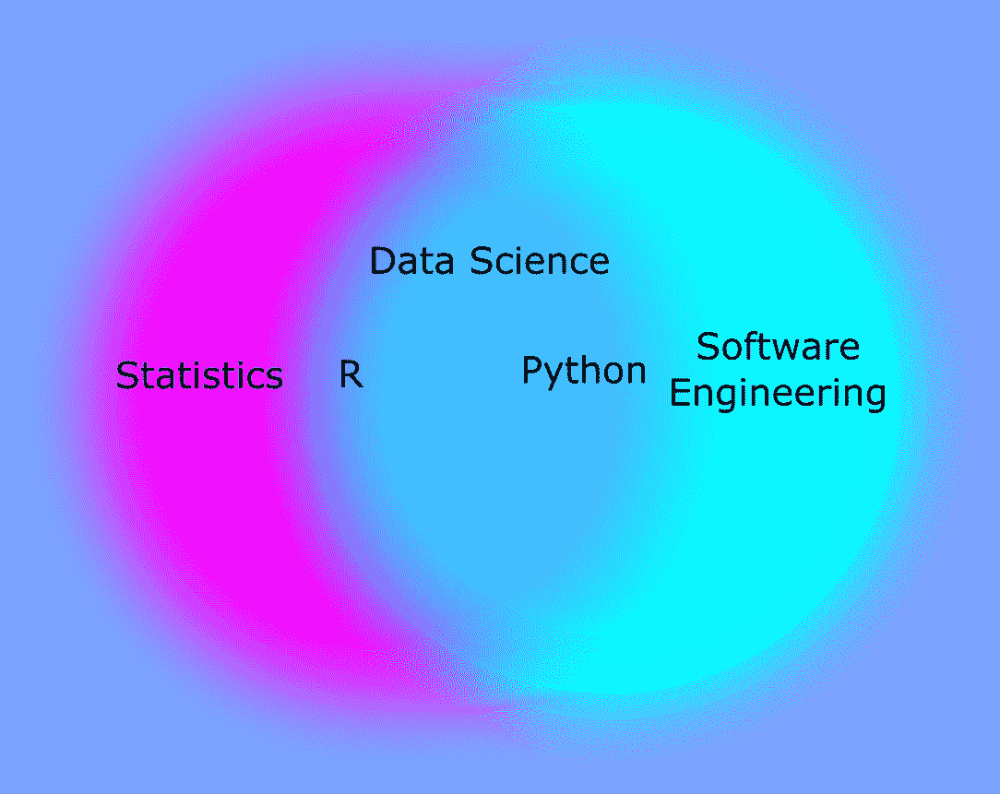

# 工程师应该学 R 还是 Python？

> 原文：<https://towardsdatascience.com/should-an-engineer-learn-r-or-python-c91b36215a91?source=collection_archive---------29----------------------->

## 诚实且可行的审查

作者图片

学习数据科学最困难的部分是决定你想先学习哪种语言。太多时候，寻求扩展他们的数据分析工具箱的专业人员被这个决定所麻痹，以至于他们从来没有取得任何进展。这是一场我希望避免的悲剧。到本文结束，你就知道最适合你的选择了。

你马上知道没有错误的答案，这对你的健康很重要。这两种语言都是图灵完备的(这意味着它们都能够解决任何计算问题)，都被广泛使用，并且都很容易学习。事实上，在您的数据科学之旅的某个阶段，您很有可能会同时使用这两种语言(我就是这样做的)，并且已经做了大量的工作来使您能够在一个分析中同时使用这两种语言。(R 的 Reticulate 包可以在 R 代码中运行 Python 代码，甚至可以将结果从一种数据类型转换成另一种数据类型！)

不过，如果你打算开始学习，你需要选择一个开始。所以，让我们言归正传。

## **背景**

r 是专门为数据科学而构建的，围绕它的社区全心全意地接受这一事实。这个社区是由教育家组成的，他们从教人们如何编码中找到巨大的乐趣。这个社区的领导者是 RStudio，他的“tidyverse”包集合非常强大和直观，并且附带了优秀的文档。#rstats 社区的名人之一是 Hadley Wickham(来自 RStudio)，他有几本书可以带你从零经验一路走到真正的高级程序员。他还有一篇重要的论文《整洁的数据》,这是任何数据科学家都应该阅读的，不管你使用的是什么软件。

Python 是软件工程师为软件工程师开发的语言。数据科学家通过构建一系列包(熊猫、numpy 等)渗透到语言中。)使 Python 能够与 R 竞争数据科学语言的声誉。由于这个性质，Python 社区有点冷，更精英化。Python 程序员倾向于从软件工程师的角度看待自己，而不是统计学家，他们可能看不起没有使用“真正的”编程语言的 R 用户。社区并不欢迎初学编程的数据科学家，但一旦你知道如何用 Python 编程，你往往会更容易在部署“生产代码”(在实际应用中使用的代码，如无人驾驶汽车或推荐服务)的公司找到工作。)

## **易决策者**

首先，你应该考虑任何潜在的合作者，并尝试采用他们使用的相同语言。如果你的队友都用同一种语言写作，生活会更容易。“队友”不一定只是工作上的同事；它也可能是您想要贡献或在自己的代码中使用的开源包。

如果你在考虑协作之后仍然有灵活性，你应该考虑你想要结束在哪里。如果你的目标是在一家将“大数据”融入其产品的软件公司工作，你可能需要学习 Python。如果您不想编写部署在应用程序中的代码，而是想编写完成分析和得出统计推断的代码，那么您可能最终会与使用 r。

## 重要因素

如果你的目标是把一套新的工具带到你目前正在做的工作中，希望说服你团队的其他人跟随你的领导，那么你就有机会选择你团队的其他人将会跟随的道路。在这种情况下，有几点需要考虑:

*学习曲线*

虽然这两种语言都相对容易掌握，但是有几个因素使学习 R 变得更加愉快。如前所述，语言本身、社区和资源的设计都是为编程初学者量身定制的。然而，具有更传统编程背景的人会更习惯使用 Python。假设你和你的团队没有编程经验，R 赢在这里。

*集成开发环境*

IDE 是你编写所有代码的地方。对于数据科学家来说，这非常重要，因为一个好的 IDE 将允许您有效地探索您的数据。迄今为止，R 凭借 RStudio 统治了这个部门。方便的是，RStudio 已经扩展为 Python 的 IDE。虽然我不推荐将它作为主要的 Python 编辑器，但是它非常适合将两种语言结合到一个分析中。虽然仍然不如 RStudio 好，但新的 Python IDE JupyterLab 最终给了 Python 数据科学家一个有价值的 IDE。不过，Jupyter 笔记本也可以用 R 写。所以，我会给 R 这个类别的胜利。

*包管理(琐碎的计算机工作)*

当您第一次学习时，在计算机上安装正确运行分析所需的所有文件可能会非常痛苦，尤其是对于 Windows 用户。RStudio 通过为您处理一些具体的问题，很好地减轻了这种痛苦。在 Windows 上使用 python 可能会导致您浪费整个晚上来排除与您试图运行的数据分析完全无关的问题。然而，这场对话中的另一个新成员，Anaconda 包分发软件，使这种情况大大减轻了。如果你使用 Anaconda，这部分是平局。否则，我会说 R/RStudio 用户会比 Python 编码人员有更好的体验。

*可视化*

两种语言都有出色的可视化包，尽管 R 的 *ggplot2* 包被认为是最好的选择。除了单一的可视化，构建仪表板的能力是这些语言的另一个可取的方面。在这里，R 再一次凭借*闪亮的*套件占据了上风。然而，plotly 的 *dash* 已经成为 Python 用户的一个很好的选择，因为它是用 React 构建的，所以比 shiny 更容易进入前端软件工程师的代码库。如果您试图使用 React 框架构建一个生产应用程序，那么 *dash* / Python 显然是您的最佳选择。然而，对于大多数用户来说，R / *闪亮* / *ggplot2* 将是首选。

*速度、语言能力、软件包生态系统*

到目前为止，Python 编码语言的有效性一直是它的主要卖点，声称它可以比 r 运行得快得多。它还有更广泛的开发人员为它制作软件包，并且是一种更通用的编码语言，允许您轻松地自动化计算机任务。这些主张不再像以前那样极端。r 开发人员已经在所有这些问题上缩小了差距。然而，纯软件工程师绝不会选择 R 而不是 Python，因为它有一些奇怪的约定(同样的约定使得它对纯数据分析师来说稍微好一点)。这一节基本是平局，但 Python 应该算是赢家。

*行业用途*

Python 往往更常用于“生产环境”,在这种环境中，代码是作为正在运行的应用程序的一部分编写的。与此同时，R 在学术领域占据主导地位，更多地用于分析和可视化。大型科技公司拥有使用两种语言的团队是很常见的；r 用于分析本身，Python 用于实现生产模型。然而，根据我的经验，如果你选择 Python 作为你的语言，会更容易找到工作。除非你在学术界，否则 Python 会在这里胜出。

## **外卖**

如果你想以最简单的方式从电子表格中摆脱出来，你应该学习 r。如果你想建立部署在自动驾驶汽车上的机器学习模型，你应该学习 Python。不管你如何开始，你将很容易学会另一种语言，并可能很快发现自己(就像我一样)在相同的数据分析中用两种语言写作。最后，协作是最重要的因素，无论你的合作者使用什么语言(甚至是电子表格)，你都需要能够有效地工作。令人欣慰的是，为了使这种协作尽可能无缝，已经做了很多工作(即使是电子表格)。

## **最后的话**

如果你仍然犹豫不决，那么这是我最后的建议。下载 RStudio，阅读“R for Data Science”一书，阅读 Hadley Wickham 的“整理数据”论文。这是做好事最简单的途径。用你学到的知识解决你自己的问题。然后，使用 RStudio 或 JupyterLab 作为您的 IDE，通过“Python 进行数据分析”,重新解决您在 r 中解决的相同问题。您现在将形成一种语言偏好(但要精通两种语言),并成为一名相当熟练的数据分析师。从这一点出发，你想要成长的机会会让你的前进道路变得清晰。