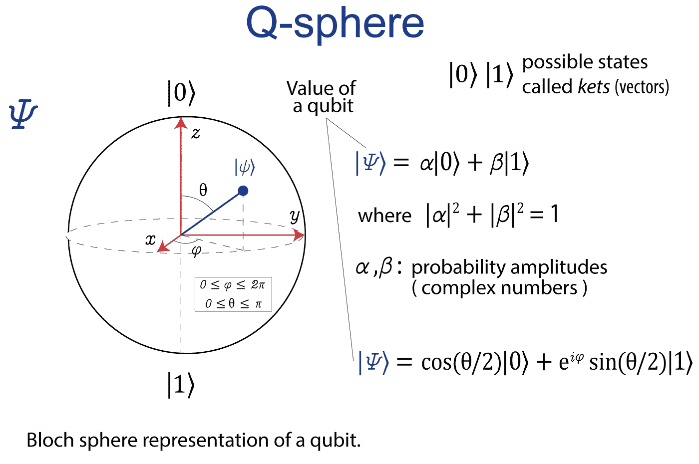
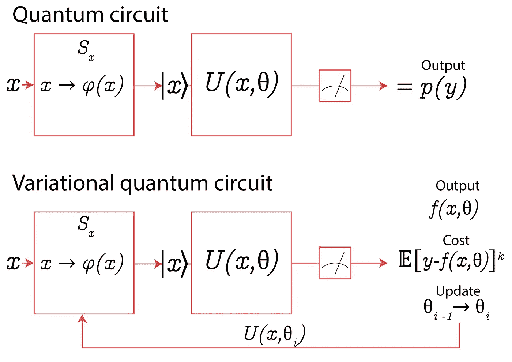
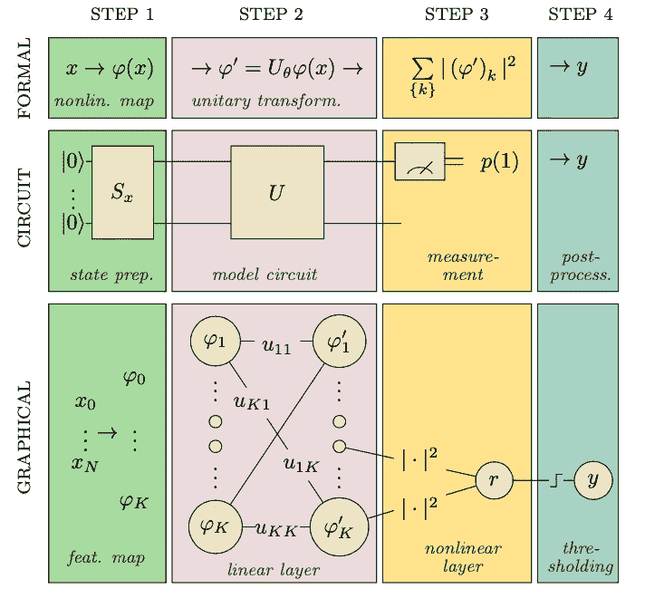
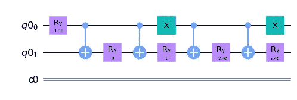
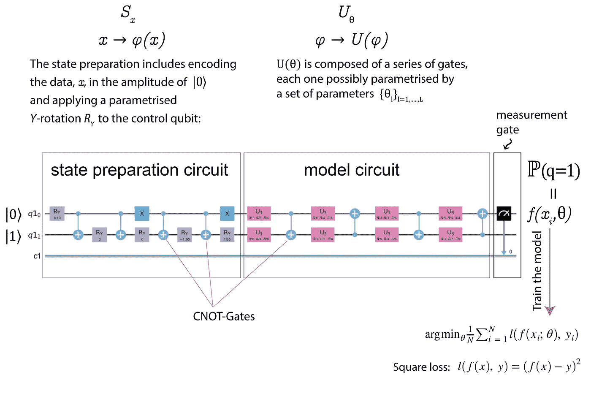
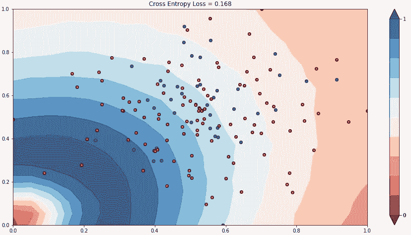
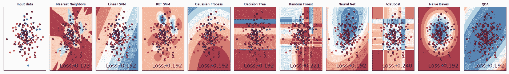

# 你应该已经在学习量子计算了吧？

> 原文：<https://towardsdatascience.com/should-i-already-learn-quantum-computing-953813797d71?source=collection_archive---------8----------------------->

## 这并不像看起来那么复杂


图片由 Pexels 提供

# 1.介绍

当谈到量子计算时，太多的人想象着遥远的未来，比如去火星旅行。然而，许多组织和科学家现在正致力于使量子力学更接近于解决日常问题。我决定对现有的各种生态系统进行一次考察，并对其中的一个或多个进行测试，首先看看它们的复杂程度，其次看看各种生态系统及其适用性，第三看看去解决“经典”问题是否有意义。

我学到的是，你需要一些量子力学的概念来理解**为什么**你做某些步骤。此外，需要复杂的代数来理解**你如何**做这些步骤，以及一些计算机科学家的技能来知道**在哪里**应用它。好消息是，你不需要理解所有的量子物理或极其复杂的代数。要处理它，你必须熟悉一些最初可能看起来违反直觉的公理和过程。

# 2.量子计算的最新进展

C 的未来仍处于猜测阶段。第二次量子数字革命的前景让人既害怕又兴奋。许多企业已经对其运营进行了数年的数字化。但是现在我们听说量子计算将再次改变一切(我们不知道什么时候)。随着量子控制的新进展，“量子怀疑论”也在增长。推特账号“量子狗屁探测器”( [@BullshitQuantum](http://twitter.com/BullshitQuantum) )已经开始在设定量子技术的今天和未来的极限方面做了一件很好的工作。他们验证科技新闻报道或一个虚构的宇宙，在那里“量子比特”将解决我们可以想象的每一个问题，或一个[镜像宇宙](https://en.wikipedia.org/wiki/Mirror_Universe)出现问题。科学界声称( *F. Arute 等人 Nature 574，505–510；2019* )关于量子至上这个术语的使用，煽动用'*优势*'这个词代替'*至上*'来避免既有错误的错觉又有误解。斯科特·阿伦森(Scott Aaronson)指出，如果我们能够将自己从物理(这令人费解且违反直觉)和“炒作”中分离出来，量子处理器的应用为 ML 和其他数字技术开辟了一个“真正”可能性的新世界。我们不知道它会到达哪里，但我们现在可以看到一些非常接近我们的有趣的发展。

# 3.行业领导者做什么？

> “今天，在任何关于任何计算问题的讨论中，提出量子计算的概率接近 1。”
> 
> 克里斯·雷特福德，谷歌数据工程师

谷歌、亚马逊、脸书、IBM 和微软早在十年前就开始投资这一领域。按照他们自己的话说，他们要到 2030 年才能开发出误差低、能力足够的可靠量子处理器。迄今为止已知最大的成功测试的量子处理器是谷歌的 Sycamore，它有 54 个*量子位*。然而，这种处理器仍然来自“非默认容忍”一代，这也称为“小规模”或“近期”，以表明它仍处于早期阶段。物理学家将当前的技术状态正式定义为 NISQ ( *噪音中等规模量子技术*)，以强调当前技术问题的来源:噪音。读者可能会奇怪，54 个量子位是有限的，但我们不得不认为，在量子世界中，计算能力随着量子位的数量呈指数增长。然而，连接的量子位越多，在设备运行时就越难保持它们的脆弱状态，误差也就越大。物理学家认为，在量子计算机能够无误差(无噪声)地运行高级算法之前，还有很多工作要做。

尽管量子计算机远离主流实际应用，但谷歌、亚马逊、IBM 或微软等科技巨头已经调整其服务平台，提供量子计算服务。他们专注于解决简单的问题，在这些问题上，IBM Q 量子处理器优于 CPU、GPU 和 TFU。例如， **IBM** 也在 50 量子位的范围内，并提供特定的 SDK Quiskit 来与其量子处理器一起运行。他们开发了一系列特定的算法来解决金融或化学问题。他们已经说服 JP 摩根(JP Morgan)和巴克莱(Barclays)等公司研究其算法在预测金融期权的风险或价值方面如何优于传统的 ML 算法。测试是成功的，金融行业对其潜在的应用充满热情。他们还帮助 Mitshubishi Chemicals 等制造商模拟其电池中的 LiO2 反应机制，以改进这项技术。CERN 使用 IBM Q 来改进其当前的分类算法，以寻求基本粒子之间的相互作用。这是其 SDK 早期采用者的简短列表。

谷歌正在集中资源进行硬件开发。约翰·马丁尼(John Martinis)是谷歌量子硬件的首席科学家，他领导的团队正试图回答一些关于理解和控制量子宇宙的基本问题，以便在通往“*量子优势*的竞赛中领先。它的方法与 IBM 的不同之处在于，目前它不太强调现实世界的应用。

**微软**推出了微软全球计划，该计划与 IBM 的方法非常接近，但与 Honeywell 或 ION-Q 等重要公司合作。 *Azure Quantum* 平台提供了解决当今量子处理器问题所需的所有层。它的方法很好地展示了整个生态系统，提供了非常以客户为中心的解决方案(在特定问题中)。

2019 年在加州理工学院校园推出的**亚马逊** *AWS 量子计算中心*是一项旨在改善未来量子计算系统的倡议。该中心通过提供完全托管的服务( *Amazon Braket* )提供了与微软类似的方法，允许用户在一个地方开始试验来自多个量子硬件提供商的计算机。这个地方仍然是一个实验平台，亚马逊已经开始建立它的完全管理的愿景。

# 4.量子 ML

> "一旦你抛开物理学，量子计算就会变得简单得多."
> 
> 斯科特·阿伦森，德克萨斯大学奥斯汀分校

量子处理器专注于三种量子力学现象[4]:

*   **离散化**，
*   **叠加，**和
*   **纠缠**

离散化意味着一些物理变量只能有一组可能的可用值。例如，原子内部的电子显示了这种性质。

量子力学是研究系统的物理状态，也就是关于这些系统的所有可用信息。根据量子力学，在一个系统中，有些量级对是不能同时测量或定义的。这仅发生在一些星等对中，特别是那些不互换的星等对。假设我们在寻找一个特定粒子的位置。量子力学告诉我们，比如某个粒子 *x* 可以同时处于两个不同的位置，并假设粒子 *x* 态可以同时定义在两个位置。这被称为叠加。如果一个粒子被定义在两个位置，那么到底在哪个位置呢？我们不知道它是在两个位置还是在其中任何一个位置。在我们真正“测量”它之前，我们没有任何概念。而当我们测量时，我们会发现粒子只处于一个位置(也称为一个量子态)。量子力学假设，如果我们重复这个测量足够的次数，粒子有可能处于第一态 *p* ，也有可能处于第二态*p’*。量子力学是概率性和预测性的。

在量子力学中，我们可以有两个明显不同的状态。但是，如果这两种状态是在一定的条件下产生的，那么我们就不能独立地描述它们中的任何一个。我们可以看到粒子在空间中分离，但它的量子描述是全局的，因为它的量子态是纠缠的。唯一的条件是，这两个粒子不能与宇宙中的任何东西发生相互作用或者纠缠丢失。

应用于量子计算，我们可以按以下方式操作这一现象:

*   **离散化**允许我们选择在物理量级上只有两种可用状态(0 和 1)的系统。
*   我们可以处于状态 0 或状态 1(经典计算)，但也可以处于状态 0 和状态 1 的叠加状态。这就是我们所说的量子比特，它具有将两个经典比特(2^1 比特)的信息集中起来的特性。例如，如果我有一组具有两个量子态的一千个离子，如果这些离子处于叠加态，我将得到一千个量子比特，这就是 2^1000 经典比特。
*   如果这一千个离子是纠缠在一起的，我就可以操作所有的离子。我可以同时操纵所有这些离子。纠缠态的存在是一个物理事实，它对量子计算和一般的量子信息处理有重要的影响。事实上，如果没有这种状态的存在，量子计算机不会比经典处理器更强大。

量子计算机我们输入信息，我们有一个处理步骤，我们得到一个输出。主要的区别是这个中间过程与经典计算机有很大的不同，因为它使用了上面描述的三种特殊现象。利用这些现象，我们可以做传统处理器做不到的事情。



图一。一个量子位的表示。作者图片

量子机器学习通过操纵量子系统中的状态来运行。我们可以将量子算法表示为电路图(图 2-a)。这是一个来自电子电路的类比，我们有一个输入和一个输出。电路有不同的元件，如电阻、晶体管或二极管，每个元件执行一种操作。量子电路的工作原理相似:有一个输入和一个输出，有几个组件，每个组件执行一个操作。这种量子运算是基于上述公理的。

任何量子系统的状态总是由复向量空间中的一个向量来表示(图 1)。这被称为希尔伯特空间。同样，任何量子系统的状态都是一个归一化的向量。电路使我们能够在这个向量空间上进行变换。量子处理器的第一步总是加载“经典”数据。例如，在这个实验中，我将使用以电路为中心的方法[1][2]，其中数据被编码成叠加量子位状态的振幅(图 1)。这种方法被称为**振幅编码量子机器学习**。**变分算法** (VQA) [2]是量子机器学习的另一种流行方法，它使用经典优化器来训练参数化的量子电路，目标是逼近给定问题的答案。在[3]描述的实验中，我将结合两种方法。这种组合利用了振幅编码的优势，但它是基于一种变分方法[5]，并且它是专门为小规模量子器件设计的。[3]包含了完整的理论背景。还有额外的资源可以帮助你更深入地理解理论问题[6]。

# 5.基本的分类任务

> “如果小型量子信息处理器可以创建经典计算机难以计算的统计模式，它们也可以识别经典无法识别的模式，”

有了这个想法，我想做一个实验，利用现有的量子技术来执行一个简单的分类任务。然后与经典机器学习算法进行比较。我们的数据集是一个多类案例，其中目标值是几个要素的非线性组合。我选择这里描述的以电路为中心的方法[3]有两个原因:

*   可用的 q 处理器的现有技术水平限制了可用量子位的数量，
*   并且该方法专用于执行具有少量 qbits 的经典机器学习任务。

这种方法通常被称为**低深度量子态制备(LDQST)**【7】。LDQST 通过引入概率量子态制备算法来减少电路深度(时间)。

图 2-a 显示了以电路为中心的量子分类器概念。量子处理单元使用模型 *f(x，θ)* = y 进行推理



图 2a .量子电路和变分量子电路。我们更新函数以获得 y 和 f 之间的最小差值，即最小化成本函数。作者图片

它由一个将输入 x 编码成量子系统振幅的状态准备电路 *S_x* ，一个模型电路 *U_θ* 和一个单量子位测量组成。该计算检索模型预测 0 或 1 的可能性，由此可以推导出二元预测。分类电路参数 *θ* 可以学习和训练。



图 2-b .本试验中使用的变分电路方法[3]。图片由[3]

以电路为中心的量子分类器的推理包括四个步骤(图 2-b)。
以回路为中心的量子分类器的推理涉及四个步骤。**步骤 1** 通过运行从输入空间到特征空间的特征映射，将输入向量编码到 n 量子位系统中。在**步骤 2** 中，量子电路将酉变换应用于特征向量，这类似于神经网络的一个线性层。

为了从量子系统中提取信息，我们需要进行“测量”。一个量子系统有无限多的可能状态，但是当我们进行基本测量时，我们只能提取有限的信息。结果的数量等于量子系统的维度。

在执行量子电路之后，在**步骤 3** 中，我们测量第一个量子位的统计数据。通过添加一个可学习的偏置项，该度量被解释为分类器的连续输出，以产生模型的连续输出(**步骤 4** )。

## **5.1 实施**

为了实现，我选择了开源的 IBM Q [iskit](https://qiskit.org/) 库。Qiskit 可以看作是一个用于量子电路执行的 Python 库。要在真实的量子计算机上运行实验，首先需要设置您的 IBM 帐户。你也可以在量子模拟器中运行它(不是真正的量子处理器)。在我们的实验中，我们使用了一个具有两个量子位的量子模拟器`qsm-simulator`,并且我们还使用一个真实的量子处理器检查了差异。

```
import **numpy** as np
import **seaborn** as sns
from **qiskit** import *
from **qiskit.tools.jupyter** import *
import **matplotlib.pyplot** as plt
import **pylatexenc**
from **scipy.optimize** import minimize
from s**klearn.preprocessing** import Normalizer, normalize, binarize, Binarizer
from **sklearn.model_selection** import train_test_split
from **sklearn.preprocessing** import StandardScaler, MinMaxScaler
from **sklearn.decomposition** import PCA, KernelPCA, LatentDirichletAllocation
import **pandas** as pd

backend = BasicAer.get_backend('qasm_simulator') ***# for using a quantum simulator***
```

对于使用真正的量子处理器:

```
***# Using a real quantum processors from IBM*** IBMQIBMQ.save_account('xxxxxxxxxxxxxxxxxxxxxxxxxxxxxxxxxxxxxxxxxxxxxxxxxxxxxxxxxxxxxxxxxxxxxxxxxxxxxxxxxxxxxxxxxxxxxxxxxxxxxxxxxxxxxxxxxxxxxxxxxxxxxxxxxx')
provider = IBMQ.load_account()
***# You can check in IBM site the cues in different backend processors # and choose the ones with lower cues to speed up your work.*** 
backend = provider.backends.ibmq_london
```

我们将在具有 N=19 个特征(包括目标特征)的数据集中执行分类任务。作为准备步骤，我们将使用 PCA 对 N=2 个分量进行降维，因为我们想要使用 2 个量子位模拟器。数据准备和降维是用 Scikitlearn 库完成的。完整的代码可以在这里找到[。](https://github.com/Javihaus/Quantum-Machinel-Leaning)

**第一步。编码数据**

只有数量为 *n* 个量子位的多项式量子算法可以对 *2n* 个振幅进行计算。

> 纠缠使得创建一个完整的 *2n* 维复向量空间成为可能，我们可以在这个空间中进行计算，只需要使用 *n* 个物理量子位。

如果使用这些 *2n* 振幅对数据进行编码，则可以在多对数时间内处理数据输入。纠缠使得我们有可能创建一个完整的 *2n* 维复向量空间来进行计算，只需要使用 *n* 个物理量子位。因此，给定一个四维酉向量，我们用函数`get_angles`提取五个角度。这些角度将作为在 quantum a 电路中对我们的数据进行编码的参数(在图 3 中， *R* 指的是 *Y* 中的旋转角度)。

```
**# Arguments to encoding quantum circuit**
def get_angles(x):
    beta0 = 2 * np.arcsin(np.sqrt(x[1]) ** 2 / np.sqrt(x[0] ** 2 + x[1] ** 2 + 1e-12))
    beta1 = 2 * np.arcsin(np.sqrt(x[3]) ** 2 / np.sqrt(x[2] ** 2 + x[3] ** 2 + 1e-12))
    beta2 = 2 * np.arcsin(
        np.sqrt(x[2] ** 2 + x[3] ** 2) / np.sqrt(x[0] ** 2 + x[1] ** 2 + x[2] ** 2 + x[3] ** 2)
    )
    return np.array([beta2, -beta1 / 2, beta1 / 2, -beta0 / 2, beta0 / 2])
```

获得的角度:

```
First features sample:[ 0.81034968, -0., 0., -1.22809981, .22809981]
```

包括角度在内的准备电路。

```
**# State preparation circuit**
def statepreparation(a, circuit, target):   **# a:angle**
    a = 2*a
    circuit.ry(a[0], target[0])         **# rotation angle on y**
    circuit.cx(target[0], target[1])    **# CNOT gate**
    circuit.ry(a[1], target[1])         **# rotation angle on y**
    circuit.cx(target[0], target[1])    **# CNOT gate**
    circuit.ry(a[2], target[1])         **# rotation angle on y**
    circuit.x(target[0])                **# x value**
    circuit.cx(target[0], target[1])    **# CNOT gate**
    circuit.ry(a[3], target[1])         **# rotation angle on y**
    circuit.cx(target[0], target[1])    **# CNOT gate**
    circuit.ry(a[4], target[1])         **# rotation angle on y**
    circuit.x(target[0])                **# x value**
    return circuit

x = X_norm[0]
ang = get_angles(x)
q = QuantumRegister(2)
c = ClassicalRegister(1)
circuit = QuantumCircuit(q, c)
circuit = statepreparation(ang, circuit, [0,1])
circuit.draw(output=*'*mpl*'*)  **#for plotting the circuit draw**
```

我们的状态准备电路将如下所示:



图 3。实验中状态准备电路 *Sx。*作者图片

其中 X-gate 由 2x2 矩阵表示。两个 X 门都在一个 0 量子位上。 *R* 为旋转角度(共五个)，连接器为 CNOT 门(图 4)。

## 第二步。模型电路。

该电路有几个堆叠的块，可以称为层，以此与神经网络进行类比。一层由应用于两个量子位的通用参数化幺正门组成。下面我们可以看到最终电路包括状态准备，模型电路和测量。



图 4。状态准备、模型电路和测量与训练。作者图片

我们将操作符应用于特征状态 *U(theta)* ，其中( *theta_i)* 是可训练参数(见图 4)。以下代码执行模型电路:

```
def execute_circuit(params, angles=None, x=None, use_angles=True, bias=0, shots=1000):
    if not use_angles:
        angles = get_angles(x)  
    q = QuantumRegister(2)
    c = ClassicalRegister(1)
    circuit = QuantumCircuit(q,c)
    circuit = statepreparation(angles, circuit, [0,1])
    circuit = create_circuit(params, circuit, [0,1])
    circuit.measure(0,c)
    result = execute(circuit, backend, shots=shots).result()

    counts = result.get_counts(circuit)
    result=np.zeros(2)
    for key in counts:
        result[int(key,2)]=counts[key]
    result/=shots
    return result[1] + bias

execute_circuit(params, ang, bias=0.02)
```

## 第三步。训练模型

我们必须找到一个预测器 *f* 来估计 *y* 给定一个新的值*x。*我们将通过找到使损失最小化的参数*θ*、 *l* (图 4) *用训练输入训练一个模型。*在我们的例子中 *f* 将返回被标记为 *l* 的概率。

## 第四步。测量和结果

执行测量后，我们得到了以下结果(图 5)。



图 5。应用图 4 电路后的测量结果。作者图片

## 5.2 结果和基准

我们使用交叉熵损失或对数损失来计算我们的模型的准确性，该模型测量分类模型的性能，其输出是 0 到 1 之间的概率值。随着预测概率偏离当前标签，交叉熵损失增加。图 5 描述了最终结果。此外，我们使用各种标准的 Scikitlearn 算法执行了相同的分类任务(图 6)。



图 6。标准 Scikitlearn 算法的分类问题。作者图片

正如我们所看到的，我们的结果比用 Scikitlearn(最近邻)得到的最好结果稍好。在任何情况下，模型猜测为正确类别的概率低于 0.8。读者可能认为使用量子算法的努力太高了。我个人是这么认为的。但是我必须考虑整个过程，在这个过程中，我用标准的 ML 算法降低了数据集的维数，以便只使用 2 个 qbits。想法是使用低深度量子态制备方法。尽管结果仍然很有希望。

# 结论

> “一旦你熟悉了量子力学的公理，叠加或纠缠在你看来就是一件自然而然的事情。”
> 
> J.I Cirac，马克斯·普朗克量子光学研究所

是的，你必须了解并熟悉量子力学的一些基本公理。否则，你可能会陷入开发量子算法所需的步骤中。然而，为了能够编写这些算法，需要一些复代数知识。与神经网络不同，这里的困难在于理解你为什么做你所做的事情。神经网络的困难在于确定它们做了什么。综上所述，进步是显著的。不仅仅是量子比特的数量；而是认识到量子算法的结果可以为模式识别提供一个新的视角。

忽略速度和计算能力等问题，量子计算今天可能会很有趣，尽管它有局限性。

# 参考

[1]御手洗幸助，内乡诚，北川正弘，藤井圭介(2018) ' *量子电路学习*'，Phys. Rev. A 98，032309。

[2]雅各布·比亚蒙特，彼得·魏特克，尼古拉·潘科蒂，帕特里克·雷本特罗斯特，内森·维贝，塞斯·劳埃德(2017)，'*量子机器学习*'，Nature 549，195–202。

[3]玛利亚·舒尔德，亚历克斯·鲍恰洛夫，克里斯塔·斯沃雷，内森·维贝，(2020) ' *以电路为中心的量子分类器*'，物理评论 A 101，032308。

[4]米勒-柯尔斯顿，H. J. W. (2006 年)。*量子力学导论:薛定谔方程和路径积分*。美国:世界科学。第 14 页。国际标准书号 978-981-2566911。

[5]马卡卢索 A .，克里萨 l .，罗提 s .，萨托利 C. (2020)量子神经网络的变分算法。载于:Krzhizhanovskaya V .等人(编辑)的《计算科学——2020 年的 ICCS》。ICCS 2020。计算机科学讲义，第 12142 卷。斯普林格，查姆。https://doi.org/10.1007/978-3-030-50433-5_45

[6]朱利亚诺·贝宁蒂、朱利奥·卡萨蒂和朱利亚诺·斯特里尼(2004 年)。*量子计算与信息原理*，默认丛书。

[7]肖，，容曼红，，(2021) ' *低深度量子态制备*'， [arXiv:2102.07533](https://arxiv.org/abs/2102.07533)

更多基础知识:

*   IBM 的 Qisqit:[https://qiskit.org/textbook/what-is-quantum.html](https://qiskit.org/textbook/what-is-quantum.html)
*   *量子算法初学者实现*， abhijith j . and adetokumbo Adedoyin and John Ambrosiano and Petr Anisimov and Andreas brtschi and William Casper and Gopinath Chennupati and Carleton coff rin and Hristo Djidjev and David Gunter and Satish Karra and Nathan Lemons and Shizeng Lin and Alexander Malyzhenkov and David Mascarenas and Susan Mniszewski and 巴鲁 Nadiga and Daniel 和 Diane Oyen and Scott Pakin and laksh man Prasad and Randy Roberts and Phillip Romero and Nandakishore Santhi and 温德尔伯格和 Boram Yoon 和 Richard Zamora 和朱未和 Stephan Eidenbenz 和 Patrick J. Coles 和 Marc Vuffray 和 Andrey Y. Lokhov。 2020，1804.03719，arXivcs。东部时间

*之前的版本最初发布于*[*https://www.linkedin.com*](https://www.linkedin.com/pulse/deber%25C3%25ADamos-invertir-en-computaci%25C3%25B3n-cu%25C3%25A1ntica-hoy-javier-marin/?trackingId=I5nirs5p2OLdsMKmuUF0ig%3D%3D)*。*