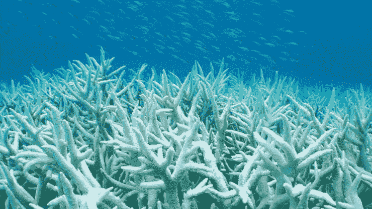
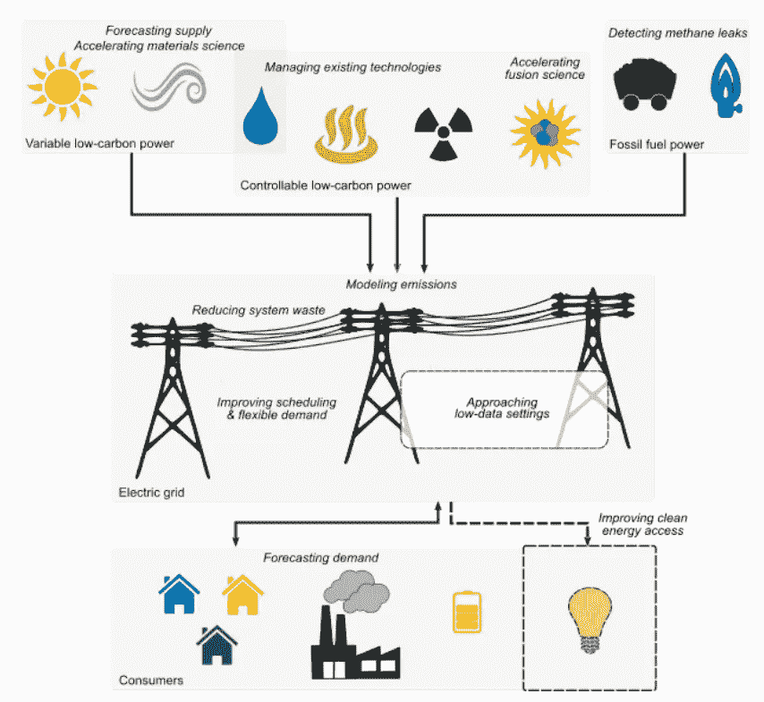
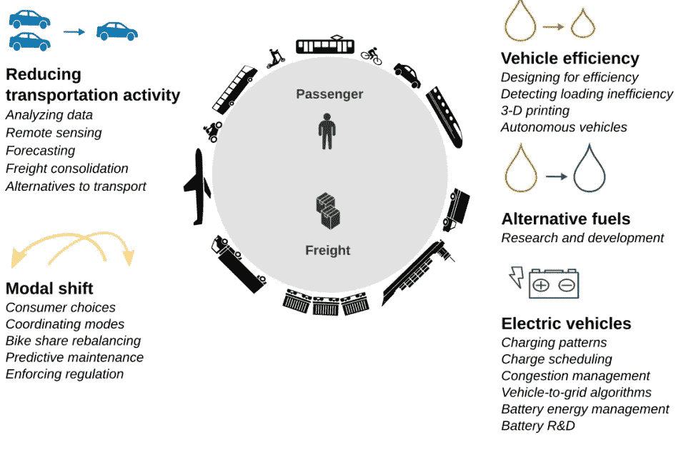
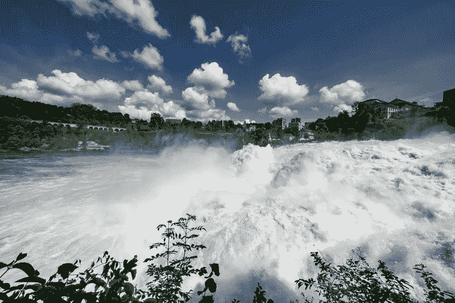
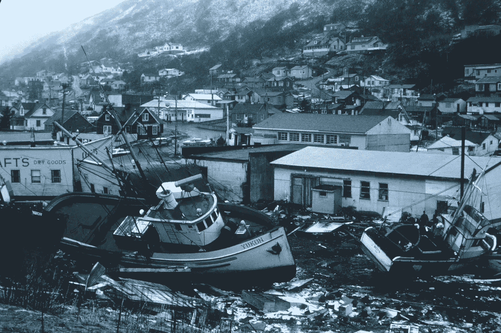
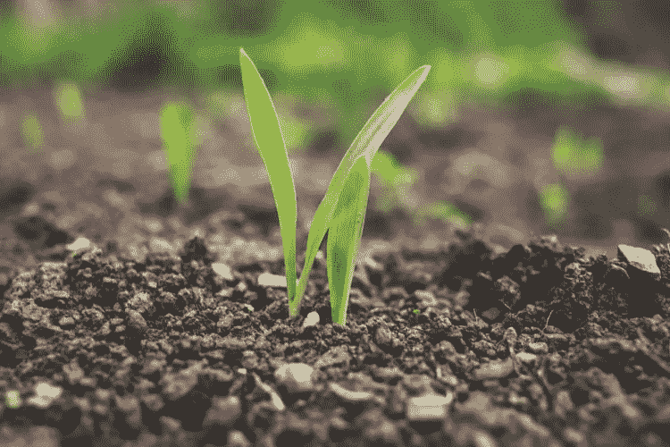
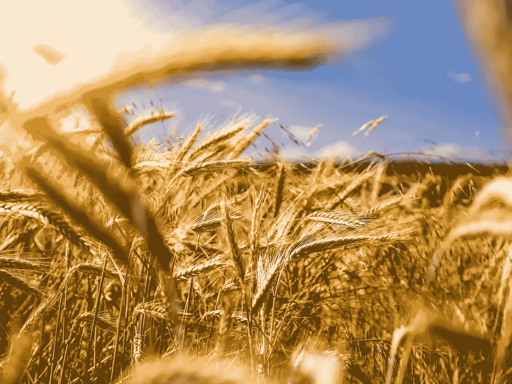
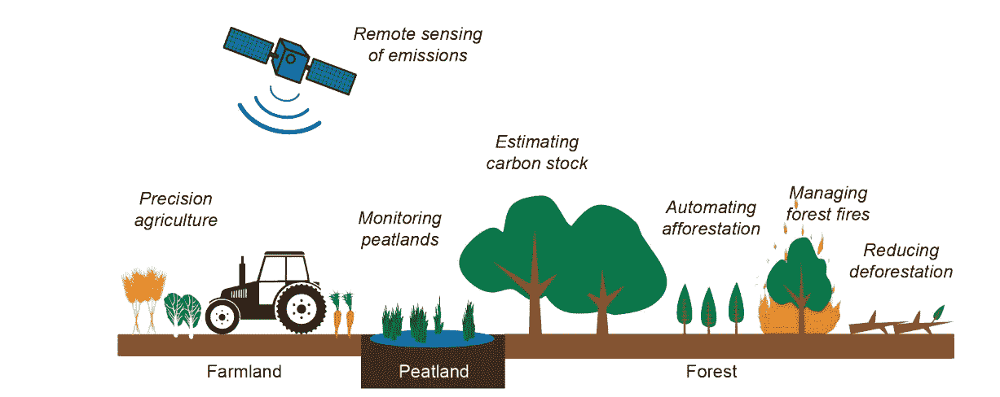
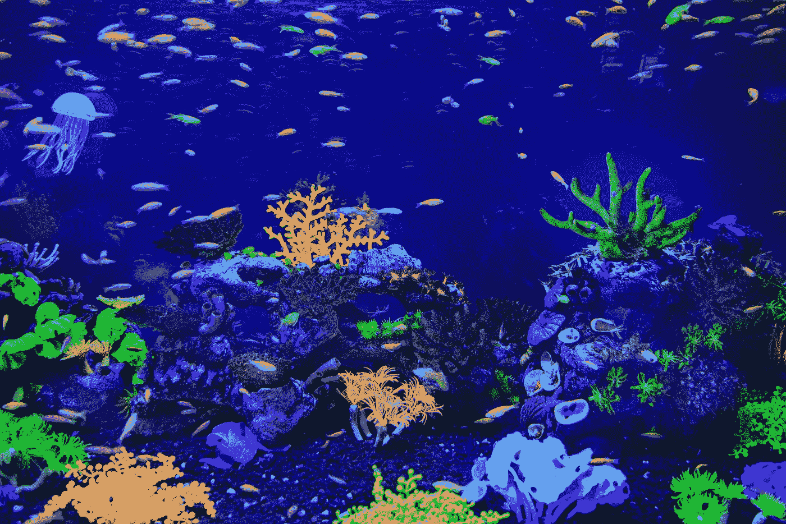

# 你如何用机器学习对抗气候变化

> 原文：<https://towardsdatascience.com/should-machine-learning-experts-respond-to-climate-change-call-to-action-1ffeb4ba008b?source=collection_archive---------35----------------------->

## 帮助解决这一紧急情况，并使之有所不同！

来源: [Flickr](https://www.flickr.com/photos/69310539@N02/8378116700/in/photolist-dLm3cW-DKZCcz-237i5FL-dKyFHF-23dSLVV-29KVpZw-T2Pzas-DRTKGZ-WX1LBt-281NXa1-p8DAiw-28UEqNR-23ne3NA-5SThXj-28Dbc77-p2Vwwq-Z42Mma-p8DyVm-pjqBSs-p8Frhp-8yiB6M-BA1T3h-DKZEq2-dW5szR-Y9fdF9-66JbES-2bjRi8j-24nUo3U-pnFj1B-28Dbdbm-M1roPH-M1qYB4-N1X7ZN-Fx6muT-25uwNPP-D3Kmv8-Z42LHX-2eHXTXf-GmGCcb-M1qYZZ-dEfmJb-237c1V1-PEiqcc-HPKNuZ-wMFTkd-AsdARS-2b9WTQK-NVNWpS-oBN6PA-Hc1rzs)

我们星球的正常运转和生存依赖于动物、植物和微生物物种的巨大异质性的微妙平衡，这些物种有助于在地球上建立生态系统。

来源: [StockSnap](https://stocksnap.io/photo/green-leaf-12ASQOGVJE)

在所有的生物中，有一种对地球产生了巨大的影响，以至于它能够打破地球的平衡，导致整个生态系统消失，并威胁到它的生存:**人类**。

密集捕鱼等活动破坏了海洋、畜牧业和我们对肉类的巨大需求，大大增加了向大气中排放的二氧化碳，并促使人们更加肆无忌惮地使用杀虫剂和压力大的技术进行耕作，从而破坏了半个世界的土壤，加速了荒漠化现象。

来源: [Flickr](https://www.flickr.com/photos/blamethepeople/5095123502/in/photolist-8LeQGW-bf3MoB-HUxKkG-g9JHSk-eihNeW-Lg4Bs2-7JWAK6-KiFWoC-25be8Hq-6tUxAL-Aw6m4n-7Zg8zf-pgNhF6-84Gaft-8EtVjs-eii2hC-tsnmCP-EEWoan-fuboHs-oHPjKJ-Xns47C-y8Wt1h-Y3fX1d-5BqanR-bWb2n7-AZd2Cq-S9Rc6s-7WWob2-oSun6H-afpme7-KrSa9E-D8JNUZ-Lee9L7-BuA8nu-dtTwSG-L7PkQm-oggtcP-oPpjZ1-84G9y4-A1qHbH-qd9WUu-9Q5owS-oPpbvN-Q5mYzQ-y93LE2-oQijqw-AHz11-oMpjzu-KRoiXc-Q7S5qU)

这使我们走到了今天，我们的社会刚刚开始从我们历史上最大的灾难之一----新冠肺炎疫情----中恢复过来，而且不可避免地要准备面对更大、更重要的挑战。

这个疫情无疑教会了我们很多东西。它告诉我们，预防胜于治疗，如果我们不提前为问题做准备，它将不可避免地压倒我们。它告诉我们，我们的平衡是脆弱的，尽管社会似乎在无情地、不可阻挡地向前发展，但只要一点点就可以使一切停止，并造成巨大的社会和经济损失。最后，它告诉我们，尽管政府的反应和长期计划总是稍慢一些，但科学界并非一无所知，他们在问题发生前的工作是至关重要的。

例如，疫苗发展的速度也是科学家们在疫情之前进行的研究的结果，他们的专业知识对于解决我们历史上的这一黑暗篇章是不可或缺的。

来源: [Flickr](https://unsplash.com/photos/rdLERs3ZGgQ)

但是，不仅仅是医学专家在改变我们的世界；相反，机器学习已经被证明是一门强大的学科，因为它能够影响社会的每个部门。

当我们听到呼吁采取行动应对气候变化时，我们许多人认为这只是针对政府的，但如果没有技术专家的支持和承诺，政府永远无法解决如此重大的问题。这就是这篇文章的来源，鼓励机器学习这一令人着迷的革命性学科的专家对这个问题感兴趣，并理解当你在**你的**手中有这样一个强大的工具时，即使是一个人也可以有所作为。

整篇文章的灵感来自于 David Rolnick 等人在“ [*用机器学习解决气候变化*](https://arxiv.org/abs/1906.05433) ”中的工作，该工作对应对气候变化的可能 ML 解决方案进行了非常广泛的分析。我真的建议你读一读，以加深对这个话题的理解。

然而，研究中关注的一些领域是大多数人无法接触到的，需要的资源和知识也不是每个人都能接触到的。因此，我将在下面列出一些可能的领域和问题，这些领域和问题可以由机器学习来处理，即使不是大公司或特定领域中最重要的专家，也有可能为之工作。但是，众所周知，要获得一个好的模型，我们需要好的数据，幸运的是，近年来，许多有趣的数据集已经发表，我们可以使用和组合它们来获得重要的结果。

对于本文的每个主题，我收集了一个有用的数据集列表，这可能是您的项目的一个好的起点。在某些情况下，它们可能只是你的部分起点，但千里之行始于足下，今天在有限数据集上创建的简单模型和开发过程中遇到的问题可能对明天的研究有用。

# 能量消耗监控

来源: [Unsplash](https://unsplash.com/photos/0w-uTa0Xz7w)

虽然不是全球变暖的唯一原因，但当谈论这个问题时，能源生产的排放肯定是首先想到的事情之一。长期以来，我们一直依赖于化石燃料的使用，并且不明智地使用能源，但这正是机器学习可以帮助我们的地方。

机器学习已经在一些良性环境中成功应用，以优化能源消耗。然而，到目前为止，这些技术还不是特别普遍，但它们仍然可以减少能源需求，从而减少二氧化碳向空气中的排放。

使用机器学习减少电力系统 GHG 排放的机会(来源:[1])

在这个领域，机器学习也可以用于越来越准确的能源消耗预测，并使电力生产和分配越来越具有战略意义。

**你可以从哪里开始？**

*   [ASHRAE:关于能源消耗的竞争和数据集](https://www.kaggle.com/c/ashrae-energy-prediction)
*   [荷兰电力和天然气消耗的历史数据](https://www.kaggle.com/lucabasa/dutch-energy)
*   [国际能源统计](https://www.kaggle.com/unitednations/international-energy-statistics)
*   [美国每小时的能源消耗](https://www.kaggle.com/robikscube/hourly-energy-consumption)
*   [能源供需统计](https://www.iea.org/data-and-statistics)
*   [欧洲能源数据](https://ec.europa.eu/eurostat/web/energy/data/database)
*   [欧统局的二氧化碳排放和其他气候变化数据集](https://ec.europa.eu/eurostat/web/climate-change/data/database)
*   [CHE-项目二氧化碳排放数据集](https://www.che-project.eu/data-portal)
*   [奥德赛数据库](https://www.indicators.odyssee-mure.eu/energy-efficiency-database.html)

# 城市和交通

资料来源: [Unsplash](https://unsplash.com/photos/6oUsyeYXgTg)

当开始讨论气候变化时，人们立即关注汽车排放，随着时间的推移，人们采取了许多措施来改善汽车的机械性能，使它们更加环保，减少它们的使用，今天我们正试图越来越多地推动电动汽车的发展。

我们还试图鼓励人们使用公共交通工具，以减少道路上的车辆数量。然而，这需要仔细和复杂的规划，以了解使用哪种交通工具以及如何组织它们，并预测人口的需求。

使用机器学习减少交通运输中 GHG 排放的策略(来源:[1])

同样的优化工作也可以用于建筑物的建造，以便它们可以以减少环境影响和所需旅行量的方式建造，但机器学习也可以用于提高它们的能源效率。例如，基于强化学习的方法已被用于这一目的，并取得了可喜的成果。

使用机器学习减少建筑物和城市 GHG 排放的选定策略(来源:[1])

**你可以从哪里开始？**

*   [芝加哥市每日寄宿数据集](https://data.world/cityofchicago/6iiy-9s97)
*   [芝加哥市公交线路统计](https://data.world/cityofchicago/bynn-gwxy)
*   [客运量和货运量](https://data.europa.eu/data/datasets/vm-uvek-shapefile-2040-bundesamt-fur-raumentwicklung-are?locale=en)
*   [里斯本市公共交通统计](https://data.europa.eu/data/datasets/5ae9c669c8d8c9146b44cc5d?locale=en)
*   [燃料排放数据](https://www.fueleconomy.gov/feg/download.shtml)
*   [建立性能数据库](https://www.energy.gov/eere/buildings/building-performance-database-bpd)
*   [乘用车二氧化碳排放的监测](https://www.eea.europa.eu/data-and-maps/data/co2-cars-emission-19/co2-emissions-cars-2019-final)
*   [纽约建筑](https://www.kaggle.com/new-york-city/nyc-buildings)
*   [能效数据集](https://www.kaggle.com/elikplim/eergy-efficiency-dataset)
*   [住宅建筑能效数据集](https://archive.ics.uci.edu/ml/datasets/energy+efficiency)

# 工业和废物

来源: [Unsplash](https://unsplash.com/photos/hkJNx0EDbjE)

可持续工业生产是建设环境友好型社会的关键，机器学习可以发挥作用的领域之一是优化生产和供应链。这些优化得越多，这些活动对环境的影响就会减少得越多。

不仅如此，工业和社会生产的资源消耗也可以变得更有效率。据估计，在发展中国家，40%的粮食生产在收获、加工或零售过程中被浪费掉了。而在工业化国家，40%的浪费发生在供应链的末端，商店、餐馆和消费者家中。

来源: [Unsplash](https://unsplash.com/photos/FFn2-TW8pxk)

在预测性维护方面也取得了长足的进步，预测性维护用于预测工厂何时需要维修并进行快速干预。行业本身对这一领域也很感兴趣，他们也看到了经济优势。

**你能从哪里开始？**

*   [面向大数据分析的 DataCo 智能供应链](https://datasetsearch.research.google.com/search?query=supply%20chain%27%20-site%3Akaggle.com&docid=L2cvMTFqbnlncTk3Ng%3D%3D)
*   [汽车供应链数据](https://data.mendeley.com/datasets/n24z7r2z28/2/files/89b1d403-2c23-41e8-888b-793ac998dd0d)
*   [供应链和物流](https://brunel.figshare.com/articles/dataset/Supply_Chain_Logistics_Problem_Dataset/7558679)
*   [食物垃圾数据集](https://www.oecd-ilibrary.org/agriculture-and-food/data/oecd-environment-statistics/waste-food-waste-edition-2017_ee807a23-en#:~:text=The%20OECD%20food%20waste%20dataset,food%20waste%20for%2032%20countries.&text=1993%20to%202013).-,The%20OECD%20food%20waste%20dataset%20is%20a%20compilation%20of%20available,food%20waste%20for%2032%20countries.)
*   [食物损失和浪费数据库](http://www.fao.org/platform-food-loss-waste/flw-data/en/)
*   [全球粮食浪费和损失](https://datatopics.worldbank.org/what-a-waste/global_food_loss_and_waste.html)
*   [AI4I 预测性维护数据集](https://archive.ics.uci.edu/ml/datasets/AI4I+2020+Predictive+Maintenance+Dataset)
*   [微软 Azure 预测维护](https://www.kaggle.com/arnabbiswas1/microsoft-azure-predictive-maintenance)
*   [预测维护数据集](https://www.kaggle.com/akulah/predictive-maintenance)

# 气象预报

来源: [Unsplash](https://unsplash.com/photos/hyyGSESM29U)

很有可能，我们已经在经历这种情况，无论我们如何迅速地扭转这种趋势，我们都将遭受过去几年我们所做的一些后果，当这种情况发生时，必须准备好做出反应。

我们已经看到飓风、火灾和洪水等破坏性自然现象的加剧，能够正确识别可能导致这些事件的天气条件可以拯救成千上万人的生命。

来源: [Unsplash](https://unsplash.com/photos/rxlx9Yi0298)

幸运的是，地球轨道上许多卫星的存在为我们提供了大量数据，可以用来建立预测模型，这些模型可能已经对今天的社会产生了重大影响，而且肯定会在不久的将来产生影响。

在最极端的情况下，洪水和干旱可能会使一些地方变得不适宜居住，迫使人口迁移，产生前所未有的移民潮。在这里，对过去数据的创造性使用可以为未来的世界产生有用的模型。

**你能从哪里开始？**

*   [NOAA 气候数据在线](https://www.ncdc.noaa.gov/cdo-web/datasets)
*   欧洲中期天气预报中心
*   [欧洲气候评估&数据集项目](https://www.ecad.eu/)
*   [MISTRAL Meteo 意大利超级计算门户开放数据](https://www.mistralportal.it/opendata/)
*   [哥白尼气象数据](https://cds.climate.copernicus.eu/cdsapp#!/search?type=dataset)
*   [南欧土壤侵蚀风险数据集](https://data.europa.eu/euodp/data/dataset/DAT-97-en)
*   [中亚和西亚典型流域荒漠化关键要素数据集](https://data.tpdc.ac.cn/en/data/df64d9be-f69d-4f2d-813f-96a1e5192640/)
*   [海平面上升图](https://data.world/city-of-ny/ezfn-5dsb)
*   [欧盟移民数据集](https://data.europa.eu/data/datasets/l0q3araj0g9dk3txzwkjg?locale=it)
*   [国际移民数据库](https://www.google.com/search?q=immigration+datasets+download&ei=g7fIYO61Do2dkgWbtJngCw&oq=immigration+datasets+download&gs_lcp=Cgdnd3Mtd2l6EAMyBwghEAoQoAE6EQguELEDEIMBEMcBEKMCEJMCOggIABCxAxCDAToLCC4QsQMQxwEQowI6BAguEEM6DgguELEDEIMBEMcBEKMCOggILhCxAxCDAToFCAAQsQM6BwguEEMQkwI6BAgAEEM6AggAOgUILhCxAzoCCC46BAgAEAo6BAguEAo6BggAEBYQHjoICAAQFhAKEB46BAgAEBM6CAgAEBYQHhATOgQIABANOgYIABANEB46CAgAEA0QChAeOgUIIRCgAVCGDVjWVmCWV2gBcAJ4AYABngGIAakXkgEFMTkuMTCYAQCgAQGqAQdnd3Mtd2l6sAEAwAEB&sclient=gws-wiz&ved=0ahUKEwiug7mR65nxAhWNjqQKHRtaBrwQ4dUDCA4&uact=5)
*   [迁移数据门户](https://migrationdataportal.org/)

# 育种和农业

来源: [Unsplash](https://unsplash.com/photos/fjj7lVpCxRE)

畜牧业现在是污染和土地开发的主要原因。当今发达国家为满足对肉类的巨大需求而存在的集约化畜牧场是非常昂贵的，需要生产大量的食物和消耗大量的水。事实上，据估计，世界上生产的 40%的谷物用于喂养农场动物。

为了满足这种需求，越来越多的土地被用于耕作，而且耕作方式越来越密集，而且往往不顾及他人。这种方法已被证明是不可持续的。犁耕和杀虫剂的使用使土壤贫瘠，对土壤的破坏越来越严重，从而加剧了荒漠化。

来源: [Unsplash](https://unsplash.com/photos/li9JfUHQfOY)

因此，预测作物对土地的影响是机器学习可以发挥作用的另一个领域，此外还可以使用新的农业工具，改善作物组织和畜群管理。

困扰农业的另一个现象是微生物和疾病，它们最终会毁坏整个作物，造成经济和社会损失，并浪费大量资源。因此，患病植物的早期分类对对抗这种现象非常有帮助。

使用机器学习减少土地使用的 GHG 排放的策略(来源:[1])

此外，森林火灾管理、估计植被吸收二氧化碳的能力、改善畜群管理和精准农业都是机器学习的一些可能应用。这个领域的可能性是无限的，机器学习可以真正成为游戏规则的改变者，是更可持续的农业和耕作的关键。

**可以从哪里入手？**

*   [全球粮食&农业数据](http://www.fao.org/faostat/en/#home)
*   [农业中的农药使用](https://www.kaggle.com/usgs/pesticide-use/home)
*   [印度农业作物产量](https://www.kaggle.com/srinivas1/agricuture-crops-production-in-india/home)
*   [干旱风险实时](https://sos.noaa.gov/datasets/drought-risk-real-time/)
*   [V2 植物幼苗数据集](https://www.kaggle.com/vbookshelf/v2-plant-seedlings-dataset)
*   [植物疾病数据集](https://www.kaggle.com/vipoooool/new-plant-diseases-dataset)
*   [植物病理学 2021](https://www.kaggle.com/c/plant-pathology-2021-fgvc8)
*   [植物叶部病害检测与分类](https://uk.mathworks.com/matlabcentral/fileexchange/55098-plant-leaf-disease-detection-and-classification-using-multiclass-svm-classifier)
*   [欧洲森林火灾数据库](https://data.europa.eu/data/datasets/678deb39-e35f-4236-a984-42d69bf95dec?locale=it)
*   [定量植物](https://www.quantitative-plant.org/)
*   [在行作物农业中的精准农业产量监控](https://lter.kbs.msu.edu/datasets/40)
*   [动物育种&基因组学](https://www.google.com/search?q=breeding+dataset&ei=erjIYO7_H5CzsAfUtYGYAw&oq=breeding+dataset&gs_lcp=Cgdnd3Mtd2l6EAMyBQghEKABMgUIIRCgAToHCC4QQxCTAjoECAAQQzoICAAQsQMQgwE6CAguELEDEIMBOgQILhBDOg4ILhCxAxCDARDHARCjAjoFCAAQsQM6BwguELEDEEM6BQguELEDOgIIADoCCC46BggAEBYQHjoHCC4QExCTAjoECAAQEzoECC4QEzoICAAQFhAeEBNQ2Q9Ymh1g9R1oAHACeACAAbEBiAGvDZIBBDUuMTCYAQCgAQGqAQdnd3Mtd2l6wAEB&sclient=gws-wiz&ved=0ahUKEwjupK6H7JnxAhWQGewKHdRaADMQ4dUDCA4&uact=5)
*   [全国肉类汇总](https://www.kaggle.com/usda/the-national-summary-of-meats/)

# 海洋和渔业

来源: [Unsplash](https://unsplash.com/photos/LZykn1xi4ek)

受人类活动影响最大的生态系统之一当然是海洋生态系统。海洋变暖了，虽然这只是几度的变化，但已经足以杀死很大一部分珊瑚礁，破坏整个海洋生态系统。好像这还不够，大量的废物最终流入海洋，包括大量的渔网，其污染已经毁灭了数量惊人的海洋物种。

来源: [Unsplash](https://unsplash.com/photos/IBrZ-TXYWY8)

这可能是应用机器学习最复杂的领域之一，缺乏好的数据肯定没有帮助。然而，人们可以想到一些模型来帮助鱼类更加健康，而不会给生态系统带来过度压力，或者一些模型可以识别人类活动导致海洋破坏的最初迹象。

**你能从哪里开始？**

*   [全球钓鱼观察](https://globalfishingwatch.org/datasets-and-code/)
*   [世界海洋数据库](https://www.ncei.noaa.gov/products/world-ocean-database)
*   [大自然保护渔业监测](https://www.kaggle.com/c/the-nature-conservancy-fisheries-monitoring)
*   [深海珊瑚](https://www.kaggle.com/noaa/deep-sea-corals)
*   [渔获统计](https://www.ices.dk/data/dataset-collections/Pages/Fish-catch-and-stock-assessment.aspx)
*   [淡水鱼疾病数据集](https://www.kaggle.com/utpoldas/freshwater-fish-disease-dataset)
*   [ice 鱼病数据集](https://gis.ices.dk/geonetwork/srv/api/records/434c9221-bd9f-4c62-aee9-cd795e5a50ad)
*   [鱼市场数据集](https://www.kaggle.com/aungpyaeap/fish-market)
*   [NOAA 渔业公司的海洋休闲渔业](https://www.fisheries.noaa.gov/recreational-fishing-data/recreational-fishing-data-downloads)
*   [海洋人类活动-压力联系表](https://data.world/datagov-uk/c52e2846-e58e-46ca-af0b-7f1fb9d4842f)

# **机器学习碳排放**

来源: [Unsplash](https://unsplash.com/photos/9drS5E_Rguc)

是的，像许多其他人类活动一样，机器学习，特别是深度学习，对环境有影响。据麻省大学的研究人员估计，训练一个大型深度学习模型会产生 626，000 磅导致地球变暖的二氧化碳，相当于五辆汽车一生的排放量。

幸运的是，似乎有许多解决方案，许多研究人员正在努力使这一学科更加可持续发展。例如，正在开发新的基于光子学的硬件来创建光子神经网络，这种网络在更节能的硬件上训练更快。

# 结论

气候紧急情况是一个现实，当我们等待世界各国政府采取行动时，任何人都可以有所作为。本文试图为在不久的将来会有用的机器学习应用程序提供一些想法和起点，但可能的创新实际上是无限的。结合、操作和分析这些以及来自在线来源的其他数据，并利用它们进行高级建模，最终可能会为即将到来的紧急情况带来一些至关重要的东西。

# 参考资料和见解

[1]《大卫·罗尔尼克等人》。*[*用机器学习应对气候变化*](https://arxiv.org/abs/1906.05433)*

**[2]《斯里尼瓦桑·艾扬格等人》。" [*WattScale:数据驱动的建筑能效分析方法*](https://arxiv.org/abs/2007.01382) "**

**[3]“solo plan”，*“*[*机器学习和人工智能如何彻底改变你的交通规划*](https://www.soloplan.com/how-machine-learning-and-artificial-intelligence-revolutionise-your-transport-planning/#:~:text=The%20advantages%20of%20using%20machine,the%20case%20of%20personnel%20changes.)*“***

**[4]《阿米尔雷扎·法拉哈尼等人》。*[*在线多式联运规划采用深度强化学习*](https://arxiv.org/abs/2105.08374)***

***[5]《雍怡然等人》。预知维修综述:系统、目的和方法***

***[6]《安德烈亚斯·卡米拉里斯等人》。 [*农业深度学习:一项调查*](https://arxiv.org/abs/1807.11809)***

**[7]《naz neen N Sultana 等人》。" [*供应链中多产品多节点库存管理的强化学习*](https://arxiv.org/abs/2006.04037) "**

**[8]《苏维扬等人》。"[利用遥感数据和机器学习预测森林火灾](https://arxiv.org/abs/2101.01975)"**

**[9]《皮尤什·贾因等人》。*[*机器学习在野火科学与管理中的应用综述*](https://arxiv.org/abs/2003.00646)***

***[10]《亚历山大·拉科斯特等人》。 [*量化碳排放的机器学习*](https://arxiv.org/abs/1910.09700)***

**[11]《洛伦佐·德·马里尼斯等人》。 [*光子神经网络综述*](http://hdl.handle.net/11568/1017604)**