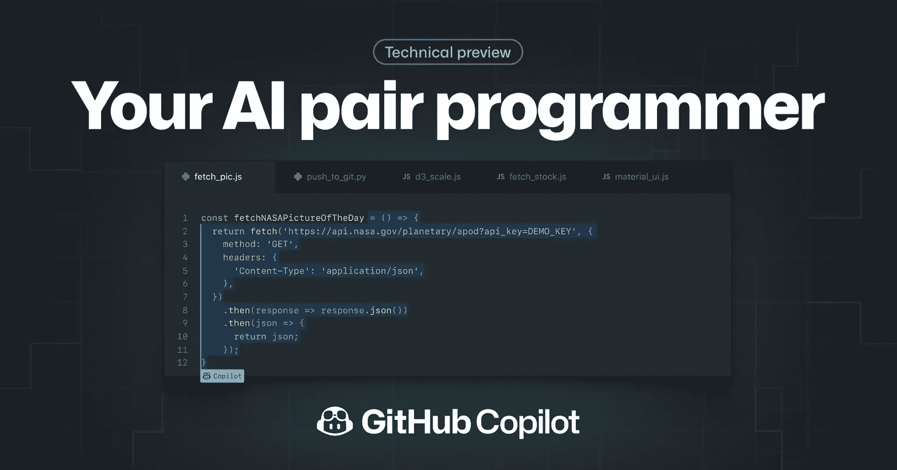
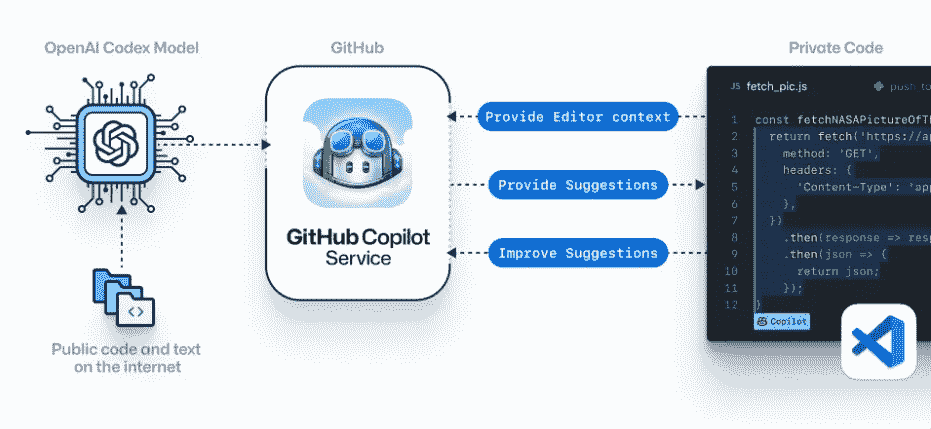

# OpenAI 推出 GitHub Copilot:专注于代码生成的 AI。我们现在应该担心吗？

> 原文：<https://towardsdatascience.com/should-we-be-worried-now-that-github-copilot-is-out-12f59551cd95?source=collection_archive---------2----------------------->

## 它是做什么的，它是如何工作的，它有什么缺陷，作为一名数据科学家，你应该担心吗…

**副驾驶主页截图**

10 亿美元的投资能买到什么？

本周二，OpenAI 和 GitHub 通过一款新的人工智能工具——**GitHub Copilot**的预览大胆地回答了这个问题。它可以编写用户兼容的代码，并且在这项任务上比它的前辈 GPT 3 号要好得多。

[Copilot](https://copilot.github.com/) 自动完成代码片段，建议新的代码行，甚至可以根据提供的描述编写整个功能。根据 GitHub 博客的说法，这个工具不仅仅是一个基于用户输入的语言生成算法——它是一个虚拟的*对程序员*。

它学习并适应用户的编码习惯，分析可用的代码库，并生成由数十亿行公共代码支持的建议。

这是微软向 OpenAI 投资[10 亿美元的第一次尝试，open ai 是一家专注于 AGI(人工通用智能)的研发公司。](https://www.theverge.com/2019/7/22/20703578/microsoft-openai-investment-partnership-1-billion-azure-artificial-general-intelligence-agi)

<https://ibexorigin.medium.com/membership>  

获得由强大的 AI-Alpha 信号选择和总结的最佳和最新的 ML 和 AI 论文:

<https://alphasignal.ai/?referrer=Bex>  

## 它是如何工作的？

在其核心部分，GitHub Copilot 使用了一种新的语言生成算法，该算法由 OpenAI 开发，称为 Codex。OpenAI 首席执行官 Greg Brockman 将其描述为 GPT-3 的后代，但只专注于代码生成。

Codex 算法已经在从 GitHub 和精选的英语语言中提取的万亿字节的公共代码上进行了训练。这使得该工具能够以前所未有的准确性编写基于上下文的代码。

目前是 Visual Studio 代码扩展，[技术预览版](https://copilot.github.com/)的位置有限。

在引擎盖下，扩展将您的代码和评论发送到 GitHub Copilot 服务，该服务使用 Codex 算法来合成和创建建议。

Copilot 主页部分截图

它几乎可以说任何编程语言，但最适合与 Python、JavaScript、TypeScript、Ruby 和 Go 一起使用。

根据用户的选择，该工具可以为一个建议生成多达 10 个备选方案。该算法通过记录每个建议是否被接受而不断改进。

## 有多好？

GitHub 的开发人员进行了一项实验来测量该工具的准确性。它在一组 Python 函数上进行了测试，这些函数在开源存储库中具有良好的测试收敛性。

所有的函数体都被删除了，唯一提供的上下文是函数名和文档字符串。Copilot 能够在 43%的时间内正确填写，在 10 次尝试后，准确率增加到 57%。

这确实是一个了不起的成就，因为该工具生成了您可以在项目中使用的工作代码。一旦上市，将有数百万人使用它，这将大大加快开发速度。

为了充分利用它，建议将代码分成小函数，提供有意义的函数名、参数和文档字符串。

换句话说，它真的是你的搭档程序员——它让你遵循软件工程的最佳实践，作为回报，它从你的代码中学习改进它的建议。

## 生成的代码质量如何？

尽管 Copilot 几乎有一半的时间是正确的，但创造者表示，应该对其输出进行监控:

> GitHub Copilot 试图理解您的意图，并尽可能生成最佳代码，但它建议的代码可能并不总是有效，甚至没有意义。

建议的质量也取决于现有的代码。Copilot 只能使用当前文件作为上下文。它不能测试自己的代码，这意味着它甚至不能运行或编译。

此外，FAQ 说你使用这个工具要自担风险，因为它可能会建议你使用旧的或者废弃的版本的库和框架。

也有人担心 Copilot 的训练集包含数百万人编写的代码。

显而易见的问题是，“它会重复训练数据中的代码吗？”答案是*会*。据观察，该工具有 0.1%的机会从训练集中泄漏代码。

副驾驶背诵蟒蛇禅

将这种可能性用百分比来表示可能不会显示更大的图景。考虑到每个建议会有多达 10 个选项，1000 分之一的可能性实际上更严重。

然而，[关于这个问题的深入案例](https://docs.github.com/en/github/copilot/research-recitation)研究显示，这些情况只发生在没有足够的背景可供学习的时候。特别是，当当前文件很短或为空时，算法更容易犯这些错误。

## 作为一名数据科学家，你应该担心吗？

考虑到它的优点和缺点，值得问一下 GitHub Copilot 是否会影响未来的开发者工作。

当 GPT-3 发布的时候，这个问题的答案是一个试探性的，微弱的*是*。然而，现在 Copilot 已经上市，并将成为一种商业产品，集成到全球广泛使用的 ide 中，我们应该重新考虑我们的答案。

创造者声称，该工具只会提高生产率，将开发人员从手工任务中解放出来，并帮助他们专注于更有趣的工作。这也有可能降低新手进入软件行业的门槛。

就我个人而言，我坚信人工智能，无论多么先进，都不会很快取代人类。我完全不同意有一天，人工智能会超越所有编程学科，能够独自解决任何独特、复杂的问题。

对于数据科学领域来说尤其如此。不管 GitHub Copilot 有多好，我觉得它连最简单的 Auto-ML 库都打不过。

数据科学不仅仅是写好代码，它是领域知识、理解数据和漂亮数学的集合。

然而，我不会否认，像这样一个基于人工智能的工具，一个由数十亿公司支持的技术，将在未来数百万程序员的日常工作流程中发挥至关重要的作用。