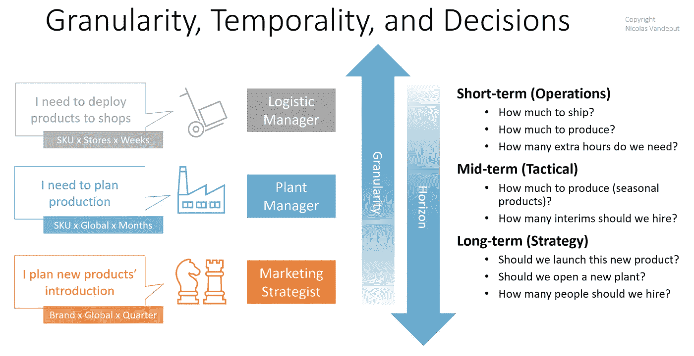
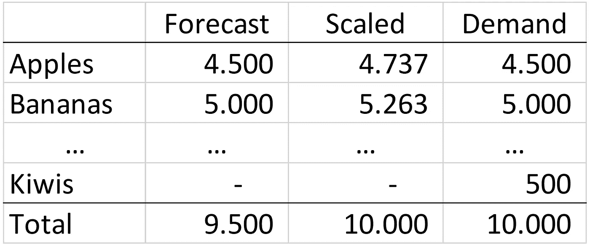
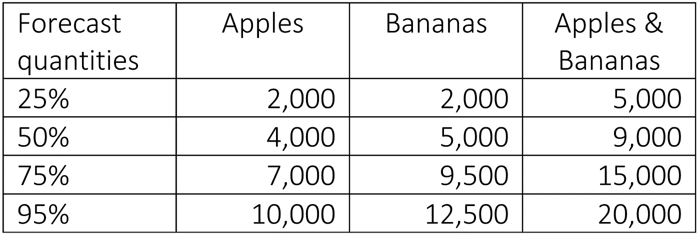

# 我们应该协调预测以调整供应链吗？

> 原文：<https://towardsdatascience.com/should-we-reconcile-forecasts-to-align-supply-chain-b8b241fcbf36?source=collection_archive---------24----------------------->

## 供应链管理是关于决策的。我们应该使用“一个数字预测”还是“一个数字思维”来调整团队？

## 请求预报

不同的团队和流程使用供应链的需求预测。正如(Vandeput，2021 年)和(Clarke，2019 年)所讨论的，不同的利益相关方对预测材料和时间粒度有其他要求。物流经理可能会使用预测来决定未来几天在哪些商店装运货物。工厂经理必须计划好接下来几周的生产。战略家和营销人员将使用同样的预测来评估在接下来的六到九个月里要推出什么新产品。财务经理将根据下一季度的收入预测与投资者沟通。

供应链管理是关于决策的。我们如何确保所有这些团队在进行预测(以及由此产生的决策/计划)时保持一致？

# 一号预测？

为了协调所有这些利益相关者，许多从业者——如(Clarke，2019 年)和(Bowman，2013 年)中所讨论的那样——倡导**一个数字预测**(即供应链中所有人共享的统一预测)；希望共享一个统一的预测将*迫使*利益相关者一致。由于当前的预测软件，跨不同的时间和材料粒度机械地调整预测是容易的。

尽管如此，它仍将伴随着挑战。

*   **效率。**首先，你将面临一个单调乏味的周期性调整过程:你能想象在未来 18 个月内每月调整数千个 SKU 的每周预测吗？
*   **最优。**第二，在一个材料/时间粒度级别的最佳预测(或模型)在另一个粒度级别将不是最佳的(我们将在下一节讨论这种影响)。一种尺寸不能适合所有人。
*   **对齐。**最后，正如(Bowman，2013 年)所解释的，拥有“一个数字预测”并不能保证供应中的所有团队都是一致的。(Bowman，2013)讨论了雀巢美国公司在 S & OP 流程中就单一数字预测达成一致的例子。然而，每个部门仍然在执行一些内部烹饪。
    再举一个简单的例子。你可以在销售会议上同意需求预测是 100。然而，供应经理将生产 120 个单位，销售经理将假设销售目标为 90，财务经理的收入为 105。一个统一的预测，却有许多不同的计划。

# 不同的粒度…不同的最佳预测

使用统一预测的一个主要问题是，单一预测(或模型)不可能对所有物料和时间汇总级别都是最佳的。

计划者经常惊讶地发现，在 SKU 水平上做出的预测与在家庭水平上做出的预测是不同的。这很正常，令人沮丧。预测者很清楚，对总和的预测并不是预测的总和。

除了数学之外，让我们来讨论这一效应背后的两个业务驱动因素:

## **现货销售&清仓处理**

一个产品系列的销售在总体水平上可以相当稳定。然而，在 SKU，你会看到许多现货销售，由于闪电促销，剩余库存清理，特定的一次性销售，或合同。SKU 不可能准确预测这些现货交易:预测模型使用历史需求来预测未来的销售。他们如何预测长期未售出的 SKU 的清仓情况？

自上而下的预测[【1】](#_ftn1)可以包括一些现货销售，但不能将它们分配到特定的库存单位。例如，如果你知道你将为一个产品系列进行清货，你并不知道你的客户将会购买哪一款*SKU。*

此外，需求计划者应该密切注意*而不是*将历史库存清理纳入未来预测。否则，他们将面临触发新的库存补充的风险。

## **产品生命周期**

(新)产品随着时间的推移来来去去。由于预测引擎使用历史需求来预测未来的销售，您不能指望预测引擎预测新 SKU 的未来推出。另一方面，预测引擎将发现产品接近其寿命终点时的任何下降趋势。这种双重效应往往会使长期自下而上的预测产生偏差。另一方面，自上而下的预测——如果家庭投资组合稳定——不会受到这种影响。

总之，即使你可以很容易地得出一个家庭级别的 18 个月预测，将其转化为 SKU 级别也不是最佳的:你不知道哪个 SKU 将构成这个家庭的总销售额(即使你可以预测主要产品)。

[[1]](#_ftnref1) 自上而下的预测:在家庭层进行的预测，根据历史值传播到 SKU。

## **示例**

作为需求计划员，你负责预测水果。水果主要由苹果和香蕉组成，加上一百种其他不太知名的水果(通常不卖)。你知道你每个月销售大约 10.000 种水果(大部分是苹果和香蕉，还有一些不太知名的水果)。

如果您预测 SKU 级别的水果销售，您的统计引擎预测每月需求为 9.500 个水果(苹果和香蕉)。如果您在汇总级别预测您的水果销售，则引擎显示 10.000 单位的预期需求。如果以水果总量来衡量，这第二个综合预测可能是最准确的。然而，在 SKU 水平上，将 9.500 个苹果和香蕉的预测扩展到 10.000 个单位(如表 1 所示)，可能不会带来任何改进，甚至会降低价值！

表 1 SKU 预报与比例预报。

SKU 预测(9500 单位)和家庭预测(10000 单位)之间的差异是由于通常不会销售的水果的意外销售。

## 结论

将苹果和香蕉的预测提高到 10.000 单位将会摧毁 SKU 水平的价值。事实上，在 SKU 的层面上，你根本无法知道下个月会有哪些“不太知名”的水果出售。

## 调和概率预测

在许多情况下，使用概率预测无法解决这个调和问题。这会让事情变得更糟。对不同物品的需求是*而不是*独立的。(一些需求驱动因素会推动所有需求上升或下降，一些客户可能会选择购买一种产品或另一种产品，等等。)以使较高聚合级别的概率分布不会是较低级别需求分布的总和(参见表 2 中的示例)。

表 2 概率预测协调示例

另一方面，点预测——因为它预测的是平均需求——在任何汇总级别都是可调节的，不会出现问题:在粒度级别的总例外需求应该与全局级别的平均预期需求相同。

这种效应为预测者所熟知:M5 国际预测竞赛要求对每个聚合级别进行不同的需求分布，但只有一个点——最细级别的预测。[【1】](#_ftn1)

[【1】](#_ftnref1)参见(商务部，2020)。

# 一号思维定势！

在*一号预测*的概念旁边，出现了一个新的想法:**一号思维定势**。这一构想建议所有利益相关者(计划者、财务、市场营销)以单一的*心态*来结盟，而不是强迫每个人都以单一的*数字*来结盟。正如(Bowman，2013 年)和(Wilson，2019 年)所建议的那样，这种想法是为了共享假设、数据和对未来的清晰愿景，而不是强迫每个人都遵循每个 SKU 预测(并在一个预测流程中满足所有要求和团队)。每个团队都应该了解任何可能影响需求的信息，如定价、营销活动、产品介绍、竞争对手的行动等。

实际上:

*   应该要求每个团队使用相同的调和需求、定价和主数据(以及任何其他相关的信息源)。供应链不允许两个团队使用不同的历史数据来填充预测。
*   应该建立一个正式的流程来共享影响需求的事件的信息(如价格变化、营销事件、产品介绍、竞争对手的行动……)。S&OP 流程可以成为团队间信息共享的渠道。
*   最后，由不同团队完成的预测应该很容易被其他团队访问。为了防止彼此之间出现任何重大偏差，所有预测可能需要在一个特定(狭窄)的范围内波动。如前所述，小的差异是可以接受的，也是正常的，但是任何大的差异(全球范围内任何高于 5%的差异)都会导致利益相关者之间缺乏一致性。

有了这种一致的心态和共享的数据，尽管使用不同的预测流程(具有不同的汇总级别)和略有不同的数字，但每个功能都将保持一致。

由于单一的思维模式而协调团队将允许每个利益相关者在其所需的预测粒度上工作，同时实现主要需求驱动因素(新产品介绍、价格变化、特殊事件等)的协调。这将为每个团队留出更多的空间来使用最合适的预测模型定义自己的预测过程，最终提高整体预测质量。正如(Clarke，2019)所解释的，团队现在将有更多的时间来讨论规划，而不是相互影响以实现单个数字预测，因为他们避免了协调过载。

例如，供应链可以有一个基于国家 x 月粒度的 S&OP 流程。然而，为了优化从全球生产工厂到本地仓库的每周交付，可以在仓库 x 周粒度上进行另一个预测。这两种预测都将使用相同的历史需求数据集生成，但使用不同的模型和审查流程。此外，短期预测将由需求计划人员进行审核，以确保与 S&OP 预测相比，短期预测保持在合理的范围内。否则，规划者可以根据 S&OP 数字轻松调整短期预测。最后，在主要 S&OP 会议中讨论的任何重大事件(如价格变化或特殊销售)都应该用于微调短期预测。

## 👉[我们在 LinkedIn 上连线吧！](https://www.linkedin.com/in/vandeputnicolas/)

# 承认

[福蒂斯·彼得罗保罗斯](https://www.linkedin.com/in/fotios-petropoulos-04536023/)，[迈克尔·吉利兰](https://www.linkedin.com/in/michael-gilliland-9365679/)，[卡尔-埃里克·德沃](https://www.linkedin.com/in/karlericdevaux/)

# 文献学

需求预测没有神奇的数字。供应链大脑 2013。[https://www . supply chainbrain . com/blogs/1-think-tank/post/15929-需求预测中没有神奇的数字。](https://www.supplychainbrain.com/blogs/1-think-tank/post/15929-there-is-no-magic-number-for-demand-forecasting.)

**克拉克西蒙**一位数预测。氩& Co 2019。[https://www . argon andco . com/us/news-insights/articles/one-number-forecasting-sandy-springs-Atlanta-ga/。](https://www.argonandco.com/us/news-insights/articles/one-number-forecasting-sandy-springs-atlanta-ga/.)

商务部主办 2020 年 M5 奥运会。[https://mofc.unic.ac.cy/m5-competition/.](https://mofc.unic.ac.cy/m5-competition/.)

Vandeput Nicolas 的四维预测框架。迈向数据科学 2021。https://towards data science . com/the-4-dimensions-forecasting-framework-f 7884 EC 1472。

你应该成为一家数字预测公司吗？需求规划 2019。[https://demand-planning . com/2019/05/20/should-you-be-a-one-number-forecasting-company/。](https://demand-planning.com/2019/05/20/should-you-be-a-one-number-forecasting-company/.)

# 关于作者

icolas Vandeput 是一名供应链数据科学家，擅长需求预测和库存优化。他在 2016 年创立了自己的咨询公司 [SupChains](http://www.supchains.com/) ，并在 2018 年共同创立了 [SKU 科学](https://bit.ly/3ozydFN)——一个快速、简单、实惠的需求预测平台。尼古拉斯对教育充满热情，他既是一个狂热的学习者，也喜欢在大学教学:自 2014 年以来，他一直在比利时布鲁塞尔为硕士学生教授预测和库存优化。自 2020 年以来，他还在法国巴黎的 CentraleSupelec 教授这两门课程。他于 2018 年出版了 [*供应链预测的数据科学*](https://www.amazon.com/Data-Science-Supply-Chain-Forecasting/dp/3110671107)(2021 年第 2 版)和 2020 年出版了 [*库存优化:模型与模拟*](https://www.amazon.com/Inventory-Optimization-Simulations-Nicolas-Vandeput/dp/3110673916) 。

