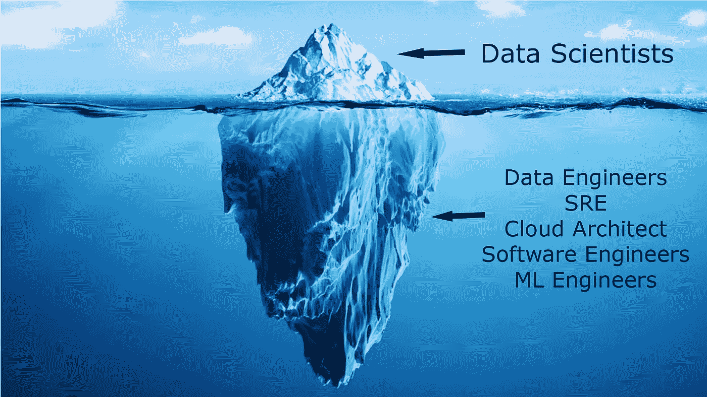
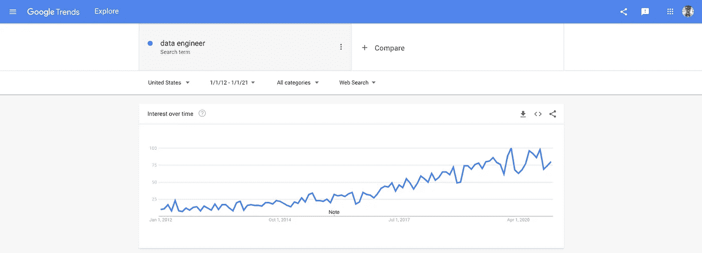
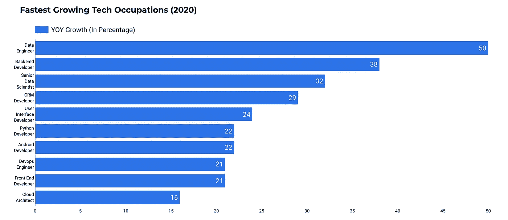
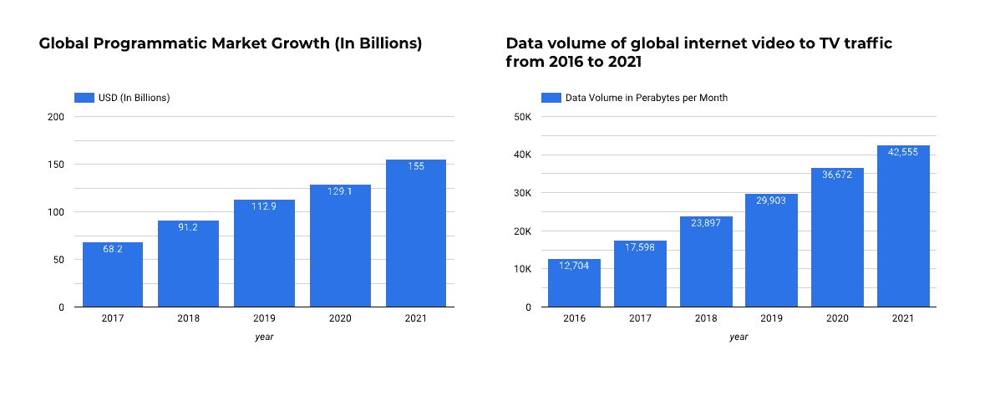
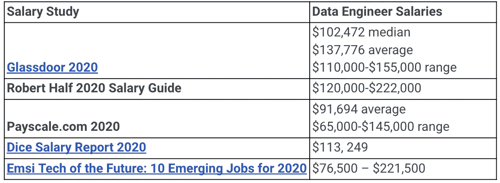
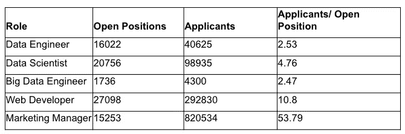
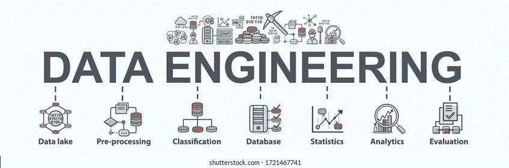

# 2021 年该不该成为数据工程师？

> 原文：<https://towardsdatascience.com/should-you-become-a-data-engineer-in-2021-4db57b6cce35?source=collection_archive---------2----------------------->

## 数据工程是新的数据科学


在 [Unsplash](https://unsplash.com?utm_source=medium&utm_medium=referral) 上 [Magnet.me](https://unsplash.com/@magnetme?utm_source=medium&utm_medium=referral) 拍照

我们都听说过这个头衔—
**数据科学家，21 世纪最性感的工作。** 但真的是这样吗？

对于许多刚接触数据行业的人来说，数据科学将是他们听到的第一件事，而且这个名称也不会过时。突然间，每个人要么已经是数据科学家，要么渴望成为数据科学家。

然而，这并不是业内唯一的职称。



作者图片

与数据相关的职称还有很多。
数据科学家已经在数据前沿工作了很长时间，现在是数据工程师和其他数据相关角色出现的时候了。

看看 2020 年的数据，这已经在发生了。
**数据科学可能正在减速。**

根据 interviewquery.com 的 [2021 数据科学采访报告，该报告收集了超过 10，000 次数据科学采访经验，**数据科学采访增长了 10%** ，相比之下**数据工程采访在 2020 年增长了 40%** 。](https://www.interviewquery.com/blog-data-science-interview-report)



作者截图

关于就业增长，数据来自 450 多家科技公司。对于数据科学家这一角色，2020 年的就业增长实际上比 2019 年下降了 15%。商业分析师和数据工程师等其他数据相关职位的增长抵消了这一下降。

因此，停止传播数据科学家仍然是最性感的工作的消息。
现在在数据领域有一些“**更热门的”**角色，数据工程师就是其中之一。

# 就业前景


保罗·斯科鲁普斯卡斯在 [Unsplash](https://unsplash.com?utm_source=medium&utm_medium=referral) 上拍摄的照片

我们来谈谈就业增长和对数据工程师的需求。
根据 [**DICE 的 2020 年科技岗位报告**](http://marketing.dice.com/pdf/2020/Dice_2020_Tech_Job_Report.pdf) ，数据工程师是 2019 年增长最快的岗位，同比增长 50%。数据科学家也榜上有名，同比增长 32%。



作者图片

但这还不是全部，其他薪酬研究也发现了关于**数据工程师角色的类似结果——T33**

*   [**软件工程师雇佣状况报告**](https://hired.com/state-of-software-engineers) —就业同比增长 45%
*   [**领英发布的 2020 年新兴工作报告**](https://business.linkedin.com/content/dam/me/business/en-us/talent-solutions/emerging-jobs-report/Emerging_Jobs_Report_U.S._FINAL.pdf)–年同比 33%的工作增长
*   [**燃烧的玻璃新星平台**](https://www.burning-glass.com/products/nova/) —就业同比增长 88%

作为数据从业者，我们明白数据不会说谎。
数据表明，数据工程是近年来增长最快的工作之一，甚至超过了数据科学的角色。

# 为什么会这样？

## 更高的支出


Photo by [金 运](https://unsplash.com/@jinyun?utm_source=medium&utm_medium=referral) on [Unsplash](https://unsplash.com?utm_source=medium&utm_medium=referral)

根据从 551 家大型科技买家收集数据的 [***IDG 云调查***](https://www.infoworld.com/article/3561269/the-2020-idg-cloud-computing-survey.html) 称**截至今天(2020 年)**，他们的全部 IT 环境中只有 38%在云上。

在 18 个月内，这些 IT 环境预计将有 59%在云上**。同样的技术买家也将 32%的 IT 预算分配给云计算**、**，相当于每家技术公司 7380 万美元(比 2018 年增长 59%)。**

**在大量数据科学家涌入之后，公司意识到他们需要适当的数据基础设施来对数据执行任何有意义的分析。公司已经开始花钱购买合适的云基础设施、数据架构，并雇佣新的数据工程人才。**

## **更高的需求**

****

**作者图片**

**对数据工程师需求的一个有力证明是大数据的增长。
如果你一直生活在岩石下，**数据就是新的石油**。**

**每天都有新的数据产生，而且只会继续增长。随着数据量的疯狂增长，对工程师处理数据的需求将会增加。**

**另一个例子是咨询公司提供的大数据工程服务的增长，如埃森哲 和其他科技公司，如 [**Cognizant**](http://www.cognizant.com/) 。随着数据的增加，适当的数据工程服务也在增加。数据工程服务市场正经历着 **18%的年增长率**，预计到 2025 年将达到 **31%的年增长率**。**

# **支付**

****

**由 [Mufid Majnun](https://unsplash.com/@mufidpwt?utm_source=medium&utm_medium=referral) 在 [Unsplash](https://unsplash.com?utm_source=medium&utm_medium=referral) 拍摄的照片**

**数据工程师工资**很高**。在很多情况下甚至比数据科学家的还要高。许多薪酬研究(总结如下)表明，数据工程师是薪酬最高的人才之一，他们的薪酬不会很快下降。**

**根据 [**聘请的 2019 年软件工程师状况报告**](http://pages.hired.email/rs/289-SIY-439/images/2019-State-of-SoftwareEngineers-Report.pdf?mkt_tok=eyJpIjoiTW1ReVl6RTNZVE15WWpNMSIsInQiOiJ5ajJ4N0xSQ3lRRmFscU84b1FzNGhZXC9IM2ZXbElCcHordUljaGY4Sk00RmtYMU1DVFJWSk1zRFExa3Q5NUlocE9LZVRRd2k3dUJzOVBLeFFQY2d1aWc2NnZydjNsVm1tYzNnUjlwN2xCZWxReEU3YmROTDNIcjA1cHRNaHRlS0EifQ%3D%3D) ，数据工程师的平均工资在纽约州增长了 7%，在湾区增长了 6%，而其他美国人的平均工资为 3.5%。**

**这是关于数据工程师的工资研究—**

****

**作者图片**

**从数据中可以看出，数据工程师的收入远远高于 110，000 美元，这对大多数人来说是一个可观的数字。此外，由于数据工程师的供应短缺，工资预计会增加。**

## **申请人竞争**

****

**作者图片**

**根据 Ori Rafael(up solver 的首席执行官)所做的一项[研究](https://thenewstack.io/data-scientists-get-the-glamour-but-there-is-also-a-need-for-data-engineers/)，LinkedIn 上列出的每个职位大约有 **2.5 名候选人申请数据工程师职位，而其他职位的申请人要多得多。****

**这个数字表明数据工程师的供应短缺。因此，求职者更有可能在招聘过程中为自己争取更高的薪资范围。**

**不言而喻，每个人的招聘过程都是不同的，谈判范围取决于多种因素。这些因素包括但不限于—**

*   **多年的经验**
*   **技能**
*   **以前的成就**
*   **公司所在地**
*   **工业**

**从经验上讲，我个人看到过那些非常重视自己数据的公司提供比其他公司更高的薪水。这些公司的一个很好的例子是提供某种数据产品的公司，以及对其数据有某种目标的公司。**

# **责任**

****

**由[布鲁克·卡吉尔](https://unsplash.com/@brookecagle?utm_source=medium&utm_medium=referral)在 [Unsplash](https://unsplash.com?utm_source=medium&utm_medium=referral) 拍摄**

**那么，数据工程师是做什么的呢？
好吧，我已经在我之前的[帖子](/why-are-data-engineers-equally-as-important-as-data-scientists-545898929444)中写了这些。**

**</why-are-data-engineers-equally-as-important-as-data-scientists-545898929444>  

从本质上讲，数据工程师管理着公司数据在数据仓库中如何组织的核心基础。任务范围从设计表结构到构建 **ETL/ELT 管道**以确保可扩展的高性能基础设施满足公司的所有数据需求。

他们还处理几乎所有与数据自动化有关的事情。我之前做过的一个例子是我创建的 [Gmail 数据管道](/data-engineering-how-to-build-a-gmail-data-pipeline-on-apache-airflow-ce2cfd1f9282)。

</data-engineering-how-to-build-a-gmail-data-pipeline-on-apache-airflow-ce2cfd1f9282>  

数据工程师能够回答这样的问题—

*   当站点上发生事件时，主数据库中会发生什么？
*   为什么数据仓库中的表是这样构造的？
*   为什么我们每天而不是每小时提取数据？

更高级的数据工程师也致力于将数据实时接收到数据接收器的流数据管道。这对于机器学习产品来说非常有用，这些产品可以实时接收数据并执行一些操作。

# 技能



图片来自 [Shutterstock](https://www.shutterstock.com/image-vector/data-engineering-banner-web-icon-business-1721467741)

成为一名数据工程师需要广泛的技能。除了掌握**编程语言**，数据工程师需要**了解数据库如何工作**，以及如何正确**设计管道**将数据加载到数据库中。为了让你更容易理解，我将它总结为 5 个主要能力—

*   编程语言— Python 和 SQL
*   SQL 和 NoSQL 数据库
*   ETL/ELT 技术— Apache Airflow、Hadoop
*   流式传输—阿帕奇波束
*   基础架构—云基础架构

这些技能完美地结合在一起，就形成了一个数据工程师。要真正了解如何构建管道，请看一看我写的关于如何使用 Apache Airflow 构建您的第一个管道的指南。

</data-engineering-basics-of-apache-airflow-build-your-first-pipeline-eefecb7f1bb9>  

# 摘要


由 [Tachina Lee](https://unsplash.com/@chne_?utm_source=medium&utm_medium=referral) 在 [Unsplash](https://unsplash.com?utm_source=medium&utm_medium=referral) 上拍摄的照片

如果你已经做到了这一步，你一定对数据工程非常感兴趣。

**有什么不喜欢的？**

这是增长最快的行业中增长最快的工作之一，同时也是世界上平均工资最高的行业之一。这听起来好得令人难以置信。在本文中，我们讨论了以下立场—

```
- Job Outlook
- Pay
- Responsibilies
- Skills
```

像往常一样，我引用一句话作为结束。

> 你可以有没有信息的数据，但你不能有没有数据的信息——丹尼尔·凯斯·莫兰

# 订阅我的时事通讯，保持联系。

也可以通过 [**我的链接**](https://nickefy.medium.com/membership) 注册一个中等会员来支持我。你将能够从我和其他不可思议的作家那里读到无限量的故事！

我正在撰写更多关于数据行业的故事、文章和指南。你绝对可以期待更多这样的帖子。与此同时，你可以随时查看我的其他 [**文章**](https://nickefy.medium.com/) 来暂时填补你对数据的渴望。

***感谢*** *的阅读！如果你想和我联系，请随时通过 nickmydata@gmail.com 联系我或者我的* [*LinkedIn 个人资料*](https://www.linkedin.com/in/nickefy/) *。你也可以在我的*[*Github*](https://github.com/nickefy)*中查看之前写的代码。***