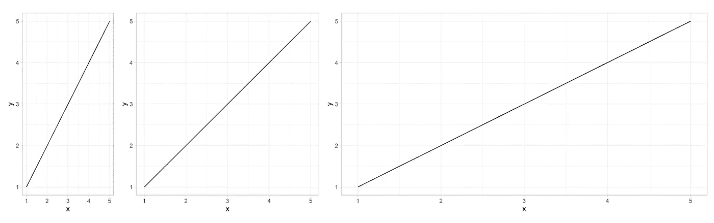
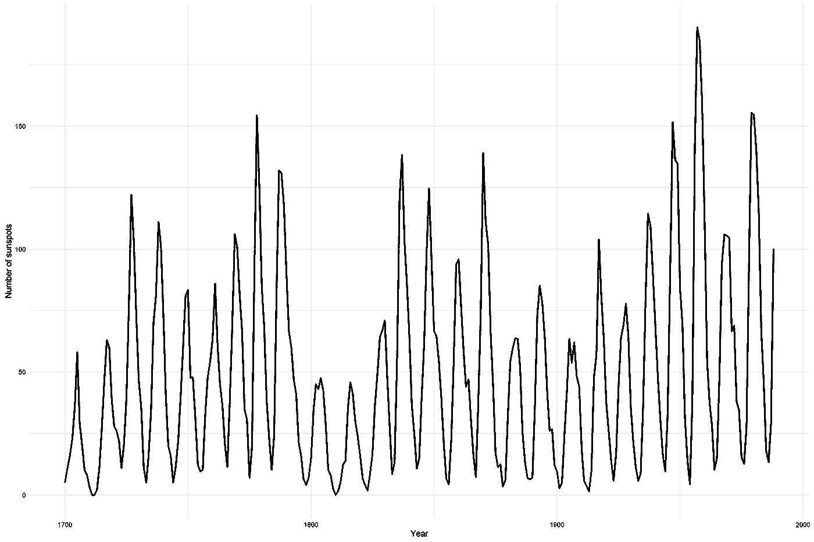
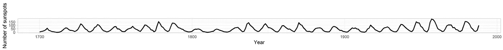
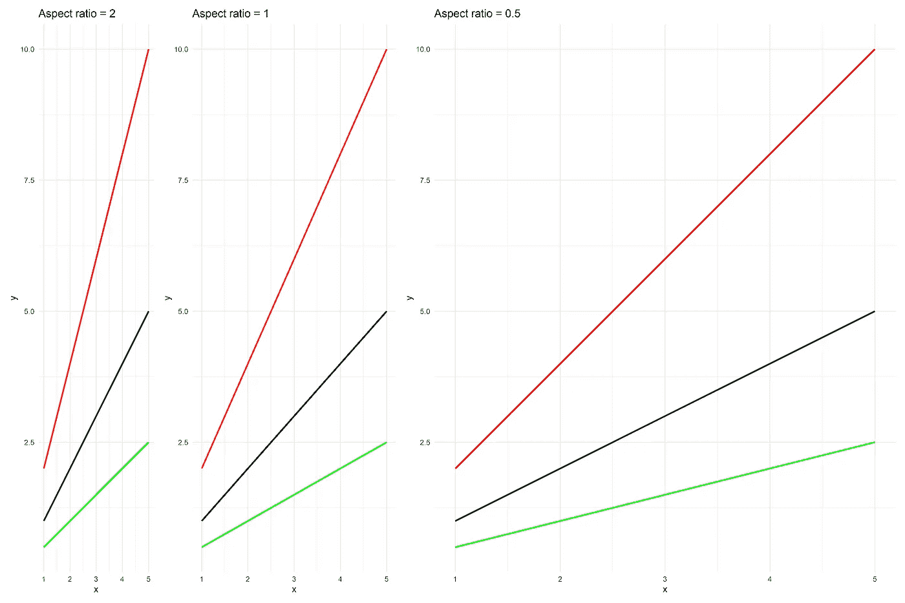
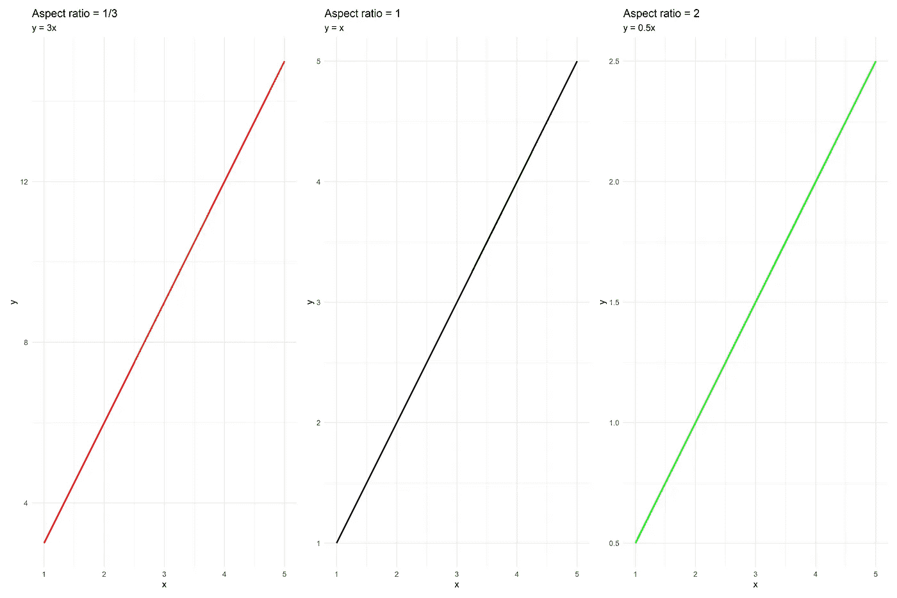
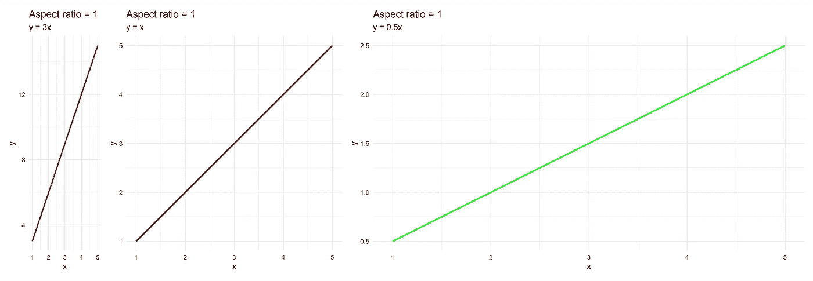

# 创建线形图时使用什么纵横比

> 原文：<https://towardsdatascience.com/should-you-care-about-the-aspect-ratio-when-creating-line-plots-ed423a5dceb3?source=collection_archive---------16----------------------->

## 了解如何创建更好的图表，并使用适当的宽高比在时间序列中找到隐藏的见解。

由[卢德·洛伦兹](https://unsplash.com/@luddelorentz?utm_source=medium&utm_medium=referral)在 [Unsplash](https://unsplash.com?utm_source=medium&utm_medium=referral) 拍摄的照片

创建图表最容易被忽视的一个方面是使用不正确的纵横比。即使在摄影中，改变长宽比也会使照片看起来失真。在这里，很容易纠正长宽比。但是创建图表就那么容易吗？

让我们比较三个情节，并尝试回答以下问题:

*   你能看出这两个情节之间的区别吗，还是一点区别也没有？
*   哪个地块更陡或更平？你能猜到吗？

作者图片

如果我说三个情节都一样。生成的图用于线方程`y = x`，您对上述问题的回答会改变还是保持不变。

最左边的曲线斜率最大，最右边的曲线较平缓。所以，你可以猜测使用不正确的纵横比会发送错误的信息。

现在让我们看看另一种类型的线形图，时间序列，以使情况更强有力。下图是 1700 年到 1988 年间观察到的太阳黑子。当考虑下面的图表时，循环行为具有几乎相同的陡度，我们不能得出太多关于太阳黑子出现的变化率的结论。

作者图片

现在，如果我们看下面长宽比为 0.045 的同一幅图，我们可以看到陡度变化很大，在 1800 年至 1850 年之间很明显。这也揭示了一个事实，即变化率每年也有很大变化。因此，很明显，在创建线条图时，纵横比起着重要的作用。

作者图片

现在剩下的问题是如何确定长宽比。大多数绘图软件使用的纵横比要么是 1:1，要么取决于监视器的显示大小，可以在 4:3、5:4 和 16:9 之间变化。我们通过取宽高比来计算长宽比。

## 计算纵横比:

计算长宽比的想法起源于确保查看者获得图表的正确视觉感知。改变纵横比会改变我们对图表感知信息的感知，从而改变对测量量变化率或相邻数据点之间斜率的解释。为了使呈现的信息和感知的信息一致，他们引入了 45 度倾斜的概念。这是为了确保图表中线段的方向尽可能接近 45 度的斜率。

有很多方法可以计算平均加权纵横比。查看文章末尾的参考资料，了解更多细节。在目前的工作中，使用了 ***中值绝对斜率倾斜*** 方法来计算太阳黑子图的纵横比。*`***ggthemes***`***包提供了一个名为*** `***bank_slopes()***` ***的函数来计算绘图的长宽比。*** 它以 *x* 和 *y* 值作为两个参数。默认方法是中间绝对坡度坡，但也可以使用平均绝对坡度坡计算纵横比。*

## *最佳实践:*

*如果您不在乎为图形选择正确的纵横比，那么您至少应该看看以下情况:*

*   **在单个图表上绘制多条线图进行比较*:在这种情况下，只有当您不打算比较两个不同的图时，默认纵横比才起作用。如下图所示，改变图表的纵横比并不能改变红线比黑线更陡，绿线更平的事实。*

**

*作者图片*

*   ****比较不同图表的不同折线图*** :在这种情况下，确保每个图的长宽比保持不变。否则，视觉解释会有偏差。让我们看两个案例:*

*1.*使用不正确或默认的长宽比*:在这种情况下，我们选择长宽比，使图形最终为方形。这种方法的问题是，在比较三个图时，看起来好像它们都有相同的斜率。这是不正确的，因为根据直线方程，三条线的斜率分别为 3、1 和 0.5。所以在选择图的长宽比时要小心。*

**

*作者图片*

*2.*计算每个图的纵横比*:比较图的最佳方法是计算每个图的纵横比。这对于图具有相同 x 极限的情况非常适用。下图表明红线是最陡的，而绿线基本上是平坦的。线斜率也与图的视觉解释一致。我使用默认设置的`bank_slopes()`功能计算了长宽比。*

**

*作者图片*

****时间序列*** :计算纵横比是明智的，因为当使用正确的纵横比绘制时，一些隐藏的信息会更加明显。*

## *结论*

*以上示例显示了创建折线图时长宽比的重要性。使用错误的长宽比会向观众传递不正确的信息，有时会隐藏显而易见的信息，如时间序列数据所示。和往常一样，最好的可行方法是使用文献中提到的不同技术来计算长宽比，或者尝试使用不同的长宽比，看看哪个长宽比值最有助于表示您的图表。*

*如果你喜欢阅读我写的文章，那么你可以通过使用下面的推荐链接订阅媒体来支持我。*

*<https://abhinav-malasi.medium.com/membership>  

要了解最新情况，您可以订阅我发布文章时的电子邮件通知。

<https://abhinav-malasi.medium.com/subscribe>  

## 参考资料:

*   J.赫尔和 m .阿格拉瓦拉，“45 岁以上的多尺度银行”，IEEE 可视化和计算机图形学汇刊(2006)，12(5)
*   D.赫里斯托多洛“在双变量线图中选择最佳纵横比的启发式标准”，Stata Journal (2017)，17(2)，279–313
*   W.S. Cleveland，M. E. McGill 和 R. McGill，“双变量图的形状参数”，美国统计协会杂志(1988)，83(402)，289-300
*   数据来源:布鲁塞尔比利时皇家天文台 WDC-SILSO

我撰写的其他与数据可视化相关的文章:

</themes-to-spice-up-visualizations-with-ggplot2-3e275038dafa>  </what-chart-type-to-use-when-visualizing-time-series-e0f1a779f2f7>  </six-guidelines-for-good-visualizations-7c1831cda29f>  </hands-on-tutorial-f2ee5dc4d0a8>  </master-data-visualization-with-ggplot2-pie-charts-spider-plots-and-bar-plots-899a07a15827>  </data-visualization-using-ggplot2-5-features-worth-knowing-c0447a760335>  </creating-your-own-color-palette-for-data-visualization-part-2-7b02ebc31c19>  

*可以在* [*LinkedIn*](https://www.linkedin.com/in/abhinav-malasi/) *和*[*Twitter*](https://twitter.com/malasi_abhinav)*上与我连线，跟随我的数据科学和数据可视化之旅。或者您可以在 Medium 上关注我，了解有关 R 和 ggplot2 包的数据可视化的最新文章。**