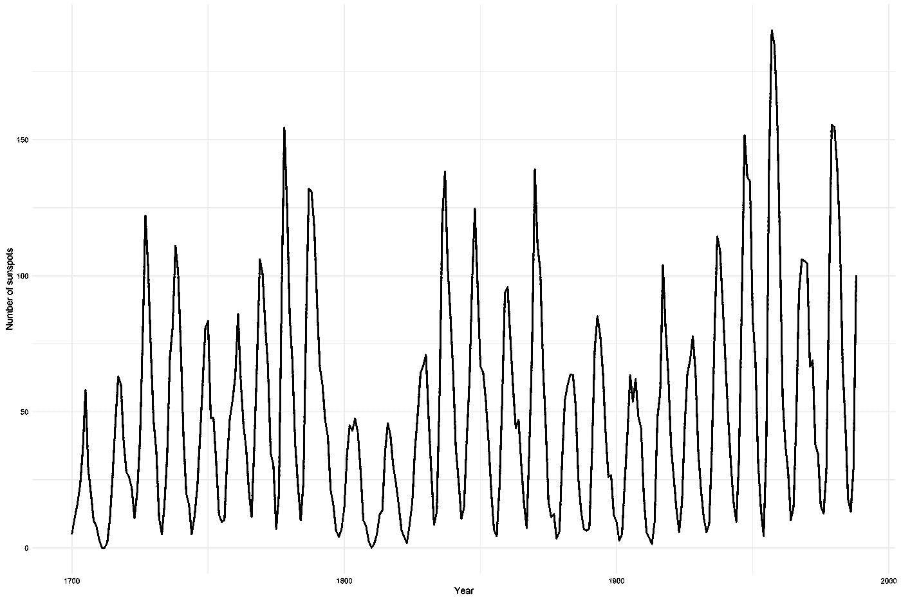
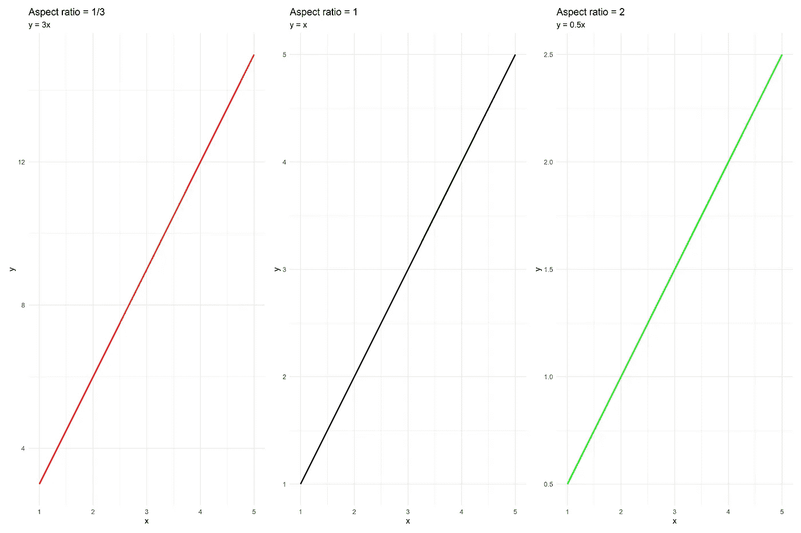

# 创建线形图时使用什么纵横比

> 原文：<https://towardsdatascience.com/should-you-care-about-the-aspect-ratio-when-creating-line-plots-ed423a5dceb3?source=collection_archive---------16----------------------->

## 了解如何创建更好的图表，并使用适当的宽高比在时间序列中找到隐藏的见解。

由[卢德·洛伦兹](https://unsplash.com/@luddelorentz?utm_source=medium&utm_medium=referral)在 [Unsplash](https://unsplash.com?utm_source=medium&utm_medium=referral) 拍摄的照片

创建图表最容易被忽视的一个方面是使用不正确的纵横比。即使在摄影中，改变长宽比也会使照片看起来失真。在这里，很容易纠正长宽比。但是创建图表就那么容易吗？

让我们比较三个情节，并尝试回答以下问题:

*   你能看出这两个情节之间的区别吗，还是一点区别也没有？
*   哪个地块更陡或更平？你能猜到吗？

作者图片

如果我说三个情节都一样。生成的图用于线方程`y = x`，您对上述问题的回答会改变还是保持不变。

最左边的曲线斜率最大，最右边的曲线较平缓。所以，你可以猜测使用不正确的纵横比会发送错误的信息。

现在让我们看看另一种类型的线形图，时间序列，以使情况更强有力。下图是 1700 年到 1988 年间观察到的太阳黑子。当考虑下面的图表时，循环行为具有几乎相同的陡度，我们不能得出太多关于太阳黑子出现的变化率的结论。

作者图片

现在，如果我们看下面长宽比为 0.045 的同一幅图，我们可以看到陡度变化很大，在 1800 年至 1850 年之间很明显。这也揭示了一个事实，即变化率每年也有很大变化。因此，很明显，在创建线条图时，纵横比起着重要的作用。

作者图片

现在剩下的问题是如何确定长宽比。大多数绘图软件使用的纵横比要么是 1:1，要么取决于监视器的显示大小，可以在 4:3、5:4 和 16:9 之间变化。我们通过取宽高比来计算长宽比。

## 计算纵横比:

计算长宽比的想法起源于确保查看者获得图表的正确视觉感知。改变纵横比会改变我们对图表感知信息的感知，从而改变对测量量变化率或相邻数据点之间斜率的解释。为了使呈现的信息和感知的信息一致，他们引入了 45 度倾斜的概念。这是为了确保图表中线段的方向尽可能接近 45 度的斜率。

有很多方法可以计算平均加权纵横比。查看文章末尾的参考资料，了解更多细节。在目前的工作中，使用了 ***中值绝对斜率倾斜*** 方法来计算太阳黑子图的纵横比。*`***ggthemes***`***包提供了一个名为*** `***bank_slopes()***` ***的函数来计算绘图的长宽比。*** 它以 *x* 和 *y* 值作为两个参数。默认方法是中间绝对坡度坡，但也可以使用平均绝对坡度坡计算纵横比。*

## *最佳实践:*

*如果您不在乎为图形选择正确的纵横比，那么您至少应该看看以下情况:*

*   **在单个图表上绘制多条线图进行比较*:在这种情况下，只有当您不打算比较两个不同的图时，默认纵横比才起作用。如下图所示，改变图表的纵横比并不能改变红线比黑线更陡，绿线更平的事实。*

**

*作者图片*

*   ****比较不同图表的不同折线图*** :在这种情况下，确保每个图的长宽比保持不变。否则，视觉解释会有偏差。让我们看两个案例:*

*1.*使用不正确或默认的长宽比*:在这种情况下，我们选择长宽比，使图形最终为方形。这种方法的问题是，在比较三个图时，看起来好像它们都有相同的斜率。这是不正确的，因为根据直线方程，三条线的斜率分别为 3、1 和 0.5。所以在选择图的长宽比时要小心。*

**

*作者图片*

*2.*计算每个图的纵横比*:比较图的最佳方法是计算每个图的纵横比。这对于图具有相同 x 极限的情况非常适用。下图表明红线是最陡的，而绿线基本上是平坦的。线斜率也与图的视觉解释一致。我使用默认设置的`bank_slopes()`功能计算了长宽比。*

**

*作者图片*

****时间序列*** :计算纵横比是明智的，因为当使用正确的纵横比绘制时，一些隐藏的信息会更加明显。*

## *结论*

*以上示例显示了创建折线图时长宽比的重要性。使用错误的长宽比会向观众传递不正确的信息，有时会隐藏显而易见的信息，如时间序列数据所示。和往常一样，最好的可行方法是使用文献中提到的不同技术来计算长宽比，或者尝试使用不同的长宽比，看看哪个长宽比值最有助于表示您的图表。*

*如果你喜欢阅读我写的文章，那么你可以通过使用下面的推荐链接订阅媒体来支持我。*

* [## 阅读阿比纳夫·马拉斯(以及媒体上成千上万的其他作家)的每一个故事

### 作为一个媒体会员，你的会员费的一部分会给你阅读的作家，你可以完全接触到每一个故事…

abhinav-malasi.medium.com](https://abhinav-malasi.medium.com/membership) 

要了解最新情况，您可以订阅我发布文章时的电子邮件通知。

 [## 每当阿比纳夫·马拉斯发表文章时，就收到一封电子邮件。

### 编辑描述

abhinav-malasi.medium.com](https://abhinav-malasi.medium.com/subscribe) 

## 参考资料:

*   J.赫尔和 m .阿格拉瓦拉，“45 岁以上的多尺度银行”，IEEE 可视化和计算机图形学汇刊(2006)，12(5)
*   D.赫里斯托多洛“在双变量线图中选择最佳纵横比的启发式标准”，Stata Journal (2017)，17(2)，279–313
*   W.S. Cleveland，M. E. McGill 和 R. McGill，“双变量图的形状参数”，美国统计协会杂志(1988)，83(402)，289-300
*   数据来源:布鲁塞尔比利时皇家天文台 WDC-SILSO

我撰写的其他与数据可视化相关的文章:

 [## 使用 ggplot2 增加可视化效果的主题

### 利用 ggplot2 包的扩展来加速可视化。

towardsdatascience.com](/themes-to-spice-up-visualizations-with-ggplot2-3e275038dafa)  [## 可视化时间序列时使用哪种图表类型

### 关于可视化时序数据时如何以及何时选择条形图而不是折线图的提示

towardsdatascience.com](/what-chart-type-to-use-when-visualizing-time-series-e0f1a779f2f7)  [## 良好可视化的六个准则

### DataViz 传奇作品的要点。

towardsdatascience.com](/six-guidelines-for-good-visualizations-7c1831cda29f)  [## 条形图动画制作完全指南

### 制作两种不同风格的条形图动画的分步指南

towardsdatascience.com](/hands-on-tutorial-f2ee5dc4d0a8)  [## 使用 ggplot2 实现主数据可视化:饼图、蜘蛛图和条形图

### 关于在 r 中创建饼图、蜘蛛图和圆形条形图的指南。

towardsdatascience.com](/master-data-visualization-with-ggplot2-pie-charts-spider-plots-and-bar-plots-899a07a15827)  [## 使用 ggplot2 的数据可视化:值得了解的 5 个特性

### 使用 ggplot2 包提高 dataviz 效率的技巧

towardsdatascience.com](/data-visualization-using-ggplot2-5-features-worth-knowing-c0447a760335)  [## 为数据可视化创建自己的调色板——第 2 部分

### 平衡色调、色调和饱和度，以生成完美的颜色渐变。

towardsdatascience.com](/creating-your-own-color-palette-for-data-visualization-part-2-7b02ebc31c19) 

*可以在* [*LinkedIn*](https://www.linkedin.com/in/abhinav-malasi/) *和*[*Twitter*](https://twitter.com/malasi_abhinav)*上与我连线，跟随我的数据科学和数据可视化之旅。或者您可以在 Medium 上关注我，了解有关 R 和 ggplot2 包的数据可视化的最新文章。**