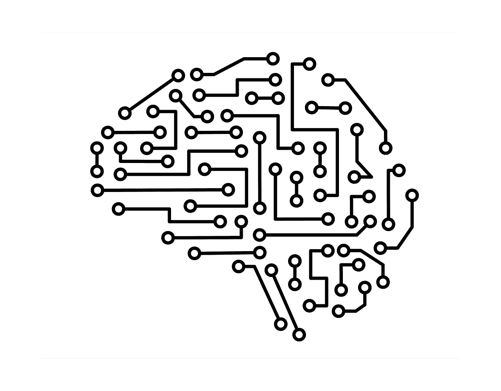

# 2021 年数据科学该不该学 Scala？

> 原文：<https://towardsdatascience.com/should-you-learn-scala-for-data-science-in-2021-cf7810be7bfc?source=collection_archive---------10----------------------->

## Scala 编程语言在发布 17 年后真的值得学习吗？

(img src =[https://pixabay.com/images/id-5076887/](https://pixabay.com/images/id-5076887/))

# 介绍

在今天奢华、功能齐全的生态系统和编程语言出现之前，数据科学之类的东西曾经非常不同。Scala 是一种在过去被大量使用并且今天仍在使用的语言。说到数据科学，Scala 有着与 R 编程语言有些相似的故事，只是它要年轻得多。考虑到这一点，如果我们想真正理解 Scala 在行业中的位置，我们可能需要从头开始。

# 斯卡拉的过去

Scala 是一种编程语言，最初发布于 2004 年；17 年前。这种语言的诞生是为了减轻对 Java 编程语言的一些批评。如果你熟悉 Java，你可能会意识到 2004 年是这种语言绝对的爆发期。我们仍然能感受到当时 Java 繁荣的影响。我认为这是有充分理由的，Java 是一个超级酷的平台，相当新，但仍然相当古老。

虽然 Java 确实是一种令人敬畏的语言，但这种语言确实存在一些问题。就我个人而言，这种语言最大的问题在于 JVM 本身和浮点设计。也就是说，并不是每个人都像我一样为了好玩而处理荒谬的复数。不要像我一样。我跑题了，一个大问题是范式相当严格地面向对象，并没有真正地有许多多范式方面。平行主义和奇怪的宣言式语言也增加了这种语言的一些设计选择的混乱。此外，如果您想了解

Scala 开始创建一种新的基于 JVM 的语言，它可以避免几乎所有这些问题。这种语言允许程序员在面向对象和函数式编程中工作。Scala 中的 Scala 实际上应该是可伸缩语言的简称。这也是 Scala 在很多方面的特点。有相当明显的科学计算和统计计算的灵感也进入了语言的创造。

# Scala 今日

现在我们至少知道了 Scala 是什么，让我们来讨论一下这种语言在 2021 年的状态。尽管 Scala 在某种程度上正在衰落，但这种语言仍然非常受欢迎，是许多雇主非常需要的技能。Scala 实际上仍然经常被使用，而且它很可能不会在短期内突然消失。也就是说，那些学习 Scala 进行数据科学的人可能也想学习另一种语言。

这是因为通常包含 Scala 的工作不仅仅是 Scala 工作，他们只是数据科学家，有些工作是在 Scala 中进行的，而通常是在更像 Python 的东西中工作。这是现代 Scala 的典型用法，更多的是作为大数据的机器。Scala 甚至将 Spark 和 Hadoop 与 Python 结合起来，为一台漂亮的小型大数据计算机器创建了一个非常棒的系统。

# 结论

2021 年数据科学该不该学 Scala？我认为这个问题的答案取决于给定的工程师在他们的数据科学旅程中处于什么位置。一些数据科学家可能毫无问题地学会了这种语言，只是顺其自然，而一些人可能会遇到麻烦。此外，很多时候你可能有更好的事情可以做。也就是说，如果你以任何一种方式学会了这门语言，在可见的未来很可能会有它的工作。也就是说，我仍然不会向一个有抱负的数据科学家推荐学习数据科学，当然不会。

那些在 2021 年将 Scala 作为数据科学的一个选项的人，至少应该非常擅长编写 Python……当然，这只是我的主观看法，但 Python 更有可能让你找到工作，会有更好的文档，并且更容易学习。真正损害 Scala 受欢迎程度的是 Python 的受欢迎程度，但真正有趣的是，Julia 真的已经成为业界的一名杰出人物。我很想知道这是否会对 Scala 的流行产生影响。很久以前，我写了一篇关于这个话题的文章，如果你对这个话题感兴趣，你可以在这里阅读:

</could-julia-replace-scala-77b73c345f6e>  

> 两年前的这个月初，哇——我怎么记得我写了这个？

不管 Scala 在数据科学生态系统中的不确定未来，我认为它仍然是一门值得学习的伟大语言。无论是否计划将这种语言用于数据科学，情况都是如此。感谢您阅读我的文章，祝您有愉快的一天！