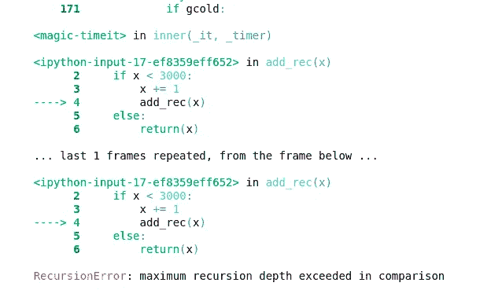

# 真的应该像瘟疫一样避免递归吗？

> 原文：<https://towardsdatascience.com/should-you-really-avoid-recursion-like-the-plague-d239aa50a16?source=collection_archive---------22----------------------->

## 忘记你的计算机科学教授告诉你的——这里是递归的真相


(src =[https://pixabay.com/images/id-6635502/](https://pixabay.com/images/id-6635502/)

# 介绍

在有时精彩，有时令人畏惧的计算机编程世界中，有许多可怕的词汇，对于一个新手，有时甚至是一个有经验的程序员来说都是可怕的。在许多情况下，令程序员感到害怕的一个词是递归。这是因为递归的关联通常被发现应该**永远不要**使用。也就是说，这绝对是一个反对这种技术的基于观点的论点，我个人认为看一看递归在软件中的什么地方被使用以及为什么在那里被使用可能是有意义的，以更好地理解这种关联到底来自于什么。

当然，没有一种技术是完美的。其他循环技术也总是存在问题，比如 while 循环和迭代循环。也就是说，从机器码的角度来看，有一些非常合乎逻辑的原因使得递归在许多场景中显然不是一个好的选择。然而，对于“是否应该使用递归？”实际上是一个相当复杂的问题，因为实际上在某些情况下，可能需要使用递归。

# 什么是递归？

在我们深入探讨为什么递归既是一件好事又是一件坏事之前，让我们首先描述并回顾一下递归到底是什么。对于下面的例子，我将使用 Julia 代码——因为它对那些不编程的人来说也是非常可读的，而且它也是我最喜欢的语言。也就是说，我还将提供一个笔记本，其中包含本文中使用的示例代码:

让我们考虑下面这个递归的例子:

```
function add_rec(x) if x < 30000 x += 1 add_rec(x) else return(x) endend
```

在这个例子中，函数 add_rec()首先检查 x 是否小于 30，000。这在递归应用程序中很常见，在递归应用程序中，如果完成了检查，就进行检查以中断循环。现在让我们考虑迭代的例子，它尽最大能力写成与递归例子相同:

```
function add_iter(x)for i in x:30000 if x < 30000 x += 1 else return(x) endendend
```

仍然很简单，但是这次计算机也知道一个停止点。计算机会知道这个循环需要运行的确切次数。递归不是这种情况，现在让我们计算一下这两个函数的时间，看看结果:

```
@time add_rec(1)0.000094 seconds@time add_iter(1)0.000000 seconds
```

嗯，我们在这个测试中确实遇到了一个问题…

> 朱莉娅太快了。

尽管 Julia 很快，而且在这里可能很难看出显著的性能差异，但我们可以清楚地看到递归示例确实较慢。考虑到这一点，为了更好地展示这一点，我决定用 python 重写代码



(图片由作者提供)

> 对…

通过这两个例子，你可能已经开始弄清楚什么是递归了。递归是我们调用整个方法定义的地方，而不是在函数内部实例化一个循环。因此，性能会受到很大的影响。这有几个原因。第一点很简单，方法调用比典型的 for 循环需要更多的计算。

发生这种情况的下一个原因是因为 while 循环本质上是为编译器设计的。当我们调用一个迭代循环时，编译器知道更多关于我们将要创建的循环的定义。有始有终。有些值是在编译器已经准备好的 for 循环范围内声明的。这就完美地引出了递归既迷人又对性能有害的最大原因——嵌套。嵌套是指同时使用多个作用域层。关于嵌套要记住的一件重要事情是，每次创建一个嵌套，编译器都要做大量的工作。声明了新的成员变量，在这个例子中是 x，声明了一个新的作用域层，这意味着所有这些值对于这个特定的方法调用都是私有的，而不是像 while 或迭代循环中的单个定义。

换句话说，每当我们打电话

```
for i in x:1000
```

我们只需要初始化一个变量，计算机已经知道它的类型是我们提供的 iterable 中的任何类型。在本例中，这是一个范围生成器，因此返回的类型将是一个整数。然而，每当我们打电话

```
add_rec(x)
```

这将重新创建该方法调用。这是这两个元素之间非常明确的根本区别——方法不是循环，循环也不是方法。使用递归，我们实际上是强迫一个方法成为一个循环。

# 从硬件看递归

既然我们已经理解了递归，以及为什么它会对硬件造成损害，那么让我们考虑一下递归在硬件上是什么样子的。为此，我当然会写一些汇编来演示。请继续关注我，因为我认为这很可能会改变你看待计算中递归的方式。我将编写一个读取、求值、打印循环——这当然是递归循环的一个例子——至少在汇编时是这样。另外，如果你想学习更多关于编写汇编的知识，我有一篇文章，我认为可以用“Hello World！”所有人都可以在这里读到:

[](/the-basics-of-writing-assembly-cf5f9e7989bc) [## 编写程序集的基础

### 想学汇编？从这里开始！

towardsdatascience.com](/the-basics-of-writing-assembly-cf5f9e7989bc) 

总之，这是我的。数据部分，它只是提供一个保存在堆栈中的提示，我们可以用它让用户输入一行。然后，我将添加一个. bss 部分，这只是允许我用一个别名保留一些内存。在这个例子中，我们只需要一个字节，因为我只是将整数存储在这里:

```
section .data
repl_prompt: db "Heya> "
section .bss
inp resb 1section .text  
global _start
```

我还添加了我的。文本部分，它包含了我的处理器要解释的所有代码。global _start 在这里的原因是因为这个函数将被用作一个入口点，因此我们希望汇编器知道当我们到达这里时该去哪里。现在，让我们最终开始编写 _start 函数，它将读取、计算并打印:

```
_start:; Check for exit code set to 1:mov rdi, 1cmp rdi, inpje _exitmov rdi, 0je _retzer; Readcall _promptcall _repl_input; Evaluatemov rsi, inpmov rax, 1mov rdi, 1mov rdx, 2syscallmov rsi, 10mov rax, 1mov rdi, 1mov rdx, 2syscall; Loopjmp _start
```

正如您所看到的，在 _start 过程的末尾，我们返回到 _start。假设这是一个函数，下面有几个不同的单独调用。这本质上看起来像是递归的应用，这是一件有趣的事情——因为从非常低级的硬件角度来看，这通常是软件的工作方式。每个应用程序的文本被调用，有时作为子程序，但通常作为主要的循环过程。

众所周知，循环是计算机计算方式不可或缺的一部分。当涉及到低级别时，与代码的处理器实现交谈——避免这种循环的唯一方法是调用. loop。当然，在汇编中也经常这样做，但前者也这样做仍然有效。我在这里想说明的是，在低端机器上使用了多少递归。

此外，编译和加载它，我们看到这个应用程序是一个 REPL，它本身经常是这样写的。这意味着我们用来处理和调试代码的 REPLs 通常本质上是递归的。此外，您可以在我的“随机代码库”中查看我为这个示例编写的所有程序集:

[](https://github.com/emmettgb/Random_Code/tree/main/assembly_repl) [## 主 emmettgb/Random_Code 上的 Random_Code/assembly_repl

### 只是一堆随机的斑点。在 GitHub 上创建一个帐户，为 emmettgb/Random_Code 开发做贡献。

github.com](https://github.com/emmettgb/Random_Code/tree/main/assembly_repl) 

# 高级编程中递归的实现

好了，现在我们已经看到了在低级操作中使用递归的例子，我们是数据科学家，通常不在那个级别上操作，所以让我们看一些在高级意义上使用递归的例子。虽然递归当然不会像迭代那样被广泛使用，甚至不会像传统的 while 循环一样被广泛使用，但是仍然有一些使用递归的例子。我通常认为统计分析和数据科学中最重要的是阶乘的计算。

阶乘很难计算。当计算与它结合时，这种情况更加有效。阶乘对于许多语言来说都是一个非常大的问题，实际上我很久以前就写过一篇文章，讲述我最喜欢的语言 Julia 是如何处理阶乘的。他们使用查找表，而不是计算阶乘，这意味着阶乘被缓存。如果这只是针对低于表所达到的计数的阶乘，那就好了，但事实并非如此。另外，你可以在这里阅读我写的关于这个话题的文章:

[](/the-julia-factorial-issue-72d12f1f42f) [## 朱莉娅阶乘问题

### 大约一周前，当我从车床软件包中提炼统计模块时，我偶然发现了我认为是…

towardsdatascience.com](/the-julia-factorial-issue-72d12f1f42f) 

这表明，即使是像 Julia 这样非常数学化的语言，也会有阶乘的严重问题。总之，典型地，递归阶乘实现是这样写的:

```
function fact(n) if n == 1 return(1) else return n * fact(n-1) endend
```

如果不使用递归，真的没有什么好的方法来计算这个。当然，在现有软件的整个范围内，有很多这样的例子。

# 应该使用递归吗？

所以问题来了，你应该避免递归吗？答案比简单的是或不是要复杂一点。尽管许多计算机科学家和教授可能会坚持，递归的使用肯定有一些有效的方面。这在高层次的意义上和非常非常低层次的意义上都是正确的。正如我们在汇编示例中看到的，在许多情况下，汇编代码中没有使用子例程，这可能使递归成为这种情况下最有效的选择。

我想我会推荐一篇关于如何运用这种判断力的好文章，作者是费思·齐克威。本文详细介绍了何时应该使用常规循环，通常是迭代循环，而不是递归实现。如果你想更多地了解他们在这个问题上的主张，你可以在这里看到一篇很好的文章:

[](https://betterprogramming.pub/when-to-loop-when-to-recurse-b786ad8977de) [## 什么时候循环？什么时候递归？

### 如何在代码中充分利用递归

better 编程. pub](https://betterprogramming.pub/when-to-loop-when-to-recurse-b786ad8977de) 

# 结论

到总结，虽然递归肯定不是没有问题，但是拥有这样一个工具也有一些非常重要的好处。没有理由完全忽略和不使用任何编程技术，甚至递归。非常感谢您的阅读，我真的希望这篇文章对这种经常被认为是不可用的技术提供了一些反思。祝您愉快！