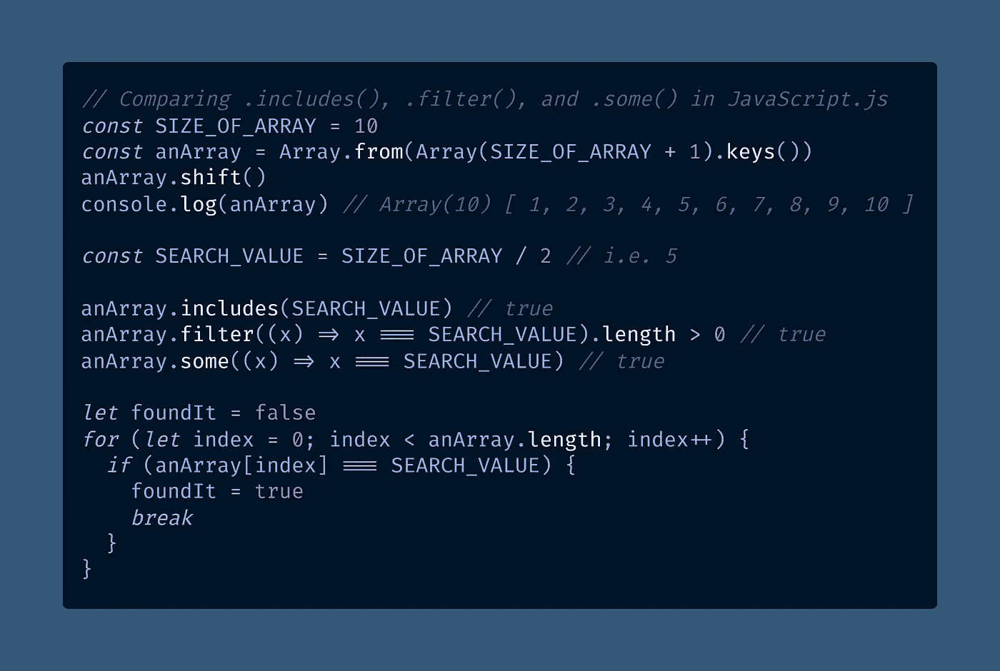
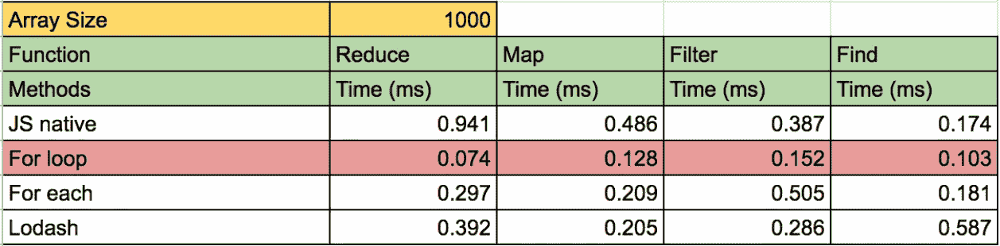

# 你应该使用。包括或。过滤器检查数组是否包含一个项目？

> 原文：<https://towardsdatascience.com/should-you-use-includes-or-filter-to-check-if-an-array-contains-an-item-1a8365dfc363?source=collection_archive---------2----------------------->

## WEB 性能

## 两种方法都可以。`Array.prototype.filter()`比`Array.prototype.includes()`强大得多，而`.includes()`方法更容易阅读，性能也更好。

照片由 [Athena Lam](https://unsplash.com/@thecupandtheroad?utm_source=medium&utm_medium=referral) 在 [Unsplash](https://unsplash.com?utm_source=medium&utm_medium=referral) 上拍摄

如果你需要知道一个 JavaScript 数组是否包含一个条目，除了写一个`[for](https://developer.mozilla.org/en-US/docs/Web/JavaScript/Reference/Statements/for)` [循环](https://developer.mozilla.org/en-US/docs/Web/JavaScript/Reference/Statements/for)之外，你还有几个选择。

最明显的选择是`[Array.prototype.includes()](https://developer.mozilla.org/en-US/docs/Web/JavaScript/Reference/Global_Objects/Array/includes)`，但是使用`[Array.prototype.filter()](https://developer.mozilla.org/en-US/docs/Web/JavaScript/Reference/Global_Objects/Array/filter)`可能会节省你未来的重构。

> `**includes()**`方法确定数组的条目中是否包含某个值，根据情况返回`true`或`false`
> — [MDN 文档](https://developer.mozilla.org/en-US/docs/Web/JavaScript/Reference/Global_Objects/Array/includes)

如果您需要返回第一个匹配的条目，您应该使用`[Array.prototype.find()](https://developer.mozilla.org/en-US/docs/Web/JavaScript/Reference/Global_Objects/Array/find)`而不是`.includes()`。

更强大的`.filter()`方法让您用任意标准测试整个数组，它返回所有匹配项的新数组。换句话说，`.filter()`给出了一个过滤后的数组。

如果以后您需要处理匹配的项目，或者将包含条件更改为任意条件，您将需要使用`.filter()`。比`.includes()`厉害多了。

> "`**filter()**`方法**创建一个新数组**，其中所有通过测试的元素都由提供的函数实现。"
> — [MDN 文档](https://developer.mozilla.org/en-US/docs/Web/JavaScript/Reference/Global_Objects/Array/filter)

如果您检查由`.filter()`返回的数组是否有一个`[.length](https://developer.mozilla.org/en-US/docs/Web/JavaScript/Reference/Global_Objects/Array/length)` > 0，您将知道数组是否包含至少一个匹配的值。这将模拟`.includes()`的行为。

还有相关的`[Array.prototype.some()](https://developer.mozilla.org/en-US/docs/Web/JavaScript/Reference/Global_Objects/Array/some)`法，基本是在`.includes()`和`.filter()`中间。

> “`**some()**`方法测试数组中是否至少有一个元素通过了由提供的函数实现的测试。它返回一个布尔值。
> — [MDN 文档](https://developer.mozilla.org/en-US/docs/Web/JavaScript/Reference/Global_Objects/Array/includes)

`.some()`方法允许一个任意的条件，比如`.filter()`，但是不返回匹配项的数组——只有`[true](https://medium.com/coding-in-simple-english/what-are-truthy-values-in-javascript-e037bdfa76f8)`或`[false](https://medium.com/coding-at-dawn/what-are-falsy-values-in-javascript-ca0faa34feb4)`。

因此，如果您需要测试数组中的任何一项是否匹配任意条件，`.some()`无需创建额外的数组。(这类似于`[.map()](https://developer.mozilla.org/en-US/docs/Web/JavaScript/Reference/Global_Objects/Array/map)`和`[.forEach()](https://developer.mozilla.org/en-US/docs/Web/JavaScript/Reference/Global_Objects/Array/forEach)`的区别。)

你可能会认为`.filter()`会比`.some()`慢一点，因为多了一步。后来，我验证了这个假设。

看看这个 JavaScript 代码示例，它演示了判断数组是否有给定值的四种方法:

[将原始代码](https://gist.github.com/DoctorDerek/b668044236713e44ac6d9f5c3574cd1e)视为 GitHub 要点

[查看原始代码](https://gist.github.com/DoctorDerek/b668044236713e44ac6d9f5c3574cd1e)作为 GitHub 要点

# 哪个 JavaScript 数组方法最快？

C 众所周知，某些 ES6 函数在大型数据集中[被认为比老式`for`循环更慢](https://www.reddit.com/r/javascript/comments/4nvcd5/performancewise_is_the_for_loop_better_than_map/)。具体来说，`[for](https://hackernoon.com/3-javascript-performance-mistakes-you-should-stop-doing-ebf84b9de951)` [循环比](https://hackernoon.com/3-javascript-performance-mistakes-you-should-stop-doing-ebf84b9de951) `[.forEach](https://hackernoon.com/3-javascript-performance-mistakes-you-should-stop-doing-ebf84b9de951)` [循环](https://hackernoon.com/3-javascript-performance-mistakes-you-should-stop-doing-ebf84b9de951)慢，尽管我更喜欢[更简单的版本](https://medium.com/better-programming/why-you-should-make-your-code-as-simple-as-possible-3b35e89f137)。

当然，对于小数据集来说，这没什么大不了的——担心它将是“[过早优化](https://wiki.c2.com/?PrematureOptimization)的严重情况。”

为了可读性，我们同意`.includes()`是最明确命名的方法，表明你想知道一个数组是否包含一个项。但是哪个是最快的？`includes()`、`.filter()`、`.some()`，还是一个`for`循环？

**我知道你需要速度**，所以我运行了[这些 JSBench.me 测试用例](https://jsbench.me/qmkm3wp74g/1)来测试上面代码示例的[微性能](https://hub.packtpub.com/6-javascript-micro-optimizations-need-know/):

[查看原始数据](https://gist.github.com/DoctorDerek/cc97857f16f435102501b97b9253a0d2)作为 GitHub 的依据

[在 Visme 查看图表](https://my.visme.co/view/768q3ww7-should-you-use-includes-or-filter-to-check-if-an-array-contains-an-item)或[将数据](https://docs.google.com/spreadsheets/d/1Csy-hPQnmExg3RyfHtbl4lEhr5kce3i3TS5Rv1oncr0/edit#gid=0)作为谷歌表单

我们在图表中可以清楚的看到`.includes()`以 10 项明显胜出，在 1000 项中独占鳌头。

当我们到达 100，000 个项目时，`.includes()`变慢了:它的性能是`for`循环的 53%(慢了 47%)。结果与 1，000，000 个项目几乎相同。

这些测试测试的是平均案例性能(列表中的中间项)。为了完整起见，我包括了`.find()`，因为我发现另一个数据集使用了`.find()`而不是`.includes()`。

结果会因您的测试环境而异。我在 Windows 10 上用的是最新的谷歌 Chrome(88 版，64 位)。然而，在我将我的结果与其他数据进行比较之前，我们先来讨论一下在 JavaScript 开发人员的现实生活中什么时候使用`for`循环。

# 性能差那么多吗？

你的数据需要多大才能让你为了性能而牺牲代码的可读性？

可能比你想象的要大。

要点如下:使用`.includes()`查看数组是否包含项目**，除非您的数组包含超过 100，000 个项目**。在这种情况下，使用`for`循环代替，因为它的速度是`.includes()`的两倍。

> "从长远来看，通过清晰和可重用的编码，你将获得更好的性能."
> 
> —[Reddit 上的约书亚·库迪斯](https://medium.com/u/64425e6407eb?source=post_page-----1a8365dfc363--------------------------------)

根据上面的结果，你需要数组中有几十万个元素才能切换到一个更难阅读的`for`循环。

在这一点上，你可能肯定想切换到`for`，但在此之前`.includes()`不仅更容易阅读，它实际上更快。默认情况下，当您需要检查数组是否包含项目时，请使用`.includes()`。对于小型数据集来说，这是一个三赢的局面。

让我们保持真实。在实际处理数组中成千上万的项之前，不需要过早地优化代码。在这一点上，考虑切换到一个`for`循环。

[Riccardo Polacci](https://medium.com/u/a1ab6cc47750?source=post_page-----1a8365dfc363--------------------------------) 在他写给《值得关注》杂志博客的一篇文章中出色地讨论了 ES6 函数的可读性和性能之间的权衡:

 [## 性能与可读性

### JavaScript 已经发展成为一种可读性更强的语言。这是毫无疑问的，也没有坏处。

blog.usejournal.com](https://blog.usejournal.com/performance-vs-readability-2e9332730790) 

我试图找到其他研究来支持我的性能结果，Deepak Gupta 在 2018 年的*hacker noon**和[*forward Data Science*](/javascript-performance-test-for-vs-for-each-vs-map-reduce-filter-find-32c1113f19d7)(完整结果在 GitHub 上)发表了大量的`for`循环测试数据[。](https://hackernoon.com/javascript-performance-test-for-vs-for-each-vs-map-reduce-filter-find-32c1113f19d7)*

**

*截图来自[迪帕克·古普塔](https://medium.com/u/5c7c0f281d28?source=post_page-----1a8365dfc363--------------------------------)的 [GitHub 知识库](https://github.com/dg92/Performance-Analysis-JS)的德里克·奥斯丁·🥳博士，对[第 1 条](https://hackernoon.com/javascript-performance-test-for-vs-for-each-vs-map-reduce-filter-find-32c1113f19d7) & [第 2 条](/javascript-performance-test-for-vs-for-each-vs-map-reduce-filter-find-32c1113f19d7)的补充*

*Deepak 发现，直到你在一个数组中找到 100，000 个元素，`for`循环并不比像`[.map()](https://developer.mozilla.org/en-US/docs/Web/JavaScript/Reference/Global_Objects/Array/map)`或`[.reduce()](https://developer.mozilla.org/en-US/docs/Web/JavaScript/Reference/Global_Objects/Array/Reduce)`这样的原生 JavaScript 函数慢多少。当数组中有 500，000 个或者特别是 1，000，000 个元素时，这种差异对于使用`for`循环来说变得更加明显。他将`for`循环比作`.find()`，这几乎就像`.includes()`。*

**

*[德里克·奥斯丁·🥳](https://medium.com/u/e5294c417caf?source=post_page-----1a8365dfc363--------------------------------)博士截图[迪帕克·古普塔](https://medium.com/u/5c7c0f281d28?source=post_page-----1a8365dfc363--------------------------------)的 [GitHub 知识库](https://github.com/dg92/Performance-Analysis-JS)，对[第 1 条](https://hackernoon.com/javascript-performance-test-for-vs-for-each-vs-map-reduce-filter-find-32c1113f19d7) & [第 2 条](/javascript-performance-test-for-vs-for-each-vs-map-reduce-filter-find-32c1113f19d7)的补充*

*Deepak 的数据显示，对于中等大小的数据，`.find()`比`for`循环更快，我用`.includes()`也得到了同样的结果。然而，对于小数据集，我们的结果有所不同:他发现`for`循环几乎是即时的，而`.includes()`稍慢一些(0.10 秒)。*

**

*在我的测试中，我发现对于小数据集来说,`.includes()`击败了`for`循环——但这可能是因为`.includes()`和`.find()`之间的根本区别。后者使用一个[回调函数](https://developer.mozilla.org/en-US/docs/Glossary/Callback_function)，这意味着您可以使用`.find()`中的任意代码。*

*换句话说，`.find()`就像`.filter()`:它们都很强大，但是很慢**，因为它们采用了回调函数**。同时，`.includes()`是快速的“是或否”搜索特性，它返回一个[布尔值](https://javascript.plainenglish.io/how-to-check-for-a-boolean-in-javascript-98fdc8aec2a7)。(作为最后的测试，我还尝试用 JSBench.me 的[缓存回调函数](https://jsbench.me/9akm42vnek/1)，但是这样做并没有改变我的结果。)*

*Chrome V8 几乎肯定使用了性能优化，比如内联缓存，这使得小数据的处理速度大大提高。我敢肯定，当内存成为更大的问题时，性能提升消失是有技术原因的。*

*一个包含[百万条目的数组在 Chrome 中占据大约 10MB](https://www.mattzeunert.com/2016/07/24/javascript-array-object-sizes.html) ，这可能大于 [CPU 的 L2 缓存](https://www.makeuseof.com/tag/what-is-cpu-cache/)，后者通常为 256KB-8MB。这意味着阵列在物理上远离 CPU，并且数据必须从 L2 缓存传输到微小的 L1 缓存才能被处理。这是我对结果的最佳猜测。*

# *一个数组包含一个项吗？使用`.includes()`*

*W 说唱起来，我们发现 JavaScript 的内置`.includes()`方法是检查 JavaScript 数组是否包含项目的最快方法，除非你有一个包含很多项目的数组。*

*在大多数情况下，`.includes()`比`for`更可读，更快，所以一定要用`.includes()`。最后，让我们讨论一下其他更慢的选项，看看数组是否包含元素。*

*我的大脑喜欢通过使用`.filter()`寻找匹配项来解决确定一个数组是否包含一个项的问题。过滤数组有一些有趣和直观的东西。*

*通过检查该数组的大小，我知道该数组是否包含该项，但我也可以灵活地轻松更改包含标准。当然，从内存使用和处理速度的角度来看，如果我以后从来没有真正使用过这个数组，那会造成很大的浪费。*

*寻找数组中是否至少有一项(即一些项)匹配任意标准的“最佳”工具是`.some()`。但是[我的蜥蜴脑](https://www.neurosciencemarketing.com/blog/articles/reptilian-brain-2.htm)喜欢我*可能*使用那些过滤的项目的想法，所以我倾向于只依赖`.filter()`而不是`.some()`。*

*当然，如果我需要做的只是检查数组是否包含特定的项。正如我们看到的，filter()是多余的。当你有小数据集时，`**.includes()**` **快得惊人**。数据集越大，`**for**` **胜于**，但数据需要大，像“大数据”一样大。*

*根据你的项目，你可能会发现`.filter()`比`.includes()` 更好——你也可以考虑使用`.some()`或`.find()`。每一个都有稍微不同的目的，但是最好记住可能会有性能差异。*

*你绝对应该使用`.includes()` …除非你正在处理一个有几十万个条目的数组，在这种情况下，你绝对应该[使用一个](https://www.freecodecamp.org/news/how-to-optimize-your-javascript-apps-using-loops-d5eade9ba89f/) `[for](https://www.freecodecamp.org/news/how-to-optimize-your-javascript-apps-using-loops-d5eade9ba89f/)` [循环来提高性能](https://www.freecodecamp.org/news/how-to-optimize-your-javascript-apps-using-loops-d5eade9ba89f/)！*

***编码快乐！**🐚🌞🕶🌻🌴*

**

*照片由 [Caleb Dow](https://unsplash.com/@calebscamera?utm_source=medium&utm_medium=referral) 在 [Unsplash](https://unsplash.com?utm_source=medium&utm_medium=referral) 上拍摄*

*[德里克·奥斯汀博士](https://www.linkedin.com/in/derek-austin/)是《职业规划:如何在 6 个月内成为一名成功的 6 位数程序员 一书的作者，该书现已在亚马逊上架。*