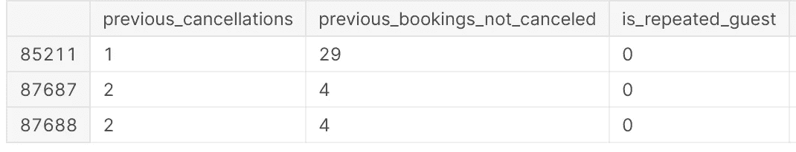
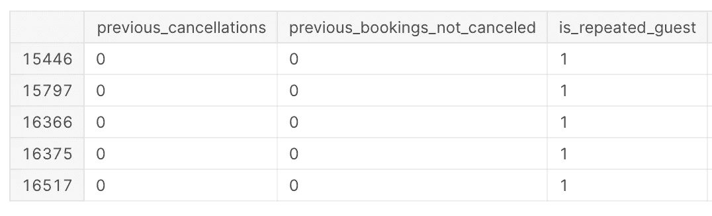
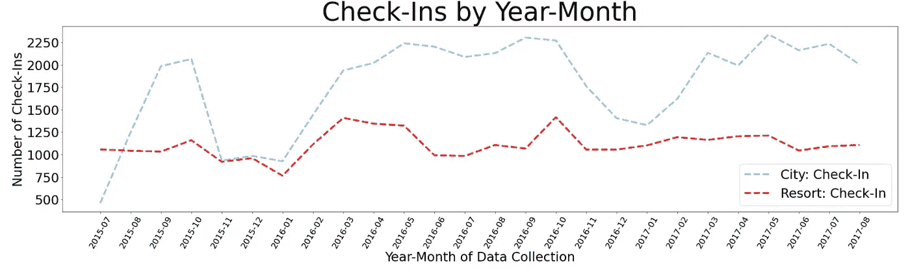
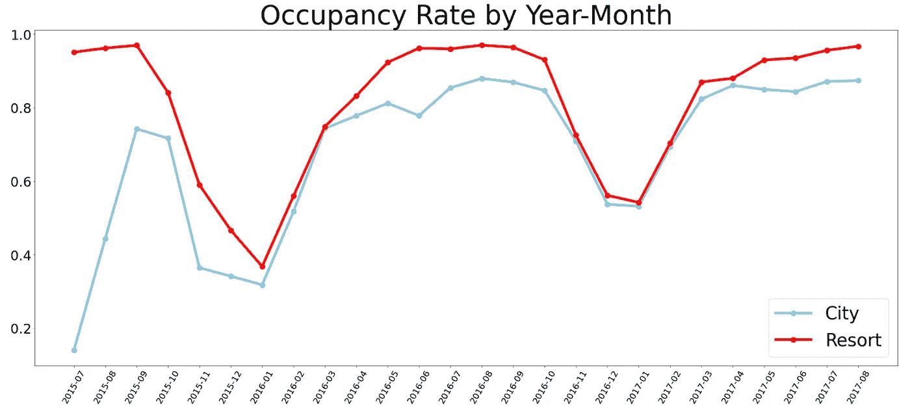

# 作为数据分析师展示增值

> 原文：<https://towardsdatascience.com/showing-value-add-as-a-data-analyst-a4d5ac97313c?source=collection_archive---------28----------------------->

## [办公时间](https://towardsdatascience.com/tagged/office-hours)

## 开放数据集:它们不仅仅是为了可视化和模型

Sharon McCutcheon 通过 Unsplash 拍摄的照片

我将解释作为一名数据分析师，你如何在不实际“分析”数据的情况下，为你当前/未来的潜在雇主增加价值！

> 嘣！—你的思想，因为它刚刚被吹爆了

# 这是什么疯话？！？

获取、准备和探索是数据管道的三个早期阶段。“好吧，但这对我有什么帮助，”，你可能会问。你是分析师，不是工程师。你所需要的是可用形式的数据，你可以把各种各样的表格放在一起，制作一些可爱的 viz。对吗？

> “我们会……”我，正要告诉你一些坏消息

# 什么是可用数据？

在一个超级棒的数据科学训练营 Codeup 期间，我学到了一个非常有价值的人生信条:“这取决于应用。”可用数据取决于其用途。任何人都可以从他们可以访问的任何表格中“选择*”或获取同事使用的 Excel 文件，并开始制作各种条形图和线图。这有可能引发许多不必要的消防演习。

接下来的这一部分将着重于您能够探索您的数据，并能够理解是否有任何事情看起来不对劲。在这里，你可以展示你属于善用数据的世界。如果您正在处理的数据中存在大问题，那么世界上所有的可视化和深入分析都毫无意义。分析型领导者会同意这种说法。

旁注:这是你听说过的数据科学中不好玩的部分。这也是数据科学中非常重要的一部分，你应该集中注意力。

# 让我们把它变得不那么抽象

接下来的几段可能会有点无聊，但是对于上下文来说非常必要。

我将向您展示 Kaggle 的“酒店预订需求”数据集中的几个数据示例。这个数据集由两家酒店的行/观察值组成，一家城市酒店和一家度假酒店。每行代表一个预订。示例栏允许您查看客人的到达/入住日期、客人数量(成人、儿童、婴儿)、ADR(平均每日房价)以及预订的是两家酒店中的哪一家。

为此，我将重点关注一个布尔值列，该列指示客人之前是否在酒店住过(0 是新客人，1 是回头客)。还有另外两列给出了客人取消的先前预订数和客人未取消的预订数。

逻辑告诉我们，新来的客人以前不会住在酒店。此外，作为回头客的客人会有先前的访问。我们看到的行不是这样。

作者照片

作者照片

在现实世界中，你可能会去找一个工程师或者提供数据的人来检查代码的逻辑。在这个例子中，你不能。

> 垃圾进，垃圾出。—一大堆数据

作为一名分析师，很大一部分工作是确保你使用的数据已经通过了健全性检查。这里的棘手之处在于，出于业务目的，可能有无数种不同的方式来查看数据。您和您的团队很可能在构建表格时无法想到要检查的所有项目。一旦你开始有目的地使用数据，事情就会变得更加明显。

# 现在，我们专注于可视化数据

下一部分更关注利益相关者在这类数据集中会发现什么是重要的。还有一个重点是创造力和将数据转换成数据集来回答你的特定问题的能力。

我们有两家酒店，我们可以很容易地看到每个酒店每个月有多少入住。数据集由两年多的观察数据组成。

如果你是一名区域经理，你会如何关注两家不同酒店的入住人数？

**为什么我不在乎入住的次数:**

1.  两家酒店很可能有不同数量的房间。
2.  如果一家酒店是更短暂(短期住宿)的酒店，而另一家酒店是长期住宿的酒店，那么入住总数将真正突出某个特定的酒店。

可视化签到不是苹果对苹果的方法。

我可以想象，担任这一角色的人会更关心每家酒店的入住率、入住房间数/可用房间数。我们来看看入住率和入住率的区别。

作者照片

作者照片

这两个酒店之间的结果在这些图像中非常不同。基本上，城市酒店确实有更多的预计房间，也有预订时间较短的客人。正因为如此，它让入住登记的第一张图片中的度假酒店相形见绌。

看一看 [Kaggle 笔记本](https://www.kaggle.com/josephburton06/hotel-performances-and-eda)以获得关于执行的数据清理和转换的更多细节，以获得允许这些可视化的数据集。

为了进一步了解数据分析世界，这篇文章关注的不仅仅是作为一名优秀的数据分析师你应该知道的标准工具。了解一些较少讨论的特征，这些特征将对你有长期的帮助。一如既往，继续学习！

 [## 怎样才能成为一名优秀的数据分析师？

### 提示:没有确切的答案

towardsdatascience.com](/what-makes-a-great-data-analyst-f6577cef81a3)