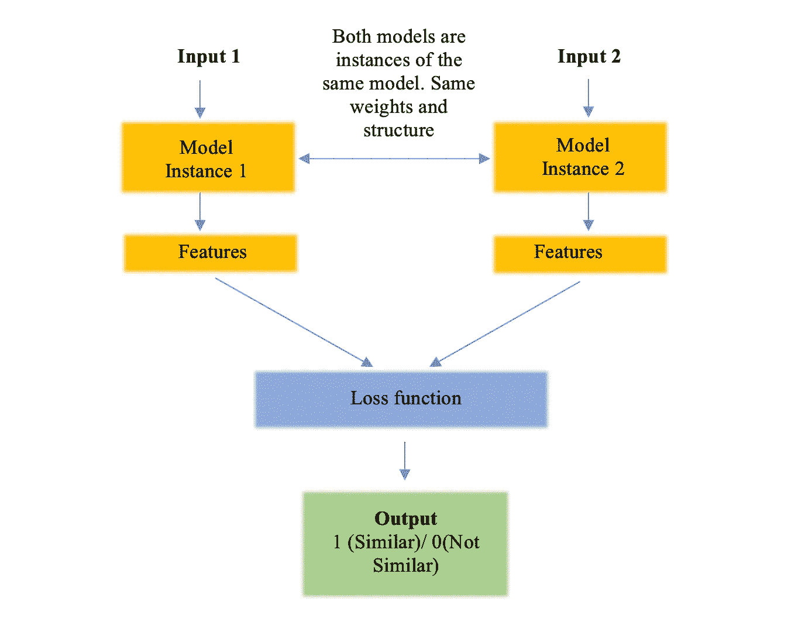
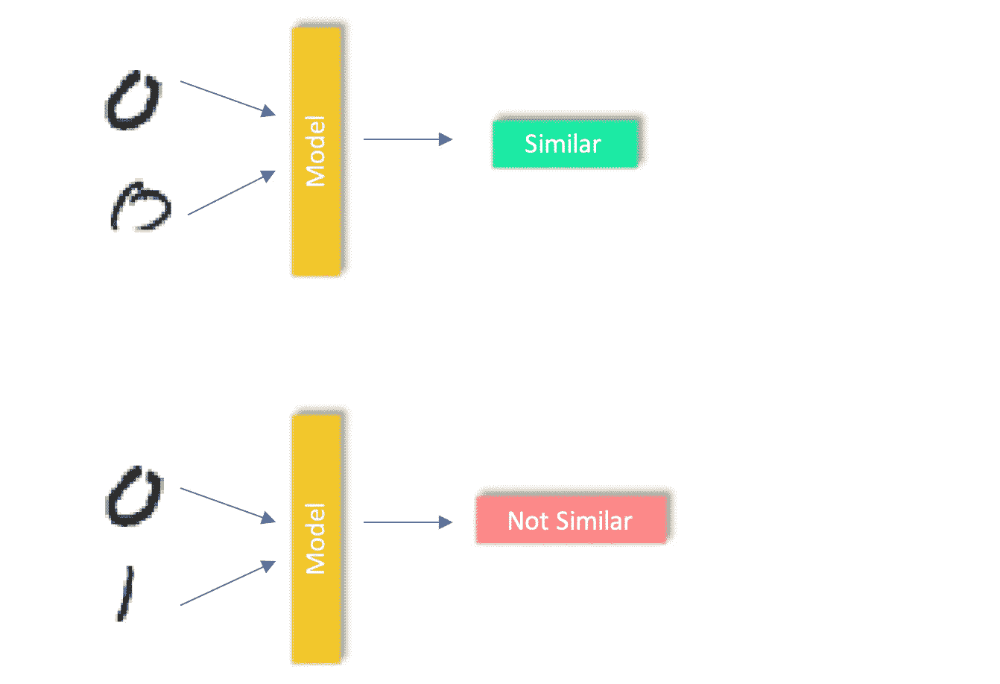
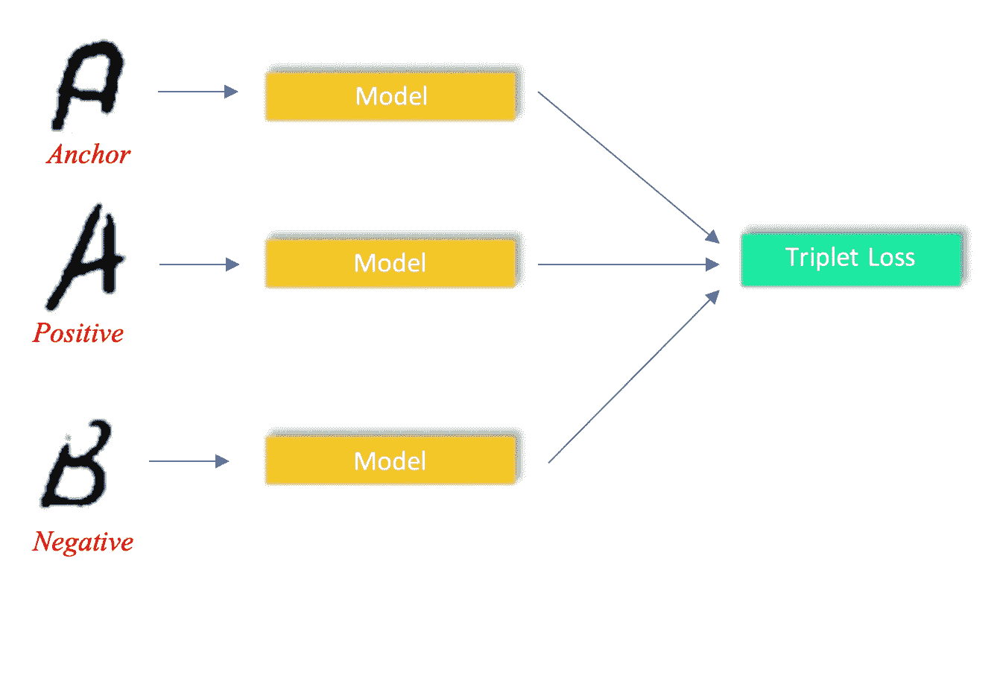
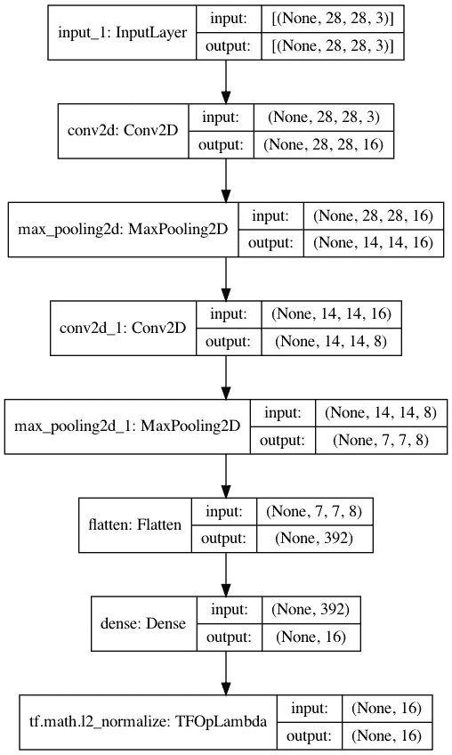
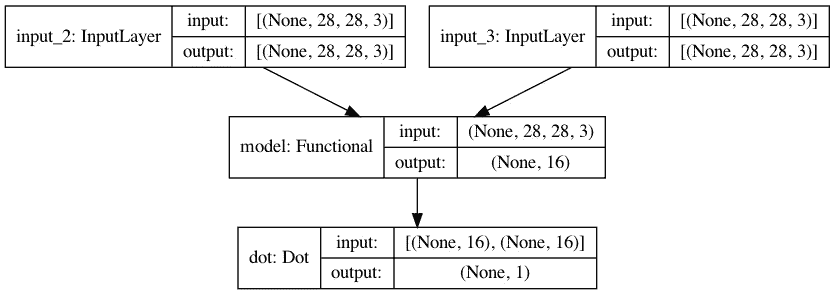
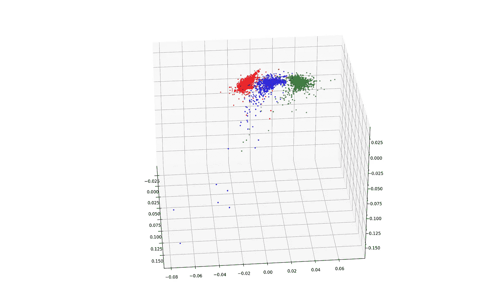
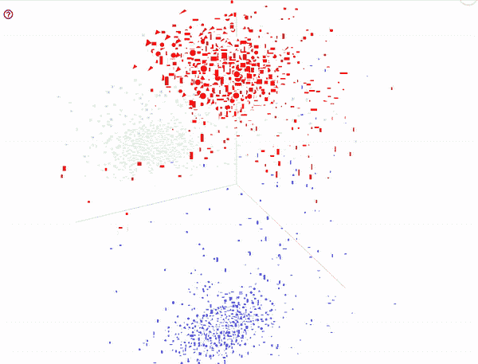
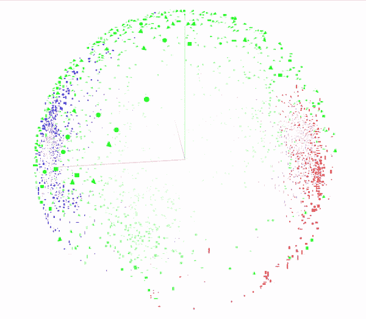
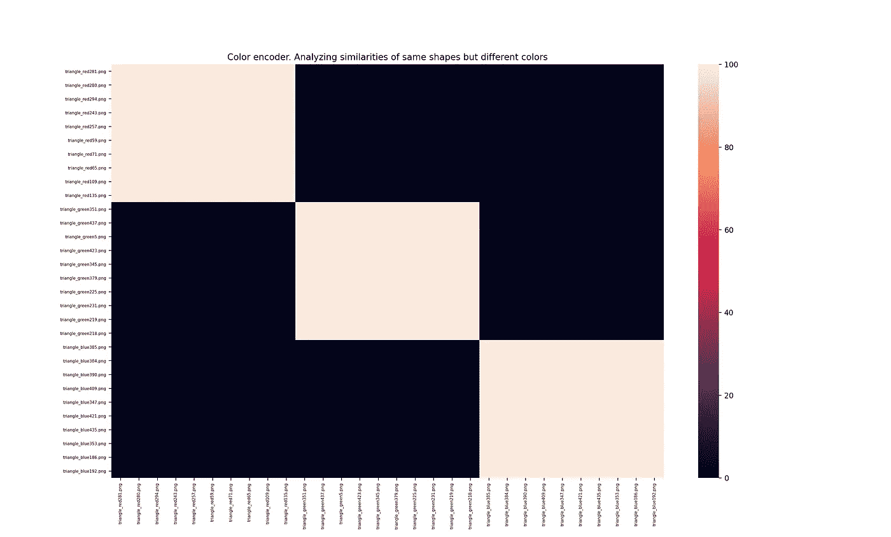

# 暹罗网络介绍和实施

> 原文：<https://towardsdatascience.com/siamese-networks-introduction-and-implementation-2140e3443dee?source=collection_archive---------1----------------------->

## 了解如何在每个类别只有少量样本且类别分布不均衡的情况下，在分类任务中获得良好的准确性

[来源](https://unsplash.com/photos/uePn9YCTCY0)

# **简介**

现在有几个深度学习模型，如 BERT、GANs 和 U-Nets，正在实现图像识别、图像分割和语言建模等任务的最先进性能。几乎没有一天机器学习没有新的创新。谷歌、微软和亚马逊等科技巨头正在开发复杂的深度学习架构，实现类似人类的性能。但是这些模型的一个问题是它们需要大量的标记数据。有时，对于特定的任务，很多数据是不可用的。更少的数据意味着深度学习模型将无法正确地对不同的类进行建模，并且性能很差。这就是暹罗网络前来救援的地方。它有助于在每类样本较少且类分布不平衡的情况下建立具有良好准确性的模型。

# **什么是暹罗网络？**

暹罗网络基本结构

连体网络是一类包含一个或多个相同网络的神经网络。我们向这些网络提供一对输入。每个网络计算一个输入的要素。然后，使用特征的差或点积来计算特征的相似性。对于相同的类输入对，目标输出是 1，而对于不同的类输入对，输出是 0。

记住，两个网络有相同的参数和权重。如果不是，那他们就不是暹罗人。

通过这样做，我们已经将分类问题转化为相似性问题。我们正在训练网络，使同一类的样本之间的距离最小，并增加类间距离。有多种相似性函数，通过这些函数可以训练暹罗网络，如对比损失、三联损失和圆损失。

1.  **对比损失**:在对比损失中，拍摄成对的图像。对于相同的类对，它们之间的距离较小。对于不同的对，距离更多。尽管二进制交叉熵似乎是我们问题的完美损失函数，对比损失在区分图像对方面做得更好。对比损失，***l****=****y * d^2+(1-y)* max(margin—d，0)^2***

*D* 是图像特征之间的距离。*边距*是一个帮助我们区分不同类别的参数。

对比损失:上半部分显示同类图像，下半部分显示不同图像

2.**三重丢失**:三重丢失是 Google 在 2015 年推出的人脸识别。这里，模型有三个输入——锚、积极和消极。锚点是一个参考输入。实际输入与锚输入属于同一类别。负输入属于锚类之外的随机类。

三重损耗实现

三联体损失函数背后的思想是，我们最小化锚和阳性样本之间的距离，同时也最大化锚和阴性样本之间的距离。

我们来看看三重态损耗的数学公式。

这里 ***d*** 表示距离度量。锚点和正锚点之间的距离应小于负锚点和正锚点之间的距离。所以， ***d(a，p) — d(a，n) < 0*** 。为了保持正，我们可以这样修改:L*OSS****L =******max(d(a，n) — d(a，p)，0)*** 。

为了进一步增加正负之间的分离，引入了参数'*裕量*'。

现在， ***L = max(d(a，n) — d(a，p) + margin，0)*** 。

# 利弊

在开始实现之前，让我们先来谈谈这种方法的一些优点和缺点。

**优点**:

1.需要更少的数据样本。

2.可以处理高度不平衡的数据。

**缺点**:

1.因为有这么多对类，所以训练数据量很大。

2.不能一概而论。为一项任务训练的模型不能用于另一项任务。

3.对输入中的一些变化敏感。

# **实施**

**问题陈述:**这是一个非常简单的演示概念的问题。我们有一个不同形状(三角形，圆形和矩形)的数据库，有 3 种不同的颜色(红色，绿色和蓝色)。这些形状大小不同，位置不同，旋转角度也不同。

我们希望通过学习图像的颜色编码，根据图像的颜色对图像进行分类。每种颜色我们有 20 个样品。*这里有一个包含这个数据集*的 GitHub 存储库。

<https://github.com/AdityaDutt/MultiColor-Shapes-Database>  

还有几个其他数据集也可以尝试，如著名的 Omniglot 数据集，MNIST 等。

***第一部分*** *:准备数据*

阅读图像，并产生积极和消极的一对。有两个 NumPy 数组包含一对大小为 Nx28x28x3 的图像。如果颜色相同，目标标签为 1，如果颜色不同，目标标签为 0。例如:

**输入** : ***红色****_ 三角形，* ***红色****_ 正方形*(同色物体)

**输出** : *1*

**输入** : ***红色****_ 三角形，* ***蓝色****_ 三角形*(不同颜色的物体)

**输出** : *0*

***第二部分:*** *创建模型*

从第**21**–**32**行，我们已经为一个单独的图像创建了模型。首先，我们有输入层。然后， **Conv2D** 和 **MaxPool** 层。之后，我们将其压平，并添加一个**密集**层。我们在那之后已经标准化了密集层，因为这些将作为我们图像的特征。特征的长度为 16。稍后，当我们连接这两个模型时，我们采用这些特性的**点积**。由于我们已经对这些特征进行了规范化，它们将介于 0 和 1 之间。因此，我们可以很容易地将它们与我们的目标标签进行比较。

在第 **36** 和 **37** 行中，我们创建了同一个模型的两个实例，并将输入传递给它们。在第 **45** 行，我们获取两个模型的输出，并对它们应用点积。点积将显示两幅图像的相似性。

这是一个简单的例子，所以我们得到了高达 99%的准确率。对于复杂的图像和任务来说，它并不是那么好。但是，本文的目标是使用一个简单的例子来演示暹罗网络。

以下是暹罗网络中单个编码器的示意图:

编码器型号

这是完整的暹罗模型的样子:

连体模型

**第 3 部分** : *测试模型*

加载模型并在看不见的图像上测试它。我们可以做以下事情来检查类之间的准确性和分离性-

a)首先，我们可以使用单个编码器模型对图像进行编码，以获得要绘制的特征。我们可以画出这些特征的散点图，看看它们的分离程度如何。(特征长度为 16)

b)其次，我们可以用连体网络输出(1 到 0 之间)做一个混淆矩阵。

两者如下所示。

这是前三个特征的三维可视化

16 个特征向量中前 3 个特征的散点图

张量板特征的 PCA 可视化

TensorBoard 球化后特征的 PCA 可视化

测试图像的混淆矩阵。所有图像都是三角形，但颜色不同。但是，对于相同颜色的图像，相似性很高。

以下是完整资源库的链接:

<https://github.com/AdityaDutt/Siamese-Networks-Tutorial>  

# 结论

1.  当可用数据较少且类别不平衡时，此模型非常有用。
2.  它具有像图像分类、对象检测、文本分类、声音分类，
3.  连体网络也可用于对特定要素进行编码。可以创建类似的模型来对不同的形状进行分类。
4.  一次性学习也使用连体网络。它通过使用每个类中的一个样本进一步扩展了这一思想。零炮学习也差不多。它在完全看不到任何输入的情况下训练模型。这是一个相当新的话题，已经引起了很多关注。

# 未来项目构想

在暹罗模型被训练之后，最终的层可以被丢弃，并且特征可以与变分自动编码器一起使用来重构输入。这样，您还可以通过使用其他图像的一些特征来重建原始图像，从而更改图像的样式和其他特征。例如，转换图像的形状或颜色。

接下来，我将写使用暹罗网络和使用 VAE 与暹罗网络的语音分类。

> 感谢阅读！希望对理解底层逻辑有帮助。
> 
> 如果你喜欢这篇文章，请推荐并分享。

# 参考

1.  https://www.cs.cmu.edu/~rsalakhu/papers/oneshot1.pdf
2.  【https://en.wikipedia.org/wiki/Siamese_neural_network 