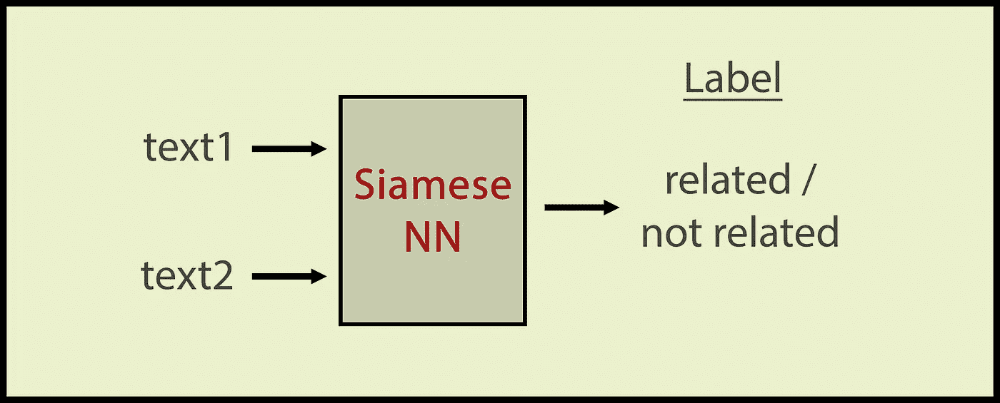
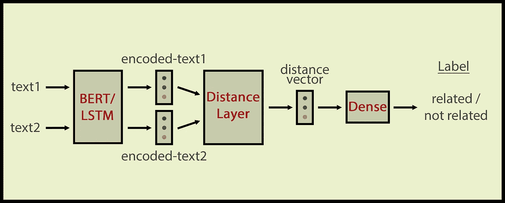

# 暹罗 NN 食谱与 Keras

> 原文：<https://towardsdatascience.com/siamese-nn-recipes-with-keras-72f6a26deb64?source=collection_archive---------10----------------------->

## 用于语义相似性任务的具有 Keras 和 BERT 的实用暹罗神经网络配方

我已经享受了一段时间在我的工作不同的 NLU 任务的暹罗网络。在本文中，我将与 Keras 分享一些快速的方法，将 Glove vectors 或 BERT 作为文本矢量器。我们将关注语义相似度计算。语义相似性基本上是确定一组文本是否相关的任务。语义相似度通常是在一对文本段之间计算的。在这篇文章中，我将举例说明如何比较两个文本。

连体网络是具有两个或更多输入的神经网络(通常输入的数量是两个，否则必须定义三向距离函数)。我们对输入文本进行编码，然后将编码后的向量提供给距离层。最后，我们在距离层上运行一个分类层。距离可以是余弦距离、L1 距离、指数负曼哈顿距离和任何其他距离函数。这是一个作为黑盒的连体网络:



更高层次的暹罗 NN。如果 2 个输入和 NN 个输出在语义上相关，我们就给它们

可以通过 LSTM、通用编码器或 BERT 对输入文本进行编码。根据带有单词嵌入的文本编码，该体系结构如下图所示:



详细的暹罗建筑。我们首先用 LSTM/伯特对输入句子进行编码，然后将编码后的向量对送入距离层。

这是带有 LSTM 和预训练嵌入层的 Keras 配方:

```
from keras import backend as Kfirst_sent_in = Input(shape=(MAX_LEN,))
second_sent_in = Input(shape=(MAX_LEN,))embedding_layer =  Embedding(input_dim=n_words+1, output_dim=embed_size, embeddings_initializer=Constant(embedding_matrix), input_length=MAX_LEN, trainable=True, mask_zero=True)first_sent_embedding = embedding_layer(first_sent_in)
second_sent_embedding = embedding_layer(second_sent_in)lstm =  Bidirectional(LSTM(units=256, return_sequences=False))first_sent_encoded = lstm(first_sent_embedding)
second_sent_encoded = lstm(second_sent_embedding)l1_norm = lambda x: 1 - K.abs(x[0] - x[1])merged = Lambda(function=l1_norm, output_shape=lambda x: x[0], name='L1_distance')([first_sent_encoded, second_sent_encoded])predictions = Dense(1, activation='sigmoid', name='classification_layer')(merged)model = Model([first_sent_in, second_sent_in], predictions)
model.compile(loss = 'binary_crossentropy', optimizer = "adam", metrics=["accuracy"])
print(model.summary())model.fit([fsents, ssents], labels, validation_split=0.1, epochs = 20,shuffle=True, batch_size = 256)
```

模型摘要应该是这样的:

```
Layer (type)                    Output Shape         Param #     Connected to                     
==================================================================================================
input_1 (InputLayer)            [(None, 200)]        0                                            
__________________________________________________________________________________________________
input_2 (InputLayer)            [(None, 200)]        0                                            
__________________________________________________________________________________________________
embedding (Embedding)           (None, 200, 100)     1633800     input_1[0][0]                    
                                                                 input_2[0][0]                    
__________________________________________________________________________________________________
bidirectional (Bidirectional)   (None, 512)          731136      embedding[0][0]                  
                                                                 embedding[1][0]                  
__________________________________________________________________________________________________
L1_distance (Lambda)            (None, 512)          0           bidirectional[0][0]              
                                                                 bidirectional[1][0]              
__________________________________________________________________________________________________
classification_layer (Dense)    (None, 1)            1026        L1_distance[0][0]                
==================================================================================================
Total params: 2,365,962
Trainable params: 2,365,962
Non-trainable params: 0
______________________________
```

两个输入层输入要比较的两个文本。然后，我们将输入单词馈送到嵌入层，以获得每个输入单词的单词嵌入。之后，我们分别将第一句话的嵌入向量馈送到 LSTM 层，将第二句话的嵌入向量馈送到 LSTM 层，并获得第一文本和第二文本的密集表示(用变量 *first_sent_encoded* 和 *second_sent_encoded* 表示)。现在是棘手的部分，合并层。合并层输入第一个文本和第二个文本的密集表示，并计算它们之间的距离。如果你查看模型摘要的第四层，你会看到*L1 _ 距离(λ)*(这一层在技术上是一个 Keras 层)，接受两个输入，它们都是 LSTM 层的输出。结果是一个 512 维的向量，我们将这个向量提供给分类器。结果是一个一维向量，它是 0 或 1，因为我在做相似或不相似的二元分类。在分类层，我用 **sigmoid** 压缩了 512 维距离向量(因为我很喜欢这个激活函数:)，我还用 **binary_crossentory** 编译了模型，因为这也是一个二进制分类任务。

在这个配方中，使用了**L1-距离**来计算编码向量之间的距离。您可以使用余弦距离或任何其他距离。我特别喜欢 l1 距离，因为它的*不像函数*那么平滑。这同样适用于 sigmoid 函数，它为*提供了语言神经网络所需的非线性*。

伯特的食谱有点不同。我们去掉了嵌入+ LSTM 层，取而代之的是伯特层(因为伯特向量包含了足够多的顺序性！):

```
fsent_inputs = Input(shape=(MAX_L,), dtype="int32")                       fsent_encoded = bert_model(fsent_inputs)                       fsent_encoded = fsent_encoded[1] ssent_inputs = Input(shape=(150,), dtype="int32")                       ssent_encoded = bert_model(ssent_inputs)                       ssent_encoded = ssent_encoded[1] merged =concatenate([fsent_encoded, ssent_encoded])                                               predictions = Dense(1, activation='sigmoid', name='classification_layer')(merged) model = Model([fsent_inputs, ssent_inputs], predictions)                                               adam = keras.optimizers.Adam(learning_rate=2e-6,epsilon=1e-08) model.compile(loss="binary_crossentropy", metrics=["accuracy"], optimizer="adam")
```

这里，我们再次分别向 BERT 层提供一对文本输入，并获得它们的编码 *fsent-encoded* 和 *ssent_encoded* 。我们使用**【CLS】**标记的嵌入，它捕获句子的平均表示。(BERT 层有 2 个输出，第一个是 **CLS** 令牌的向量，第二个是 *(MAX_LEN，768)* 的向量。第二个输出为输入句子的每个标记提供了一个向量。我们通过调用*fsent _ encoded = fsent _ encoded[1]*和*ssent _ encoded = ssent _ encoded[1]*来使用第一个输入。优化器也是 Adam，但学习率略有不同(我们降低 lr 以防止 BERT 表现过激和过度拟合。如果我们不加以阻止，伯特很快就会过度适应)。损失也是二元交叉熵，因为我们在做二元分类任务。基本上我用 BERT 层替换了嵌入层+ LSTM，其余的架构是相同的。

亲爱的读者，您已经阅读完了这篇实用文章。我的目的是提供一个快速的工作解决方案，以及解释如何暹罗网络的工作。如果你愿意，你可以把辍学层放在几个地方，自己做实验。玩暹罗网络很令人兴奋，就我个人而言，它们可能是我最喜欢的架构。我希望你喜欢暹罗 NN，并在你的工作中使用。在新架构会议之前，感谢您的关注，敬请关注！