# 《权力的游戏》中的兄弟竞争与共整合

> 原文：<https://towardsdatascience.com/sibling-rivalry-and-cointegration-in-the-game-of-thrones-8642466fa2f2?source=collection_archive---------15----------------------->

## [实践教程](https://towardsdatascience.com/tagged/hands-on-tutorials)

## 提利昂和瑟曦·兰尼斯特之间的因果关系。在 Python 中。没有龙。

时间序列协整、格兰杰因果关系、平稳性(ADF 和 KPSS)和白噪声残差的检验。在向量自回归的快速帮助下。

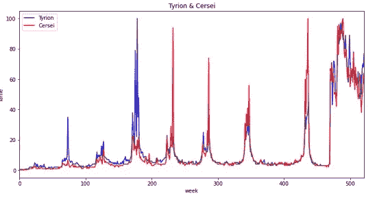

流程步骤:

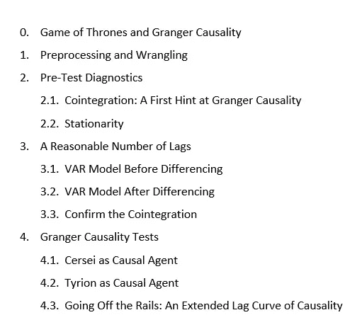

# 0.《权力的游戏》和格兰杰因果关系——这是关于什么的？

一个普遍公认的事实是，一个拥有有点书呆子气的头脑的数据科学家肯定想要一个幻想世界，供她或他在下班后沉浸其中。

十年来,《权力的游戏》( GoT)一直是我们许多人消磨时间的选择。数据科学爱好者和 GoT 爱好者之间肯定有大量的重叠。然而，与 GoT 相关的定量分析的缺乏表明，这种差距需要弥补。

然而，如果你不是一个 GoT 爱好者，并想知道这是怎么回事，这里的纲要:

## 《权力的游戏》

GoT 是一个以维斯特洛和埃索斯大陆为背景的中世纪奇幻世界；乔治·R·R·马丁在 20 世纪 90 年代开始写的系列丛书；自 2010 年以来，它还作为 HBO 系列播出。

GoT 正在暂存:

*   龙(活着的、死了的或不确定的)和它们的骑手；
*   大摇大摆卖剑；
*   不死的白行者(与 AMC 系列无关)，他们不受钢刃的伤害，但被黑曜石触碰时会碎成冰柱；
*   喝醉的国王，诡计多端的朝臣，名字如小指头；
*   头发花白的学院派学士们，如果他们不必花那么多时间打扫他们雇来作为加强版信鸽的乌鸦的笼子，他们无疑会渴望尝试数据科学；
*   狡猾的太监间谍头子和身经百战的太监士兵；
*   乱伦倾向和其他家族并发症；
*   一个不死怪物骑士，在被驱逐的弗兰肯斯坦学士的帮助下，将他残暴的个性带到了不太真实的来世；
*   一个红头发的火女祭司，不知什么原因，每当她念咒语时，她必须在屏幕上露出胸部；
*   这是一场皇家红色婚宴，让任何其他醉酒的家庭庆典和争吵都相形见绌。

你知道要点了。

提利昂和瑟曦是这个重塑的黑暗时代的主角。

*   提利昂是双胞胎瑟曦和杰米的弟弟，这对双胞胎从十几岁开始就陷入乱伦关系。天生矮人的提利昂，用他非凡的智慧反击瑟曦煽动的嘲笑和羞辱。
*   瑟曦责怪提利昂，他们的母亲在生提利昂时死在产床上。瑟曦在帮助她永远泡在水里的丈夫劳勃·拜拉席恩国王进入一个早期皇家墓穴后成为摄政王。对于这对皇室夫妇，肯定有一些格兰杰因果关系需要分析，但我们没有足够的数据说明罗伯特国王在斩首开始前迅速离开舞台左侧。瑟曦控制欲强，权力欲强，报复心强。她认为自己在政治上很精明，但却追求短视的野心。龙或不死行尸只是她寻求力量的麻烦。她的弟弟提利昂成了她仇恨的磁石。
*   《权力的游戏:screenrant.com》中瑟曦·兰尼斯特做过的 10 件最无耻的事

好了，你已经有了一分钟的概要。

现在，我们将把这个戏剧性的织锦的一小部分输入到一些选定的 Python 算法中，看看我们能从中提取出哪些确凿的事实。

## **格兰杰因果关系**

g-因果关系是一种概率性的(相对于确定性的)方法来定义和研究因果关系。

如果 X 的过去值包含的信息有助于预测 Y，而不仅仅是 Y 的过去值中包含的信息，则称变量 X 是目标变量 Y 的 *Granger 原因*

GC 检验的无效假设是 X 的滞后值*而非*有助于解释目标变量 Y 的变化。X 中没有信号，从中可以推导出 Y 在未来期间的预测。如果我们拒绝低 p 值的零假设，我们可以得出结论，X 可以贡献一些预测值:X G *ranger-causes* Y 通过帮助预测 Y。

因此，G-因果关系并不能证明一个真正的因果链。

在一个滞后范围内，格兰杰因果关系可能不是单向的(X 格兰杰原因 Y)，而是双向的。

# **1。预处理和数据争论**

我们下载了从 2011 年到 2020 年的关键字“提利昂”和“瑟曦”的全球谷歌趋势时间序列。

https://trends.google.com/trends/explore?date=today%205-y 问=提利昂，瑟曦

请注意，Google Trends 提供了长达 5 年的每周关键词数据。超过 5 年后，频率变为每月。要获得 2011–2020 年的每周数据，我们需要从 5 年前开始重新运行自定义日期范围的搜索。csv 文件，然后将时间序列合并到一个文件中。

谷歌关键词趋势表达了当姐妹俩在屏幕上实施他们的阴谋时，公众对瑟曦和提利昂生活的兴趣有增无减。我们将这种趋势作为衡量其名气或恶名的标准，并询问一个兄弟姐妹受欢迎程度的起伏是否是格兰杰原因——导致另一个兄弟姐妹在观众心目中出现的高峰和低谷。

我们创建一个 Jupyter 笔记本并导入所需的包。然后我们加载 Google 趋势源数据文件‘got _ Cersei _ Tyrion . CSV’

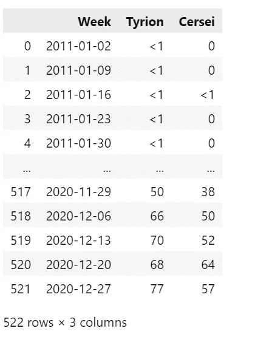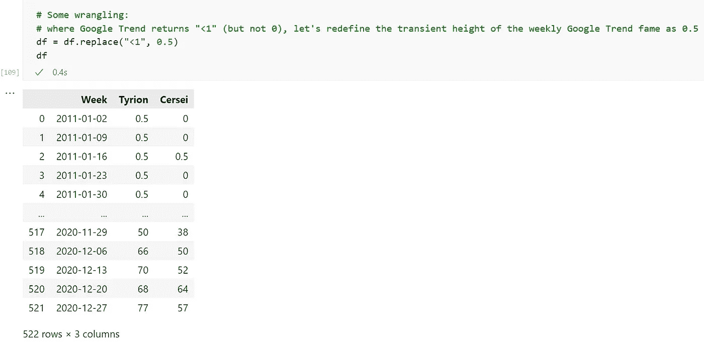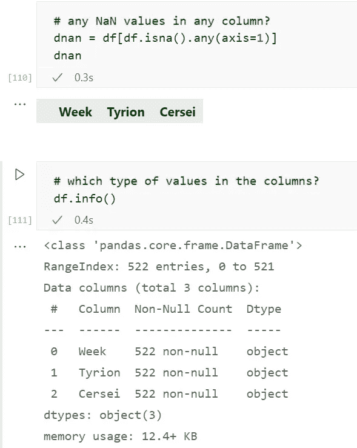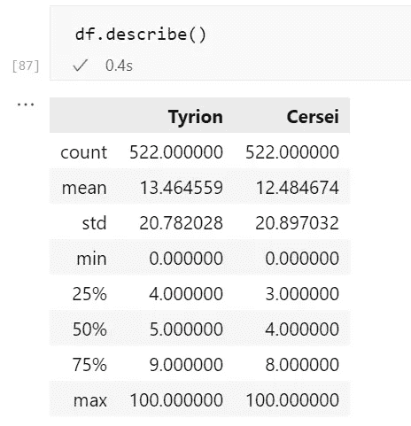

将字符串对象转换为数字和日期后，我们可以绘制提利昂和瑟曦的数据。

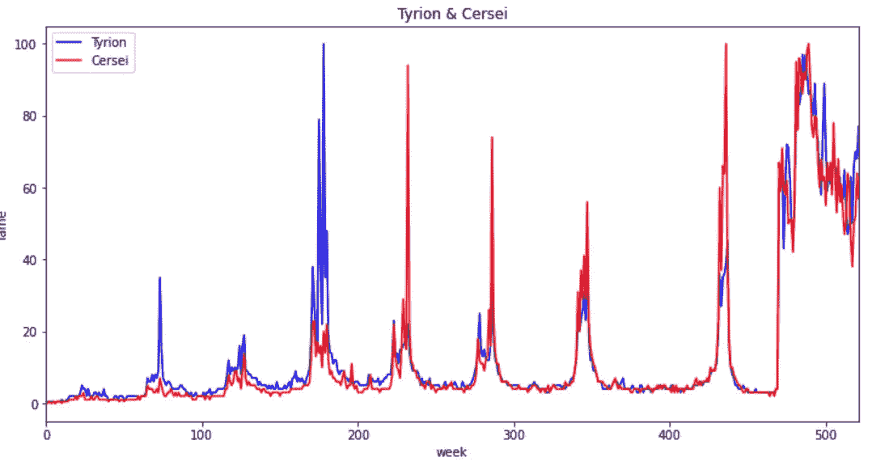

2011 年至 2020 年间，关于提利昂和瑟曦的新闻集中在特定的几周和几个月:每当 HBO 播出新一季的。该时间表并不完全表现出固定的周期。

我们必须假设提利昂和瑟曦的手足之争包含了平静的时期，在几个月的时间里不断积累紧张，然后在极端戏剧性的时刻爆发，通过餐桌上的下流言论、斩首或解决家庭内部纠纷的类似方法来释放紧张。

提利昂和瑟曦的关联有多强？

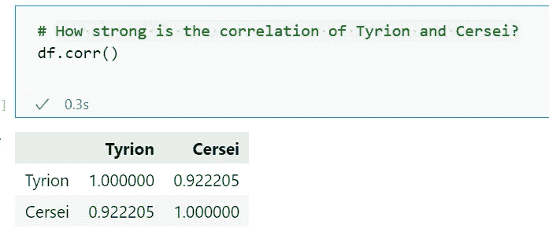

就其本身而言，提利昂和瑟曦的高度关联并不能证实格兰杰因果关系。低相关性也不会否定协整或格兰杰因果关系。

*   相关性不一定随时间保持稳定，例如，如果序列遵循具有不同上升或下降速率的趋势曲线。
*   具有完全对齐的峰的两个系列可以表现出 1.0 的相关性。但是，如果其中一个序列在时间轴上经历了小的移动，使得其峰值现在与另一个序列的谷值对齐，则该序列将相互抵消，并且它们的相关性可能下降到 0。

# **2。测试前诊断**

## **2.1 协整:格兰杰因果关系的首次暗示**

如果两个数列中的每一个都是非平稳的，那么它们就是协整的，但是存在一个平稳的线性组合。

这两个序列不一定完全同步(每个周期中的峰值和谷值不精确匹配)，但它们之间的平均距离随着时间的推移保持相对恒定:序列将返回到平衡状态。如果我们着眼于长期关系，协整取代了相关性。

如果两个序列是协整的，那么它们之间必然存在格兰杰因果关系。

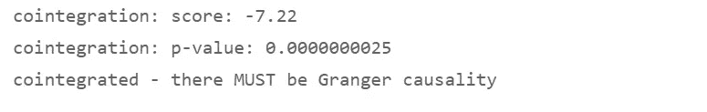

## **2.2 平稳性检验和差分**

格兰杰因果关系要求时间序列是平稳的。

扩展的迪基-富勒(ADF)和科维亚特科夫斯基-菲利普斯-施密特-申(KPSS)检验是研究时间序列平稳性的常用选择。但是，它们可能会返回相互冲突的结果。我们将不得不反复核对它们，以决定是否需要对时间序列进行区分。

可能的冲突:

*   如果 ADF 确定了一个单位根，但是 KPSS 发现这个序列在一个确定的趋势附近是平稳的，那么这个序列只是趋势平稳的。区别它(或者尝试通过其他转换去趋势化它)。
*   如果 ADF 没有找到单位根，但 KPSS 通过了非平稳性的判断，则该序列只是差分平稳的。区别它。

我们将运行 ADF 和 KPSS 测试，审查它们的结果，并确定适当的差异顺序。

定义测试后，我们检查 Tyrion 的稳定性。

综合测试的结果是推荐区分 Tyrion 的系列——之后我们将测试差异数据的平稳性。

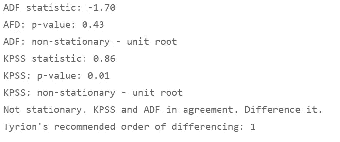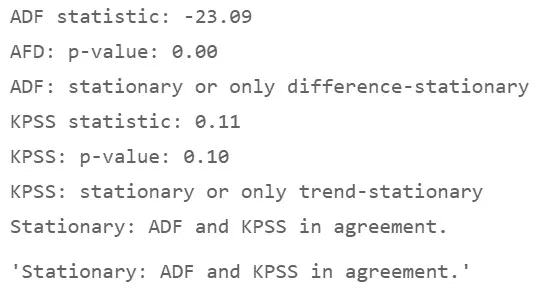

经过一次一阶差分后，提利昂是一个平稳过程。

接下来，我们区别瑟曦。

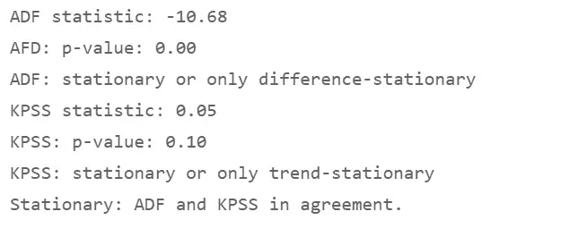

经过一阶差分后，瑟曦是一个平稳过程。

让我们总结一下提利昂和瑟曦的系列，区分前后:

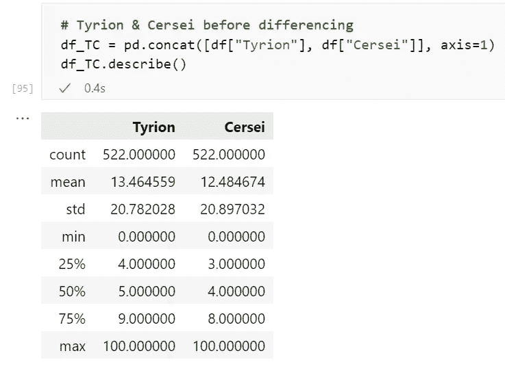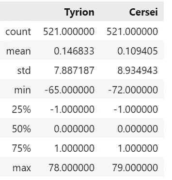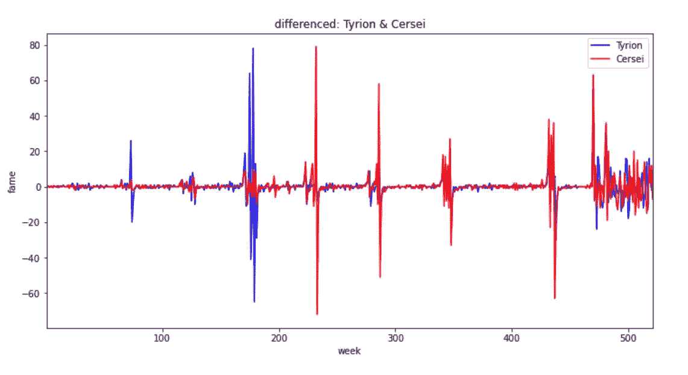

# **3。合理数量的滞后**

如果我们为格兰杰因果关系检验选择了太多的滞后，我们将倾向于接受假阴性，并在没有因果关系的地方发现明显的因果关系。我们将通过执行大量测试来实施 p-hacking 或数据挖掘，直到我们在其中一个外围滞后处找到因果关系。

另一方面，如果我们选择的滞后时间太少，测试结果可能会因为截止期以外的自相关而出现偏差。

因此，我们将对长达 52 周的滞后运行向量自回归模型(VAR ),并选择导致最低 Akaike 信息标准的滞后。

我们将遵循 Dave Giles 的指导:在风险值模型中，我们将在差异之前使用源数据*。[https://Dave giles . blogspot . com/2011/04/testing-for-Granger-causality . html](https://trends.google.com/trends/explore?date=today%205-y&q=tyrion,cersei)*

## **3.1 差异前的风险值模型**

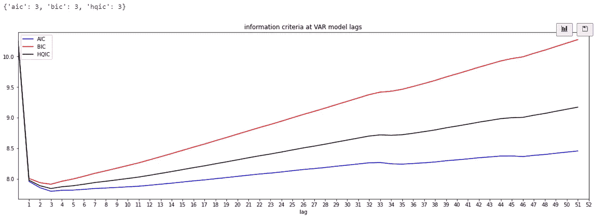

让我们通过使用德班-沃森检验来确认，残差是否表明 VAR 模型在时间序列中没有发现显著的信号。

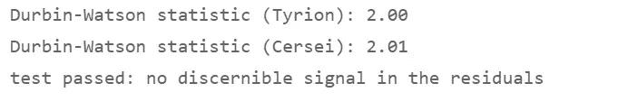

## 3.2 差异后的风险值模型

我们再次运行风险值模型，这一次是对差分序列，并将差分顺序添加到 AIC 最小化之前风险值模型返回的滞后。

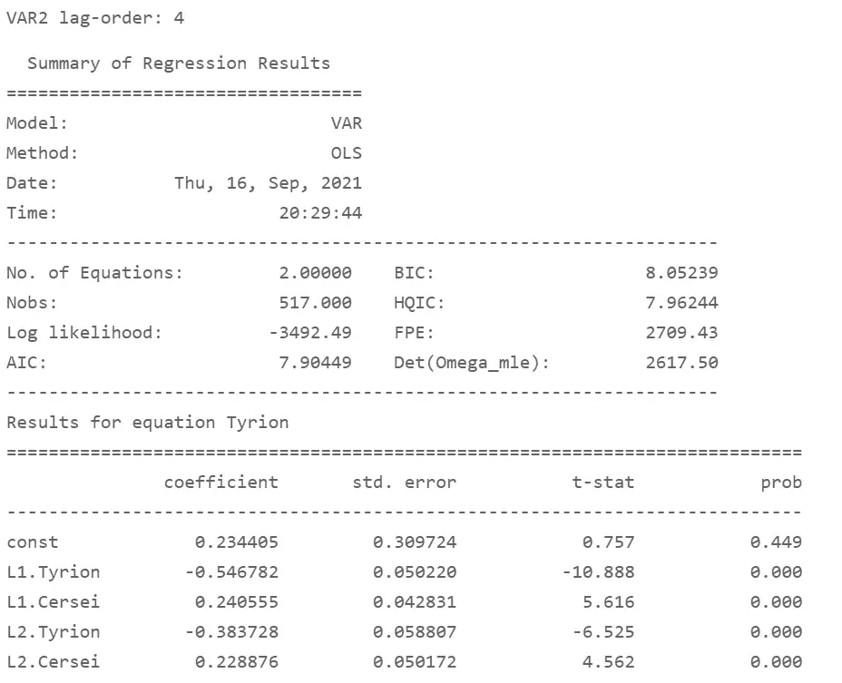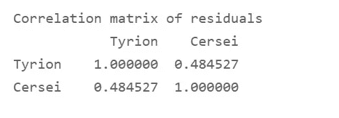

让我们再次使用德班-沃森测试来确认残差是否可以被解释为白噪声。

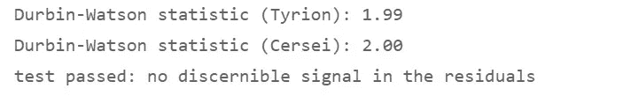

## **3.3 确认协整**

我们重复进行协整检验，这次使用的是 VAR 模型推荐的合理的滞后数。

如果时间序列“是协整的，那么它们之间一定存在格兰杰因果关系——要么是单向的，要么是双向的。”(戴夫·贾尔斯，2011 年)

如果不存在协整，该序列仍可能呈现格兰杰因果关系。

[https://Dave giles . blogspot . com/2011/04/testing-for-Granger-causality . html](https://davegiles.blogspot.com/2011/04/testing-for-granger-causality.html)

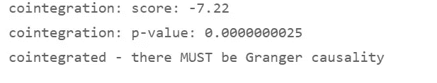

# **4。格兰杰因果检验**

## **4.1 瑟曦作为致病因子**

我们从数组的第一列中的提利昂开始；瑟曦，在第二列。因此，瑟曦将被视为致病因子。我们将测试瑟曦的恶名是否有助于预测几周后提利昂的受欢迎程度。

我们使用 VAR1 模型推荐的 AIC 最小化滞后的数量。

*   无效假设:瑟曦的恶名不会*而不是*成为提利昂受欢迎的原因。
*   替代假设:瑟曦的突出确实是提利昂的格兰杰原因。
*   输出:该方法在选定的滞后期应用了 4 个可选择的检验:F、卡方、似然比和参数-F。
*   f 检验:仅适用于序列协整的情况。

我们将关注 f 检验。

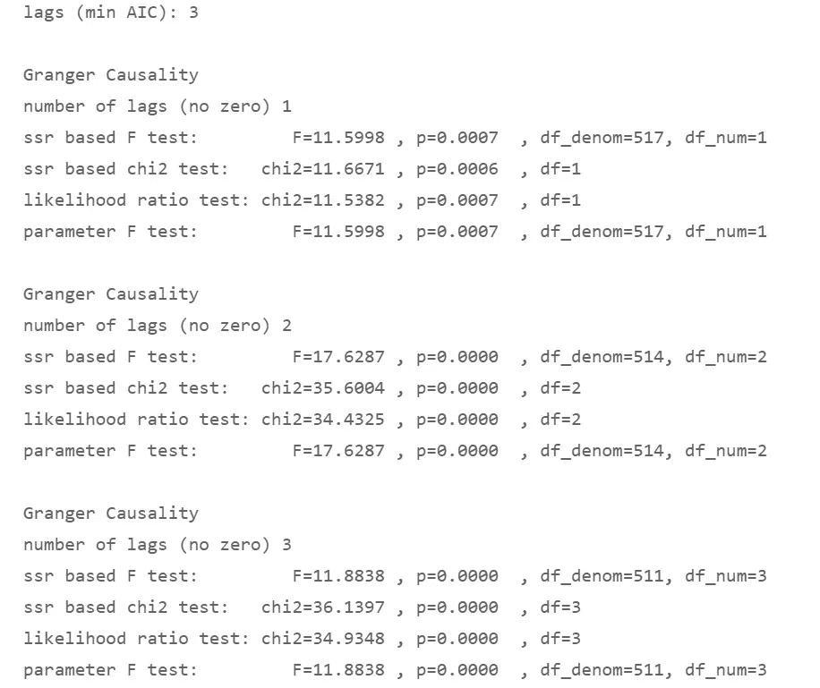

我们观察到瑟曦的 p 值仍然远低于 0.05，并得出结论，她确实是提利昂共整合突出的格兰杰原因。

让我们回头来研究格兰杰因果关系是否是双向的。

## **4.2 作为致病因子的提利昂**

他的高 p 值表明——除了滞后三周的短暂时间窗口——提利昂并不是瑟曦声名狼藉的原因。瑟曦忠于她邪恶女王的角色，必须被视为她自己的毁灭代理人，而不需要她弟弟星光大道上任何之前的起伏来推一把。

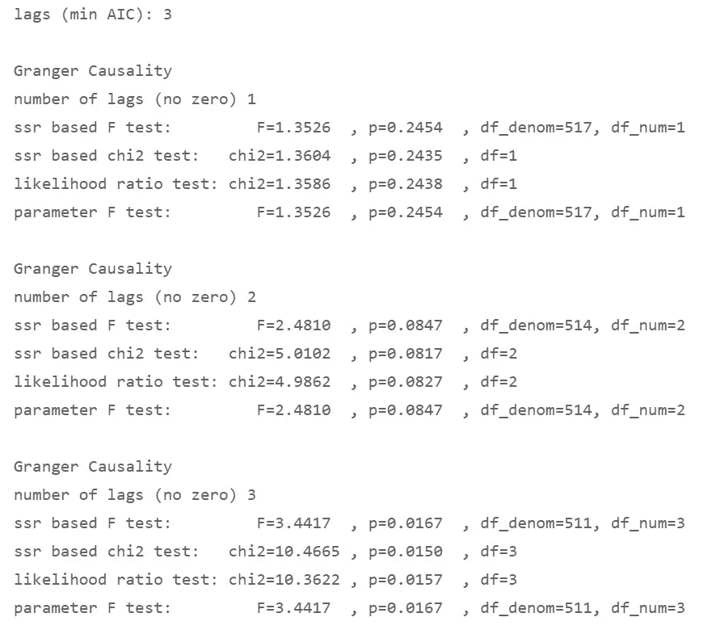

## **4.3 出轨:因果关系的扩展滞后曲线**

我们现在做了一些统计学家不会赞同的事情。我们将在比我们的 VAR 模型推荐的 Akaike 信息标准更多的滞后上运行因果关系测试。

如果选择了太多的滞后，我们可能会被虚假的回归结果引入歧途，并在没有因果关系的地方接受明显的因果关系。然而，最小 AIC 并不是一个硬性的规则，而只是一个寻找合理的滞后次数的启发式规则。

减轻处罚的情节:我们已经观察到瑟曦在很少的滞后时间里有可靠的格兰杰因果关系。我们不想在后期寻找虚假的因果关系，而是相反:瑟曦对提利昂的影响是否会在后期开始减弱？

在提利昂的案例中，我们只看到了轻微的因果关系，如果有的话。我们将观察这种模式是否会在晚些时候改变，但我们不会接受提利昂的格兰杰因果关系在 15 或 18 周的时间滞后后突然发生。在一季的最后一集播出后，观众不再收到瑟曦和提利昂出轨的每周更新，这种褪色的模式更有可能。因此，考虑到原始数据的性质，格兰杰因果关系在 15 或 20 周后出现将无法通过气味测试。

我们选择了一个“难以置信”的最大数字:长达 20 周的滞后。

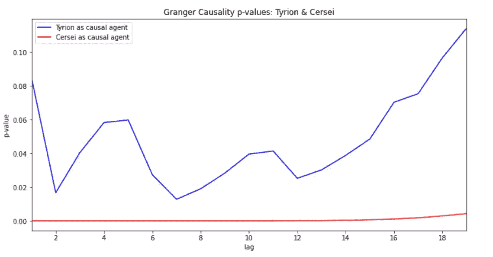

越来越滞后的高 p 值表明提利昂只是间歇性地让瑟曦的名声或恶名指数短暂波动。

相比之下，瑟曦的低 p 值持续存在。她似乎是格兰杰的原因，因为她给她的弟弟带来了太多的悲伤，这使得提利昂受到的公众关注有了明显的变化。