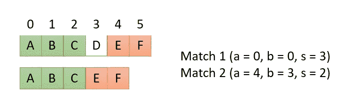

# Python 中字符串的并排比较

> 原文：<https://towardsdatascience.com/side-by-side-comparison-of-strings-in-python-b9491ac858?source=collection_archive---------5----------------------->

## 实施一个工具，用 Python 并排比较文本，以便更好地了解差异

瓦妮莎·贾科尼的照片(图片来源: [Unsplash](https://unsplash.com)

目前我正在为 Python 中的文本制作一个[隐私过滤器。在开发过程中，我遇到了一个经常遇到的问题；如何快速比较两个字符串并轻松评估差异？这一次，是时候解决这个问题了。](/remove-personal-information-from-text-with-python-232cb69cf074)

## difflib 库

一些互联网研究很快揭示了 difflib 模块的存在。这个默认的[模块](https://docs.python.org/3/library/difflib.html)包含几个比较序列的助手，比如数组和字符串。所有比较序列的算法都可以用几行代码实现。有那么一小会儿，实现我自己的算法的想法掠过我的脑海，但很快就消失了。

difflib 模块的基础是类 **SequenceMatcher** 。这个类实现了比较序列的算法。它首先在两个输入序列中找到最大的公共序列，并在其他部分递归地执行这个任务，直到没有序列剩下。由于它的递归性质，执行时间可以变成二次的，这取决于序列中的差异量。对于我们的目标来说，这种表现是可以接受的。它不会被用来比较书籍的文本，但只有几行一次。

## 查找匹配序列

为了匹配序列，我们首先必须创建一个 SequenceMatcher 类的实例。构造器将两个序列匹配作为参数 *a* 和 *b* 。不使用垃圾邮件检测的参数。当将字符串作为参数传递时，字符串被视为一系列字符。匹配器将寻找匹配的字符序列。

SequenceMatcher 类有几种返回匹配结果的方法，比如找到最长的匹配，返回将 *a* 转换为 *b* 的操作，以及返回所有找到的匹配。我们将使用后者:

get_matching_blocks()方法返回所有匹配项的可迭代列表，从序列的开始按出现的顺序排序。每个匹配由序列中匹配的位置 *a* ，序列中匹配的位置 *b* 和匹配的长度*组成。在示例中，找到了三个匹配；“是”，“温暖。是”，“呃。”。第四个返回的匹配是序列的结尾。*

所以我们在字符串中找到了所有匹配的序列。但是为了比较文本，最后一个匹配“呃”只匹配单词的一部分。我喜欢只匹配整个单词。因为匹配器接受序列(字符串是 Python 中的字符序列)，所以我们应该向匹配器添加单词。因此，让我们看看如果在执行匹配器之前对字符串进行标记会发生什么:

tokenize 方法是一个非常简单、粗糙的实现，它通过在空格(“”)处分割字符串来实现。结果是有希望的，只有序列“它是”和“温暖”。“是被退回来了。不再找到部分匹配的单词。测试几行文本很快就指出了只在空格处进行拆分的有限的标记化。它在换行符和制表符处失败，所以为了加快游戏进度， *split()* 被替换为一个正则表达式，该表达式在所有空格处拆分文本:

这与前面的实现结果相同，但是对于其他白色空间比空间本身更健壮。

## 平衡琴弦

匹配器告诉我们哪些序列匹配，哪些不匹配。有了这个信息，就有可能使两个序列相等，把第一个序列的缺失部分加到第二个序列上，反之亦然。

看上面的例子，我们看到第一个匹配序列从位置 0 开始，长度为 2。第二个匹配序列从序列 *a* 的位置 2 开始，从序列 *b* 的位置 3 开始。因此序列 *b* 包含不在序列 *a* 中的部分。我们需要向序列 *a* 中添加一个元素，其长度与序列 *b* 中的元素长度相同。

为了确定匹配序列中是否缺少元素，我们查看匹配的起始位置，加上匹配序列的长度，并确定下一个序列是否从两者之和开始。在下面的示例中，两个序列的第二个匹配从位置 0 + 3 开始，第一个序列的第二个匹配从位置 4 开始，第二个序列的第二个匹配从位置 3 开始。由于 0 + 3 等于 3，匹配序列在第二个序列中相互“接触”,第一个序列在两个匹配序列之间包含一个附加元素。这意味着，第二个序列中必须增加一个附加元素。

作者图片

有三种可能性:第一个序列包含一个或多个附加元素，第二个字符串包含附加元素，或者两个字符串都包含附加元素。在后一种情况下，序列不匹配，例如，在我们的第一个例子中，单词“summer”和“winter”。

我们将通过在其他序列具有不匹配元素的地方添加附加元素来均衡该序列。这些附加元素将被赋予与不匹配元素相同的长度，并将由下划线组成:

该方法遍历找到的匹配项(第 15 行),并检查每个匹配项是否与前一个匹配项相邻。如果不是这种情况，元素被添加到另一个序列中以创建一个匹配(第 16–23 行)。添加缺失的元素后，用匹配的序列扩展两个序列。在返回值之前，它们是未标记的。

不在第一个字符串中的单词“not”作为下划线添加到第一个字符串中。不同的词“夏天”和“冬天”都添加到另一个字符串中。看到上面的结果已经很好地概括了两个字符串之间的区别。

## 视觉化差异

所以现在我们有了均衡的字符串，我们需要一个方便的方式来可视化的比较。对于单句，将它们一个接一个地打印出来是一个很好的解决方案。对于较长的文本，并排比较更方便。

为了进行并排比较，我们需要将字符串分成有限的块，例如 40 个字符。我们希望在单词中间断开，因此添加了一个可接受的窗口，例如 10 个字符，这意味着我们将开始搜索 40 个字符后的空格(第 5 行)，并最多返回 10 个字符，以找到小于并最接近 40 个字符的第一个空格(第 7–8 行):

该函数返回一个字符串列表，长度不超过 40。因为均衡字符串使它们长度相等，所以我们可以使用这种方法将两个字符串都断开，并且这些字符串将总是在同一行包含相同的单词。它们很容易比较。我们可以打印包含下划线的字符串，但删除了下划线。通过在 breaking then text up 之后删除下划线，我们可以保证两个文本中的相同单词出现在同一行中:

**comparison()** 函数将两个要比较的文本作为参数，后跟可选的并排显示宽度、从该宽度中寻找空间的窗口以及是否并排或上下显示文本。

完整代码:

使用所有可能的可视化运行示例:

希望这种并排比较法对你的帮助和对我的帮助一样大。通过这种比较，找到文本中的差异要容易得多，因为左右相同的文本出现在同一行确实很有帮助。对于我的隐私过滤器来说，当相同的文本部分之间显示多行时，长度差异变得相当大，使得比较变得很尴尬。

我希望你喜欢这篇文章。要获得灵感，请查看我的其他文章:

*   [用 FastAPI 和 Heroku 创建隐私过滤器 web 服务](/create-a-privacy-filter-webservice-with-fastapi-and-heroku-4755ef1ccb25)
*   [用 Python 删除文本中的个人信息](/remove-personal-information-from-text-with-python-232cb69cf074)
*   [使用 Python 实现并行 web 请求](/parallel-web-requests-in-python-4d30cc7b8989)
*   [所有公共交通都通往乌得勒支，而不是罗马](/all-public-transport-leads-to-utrecht-not-rome-bb9674600e81)
*   [用开放数据和开普勒](/visualization-of-crowdedness-for-dutch-trains-with-kepler-f55057a3ba24)可视化荷兰火车的拥挤
*   [使用 OTP 和 QGIS 可视化行程时间](/visualization-of-travel-times-with-otp-and-qgis-3947d3698042)

*免责声明:本文包含的观点和看法仅归作者所有。*