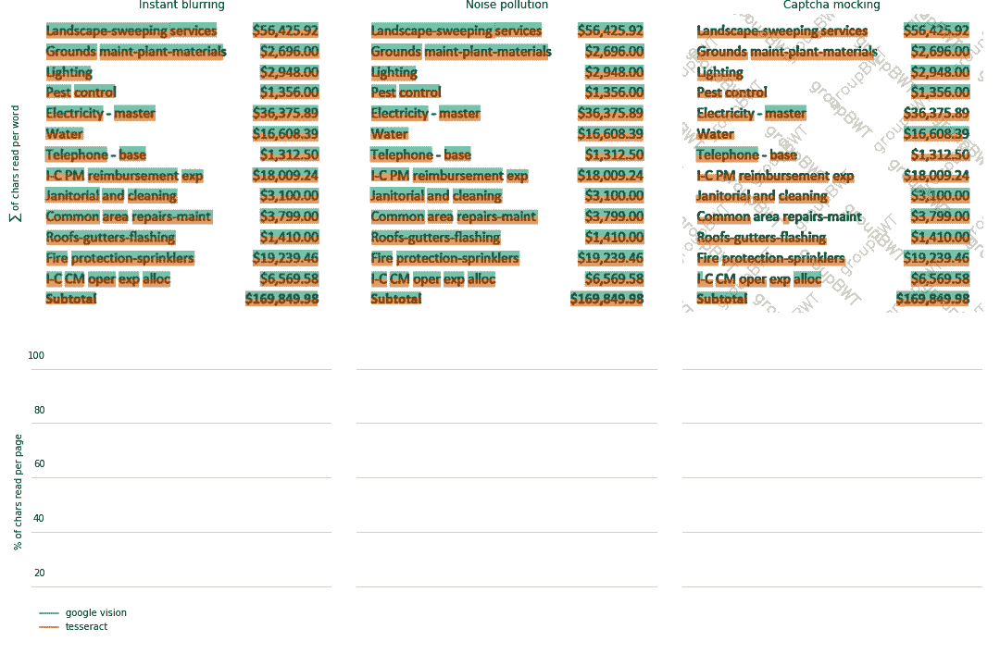
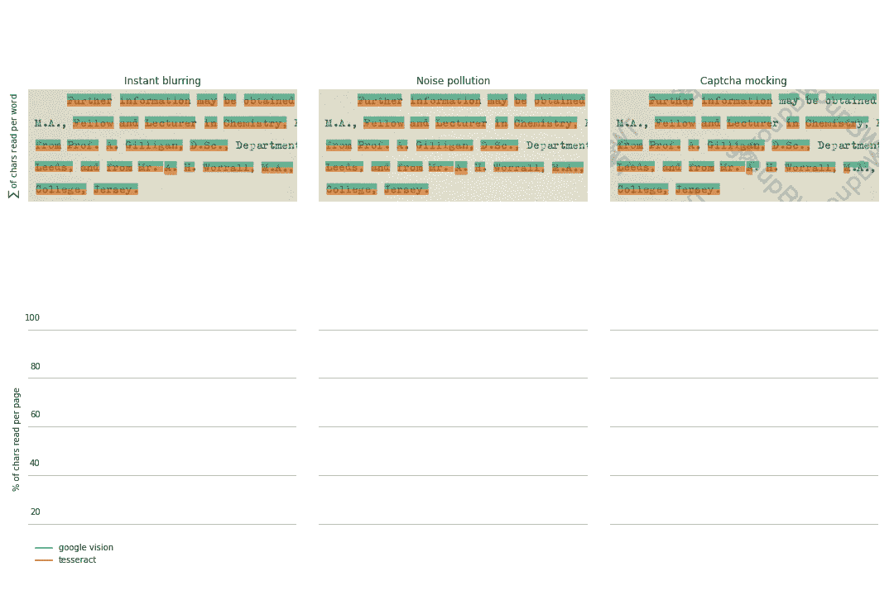
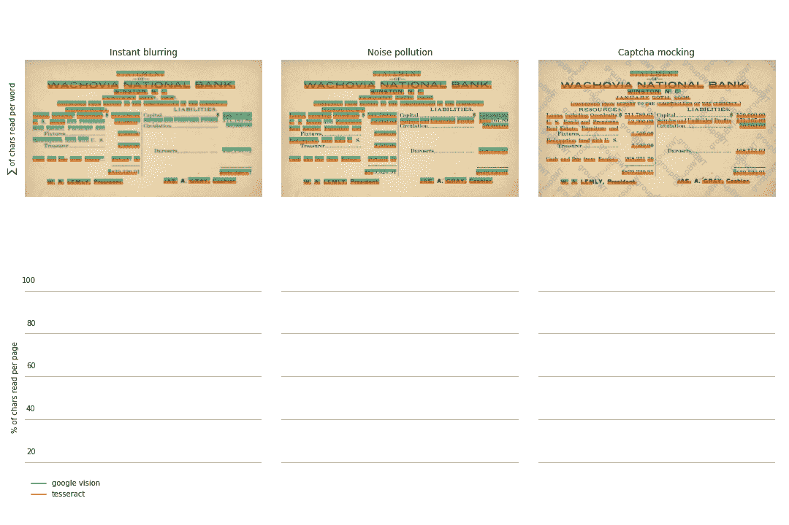
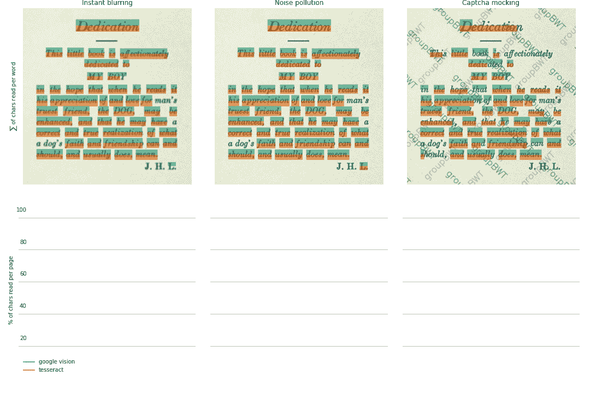

# Python 中的并行 OCR 与 Google Vision 和 Tesseract

> 原文：<https://towardsdatascience.com/side-by-side-ocr-in-python-with-google-vision-and-tesseract-66021d5702a0?source=collection_archive---------9----------------------->

## 关于如何使用一些流行的引擎在 Python 中执行 OCR 以及它们的特点和技巧的简短说明

作者图片

## 现代光学字符识别系统

OCR(光学字符识别)系统将包含有价值信息(假定为文本格式)的图像转换为机器可读数据。在大多数情况下，通过一些可用的方法执行 OCR 是从纸质或基于扫描的 PDF 文档中提取数据的第一步。

然而，在网上进行短暂的搜索后，你可以找到大量各种开源和商业工具的链接，[谷歌视觉](https://cloud.google.com/vision)和[宇宙魔方](https://tesseract-ocr.github.io/)作为 OCR 引擎已经比他们的竞争对手领先了很长时间，尤其是在最近几年。

Tesseract 是一个离线和开源的文本识别引擎，具有全功能的 API，可以通过 Python 的一些包装器模块轻松实现到任何业务项目中， [*pytesseract*](https://pypi.org/project/pytesseract/) 就是一个例子。

相反，Google Vision 并不在本地运行，而是在远程 Google 的服务器上运行。要开始在您的项目中使用 Google Vision API，您必须进行一些设置步骤，包括根据[官方指南](https://cloud.google.com/vision/docs/setup)提供有效凭证。此外，如[谷歌的定价政策](https://cloud.google.com/vision/pricing)所述，你可以为超出免费限制的文本识别请求付费。

尽管这两种工具在用法和选项设置上存在根本差异，但从谷歌趋势来看，它们对网络用户的兴趣几乎是一样的:

接下来，我们将尝试使用两个引擎在 Python 中执行 OCR，顺便比较它们在真实图像上的性能(由作者重新创建或扫描以模仿不同初始质量的文档)。

## OCR 比较方法综述

为了获得尽可能可比的结果，我们将执行“反转”方法。这意味着，我们将首先对文本图像执行 OCR，而不进行任何预处理，尝试从同一图像中反复应用不同的降级过滤器来机器读取字符。在每一步中，我们将评估 OCR 性能，将正确读取的字符数与两种工具在初始步骤中成功读取的字符数进行比较。

但是作为一个起点，我们将尝试在使用 Google Vision 和 Tesseract 在 Python 中执行 OCR 时，您应该注意的每个工具的一些奇怪之处。

## 宇宙魔方:连接你可能期望分裂的东西

当您将 Tesseract 的 *image_to_data* 方法应用于足够高质量的图像(即足够硬和清晰)时，事情可能看起来很自然。但是对于模糊的图像，这个工具试图不正确地确定文本边界框。这就是实际情况。

更具体地说(注意一些边界框是如何相互重叠的):

为了检索这种奇怪的行为，我们必须手动迭代边界框，找到那些具有显著水平相交区域的边界框，并纠正它们的右边界。在绝大多数情况下，它会使边界框的宽度精确匹配所包含的字符串的长度。这个算法已经包含在 Demoocr 类的 *get_tes_ocr_data* 方法中，允许我们在对修改后的图像执行 OCR 的每个步骤中获取调整后的数据。

## Google Vision:拆分你可能期望加入的内容

与 Tesseract 相反，Google Vision 为已识别的文本实体提供了更加分散的边界框。请注意，它将作为标点符号阅读的字符从前面的单词中分离出来是多么有用和隐含。但是在某些情况下，这可能会被认为是不受欢迎的行为！在我们的特殊情况下，从后续数字的边界框中取出一个货币单位，这使得很难直接比较 OCR 引擎在给定区域内字符数量方面的性能。

## OCR 比较方法:更精细的点

由此可见，我们不仅要考虑在每一步图像修改中识别的字符数量，还要考虑它们的正确位置，即在初始步骤中确定的边界框。由于 OCR 引擎的输出有很大的不同，我们需要手动校正边界框，这次是通过以下方式合并所有重叠的多边形。

接下来，我们将在这些基线边界内精确计算识别字符的数量。为了便于说明，正确读取的字符数将显示在图像上相应区域的不透明彩色横条上。堆叠的条越短，相应的 OCR 引擎在给定区域内成功读取的字符数量就越少。

## 把所有的放在一起

通过比较两种工具在使用不同强度的过滤器修改图像的每一步的 OCR 结果，我们有望获得谷歌视觉和宇宙魔方特定功能的感觉。下面是一个中间步骤的示例，以及这两种工具的 OCR 结果。

下面是我们的比较方法:

作者图片

另一个例子是:

作者图片

还有一个。

作者图片

最后一个了。

作者图片

## 带回家的笔记

如上所述，Google Vision 和 Tesseract 都是成熟的工具，并且历史上已经在许多商业项目中找到了它们的方法。即使没有经过预处理，它们也能对质量尚可的文本图像进行充分的 OCR。虽然这样的预处理用[*OpenCV*](https://opencv.org/) 或 [*枕*](https://pillow.readthedocs.io/en/stable/) 似乎能显著提高对宇宙立方体的 OCR 结果。此外，您应该已经注意到，这两种工具对带有文本背景的图像的处理是多么不稳定。我们分析的这一发现与另一个比较中[的见解有着特定的对应关系，但这也绝非详尽无遗。总而言之，这两个引擎都应该被认为是易于设置和使用的 OCR 工具，您的项目的正确选择在很大程度上取决于外部需求和预算。](https://fuzzylabs.ai/blog/the-battle-of-the-ocr-engines/)

在 [Github](https://github.com/woldemarg/google_vision_tesseract_post) 上查看完整的代码，其中包含一系列方便的 OCR 和图像预处理方法。