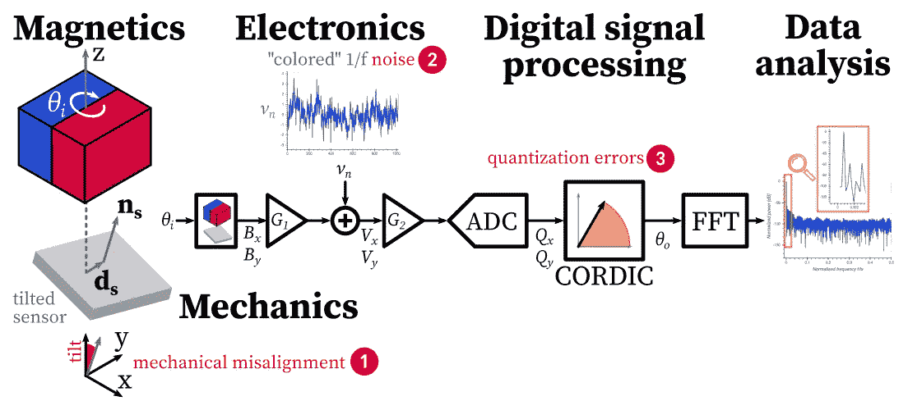
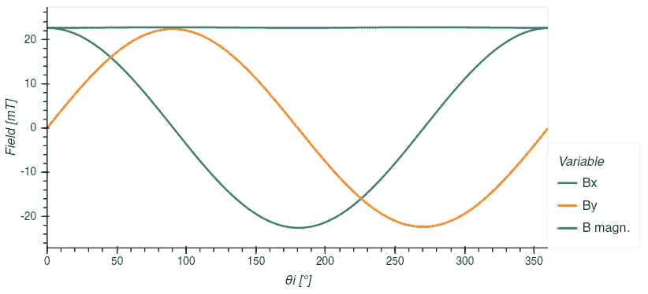
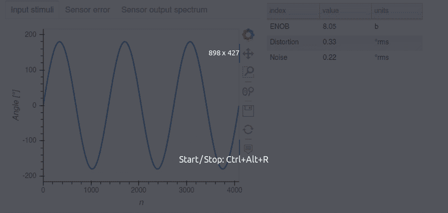

# Python 中的信号链分析

> 原文：<https://towardsdatascience.com/signal-chain-analysis-in-python-84513fcf7db2?source=collection_archive---------28----------------------->

## [行业笔记](https://towardsdatascience.com/tagged/notes-from-industry)

## **硬件工程师案例研究**

> 信号链在硬件电子产品中很常见。通常情况下，物理信号(温度、位置、压力……)会通过一系列操作在整个链条中进行转换。考虑到实际的硬件限制，这种转换会引入一些误差。预测存在错误时的整体性能需要数学分析，Python 非常适合这种分析。这篇**教程文章**提供了一个完整的**可重现性分析**作为说明性案例研究。案例研究是一个跨越多个领域(机械、磁性、模拟硬件和数字信号处理)的**传感器读出链**。本文展示了 Python 作为一流工程设计工具的能力。它是介绍编码模式的前一篇文章[1]的延续。这里的分析使用这种编码模式，并集中在工程方面。

# 介绍

温度、压力、位置等真实信号通常由硬件信号链处理。典型的链由模拟电子设备、数字数据转换和进一步的数字处理操作组成。实际硬件的非理想性，如噪声和有限的位数，会降低信号质量。为了量化性能，需要一个忠实捕捉误差的链的数学模型。Python 拥有丰富的数学和工程库生态系统，非常适合编写这样的模型。此外，Jupyter 笔记本混合了计算、绘图和叙述故事，为与同事、利益相关者甚至全世界分享工程分析报告提供了理想的格式。这种分析可以用最少的基础设施再现:只需一个浏览器。此外，这个生态系统的开源性质不仅有利于钱包，而且促进了学习和合作。

尽管有这些优势，没有软件背景的工程师经常发现很难开始使用 Python 建模和分析。因此，这些工程师倾向于回到电子表格来进行系统建模。Excel 仍然是最常用的建模语言[2]——严重限制了建模能力。

在本文中，我们将展示 Python 支持完整信号链分析的能力。我们采用教程方法，涵盖端到端的分析**。我们从链框图开始，讨论每个块的建模代码。我们解释了一般的分析流程，并在与利益相关者共享的出版物质量的交互式仪表板中总结了我们的结果。**

作为一个具体的用例，我们将该方法应用于一个智能传感器读出链。这个例子的灵感来自作者的职业经历[3]。然而，设计和参数是虚构的。虽然建模和分析技术是通用的。这个示例性链的优点在于，它足够通用，可以涵盖各种信号链。它包括非线性运算和在实际硬件实现中发现的非平凡误差。

完整的代码以 Jupyter 笔记本的形式提供。这个笔记本是完全可执行的[在那里](https://mybinder.org/v2/gh/closega/portfolio/master?filepath=ipynb%2Fsignal_chain_case_study.ipynb)。鼓励读者在笔记本上玩耍，复制下面讨论的情节和仪表板。

# 传感器读出链的例子

作为一个实际例子，我们考虑智能磁位置传感器的信号链。传感器的目的是测量旋转磁铁的角位置。这种传感器在现代汽车和无数其他工业和机器人应用中无处不在。

该链如下所示，涵盖多个工程领域。从左到右，磁铁产生磁场。磁体的机械旋转调制由传感器感测的磁信号。传感器沿着正交传感轴转换磁场分量。这两个电压被标准模拟电子设备放大并转换成数字位。通过对两个数字分量进行反正切运算(由 [CORDIC](https://en.wikipedia.org/wiki/CORDIC) 算法实现)来计算角度。



硬件信号链(图片作者提供)。

如果该链是理想的，那么可以进行分析，或者在简单的电子表格中进行模拟。实际上，这个链条受到非理想性的困扰。它们以非平凡的方式破坏信号，使得除了最简单的情况之外，分析在电子表格中难以管理。

另一方面，使用 Python，我们可以将链分解成模块化的功能块。此外，对于复杂的数学运算，我们可以依赖一个丰富的生态系统，该系统由成熟的开源高级库组成。从而保持对工程方面的关注。

# 误差模型考虑

考虑以下误差源(在上图中以红色突出显示和编号)。

**(1)机械错位。**传感器没有完全对准磁铁旋转轴。想象有一个偏心率和一个倾斜角。这使得数学变得具有挑战性:简单的[教科书公式](https://www.kjmagnetics.com/blog.asp?p=surface-fields-101)不再适用于磁体对称轴上的磁场。相反，该模型需要考虑 3-D 中的矢量场，如[4]中的等式所示。此外，在传感器的框架中表达该场需要使用旋转。开源库 Magpy [5]很好地解决了第一个挑战，它为各种磁体几何形状提供了磁场。关于旋转，标准的 [scipy.spatial.transform](https://docs.scipy.org/doc/scipy/reference/spatial.transform.html#module-scipy.spatial.transform) 包中提供了各种格式(欧拉角、角轴、矩阵……)的基本旋转操作。

**②电子噪音。**感应信号在毫伏范围内，因此被电子噪声破坏。我们假设噪声源可以建模为[闪烁噪声](https://en.wikipedia.org/wiki/Flicker_noise)，也称为[“粉红噪声”](https://en.wikipedia.org/wiki/Colors_of_noise#Pink_noise)。这种噪声在电子产品中很常见。与纯粹随机的“白噪声”不同，相邻样本在某种程度上是相关的，就像在随机漂移或扩散过程中一样。再次，产生具有这种性质的噪声序列的算法被发展。有多个现成的开源 Python 库可以用一行代码生成如此嘈杂的波形。一个例子是[6]。

**(3)量化误差。**数字运算受到二进制运算精度的限制。例如，模数转换器(ADC)的位数有限。这很容易被建模为舍入运算。对在硬件中实现的有限精度的三角函数进行建模是更加进化的。考虑 CORDIC 算法:它将反正切运算分解为一系列角度递减的旋转。产生的角度误差再次取决于位数，但也取决于迭代次数。还有现成的开源 Python 库，如[7]提供了这种操作的高级模型。

以上三个误差的累积效应是，测得的输出角 *θo* 仅约等于磁体的输入角 *θi* 。角度误差由随机波动和非线性失真组成。基于[快速傅立叶变换](https://en.wikipedia.org/wiki/Fast_Fourier_transform) (FFT)的频谱分析可以区分这些贡献，从而提供工程洞察力。标准`scipy`封装中也提供 FFT 功能。

总的来说，Python 生态系统为我们提供了建模链、其误差和数学信号分析的高级库。按照我们在上一篇文章[1]中介绍的编码模式，该模型将由一系列模块块组成，从而密切模仿框图的结构。对于每个模块，我们将定义一个函数 *y=f(x)* 来捕捉从输入到输出的转换。

块函数通常在代码行方面很小，尽管由于高级库而捕获了复杂的数学。代码将保持精简，在精神上接近工程图。

请注意，编码模式仅限于没有反馈回路和动态的链。需要一个扩展来涵盖这些情况。这将在后续文章中讨论。

# 建模

鉴于完整的代码可在配套的 Jupyter 笔记本中获得，我们在这里不深入研究所有细节。相反，我们专注于工程方面和整体方法。我们首先列出所有表征链条的工程参数及其误差源。

首先考虑磁铁。其特征在于它的维度(一个 3 元素列表)、它的磁化矢量(另一个 3 元素列表)和它的位置(另一个 3 元素列表)。对于传感器，我们有位置、倾斜角、灵敏度和噪声均方根(RMS)幅度。对于 ADC，我们有舍入步长和位数。对于 CORDIC 算法，我们有迭代次数。

就像我们以前的文章[1]中推荐的那样，为了方便起见，我们将所有固定的参数分组到一个数据字典中。我们使用一个 [Box](https://github.com/cdgriffith/Box/wiki) 数据结构，而不是普通的字典:这样就可以用`dd.block.parameter`简洁地调用参数。

将参数分组在单个数据结构中为给定模拟运行的参数集提供了单点真实性。这简化了参数研究期间多个模拟运行的管理。

为了简化计算，通常还需要几个额外的导出参数。这里，传感器和磁体边缘之间的气隙以及传感器旋转矩阵被用于中间计算。因为两者都是直接从主要的参数集派生出来的，所以为了方便起见，我们将它们集成到数据字典中。为了模块化，我们将数据字典定义和派生参数的计算包装在支持函数中。我们获得下面的代码。

```
*#----------------------*
*# Parameters*
*#----------------------*

**def** load_dd():
  **return** Box({
    'magnet'  : {
      'dim'   : [10,10,10],  *# magnet dimension Lx, Ly, Lz [mm]*
      'mag'   : [-1,0,0],    *# magnetization vector Br [Tesla]* 
      'pos'   : [0,0,15] },  *# magnet center [mm]* 
    'sensor'  : {
      'pos'   : [0,1,0],     *# sensor center [mm]*
      'tilt'  : 3,           *# sensor tilt [°]*
      'S'     : 1.0,         *# sensor sensitivity [Volt/Telsa]*
      'noise' : 0.2 },       *# sensor input-referred noise [Tesla]*
    'adc': {
       'lsb'  : 0.1,         *# ADC LSB size rounding step*
       'n'    : 12 },        *# ADC number of bits* 
    'cordic'  : {
      'n'     : 12, }        *# CORDIC number of iterations* 
  })

**def** calc_derived(dd):
  dd.sensor.airgap =dd.magnet.pos[2] - dd.magnet.dim[2]
  dd.sensor.rot=R.from_euler('y', dd.sensor.tilt, degrees=**True**)
```

# 建模磁性和机械方面

我们现在将注意力转向机械和磁方面的建模。根据我们的功能框图，磁体和传感器被组合成一个单独的模块。相应的函数将输入角度 *θi* 转换为传感器位置的磁场矢量，以传感器的框架表示。让我们将这个函数分解成基本的 Python 语句。

*   我们用数据字典中的参数创建一个条形磁铁的实例:`magnet = Bar_magnet(*dd.magnet)`；
*   我们将磁铁旋转输入角度:`magnet.rotate(...)`；
*   我们计算参考系`B=magnet.getB(...)`中传感器中心的磁场；
*   我们将磁铁返回到初始位置(避免记忆状态):`magnet.angle=0`。
*   我们通过乘以旋转矩阵来表达传感器框架中的矢量，以说明倾斜:`dd.sensor.rot.apply(B)`。
*   我们使用显式变量标签返回向量分量，以符合我们的编码模式:`return {'Bx': B[0], ...}`。

我们获得了下面的代码(与电子表格中的暴力实现形成对比)。

```
**from** **magpylib.source.magnet** **import** Box **as** Bar_magnet
magnet=Bar_magnet(**dd.magnet)

**@apply_func_df**
**def** calc_B(X, dd, magnet):
  'Calculate the field vector in mT as a function of rotation'
  magnet.rotate(angle=X.theta_i, axis=[0,0,1])
  B = magnet.getB(np.array(dd.sensor.pos))/1e-3
  magnet.angle=0
  B=dd.sensor.rot.apply(B)
  **return** {'Bx': B[0], 'By': B[1], 'Bz': B[2]}
```

请注意，magnet 实例只为函数外部的所有对象创建一次，并作为参数传递，以避免在每个函数调用中产生开销。像我们以前的文章[1]中一样，该函数用`@apply_fun_df`包装，以使其与数据帧兼容。这样，该函数直接在一个表格数据集上操作，该数据集代表一次*全角度扫描*，而无需显式循环。有了这些代码，我们可以对这个功能块进行实验，例如，绘制一个完整旋转的字段的 *Bx* 和 *By* 分量:

```
df = pd.DataFrame({'theta_i': np.linspace(0,360,2**10, endpoint=False)})
df.hvplot(x='theta_i', y=['Bx', 'By', 'B magn.'],
          xlabel='θi [°]', ylabel='Field [mT]')
```



完整旋转的字段组件(图片由作者提供)。

# 噪声建模

为了模拟噪声，我们将两个粉红噪声序列注入到两个感测的场分量中。这两个噪声序列是来自同一统计模型的两种不同实现。实际上，这相当于两个分量被两个独立的链放大的情况，每个链都有自己的噪声源。在功能上，这被表示为从一对无噪声分量 *(Bx，By)* 到有噪声分量*(Bx’，By’)*的变换。该功能可以分解如下:

*   我们使用库 *colorednoise* 生成两个独立的粉红噪声序列(与刺激长度相同)。默认情况下，它们的归一化均方根幅度为 1；
*   我们通过期望的 RMS 幅度(来自数据字典的参数)来缩放两个序列；
*   我们将它们添加到无噪声信号中。

下面是相应的代码。请注意，为了方便起见，转换是就地完成的(无噪声组件被覆盖)。

```
**import** **colorednoise** **as** **cn****def** apply_noise(df, dd):
  noise=pd.DataFrame([pd.Series(cn.powerlaw_psd_gaussian(1, len(df))) **for** k **in** (0,1)]).T
  noise*=noise*dd['sensor']['noise']
  df[['Bx', 'By']] +=noise.values
  **return** df
```

# 完整链

对于链的其余部分，我们以类似的方式进行。表示为 *G_k* 的两个模块仅代表缩放增益系数，在此忽略不计( *G_k* =1)。ADC 函数只是一个舍入运算。我们只剩下使用 CORDIC 算法的角度计算。我们通过 *n* 次迭代(数据字典中的参数)重用库[7]中的算法，特别是在单个象限中工作的`arctan_cordic`函数。为了推广到四个象限，我们使用[维基百科](https://en.wikipedia.org/wiki/Atan2#Definition_and_computation)中的公式，使用`sign`函数从`arctan`计算`arctan2`。我们获得:

```
**@apply_func_df**
**def** calc_angle(X, dd):
  x,y = X.Qx, X.Qy *# convenient alias*
  angle = cordic.arctan_cordic(x, y, n=dd.cordic.n)
  *# 4-quadrant extension*
  **return** {'theta_o': np.degrees(np.sign(x)**2 * angle + (1-np.sign(x))/2*(1+np.sign(y)-np.sign(y)**2)*np.pi)}
```

除了分析模块之外，完整的链现在被建模。为了模块化，我们将完整的模拟运行封装到一个`virtual_experiment`函数中。该功能执行端到端实验(设置参数，按顺序运行所有模块，并测量角度误差)。它将数据框中的角度扫描和对数据字典的潜在更改作为参数。它返回包含所有中间信号和自然输出角度的填充数据帧。该功能如下进行:

*   我们首先构建默认的数据字典；
*   我们合并作为参数传递的更改；
*   我们将使用的块函数链接成一个流水线，依次调用每个函数，丰富了信号的数据帧；
*   我们执行快速计算以提取角度非线性误差(为便于解释，该误差包裹在 180°内),并针对平均值进行了校正(这不会导致非线性)。

下面是相应的代码。并注意与框图的对应关系。

```
**def** virtual_experiment(theta_i=np.arange(0,360,0.1), dd={}):
  dd=merge(load_dd(), dd)
  calc_derived(dd)
  magnet=Bar_magnet(**dd.magnet)

  df = pd.DataFrame({'theta_i': theta_i})
  df=(df.pipe(calc_B, dd=dd, magnet=magnet)
      .pipe(transduce,dd=dd)
      .pipe(apply_noise, dd=dd)
      .pipe(quantize, dd=dd)
      .pipe(calc_angle, dd=dd))
  df['theta_err'] = deg_180(df.theta_o - df.theta_i)
  df['theta_err'] -= df['theta_err'].mean()
  **return** df
```

# 分析

量化动态误差并给出令人信服的解释的一个性能指标是有效位数(ENOB)。确切定义见【8】和 [[](#enob-2) 9]。顾名思义，该指标提供了从模拟输入到数字输出的整体转换的有效位数。例如，ENOB=10b 表示误差与理想 10 位转换的幅度相同。

根据定义，该指标需要满量程幅度的正弦波激励: *θi* = 180 sin(2π *ft* )。调整频率 *f* 以覆盖 2ᴺ样本中的整数个周期。然后通过 FFT 分析数字输出 *θo* 波形。工程解释是 FFT 的系数(所谓的频谱)对应于每个频率仓中的信号功率。自然，在输入频率上有一个功率峰值:这是目标信号的功率 *S* 。总功率为 *D* 的失真出现在谐波频率上。剩余的功率 *N* 是随机噪声，它广泛地填充了其他频率仓，建立了“噪声基底”。在 Python 中，这种分析通过以下方式简洁地调用:

```
f,P = signal.periodogram(df.theta_o, scaling='spectrum')
idx_max=np.argmax(P)
S   = P[idx_max]    
D   = sum(P[2*idx_max:11*idx_max:idx_max]) *# sum of harmonic components up to order 10*
N   = sum(P) - S - D
```

再次注意拥有高级库的便利，比如提供`periodogram`分析功能的`scipy`。

像往常一样，为了模块化，我们将上述内容和最终的 ENOB 计算封装在一个函数`ENOB()`中。然后通过连续调用虚拟实验和 ENOB 函数来调用完整的分析。

# 分析仪表板

该分析返回最终指标，如 ENOB(位数)以及失真和噪声的均方根功率。在分享我们的分析之前，我们应该用几个有见地的情节来说明。这里我们简单地画出输入激励、输出误差和频谱。我们使用另一个库[面板](https://panel.holoviz.org/)将这些图和一个汇总表组合在一个交互式仪表板中。



互动仪表盘截图(图片由作者提供)。

# 分享分析

在区域工程分析中，人们当然会分析这些结果，并提出设计改进建议。这超出了本文的范围，我们将通过发布分析来结束本文。

分析是在 Jupyter 笔记本中进行的:分析代码、情节和叙述是一个整体:一个可复制的报告。自然，报告可以导出为标准的静态格式，如 HTML 或 PDF。然而，共享报告的“实时”实例确实有好处。这样，计算可以被复制。除了再现之外，还可以试验一组新的参数，并且报告可以即时更新。这促进了协作学习。完整的代码笔记本可以在[那里](https://gist.github.com/gael-close/3dd0ef09a22def02ec97246543d9d4ae)找到，还有一个可执行版本的链接。

# 结论

我们用 Python 演示了硬件信号链的分析。从框图和误差源的识别开始，我们开发了相应的 Python 模型。我们使用模块化编码模式，严格遵循框图的结构。我们展示了如何调用该模型来运行虚拟实验和执行深入的信号分析(例如失真和噪声分析)。最后，我们以出版物质量仪表板和可复制报告的形式展示了我们的结果。总的来说，这个端到端教程展示了 Python 执行硬件工程设计任务的能力。

# 参考

[1] G. Close，“python 中的功能建模和定量系统分析”，走向数据科学，2021 年 1 月 31 日。可用:[https://towards data science . com/functional-modeling-and-quantitative-system-analysis-in-python-22 b 90 BF 0 b 9 b 5。](/functional-modeling-and-quantitative-system-analysis-in-python-22b90bf0b9b5.)

[2] R. Dronzek，“系统工程师的模拟建模”，INCOSE 网络研讨会，2019 年 7 月 10 日。可用:[https://www . any logic . com/upload/webinars/al-webinar-simulation-modeling-for-systems-engineers . pdf .](https://www.anylogic.com/upload/webinars/al-webinar-simulation-modeling-for-systems-engineers.pdf.)

[3] N. Dupré、Y. Bidaux、O. Dubrulle 和 G. Close，“具有 1%精度的杂散磁场免疫磁位移传感器”，IEEE Sens. J，2020 年 5 月。可用:[https://doi.org/10.1109/JSEN.2020.2998289](https://doi.org/10.1109/JSEN.2020.2998289)

[4] R. Ravaud 和 G. Lemarquand，“平行六面体磁铁产生的各种均匀极化的磁场”，电磁学研究进展，第 98 卷，第 207-219 页，2009 年。可用:[http://dx.doi.org/10.2528/PIER09091704](http://dx.doi.org/10.2528/PIER09091704)。

[5] M. Ortner 和 L. G. Coliado Bandeira，“Magpylib:用于磁场计算的免费 Python 包”，SoftwareX，第 11 卷，第 100466 页，2020 年 1 月。可用:[http://www . science direct . com/science/article/pii/s 2352711020300170](http://www.sciencedirect.com/science/article/pii/S2352711020300170)

[6] F. Patzelt 和 Alex Spaeth，“colorednoise.py”，版本 1.1.1，2019 年 6 月 1 日。可用:【https://github.com/felixpatzelt/colorednoise 

[7]:约翰·伯卡特，《科迪奇》，2017 年 6 月 28 日。可用:[https://people . sc . FSU . edu/~ jburkardt/py _ src/cord IC/cord IC . html](https://people.sc.fsu.edu/~jburkardt/py_src/cordic/cordic.html)。[访问日期:2021 年 2 月 15 日]

[8] W. Kester，“了解 SINAD、ENOB、SNR、THD、THD + N 和 SFDR，以免迷失在噪底中”，ADI 公司，MT-003 教程，2009 年。可用:[https://www . analog . com/media/en/training-seminals/tutorials/MT-003 . pdf](https://www.analog.com/media/en/training-seminars/tutorials/MT-003.pdf)。

[9]:robustcircuitdesign.com，“理解有效位数”，2016 年 11 月 18 日。可用:[https://robustcircultdesign . com/signal-chain-explorer/understanding-effective-number-of-bits/](https://robustcircuitdesign.com/signal-chain-explorer/understanding-effective-number-of-bits/)【访问时间:2021 年 2 月 15 日】