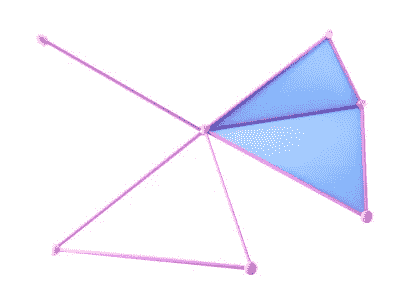
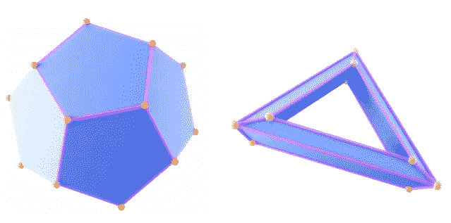
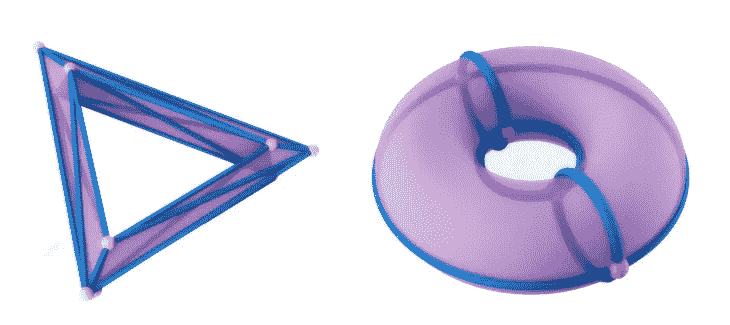
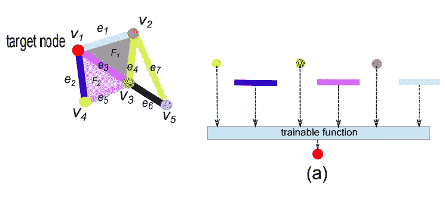
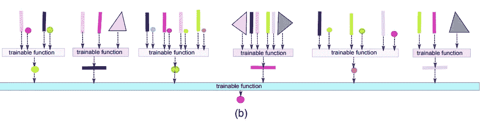
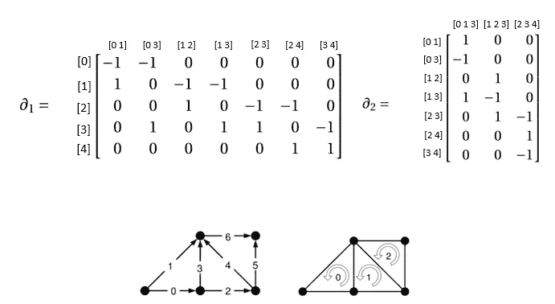
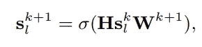
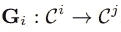
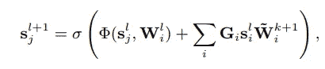

# 基于细胞复杂网络的细胞复合体信号处理

> 原文：<https://towardsdatascience.com/signal-processing-on-cell-complexes-with-cell-complex-networks-cxns-fc4cebe24e42?source=collection_archive---------19----------------------->

## 单纯/细胞复合体及其他支持的深度学习

里卡多·戈麦斯·安吉尔在 [Unsplash](https://unsplash.com?utm_source=medium&utm_medium=referral) 上的照片

D eep 学习促进了许多新技术的发展，从自动医学图像分析到人工智能驱动的文档翻译。这些社会变革起源于计算机视觉和自然语言处理领域的快速发展，即图像和文本的处理。然而，用一个像素网格或一系列单词来表示大范围的数据并不是最好的。例如，(生物分子)形状或(社会)网络是展示局部和全局几何属性的数据类型，这些属性可能无法被现有的深度学习架构有效利用。因此，需要严格理解和扩展深度学习方法可以应用的数据类型。本文考虑将深度学习推广到称为“细胞复合体”的广义空间。这种域概括了几乎所有具有实际重要性的离散域，如图形、点云、网格和单纯复形。然而，它们保留了足够直观的结构，使它们在实际应用中很重要。我们简要介绍了这些空间，并提供了这方面的最新工作[9]。

# 高阶网络建模

图是用于建模实体之间关系的自然对象。然而，通常在实践中，人们可能需要对 k 个实体之间的高阶关系进行建模。图形的建模能力有限，因为它们只能对*成对关系*建模。如果我们想要对关系之间的关系建模呢？这就是来自代数拓扑的对象，如单纯和细胞复形来拯救[1，9，10]。

单纯复形是从称为单纯的原始对象构建的图的推广。零和一单形对应于图中的节点和边。单纯复形中的高阶关系通过面或四面体和高阶单纯来建模。下图是一个二维单纯复形的例子。这里维数为 2 的原因是这个单纯复例包含维数为 2 的单纯。

二维单纯复形。图像源[1]

单纯复形可能是最简单的一种复形，并且已经具备了许多编码高阶关系的特性:它们不仅允许顶点对之间的关系，而且允许更大的顶点集之间的关系，从而扩展了图。然而，单纯复形作为离散域的建模工具具有某些缺点。特别地，在单纯复形中，k 个实体之间的任何关系都必须从包含(k1)个实体的所有对应子集的关系中构建。因此，通过单纯复形编码空间可能需要(不必要的)大量数据和存储器。对于深度学习应用，这使得在这些领域训练神经网络相当具有挑战性。

我们能否找到这个空间的更简单的表示，它保留了单纯复形的代数结构，我们可以利用它进行深度学习应用？在这篇文章中，我们认为*规则细胞复合体*的理论为 SCs 肯定地回答这个问题提供了必要的概括。

# 什么是细胞复合体？

多边形复合体是规则细胞复合体的特例[1，9]。

在直观的层面上，单元复合体(CC)是由称为单元的基本实体构建的广义空间。虽然 SC 只允许简单的构造块，但是 CC 允许使用任意形状的单元。因此，每个单元在其边界上可以具有任意数量的低维单元。这种更灵活的复杂类型产生了一个更简单的圆环模型，见下图(右)。不是必须将环面的表面分成 18 个三角形，而是可以用 4 个节点、8 条边和 4 个面来模拟环面，描述由这些边界定的区域。除了在模拟各种域时增加的灵活性之外，当用细胞复合体代替单纯复合体时，还可以获得数值稳定性[9]。

单元复合体可用于用少得多的构件来模拟相同的底层空间。图片来源[9]

# 细胞复杂网络

最近，人们对将深度学习协议推广到自然模拟高阶交互的对象产生了浓厚的兴趣。细胞复合体网络是一种在常规细胞复合体上执行深度学习计算的网络。在常规细胞复合物上的这种网络的研究首先在[1]中介绍。这种网络是图形神经网络的一般化，并且它们使用直观的消息传递协议以类似的方式操作，该协议允许在细胞之间改组信号。这些网络表现出的一个关键区别是，细胞复合体上的信号可以在不同维度的细胞之间被打乱[1，9]。相关处理方法参见[2，3，4，5，6，7，8]。

例如，考虑下图中给出的例子。

消息传递方案，其中节点从 0 和 1 单元接收信号。图像源[1]

这个简单细胞复杂网络的计算图是相对于红色节点来解释的。注意这个节点是如何从 0 维和 1 维细胞接收信号的。在这种网络的计算中(通过考虑红色单元的局部邻域)，维度 1 的单元接收来自维度 1 和维度 2 的单元的信号。这可以从下图中看出:

在第二层中，使用来自相邻边缘以及面的信号来更新边缘信号。图像源[1]。

请注意，蓝色边缘接收来自亮粉色边缘和暗粉色边缘的信号，因为所有这些边缘都是粉色表面的边界。也可以在小区复合体上定义其他消息传递方案。关于这些网络[13，14]的更多细节，参见 CXNs 的[介绍](/one-network-to-rule-them-all-cell-complex-neural-networks-5920b4978a7c)和[这篇](https://towardsdatascience.com/tagged/editors-pick)相关文章。

# 引入代数拓扑语言描述 CXNs

细胞复合体是拓扑空间，通常在代数拓扑的背景下研究[10]。组合上，它们可以通过一系列的*边界图*来描述，粗略地说，描述了(n-1)个单元与 n 个单元相邻的方式。以下是图下部给出的细胞复合体的前两个边界图。注意，这里有两个边界矩阵(因为复合体的维数是 2)，第一个矩阵描述了 1 单元相对于 0 单元的邻接关系(或者更精确地说是边界关系),第二个矩阵描述了 1 单元相对于 2 单元的边界关系。

单纯复形的前两个边界图

这些矩阵序列实际上可以用来表示一个单元或一个单纯复形。在这些领域的深度学习环境中，这些图可用于在复合体的细胞之间发送信号或协同链[1，9]。

现在我们知道如何描述细胞复合体，我们上面描述的计算图可以通过熟悉的方程(类似于熟悉的 GNN 方程)在实践中计算出来[4，9，11]:

这里，H 是线性*运算符*，负责在尺寸为 *l 的单元之间移动信号(消息传递信号),而* s_l 是在 l 单元上更新/混洗的信号。在实践中，H 只是一个矩阵，并且在单纯/细胞复合体的信号处理的上下文中[8，9，11，12]，H 被选择为拉普拉斯矩阵或其一个推广的霍奇拉普拉斯矩阵[8，9，11，12]。

我们可以推广上述等式，并要求在不同维度的单元之间移动信号(由于边界/共边界运算符将信号发送到较低/较高的单元)。即，给定上链空间之间的适当线性算子的集合[8，9]:

将 I 单元格顶部定义的信号映射到 j 单元格的矩阵。

人们可以将一般的细胞复杂网络定义如下:

使用算子 Gi，可以将来自多个源的信号组合在一起，以更新目标信号 sj。

前一等式中给出的这种通用形式描述了在单元/单纯复合体上支持的深度学习模型的许多现有架构，包括[1，2，3，4，5，6，7，8]。映射 Gi 起到将信号从 I 细胞传递到 j 细胞的作用，并且可以看出，这可以容易地用矩阵来表征。有关更多详细信息，请参见[1，8，9]。

本文是与许多作者共同工作的一部分，这些作者包括 Roddenberry、T. Mitchell、Michael T. Schaub、Ghada Zamzmi、Birdal、Kyle Istvan、Xuanting Cai、Nina Miolane、Karthikeyan Natesan Ramamurthy 和 Aldo Guzman Saenz。

# 参考文献

[1] M. Hajij、K. Istvan 和 G. Zamzmi，“细胞复合神经网络”，NeurIPS 2020 研讨会，TDA 及以后，2020 年。

[2] M. T. Schaub，Y. Zhu，J.-B. Seby，T. M. Roddenberry 和 S. Segarra，“高阶网络上的信号处理:生活在边缘上……以及超越”,信号处理，第 187 卷，第 108149 页，2021 年。

[3] M. T. Schaub、A. R. Benson、P. Horn、G. Lippner 和 A. Jadbabaie，“单纯复形上的随机漫步和标准化的 hodge 1-laplacian”，《暹罗评论》，第 62 卷，第 2 期，第 353-391 页，2020 年。

[4] S. Ebli、M. Defferrard 和 G. Spreemann，“单纯神经网络”，NeurIPS 拓扑数据分析研讨会，2020 年。

[5] T. M. Roddenberry，N. Glaze 和 S. Segarra，“用于轨迹预测的有原则的单纯神经网络”，机器学习国际会议，第 9020-9029 页，PMLR，2021 年。

[6] E. Bunch、Q. You、G. Fung 和 V. Singh，“Simplicial 2- complex 卷积神经网络”，NeurIPS 拓扑数据分析研讨会，2020 年。

[7] M. Hajij，G. Zamzmi，和 X. Cai，“单纯复表示学习”，arXiv 预印本 arXiv:2103.04046，2021 .

[8] Hajij，Mustafa 等，“以数据为中心的人工智能需要重新思考数据概念。”NeurIPS 以数据为中心的人工智能研讨会，2021 年。

[9] Roddenberry、T. Mitchell、Michael T. Schaub 和 Mustafa Hajij。"细胞复合体的信号处理."arXiv 预印本 arXiv:2110.05614 (2021)。

[10]艾伦·哈奇，[代数拓扑](https://books.google.com/books?hl=en&lr=&id=xsIiEhRfwuIC&oi=fnd&pg=PR9&dq=hatcher+algebraic+topology&ots=ZpSMioccuT&sig=yabOENNgsVaQXc78e1mB3HWK20Q)，2005。

11.《单纯复形上的信号处理》 *arXiv 预印本 arXiv:2106.07471* (2021)。

[12]巴巴罗萨、塞尔吉奥和斯特凡尼亚·萨德利提。"单纯复形上的拓扑信号处理."IEEE 信号处理汇刊 68(2020):2992–3007。

[13] M. Hajij，[单纯复表示学习](/simplicial-complex-representation-learning-a04ccf2d2578?source=collection_tagged---------13-------------------------------)，使用高阶几何消息传递方案学习整个单纯复表示。

[14] M. Hajij，[一个网络统治一切:细胞复杂神经网络](/one-network-to-rule-them-all-cell-complex-neural-networks-5920b4978a7c)一个统一的数学框架，在其中可以定义和执行深度学习模型和协议。