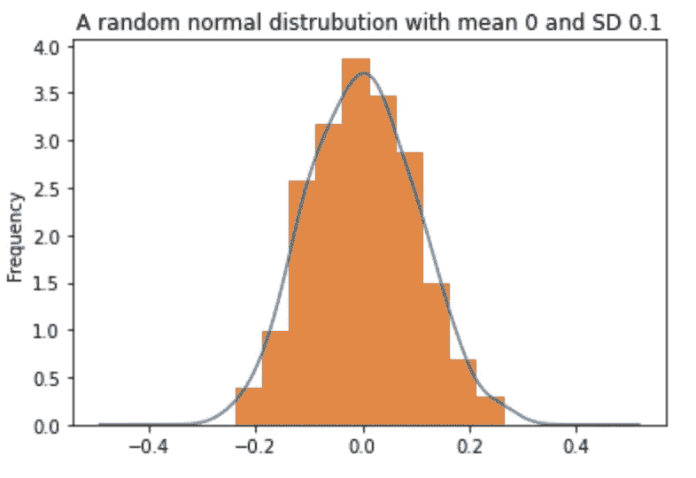
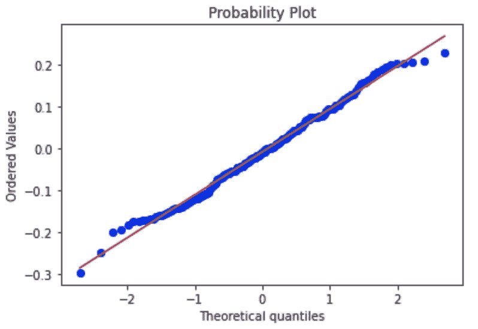
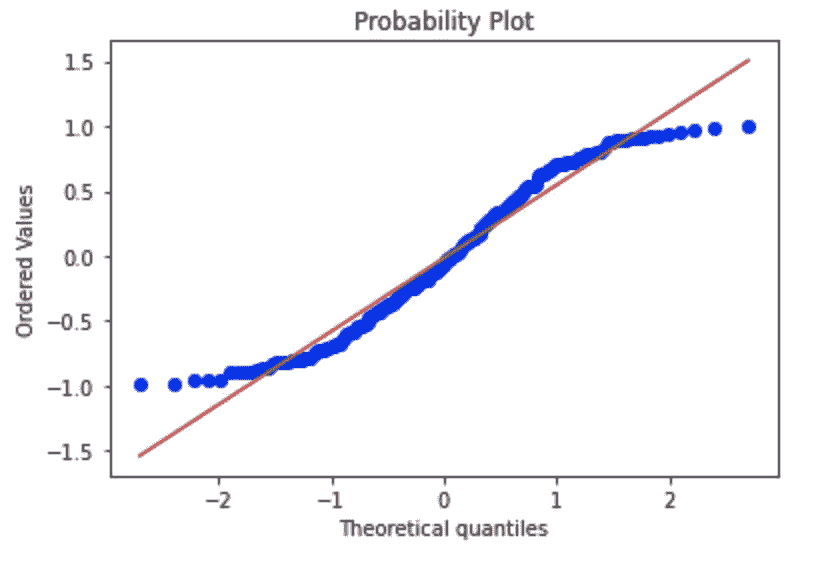

# Q-Q 图的重要性

> 原文：<https://towardsdatascience.com/significance-of-q-q-plots-6f0c6e31c626?source=collection_archive---------13----------------------->

## 它会告诉我们哪些关于数据的秘密？


马特·邓肯在 [Unsplash](https://unsplash.com?utm_source=medium&utm_medium=referral) 上的照片

了解变量的分布是浏览数据集时首要完成的任务之一。一种用图形测试连续变量分布的方法是通过 Q-Q 图。就个人而言，这些图在参数检验的情况下很方便，因为它们坚持正态假设，即使它们可以用于任何基础分布。

# 什么是阿 q 情节？

分位数-分位数图或 Q-Q 图是通过绘制两个不同的分位数来创建的散点图。第一个分位数是测试假设的变量的分位数，第二个分位数是测试假设的实际分布。例如，如果您正在测试团队中员工的年龄分布是否为正态分布，您将比较团队成员年龄的分位数与正态分布曲线的分位数。如果从同一分布中抽取两个分位数，它们应该大致落在一条直线上。
由于这是一种直观的比较工具，结果也可能相当主观，但对理解变量的潜在分布很有用

# 是如何产生的？

以下是为团队成员年龄生成 Q-Q 图以测试正态性的步骤

1.  将你感兴趣的变量(在这个场景中是团队成员的年龄)从最小值到最大值排序。假设在这个场景中有 19 个团队成员。
2.  取一条正态曲线，分成 20 等份(n+1；其中 n = #个数据点)
3.  计算这些点的 z 分数
4.  根据排序后的变量绘制获得的 z 得分。通常，z 分数位于 x 轴(也称为理论分位数，因为我们将它用作比较的基础)，可变分位数位于 y 轴(也称为有序值)
5.  观察数据点是否在一条 45 度直线上紧密对齐
6.  如果有，年龄呈正态分布。如果不是，您可能希望对照其他可能的发行版来检查它

# 我如何用 Python 来绘制这个？

下面是检查随机正态分布的正态性的示例代码

```
import numpy as np
import pandas as pd
import matplotlib.pyplot as plt
from scipy import stats
%matplotlib inlinenp.random.seed(100) #for reproducibility# Generate 200 random normal data points with mean=0, standard_deviation=0.1
#Documentation:https://numpy.org/doc/stable/reference/random/generated/numpy.random.normal.html
random_normal_datapoints = pd.Series(np.random.normal(0, 0.1, 200))# Lets plot the data points along with its KDE to see how it looks
fig, ax = plt.subplots()
random_normal_datapoints.plot.kde(ax=ax, legend=False, title='A random normal distrubution with mean 0 and SD 1')
random_normal_datapoints.plot.hist(density=True, ax=ax)
ax.set_ylabel('Frequency')# Plot the Q-Q plot to graphically check for the hypothesis
#https://docs.scipy.org/doc/scipy/reference/generated/scipy.stats.probplot.html
res = stats.probplot(random_normal_datapoints, plot=plt)
plt.show()
```



```
# Plot the Q-Q plot to graphically check for the hypothesis
# Documentation : https://docs.scipy.org/doc/scipy/reference/generated/scipy.stats.probplot.html
res = stats.probplot(random_normal_datapoints, plot=plt)
plt.show()
```



正如您所观察到的，数据点大致位于一条直线上。因此，我们可以说数据点是正态分布的(即使我们知道它是从随机正态分布中采样的)

如果你要绘制一个随机均匀分布对正态分布，你会得到下图



正如你所看到的，大多数点并不在一条直线上。表明潜在的分布是不正常的

在下面的 Github 链接中可以找到更多关于如何检查其他发行版的示例和一些其他示例:

[https://github.com/SundareshPrasanna/QQPlot-Medium](https://github.com/SundareshPrasanna/QQPlot-Medium)

# 我们还能用它做什么？

Q-Q 图也可用于测试 2 个不同数据集之间的分布。例如，如果数据集 1(年龄变量)有 200 条记录，而数据集 2(年龄变量)有 20 条记录，则可以比较这些数据集的分布，看它们是否确实相同。这在机器学习中特别有帮助，在机器学习中，我们将数据分成训练-验证-测试，以查看分布是否确实相同。它还用于部署后场景，以直观地识别协变量转换/数据集转换/概念转换。

# 摘要

总的来说，Q-Q 图可以帮助你比较手头变量的样本分布和其他可能的分布。

 [## sundaresh 正在创作与数据科学相关的文章，并且热爱教学

### 嘿👋我刚刚在这里创建了一个页面。你现在可以给我买杯咖啡了！

www.buymeacoffee.com](https://www.buymeacoffee.com/sundaresh)