# 使用 Python 进行显著性或假设检验

> 原文：<https://towardsdatascience.com/significance-or-hypothesis-tests-with-python-7ed35e9ac9b6?source=collection_archive---------22----------------------->

## [入门](https://towardsdatascience.com/tagged/getting-started)

## 用 Python 实现大学统计

# 介绍

在一系列的每周文章中，我将会涉及一些重要的统计学主题。

目标是使用 Python 来帮助我们获得对复杂概念的直觉，从经验上测试理论证明，或者从零开始构建算法。在本系列中，您将会看到涵盖随机变量、抽样分布、置信区间、显著性检验等主题的文章。

在每篇文章的最后，你可以找到练习来测试你的知识。解决方案将在下周的文章中分享。

迄今发表的文章:

*   [伯努利和二项随机变量用 Python 编写](/bernoulli-and-binomial-random-variables-d0698288dd36)
*   [用 Python 从二项式到几何和泊松随机变量](/geometric-and-poisson-random-variables-with-python-e5dcb63d6b55)
*   [用 Python 实现样本比例的抽样分布](/sampling-distributions-with-python-f5a5f268f636)
*   [Python 的置信区间](/confidence-intervals-with-python-bfa28ebb81c)
*   [使用 Python 进行显著性测试](/significance-or-hypothesis-tests-with-python-7ed35e9ac9b6)
*   [用 Python 进行组间差异的双样本推断](/two-sample-inference-for-the-difference-between-groups-with-python-de91fbee32f9)
*   [分类数据的推断](/inference-for-categorical-data-9f3c6034aa57)
*   [高级回归](/advanced-regression-f74090014f3)
*   [方差分析— ANOVA](/analysis-of-variance-anova-8dc889d2fc3a)

像往常一样，代码可以在我的 [GitHub](https://github.com/luisroque/College_Statistics_with_Python) 上找到。

# 假设检验简介

安东尼奥和 4 个朋友一起度过了 30 天的假期，他们想决定每晚谁来做饭。安东尼奥提议他们可以写下自己的名字，并把它们储存在一个碗里。然后，他会从一个碗里随机抽取一个名字，上来的名字必须是当天晚上做晚饭的。现在，假设在 4 轮随机选择名字后，安东尼奥的名字再也没有出现。剩下的朋友开始怀疑发生了什么事。让我们来计算一下这个概率。

```
0.80**40.4096000000000001
```

我们可以看到，这种情况有接近 41%的概率发生。这是一个非常重要的概率，因此朋友小组可能应该信任安东尼奥。现在，想象一下 15 轮过后，安东尼奥仍然没有被选中。

```
0.8**150.03518437208883203
```

假设这个过程是完全随机的，他连续 15 轮没被选中的概率大概是 3.5%。如果他的朋友使用通常定义的 5%的阈值，他们不会想到纯粹偶然发生的事件的概率小于 5%。然后，他们可能会拒绝这是一个真正随机过程的假设，这意味着安东尼奥在作弊。

# 关于总体比例的假设检验


图 1:安东尼奥和他的朋友在海滩上思考统计数据；[来源](https://unsplash.com/photos/OAnydGhhcxE)。

一天，在海滩上，安东尼奥在一本杂志上读到一篇文章，文章称只有 30%的人在海滩上使用防晒霜。安东尼奥认为这个数字对于他们度假的海滩地区来说太低了。他告诉了他的朋友，他们决定从附近的海滩随机抽取 35 人，他们估计当天至少有 400 人在享受海滩。这 35 人中，有 14 人使用了防晒霜。

```
14/350.4
```

让我们更正式地定义我们的假设检验:

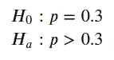

零假设显示了预期的结果，假设只有 30%的人在海滩使用防晒霜。另一方面，另一个假设陈述了安东尼奥的怀疑:超过 30%的人实际上在使用防晒霜。

让我们进行一次模拟，看看像上面这样的样本随机发生的可能性有多大。我们模拟了 40 个样本，样本量等于 30，其中 40%的人使用了防晒霜。

```
from scipy.stats import bernoulli, norm, t
import matplotlib.pyplot as plt
import numpy as np
import seaborn as snsx = np.zeros((40, 35))
for i in range(40):    
    x[i] = bernoulli.rvs(p=0.3, size=35)
```

我们可以用柱状图来描绘我们的模拟。

```
sns.histplot(np.mean(x, axis=1));
```

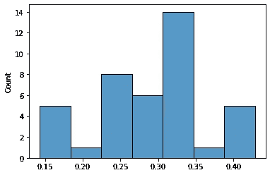

图 2:样本大小等于 30 的模拟样本(40)的直方图。

```
p = np.mean(x, axis=1)
```

有了这些信息，我们就可以计算我们的 p 值。它可以定义为 p̂大于或等于 0.4 的抽样比例的概率，以 h0 为真为条件:

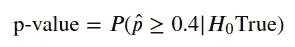

我们可以很容易地计算出 p 值。

```
p[p>=0.40].shape[0]/p.shape[0]0.125
```

如果安东尼奥使用α=0.05 的显著性水平，他不会拒绝 H_0。这意味着，在 p̂ = 0.4 的情况下，他们没有足够的证据来否定只有 30%的人使用防晒霜的可能性，而他们得到的 40%的统计数据只是随机的结果。

```
if (p[p>=0.4].shape[0]/p.shape[0]<0.05):
    print('Reject H_0')
else:
    print('Do not reject H_0')Do not reject H_0
```

# 关于比例的 Z 检验的条件

我们在以前的文章中看到了执行 z 测试的条件。这三个条件是:

*   样本必须是随机的。
*   正态分布可以近似样本比例的抽样分布。经验法则是，你至少需要有 10 次成功和 10 次失败。
*   要求样本是独立的。经验法则是，如果你是在没有替换的情况下抽样，你的样本量应该少于总体量的 10%。

让我们完成前面的例子，并对每种情况进行测试。从随机抽样开始，我们被告知，朋友小组随机选择要问的人。有了这些信息，我们将假设他们的过程是真正随机的。正常情况告诉我们，预期的成功和失败次数至少需要等于 10 次。我们也能够满足该标准(参见下面的计算)。最后，我们有独立的条件。在我们的例子中，人口数量是海滩地区的人口，大约 400 人。使用的样本大小为 35，因此我们也可以满足执行 z 检验的条件。

```
n = 35
p = 0.3

print('np = '+ str(n*p))
print('n(1-p) = '+ str(n*(1-p)))np = 10.5
n(1-p) = 24.5
```

# 在关于比例的测试中计算 z 统计量

我们将继续使用我们的防晒霜问题。在上一节中，我们检查了推断的所有条件都得到了满足。在这种情况下，我们将执行 z 测试。

在继续之前，让我们回忆一下我们的目标。安东尼奥和他的朋友们从海滩地区的所有人口中抽取了 35 人作为样本，并计算出样本统计̂p= 40%。现在，假设零假设为真，得到一个离假设的人口比例 p=30%这么远或者更远的结果的概率是多少。

计算这种概率的一种方法是通过计算抽样比例与真实比例相差多少标准差(记住我们总是假设 h0 为真，所以我们认为是真实比例)。

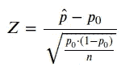

```
p_0 = 0.3
p_hat = 0.4

Z = (0.4-0.3)/np.sqrt((0.3*(1-0.3)/n))
Z1.290994448735806
```

我们的 p 值可以定义为:

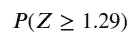

```
1-norm.cdf(Z)0.09835280122947343
```

将我们得到的这个概率与α=0.05 的显著性水平相比较，我们再次看到，我们不能拒绝 H_0。

# 关于总体均值的假设检验

一天晚上，安东尼奥正在查看他的手机，并开始想知道他和他的朋友在 WhatsApp 群聊中交换了多少条消息，他们在度假前 3 个月就建立了这个群聊。他怀疑他们平均每天会互相发送 180 条信息，但他的一个朋友认为他们交换了超过 180 条信息。他们决定检验这个理论。

让我们定义我们的显著性测试:

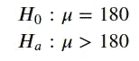

他们从聊天记录中随机抽取了 8 天的样本，并记录了这些天发送了多少条消息。样本数据大致对称，平均值为 215 条消息，标准偏差约为 36 条消息。他们想用 5%的显著性水平来检验他们的假设。

正如我们之前看到的，在这种情况下，我们将执行 t 检验，而不是 z 检验。原因是我们不知道样本均值的抽样分布的标准偏差

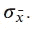

我们只能用抽样标准差来估计它

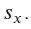

然后，我们可以将测试写成:

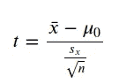

```
x = [266, 190, 161, 191, 241, 180, 240, 251]
x = np.asarray(x)
sns.histplot(x, bins=10);
```

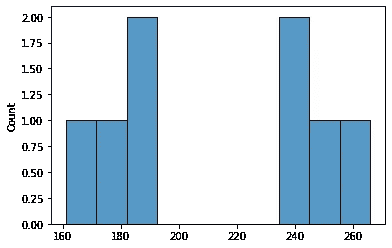

图 3:随机抽样的邮件数量直方图。

```
print(x.mean())
print(x.std())215.0
36.29738282576307μ = 180
n = 8

t_star = (x.mean()-μ)/(x.std()/np.sqrt(n))
t_star2.7273302276728411-t.cdf(t_star, df=n-1)0.01472601649385541
```

我们的 p 值约为 0.015，小于我们的显著性水平。这意味着我们可以拒绝安东尼奥提出的 H_0，而接受替代假说。有足够的证据接受安东尼奥的朋友的假设，即该小组每天发送超过 180 条消息。

# 关于总体均值的 t 检验的条件

我们在以前的文章中看到了执行 t 检验的条件。这三个条件是:

*   样本必须是随机的。
*   样本均值的抽样分布可以近似为正态分布。有三种方法可以实现它:样本量大于 30(中心极限定理适用)，原始分布是正态分布，或采样分布是对称的，不显示异常值。
*   要求样本是独立的。经验法则是，如果你是在没有替换的情况下抽样，你的样本量应该少于总体量的 10%。

让我们再一次针对每一种情况测试我们之前解决的问题。这将使我们更加确信结果在某种程度上不会有偏差。我们被告知安东尼奥和他的朋友随机选择日期，这符合第一个标准。其次，我们的样本分布大致对称，可以认为正态条件也满足。最后，安东尼奥和他的朋友使用了 8 的样本量。我们被告知，他们在度假前 3 个月就已经建立了 WhatsApp 群聊。样本量少于 10%，因此可以安全地假设取样日之间的独立性，即使它们是在没有替换的情况下取样的。

# 第一类和第二类错误

我们已经看到，如果 p 值小于显著性水平α，我们应该拒绝 H_0。反之，如果 p 值大于α，我们就不能拒绝 H_0。当我们进行这些比较时，总有可能出错。让我们画一个表，让它更清楚。

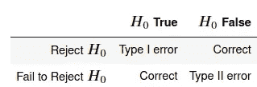

表 1:与实际和预测结果相关的 I 型和 II 型误差。

请注意，出现 I 类错误的概率等于显著性水平。假设您定义了 5%的显著性水平。这意味着，在 5%的情况下，即使你的零假设是真的，你也会得到一个让你拒绝零假设的统计数据。

在前面给出的例子中，第一类和第二类错误是什么？让我们再次写下使用防晒霜人群比例的假设检验:

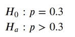

如果朋友们得出结论，使用防晒霜的人的比例不等于 0.3，而实际上是 0.3，那么就会发生第一类错误。另一方面，第二类错误是人们的比例不等于 0.3，但他们没有拒绝它。

另一个需要定义的重要概念是显著性检验的功效。它是当假设不成立时，你拒绝零假设的概率。

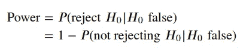

请注意

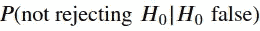

实际上是犯第二类错误的概率，所以你可以把显著性检验的功效看作是**而不是**犯第二类错误的概率。

让我们看看我们能做些什么来增强假设检验的能力:

*   提高显著性水平(但请注意，这也将增加 I 类错误的概率)。
*   增加样本量。
*   数据的可变性更小。
*   如果真参数远离零假设。

# 结论

在本文中，我们讨论了显著性或假设检验。这对于使用抽样数据来评估关于总体值的索赔的可能性非常有用。要测试的值可以是总体的比例或平均值。我们分别使用 z 检验和 t 检验计算了两种情况下的 p 值。

我们还解决了在执行这些测试时可能发生的错误。类型 I 错误的发生概率与定义的显著性水平相同，并转化为对实际为真的零假设的拒绝。当我们不能拒绝一个无效假设，并且它是错误的，我们就产生了第二类错误。最后，我们将显著性检验的功效定义为不犯第二类错误的概率，并找到了提高它的方法。

保持联系: [LinkedIn](https://www.linkedin.com/in/luisbrasroque/)

# 练习

你将在下周的文章中找到答案。

1.  根据去年的一项大型民意调查，波尔图大约 85%的房屋都接入了高速互联网。Marco 想知道这一比例是否发生了变化，他随机抽样调查了 80 栋房子，发现其中 75 栋可以接入高速互联网。他想用这个样本数据来检验这个比例是否真的发生了变化。假设推断条件满足，考虑到 1%的显著性水平，您对拥有高速互联网的房屋比例会得出什么结论？
2.  玛尔塔拥有一家水果店，每周都会收到西瓜。供应商声称它们应该重 1 公斤。Marta 决定对随机抽取的 100 个西瓜进行称重，发现平均重量为 850 克，标准偏差为 200 克。她想用这个样本数据来测试平均值是否小于供应商声称的平均值，如果是这样，就重新协商他们的合同。假设推断的条件满足，Marta 应该怎么做(考虑 5%的显著性水平)？

## 上周的答案

1.  更改函数`confidence_interval_mean_t`并构建 5 个不同的实验来计算样本均值的 95%区间，其中 3 个不满足 t 区间的条件，2 个满足。对于不满足条件的 3，定义以下情况:抽样不随机，原始分布不近似正态，不满足独立性。对于满足条件的两种情况，定义一种情况下原始分布是正态分布，另一种情况下原始分布是偏斜的，但采样均值是正态分布。对于后两种情况，真正的总体均值应该包含在 95%的计算置信区间内。

*提示:您可能会发现使用* `*scipy*` *中的* `*skewnorm*` *函数很有用。下面，您有一个正态分布的修改版本，由偏斜度参数、平均值和标准偏差来偏斜。*

```
# code adapted from https://stackoverflow.com/questions/49367436/scipy-skewnorm-mean-not-matching-theory

skew = 4.0
mean = 2
stdev = 0.5

delta = skew / math.sqrt(1\. + math.pow(skew, 2.))
adjStdev = math.sqrt(math.pow(stdev, 2.) / (1\. - 2\. * math.pow(delta, 2.) / math.pi))
adjMean = mean - adjStdev * math.sqrt(2\. / math.pi) * delta

print('target mean={:.4f} actual mean={:.4f}'.format(mean, float(skewnorm.stats(skew, loc=adjMean, scale=adjStdev, moments='mvsk')[0])))
print('target stdev={:.4f} actual stdev={:.4f}'.format(stdev, math.sqrt(float(skewnorm.stats(skew, loc=adjMean, scale=adjStdev, moments='mvsk')[1]))))target mean=2.0000 actual mean=2.0000
target stdev=0.5000 actual stdev=0.5000# Original skewed distribution

plt.hist(skewnorm.rvs(a = skew, loc=adjMean, scale=adjStdev, size=2000), bins=50);
```

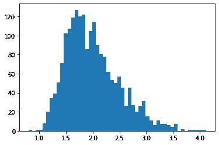

```
# Approximately normal distribution of the sample mean because sample 
# size is bigger than 30 (CTL applies)

plt.hist(np.mean([skewnorm.rvs(a = skew, loc=adjMean, scale=adjStdev, size=35) for _ in range(2000)], axis=1), bins=50);
```

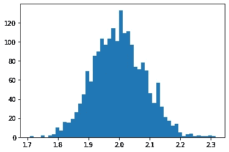

```
def confidence_interval_mean_t(μ, σ, n, number_trials, N, ci=0.95, sample='random', dist='normal'):

    skew = 4.0
    mean = μ
    stdev = σ

    delta = skew / math.sqrt(1\. + math.pow(skew, 2.))
    adjStdev = math.sqrt(math.pow(stdev, 2.) / (1\. - 2\. * math.pow(delta, 2.) / math.pi))
    adjMean = mean - adjStdev * math.sqrt(2\. / math.pi) * delta

    if dist!='normal':
        x_ = skewnorm.rvs(a = 4, loc=adjMean, scale=adjStdev, size=N)
    else:
        x_ = norm.rvs(loc=μ, scale=σ, size=N)

    x_hat_list = []
    SE_hat_x_list = []

    if sample!='random':
        # Inducing bias on the sampling
        x_.sort()
        x_ = x_[:-int(0.2*N)]
        np.random.shuffle(x_)

    for i in range(number_trials):
        s_ = np.random.choice(x_, n, replace=False)
        x_hat = np.mean(s_)
        x_hat_list.append(x_hat)
        SE_hat_x_list.append(t.ppf(ci+(1-ci)/2, df=n-1)*np.std(s_)/np.sqrt(n))

    plt.hist(x_hat_list, bins=50)

    j=0
    _, ax = plt.subplots(1, 1, figsize=(6, 8))
    for i in range(len(x_hat_list)):
        if (μ>x_hat_list[i]-SE_hat_x_list[i]) & (μ<x_hat_list[i]+SE_hat_x_list[i]):
            # interval contains p
            if i > len(x_hat_list)-50:
                ax.errorbar(x_hat_list[i], np.arange(len(x_hat_list))[i],lolims=True, xerr=SE_hat_x_list[i], yerr=0.0, linestyle='', c='black')
            j +=1
        else:
            # interval does not contain p
            if i > len(x_hat_list)-50:    
                ax.errorbar(x_hat_list[i], np.arange(len(x_hat_list))[i],lolims=True, xerr=SE_hat_x_list[i], yerr=0.0, linestyle='', c='red')
    ax.axvline(μ, color='darkorange')
    #plt.xlim(0,1)
    plt.show()
    print(f'{j}/{number_trials}={np.round(j/number_trials,2)}')# Not random sampling
confidence_interval_mean_t(μ=2, σ=0.5, n=35, number_trials=1000, N=500, sample='not_random')
```

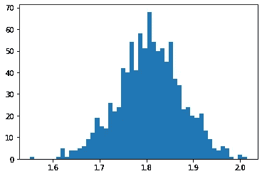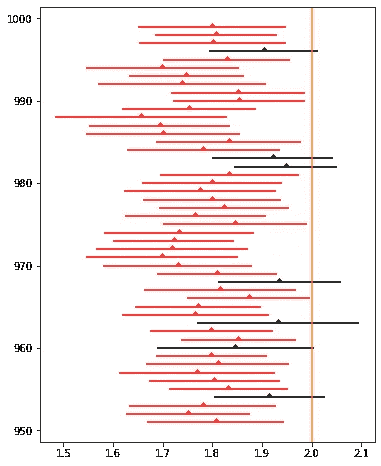

```
191/1000=0.19# not approximately normal dist
confidence_interval_mean_t(μ=2, σ=0.5, n=15, number_trials=1000, N=500, dist='not normal')
```

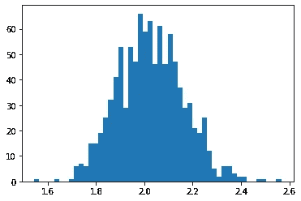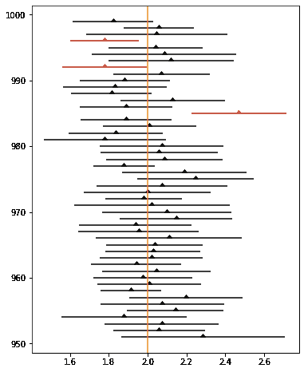

```
944/1000=0.94# not independent samples
confidence_interval_mean_t(μ=2, σ=0.5, n=150, number_trials=1000, N=600, dist='not normal')
```

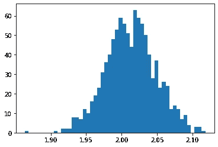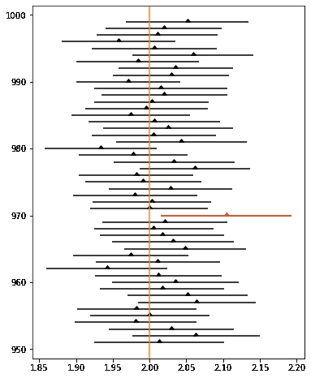

```
973/1000=0.97# Not normal distribution but n >= 30, so CTL applies; all other conditions are met
confidence_interval_mean_t(μ=2, σ=0.5, n=35, number_trials=1000, N=500, dist='not normal')
```

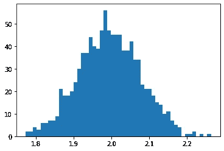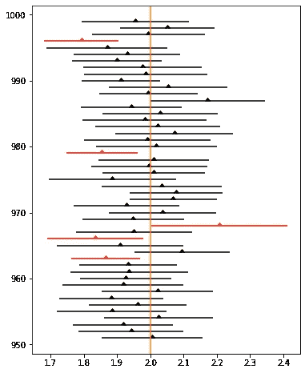

```
947/1000=0.95# Original distribution is normal; all other conditions are met
confidence_interval_mean_t(μ=2, σ=0.5, n=35, number_trials=1000, N=500)
```

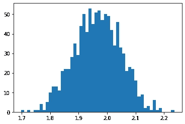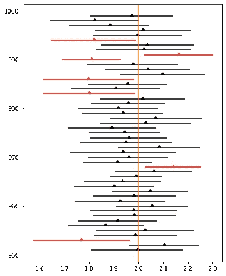

```
930/1000=0.93
```