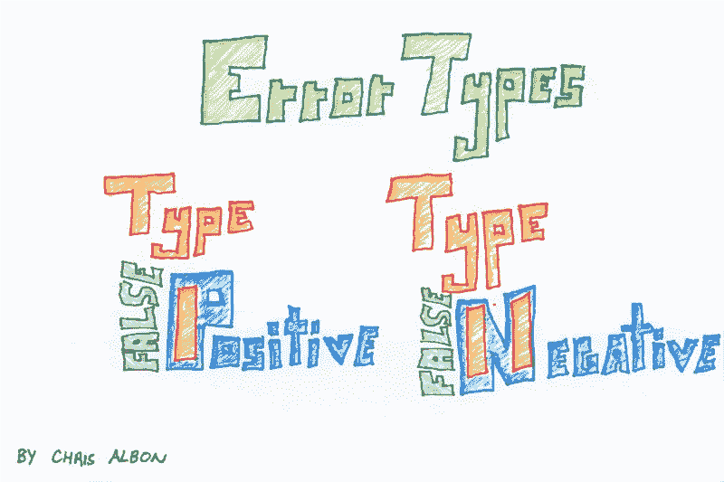

# 虽然最讨厌，显著性测试仍然是有用的

> 原文：<https://towardsdatascience.com/significance-testing-2e5a0e546b3a?source=collection_archive---------34----------------------->

## 即使在[复制危机](https://www.tandfonline.com/doi/full/10.1080/19466315.2020.1724560)之后，统计学意义仍然是数据科学家需要理解的一个重要概念

照片由来自 [Pexels](https://www.pexels.com/photo/action-adult-balance-balancing-415176/?utm_content=attributionCopyText&utm_medium=referral&utm_source=pexels) 的 [Pixabay](https://www.pexels.com/@pixabay?utm_content=attributionCopyText&utm_medium=referral&utm_source=pexels) 拍摄

有许多类型的统计检验 — **零假设显著性检验**占主导地位。

使用这种技术，目的是针对**无效假设**测试观察值。你可以把零假设当成现状。它代表干预不起作用的情况。

**显著性测试**上升到卓越的地位，因为它是一种对从大量人口中提取的数据子集进行推断的有用方法。本文将增强您对这种有用的数据科学技术的直觉。

## 概观

研究者进行零假设检验的目的是评估零假设是否可以被拒绝。这需要一个称为**显著性水平**或**α(⍺)**的概率阈值。该值通常设置为 0.05，代表拒绝干预无效的零假设所需的证据水平。

**0.05** 的显著性水平意味着如果我们运行测试 100 次，我们可以预期 100 次中有 5 次错误地拒绝零假设。换句话说，在没有实际效果的情况下，我们有 5%的时间错误地报告干预有效果。

为了使测试更加严格，研究人员只需将 alpha 值从标准的 0.05 降低到 0.01 或更低。不同的科学学科有不同的设定 alpha 的标准。在粒子物理学中，测量是非常精确的，alpha 可能被设置为 0.000001。相比之下，在社会科学中，0.05 的 alpha 值被认为是可以接受的。

## 拒绝零假设

假设检验导致 **p 值**的计算。在我定义这个术语之前，请观看一群统计学家试图这样做的视频:

 [## 那么，什么是 P 值呢？

### p 值在科学研究中真的很重要。但是科学家们知道它们是什么吗？

fivethirtyeight.abcnews.go.com](https://fivethirtyeight.abcnews.go.com/video/embed/56150342) 

欢迎回来，心情沉重的旅行者，来到由内特·西尔弗和团队揭露的奇异之地。你仍然*想要*一个 p 值的定义吗？

好吧，好吧:

> 假设零假设是正确的，得到结果的概率至少与观察到的结果一样极端*。*

作为研究人员斯图尔特·巴克的进一步解释:

> p 值不会告诉你硬币是否公平，但它会告诉你如果硬币是公平的，你得到的人头至少和你得到的一样多的概率。

记住这些技术和功能定义，让我们继续理解 p 值如何用于显著性检验。

p 值*小于或等于*α表示我们可以拒绝零假设，并说结果**具有统计显著性**。在这种情况下，证据有利于另一种假设——尽管我们绝不会说我们接受另一种假设——️️⛔️

没有。多亏了统计学，我们陷入了笨拙的双重否定:*我们* *拒绝零假设* ✅

这实际上非常重要，因为在科学上，基本上不可能证明干预是有效的。回想一下你三年级的科学老师解释重力只是一个理论——不管你多少次把书从桌子上摔下来，你都无法最终证明另一个假设,即重力起作用并且总是会让你的书落下。

当我们执行零假设显著性检验时，在评估零假设时，我们可能会犯两个潜在的错误。如果无效假设被错误地拒绝(*即我们认为疫苗是有效的，而事实上它不是*)，我们就犯了**1 型错误**—**假阳性**。相反，如果我们未能拒绝零假设，而事实上我们应该拒绝(*即我们认为疫苗无效，而事实上是*)，我们就犯了**2 型错误**—**假阴性**。

[克里斯·阿尔邦](https://medium.com/u/7d3f065c187e?source=post_page-----2e5a0e546b3a--------------------------------)创造了一个方便的图形来帮助我们区分这两者:

通过[机器学习抽认卡](https://machinelearningflashcards.com/)

## 显著性测试词汇

*   **假设**:基于观察数据可检验的陈述
*   **零假设**:被测效应等于零的默认假设
*   **显著性水平(⍺)** :研究者设置的阈值，代表当零假设为真时拒绝零假设的概率
*   **p 值**:在特定的统计模型下，数据的统计汇总(例如，两个比较组之间的样本均值差异)等于或大于其观察值的概率；如果 p ≤ ⍺，我们可以拒绝零假设，说结果是有统计学意义的
*   **替代假设**:与原假设相反
*   **第一类错误**:拒绝事实上为真的原假设；也称为*假阳性*
*   **第二类错误**:当原假设事实上为假时，未能拒绝原假设；同样*假阴性*

## 关于显著性检验的警告

请注意，零假设显著性检验的方法受到了攻击，原因有很多:

🔥首先，众所周知，p 值很难解释。将科学方法的基本概念建立在专家们难以表达而普通大众难以理解的概念上是很棘手的。

🔥第二，正如在这篇文章的描述中提到的，p 值在 2010 年代中期动摇社会科学的复制危机中发挥了作用。术语 [**p-hacking**](https://www.americanscientist.org/article/the-statistical-crisis-in-science) 是指操纵数据或分析直到 p 值符合统计显著性所需的小于α水平的做法。心理学家 Brian Nosek 的创意项目[再现性项目](https://osf.io/ezcuj/)显示，在 100 个被评估的心理学发现中，只有 36%在重复时产生了具有统计学意义的结果。

🔥第三，存在好的替代原假设显著性检验的方法，包括:**[**【置信区间】**](https://www.datasciencecentral.com/profiles/blogs/the-death-of-the-statistical-test-of-hypothesis)[**【有点精确的结果检验(SPOT)**](https://www.researchgate.net/publication/312395254_Releasing_the_death-grip_of_null_hypothesis_statistical_testing_p_05_Applying_complexity_theory_and_somewhat_precise_outcome_testing_SPOT) 。**

** [## 5 篇必读的数据科学论文(以及如何使用它们)

### 让您在数据科学领域保持领先的基本理念。

towardsdatascience.com](/must-read-data-science-papers-487cce9a2020) 

## 摘要

最后，我引用一下[安妮·杜克](https://medium.com/u/d3a7cb4ec992?source=post_page-----2e5a0e546b3a--------------------------------)的话，她是扑克冠军，也是*下注思考*的作者:

> 尽管人们普遍认为我们通过积极的想象获得成功，但事实证明，融入消极的想象会让我们更有可能实现我们的目标。

在生活中，就像在数据科学中一样，从我们的模型不起作用、我们的干预不起作用、现状不会被新事件打破的假设出发是有用的。

零假设显著性测试从这个前提开始，并要求研究者找到足够的证据来拒绝现状。尽管最令人讨厌，显著性测试仍然是数据科学家需要理解的一种有用的方法。** 

# **更多文章促进您的数据科学**

** [## 正态分布综合指南

### 顺便了解一些关于这一基本统计学概念如何提高您的数据科学的技巧。

towardsdatascience.com](/normal-distribution-160a93939248)  [## 如何使用聚类创建邻域浏览器工具

### 使用 sklearn 的聚类算法为您的城市创建交互式仪表板的分步演练。

towardsdatascience.com](/neighborhood-explorer-a7f374e8527d)  [## 新常态下的数据科学——来自一家 14 亿美元初创企业的教训

### 后 COVID 时代，机器学习对商业成功越来越重要。

towardsdatascience.com](/data-science-new-normal-ca34bcbad8f0)  [## 训练营里不会教的 10 项 Python 技能

### 使用这份编码技巧列表，在数据科学和机器学习方面提升到新的高度。

towardsdatascience.com](/10-python-skills-419e5e4c4d66)  [## 2021 年增强数据科学的资源

### 新的一年，机器学习成功所需的工具。

towardsdatascience.com](/supercharge-data-science-562d891ef7f9)**