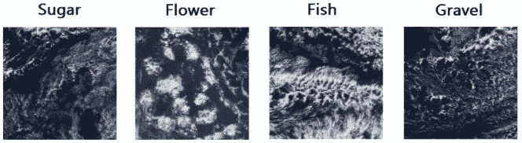
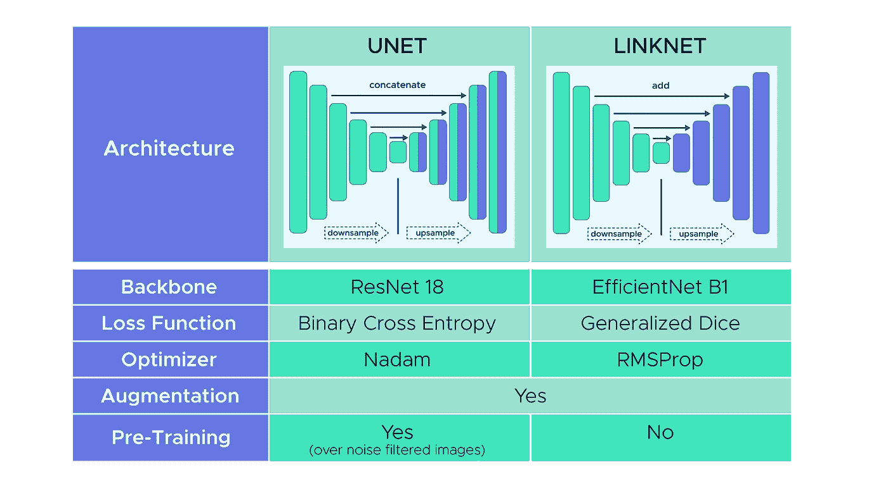
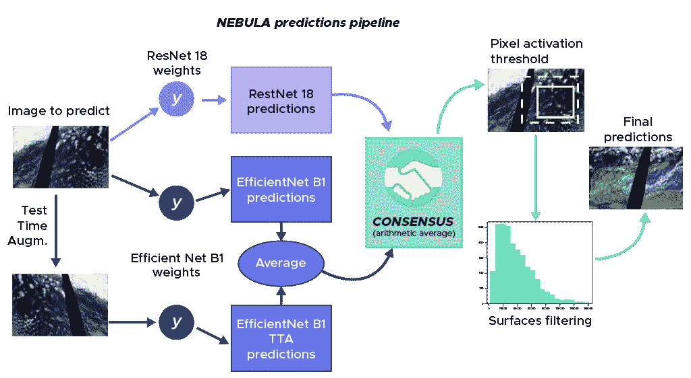
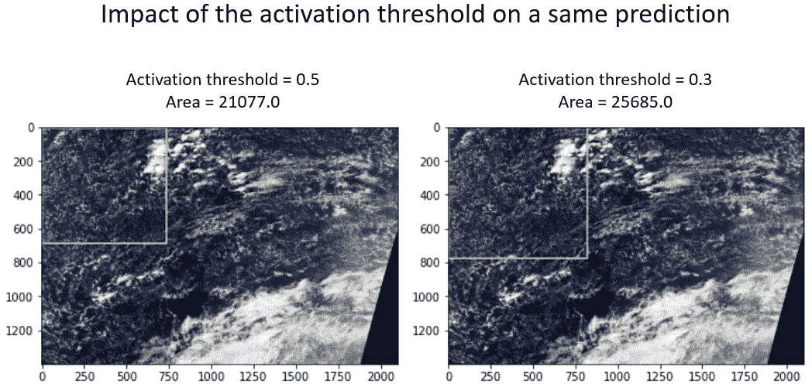
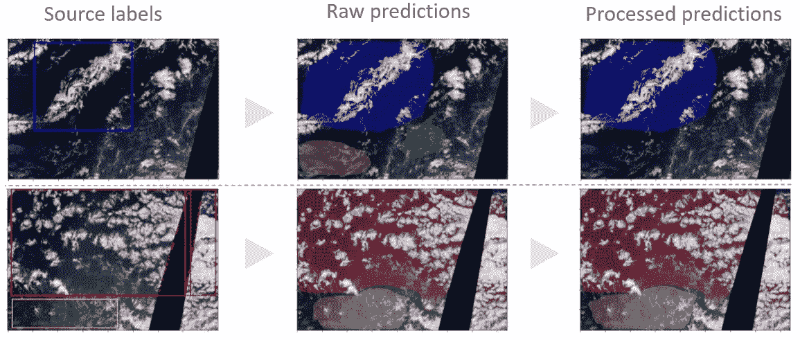
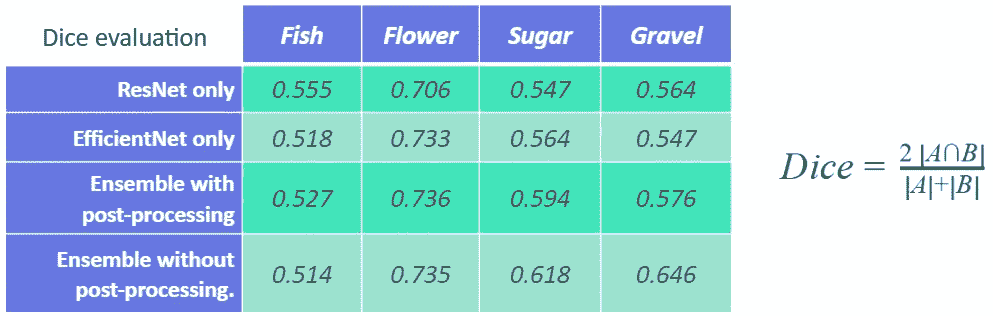
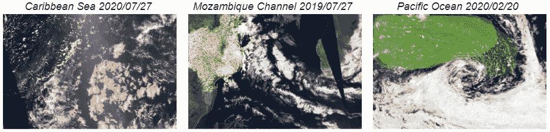

# 人工智能给云带来一线希望

> 原文：<https://towardsdatascience.com/silver-lining-clouds-with-ai-ff6a234786e2?source=collection_archive---------20----------------------->

## [思想和理论](https://towardsdatascience.com/tagged/thoughts-and-theory)

## 星云计划，通过卷积神经网络的云分割应用

***作者***

[扬恩·伯纳利](https://www.linkedin.com/in/yann-bernery-772a58112/)，[卢多维奇·钱翁](https://www.linkedin.com/in/ludovic-changeon-9047141b1/)，[凯茜·拜诺-萨姆森](https://www.linkedin.com/in/cathy-baynaud-samson-b2637817/)，[何塞·卡斯特罗](https://www.linkedin.com/in/jos%C3%A9-castro-7b62697b/)

来自 [Pexels](https://www.pexels.com) 的[詹姆斯·惠勒](https://www.pexels.com/@souvenirpixels)的照片

F 鱼、花、石子、糖……这绝不是随机盘点，而是云形成的命名。根据它们的形状命名，它们可能对地球气候理解有很大的兴趣。

这与这些浅云的矛盾特征有关:对地球辐射平衡的重要影响和不愿建模。早在 2019 年，马克斯·普朗克气象研究所就通过 Kaggle 比赛的方式向数据科学家社区发起了挑战。目标:在先前由一个专家小组标记的卫星图像上确定和定位上述四类云。实际的项目不是假装直接解决气候变化，尽管我们认为这有助于更好地理解气候。

美国宇航局在[地球观测系统数据和信息系统(EOSDIS)](https://worldview.earthdata.nasa.gov/) 上拍摄的照片，非版权材料

下面的文章将介绍这种图像分割情况的解决方案。有关基本假设，请参见参考资料。该项目及其成果是来自数据科学研究所的[数据科学家培训课程的一部分。](https://datascientest.com/formation-data-scientist)

本文末尾给出了关于数据集的更多信息。

您可以随意探索和使用演示来查看运行中的模型:[星云项目演示](https://studio.datascientest.com/project/nebula/)。

***分析局限性***

根据专家们对许多云形成的位置和性质的分歧，我们推断类别特征可能是模糊的。探索性分析证明我们是对的。无论是云的表面，还是图像的白色比例，都无法让我们确定每一类的特征。对图像灰度的分析最终说服我们将像素亮度分开。为了定位类别，我们需要在图像中寻找模式，并因此使用更智能的计算技术:卷积神经网络(又名 CNN)。

*内存限制迫使我们使用参数尽可能少的网络。通过迭代，我们选择了其中的两个:安装在 UNet 架构内的 ResNet 18 主干和安装在 LinkNet 架构内的 EfficientNet B1 主干。这两个模型分别计算 1400 万和 850 万个参数。该项目的一个核心思想是利用两种不同的模型，以建立各自的优势。在这个框架中，损失函数和模型优化器的选择与它们各自的体系结构不同。*

*下表总结了最终模型的主要特征。*

**

**作者图**

*在使用之前，所有图像都从 1400x2100 像素缩小到 320x480 像素，然后通过垂直和水平对称、10°以下旋转和伽马校正进行放大。这最后一次增强是特别选择来补偿在许多图像上明显的太阳步幅。第一个模型受益于在有限数量的时期内对噪声过滤图像的预训练阶段。这将有助于模型在主要训练期间关注低层云的特征。*

****这样美好的婚礼****

*对这两个模型的评估产生了接近的平均性能。每一个在某些职业中更强一点。因此，最终的预测来自于婚礼或共识。跨模型对每个像素属于一个类别的预测概率进行简单的算术平均。然而，似乎云模糊模式和硬件限制都需要纠正。这是通过两种后处理技术实现的:像素激活和表面滤波。*

**

*作者的预测管道图，NASA 在[地球观测系统数据和信息系统(EOSDIS)](https://worldview.earthdata.nasa.gov/) 上的照片，非版权材料*

****照亮我的像素****

*像素级别的预测通过其属于当前类别的概率来识别。默认阈值为 0.5，这意味着只要概率高于 50%，像素就属于该类。现在很容易理解云的形成有不同的结构:糖类似乎比鱼更稀疏。这导致糖的激活阈值较低，或者激活区域较宽。*

*通过对来自训练集的 30 批 64 幅图像进行采样来识别最佳阈值。*

**

*美国宇航局在[地球观测系统数据和信息系统(EOSDIS)](https://worldview.earthdata.nasa.gov/) 上拍摄的照片，非版权材料*

****清洁表面****

*从先前操作得到的掩模可以是从一个像素到整个图像的所有可能的尺寸。为了从实际的云中过滤数字伪影，详细阐述了校准操作。计算了一个简单且任意的规则，以避免在过度拟合数据时被当场抓住。基于训练集，为每个类确定第 15 个百分位数的表面大小。最后，删除所有低于阈值的预测曲面。*

****几个预测****

*考虑到一张图片胜过千言万语，我们收集了以下几个预测。第一行显示由于太小而被过滤的糖(黄色)和砾石(绿色)表面。第二行显示了 Sugar 类的轻微调整，这是由于降低了激活阈值。*

**

*美国宇航局在[地球观测系统数据和信息系统(EOSDIS)](https://worldview.earthdata.nasa.gov/) 上拍摄的照片，非版权材料*

****评估和结果****

*评估是基于一个保留的 224 图像集进行的，两个模型都不知道。评估综合如下表所示。*

**

**注:如结果表中所述，所选指标是骰子系数或 f1 分数**

*除了 Fish 类，我们可以看到模型集和后处理都提高了原始模型的个体性能。即使改进看起来很大，我们也要记住，测试是在有限的 224 个图像集上进行的。*

*作为奖励，Kaggle 竞赛的迟到提交确认了我们的方法性能，授予我们虚拟的第 74 位(在 1500 名贡献者中)。公开分数是 0.66173，而私下分数是 0.66016。*

*我们的策略在测试和训练数据集上显示了准确的结果。对完全不同的图像进行模型推断是我们进行的最后一项测试。在这个画面中，我们扫描了世界各地的其他地点。该模型能够识别它所训练的云，结果似乎是一致的。请看下面的几个例子。*

**

*美国宇航局在[地球观测系统数据和信息系统(EOSDIS)](https://worldview.earthdata.nasa.gov/) 上拍摄的照片，非版权材料*

*作为结论，我们提出所提出的解决方案在硬件限制方面是有效的。在目前的框架内，仍有可能进一步改进，因为仍存在许多轨道。例如，对在调整图像尺寸期间使用的图像插值方法进行彻底的分析，或者使用梯度累积技术以实现更密集的模型架构。最后，我们已经获得了强有力的证据，证明我们的模型有潜力进入上述 Kaggle 竞赛的前 10 名。*

****结论****

*从卫星图像中收集新数据，这些数据如此重要，以至于我们能够了解我们的星球，用类似人类的模式识别能力分析甚至最模糊的实体，如云，并将其应用于几乎无限量的图像…*

*所有这些都可以通过每个人都可以使用的深度学习技术来实现。与大数据相结合，一切都朝着卫星图像领域的重大扩展方向汇聚，这将极大地改善我们对环境的理解。*

****致谢****

*首先，我们要感谢整个 DataScientest 团队在过去几个月中提供的宝贵帮助和支持。*

*DataScientest.com 学院的数据科学家学位课程让我们获得了丰富多样的知识。这是在像现在这样的数据科学项目中保持自主和关键的先决条件。*

*我们的团队是由四个人组成的，彼此都不认识。由于地理距离和封闭，我们很少有机会见面，而且…我们还没有。在我们为期八个月的项目中，每个人的投资都是成功的关键。*

*成功的数据科学项目的另一个关键是数据管理。利用 Google Colab / Drive 作为主要平台，Github 作为笔记本和库的版本化工具，我们能够支持从最初的学习步骤到更复杂的最终步骤的整个项目。*

*我们感谢使用来自 NASA Worldview 的图像，这是 NASA 地球观测系统数据和信息系统(EOSDIS)的一部分。*

*最后但同样重要的是，感谢您的阅读。我们希望你和我们一样享受完成整个工作的经历。如需更多信息，请随时联系我们。*

****数据集****

*本文讨论的 Nebula 项目仅用于教育目的。*

*本项目使用的数据集可从 [Kaggle 竞赛主页](https://www.kaggle.com/c/understanding_cloud_organization/overview)获得。*

*数据选自三个地区，横跨 21 度经度和 14 度纬度。更多的细节可以从 Rasp，Schulz，Bony 和 Stevens 的研究中获得，在本文的参考文献部分提到[1]。*

*正如 Kaggle 数据描述中提到的，组成数据集的图像是从 [NASA Worldview](https://worldview.earthdata.nasa.gov) 下载的。因此，数据受制于以下条款和条件:[美国宇航局地球科学数据](https://earthdata.nasa.gov/earth-observation-data/data-use-policy)。*

****参考文献****

*[1] Rasp，Schulz，Bony 和 Stevens，[结合众包和深度学习探索浅对流的中观尺度组织](https://arxiv.org/abs/1906.01906) (2019)*