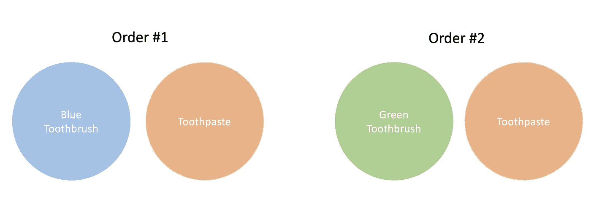
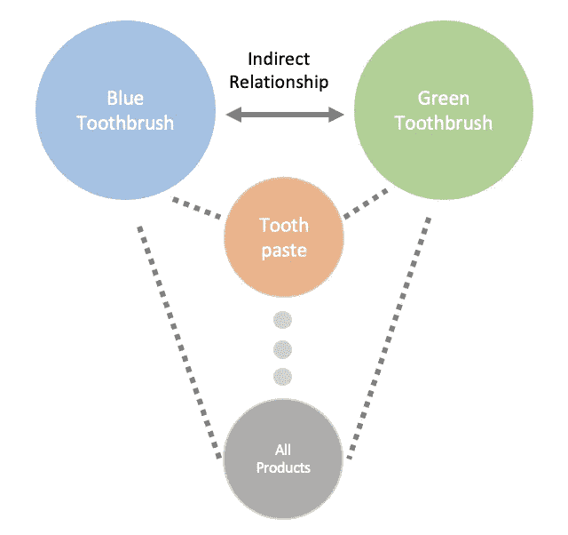
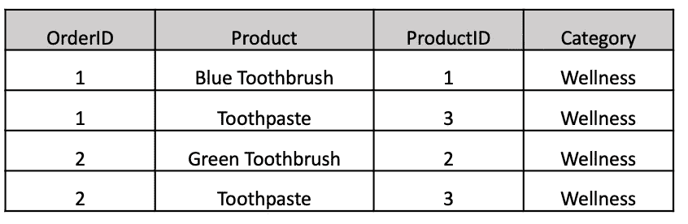
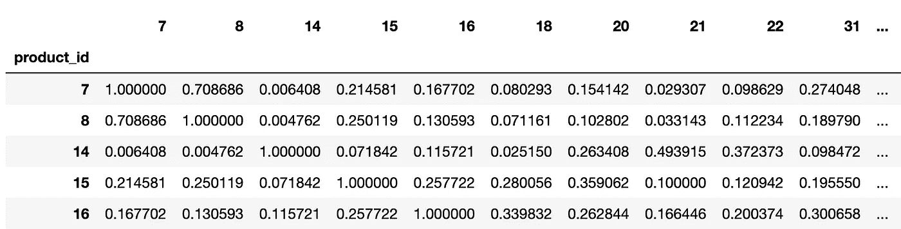

# 用你的销售数据建立一个产品推荐系统

> 原文：<https://towardsdatascience.com/similar-product-recommendations-data-to-deployment-970a085bafce?source=collection_archive---------5----------------------->


约翰·福勒在 [Unsplash](https://unsplash.com?utm_source=medium&utm_medium=referral) 上的照片

# **简介**

这是一篇分享我从头到尾实现一个产品推荐系统的帖子。我构建的推荐系统是基于条目-条目协同过滤的。我们将通过共生矩阵构建产品的多维向量表示，并通过所有产品向量之间的余弦相似性来寻找相似的产品。

在应用方面，该系统旨在为电子商务产品提供产品推荐。例如，当客户点击某个产品时，大多数网站会显示一个产品详情页面(PDP)，通常您可能会在该页面上看到更多共享的产品，标题为“*您可能也喜欢“*或*“类似产品”*。

# **概念**

**同现矩阵**

我不会深入到同现矩阵的细节，因为这是已经写了很多的东西。但是我将从概念上介绍共现矩阵是如何工作的，以及为什么我们可以使用它来创建类似产品的推荐系统。我们正在利用的数据只是客户订单数据，特别是我们感兴趣的是产品与其他产品一起购买的订单。

***简化示例***

在我们的简化示例中，我们在整个历史中只有两个订单:



作者图片

我们有 3 个独特的项目，两个不同颜色的牙刷都是独立购买的牙膏。利用这些信息，我们能够通过牙膏建立从蓝色牙刷到绿色牙刷的桥梁。



作者图片

现在想象一下，我们有成千上万的订单。你可能会认为两种颜色的牙刷都和牙线、漱口水等一起出现。我们可以利用这些产品的共现来构建目录中所有产品的多维向量表示。

**余弦相似度**

为了确定一个产品是否与另一个产品相似，我们从我们的共现矩阵中获取它们的向量表示之间的余弦相似性，并得到-1 和 1 之间的分数。分数为 1 表示向量方向相同，分数为-1 表示向量方向相反。你可以在这里找到余弦相似度[的细节。](https://en.wikipedia.org/wiki/Cosine_similarity)

# 数据

如前所述，我们的数据是客户订单数据。对于大多数数据集，您可能希望将一个订单级表连接到一个订单行级表，以便可以看到特定订单 id 中出现的所有项目。



作者图片

# 模型代码

*库依赖:*

```
import pandas as pd
import numpy as np
import s3fs
import json
from sklearn.metrics.pairwise import cosine_similarity
import datetime
```

首先以上面的格式加载您的客户订单数据，作为名为 *sales_df 的 pandas 数据框。*

加载数据后，您需要将数据转换为每行是一个订单，每列是一个产品，值是每个订单中产品的数量。*注意:pandas 会自动将 pivot 中的数据类型更改为 float64。如果你有内存方面的考虑，你可能想向下传输数据*

```
pivot_df = pd.pivot_table(sales_df,index = 'order_id',columns = 'product_id',values = 'category',aggfunc = 'count')pivot_df.reset_index(inplace=True)
pivot_df = pivot_df.fillna(0)
pivot_df = pivot_df.drop('order_id', axis=1)
```

接下来，我们通过获取数据透视表及其转置的点积，将数据透视表转换为共生矩阵。

```
co_matrix = pivot_df.T.dot(pivot_df)
np.fill_diagonal(co_matrix.values, 0)
```

为了将共现矩阵转换为我们产品之间的余弦相似度矩阵，我们利用了来自 *sklearn* 的*余弦相似度*函数。

```
cos_score_df = pd.DataFrame(cosine_similarity(co_matrix))
cos_score_df.index = co_matrix.index
cos_score_df.columns = np.array(co_matrix.index)
```



产品 x 产品余弦相似性得分

# 模型验证

与大多数无监督学习模型一样，模型验证可能很棘手。对于我们的数据集，我们有一组不同的产品类别。由于我们正在创建一个推荐器来显示类似的产品，我们应该期望我们的模型返回与原始基本产品在同一类别的推荐。

***针对每个产品类别:***

*计数(类别中每个产品的最佳推荐)/计数(类别中的产品)= %相同类别中的推荐*

***举例:***

我们为 735 种健康产品生成了建议，根据我们对每种健康产品的最佳余弦相似度，我们有 720 种建议属于健康类别，或 98%的同类建议。有了如此高比例的同类推荐，我们可以更加自信地认为，我们的购买数据中有一个强大的信号来推动我们的模型。

**下一步**

从这里开始，一旦我们将模型的第一个版本推广到生产，并开始 AB 测试，模型验证将继续进行。迭代模型时的一些参数调整考虑事项将有一个余弦相似性得分阈值或样本大小阈值，以将建议限制在我们有最高置信度的范围内。

# 部署

我们的部署过程相当简单。我们将带有前 n 条建议的 JSON 文件输出到 S3 桶中。这个 JSON 文件然后被我们的平台工程团队提取出来，并加载到 Postgres 数据库中，该数据库将用于前端产品服务。

*得分最高的五个推荐和 JSON 输出:*

```
#Take top five scoring recs that aren't the original productproduct_recs = []
for i in cos_score_df.index:
    product_recs.append(cos_score_df[cos_score_df.index!=i][i].sort_values(ascending = False)[0:5].index)

product_recs_df = pd.DataFrame(product_recs)
product_recs_df['recs_list'] = product_recs_df.values.tolist()
product_recs_df.index = cos_score_df.index#Semi-colon delimited JSON Outputproduct_recs_df['json_out'] = product_recs_df['recs_list'].apply(lambda x: [str(element) for element in x])
product_recs_df['json_out'] = product_recs_df['json_out'].apply(lambda x: ";".join(x))
product_recs_dict = product_recs_df.to_dict()
json_out = json.dumps(product_recs_dict['json_out'],indent = 4,ensure_ascii = False).encode('UTF-8')
```

*将 JSON 输出到 S3 桶:*

```
ts = datetime.datetime.now().strftime("%Y-%m-%d_%H-%M")fs = s3fs.S3FileSystem(key=s3_key, secret=s3_value)
with fs.open('s3://yourbucket/key'+ts+'.json', 'wb') as f:
    f.write(bytes(json_out))
```

# 结论

因此，我们已经为类似产品创建了一个端到端的产品推荐系统，只需使用历史销售数据。对于所有模型，模型输出的质量将取决于数据的质量。一般来说，每种产品的订单样本越大越好；因为我们期望在较大的样本量下减少来自随机产品共现的噪声。要为您的模型找到正确的样本大小阈值，您可以在不同的样本阈值下评估模型验证指标*(同一类别中建议的百分比)*，以查看在哪个阈值下评估指标开始出现有意义的下降。