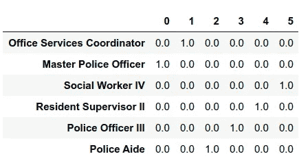
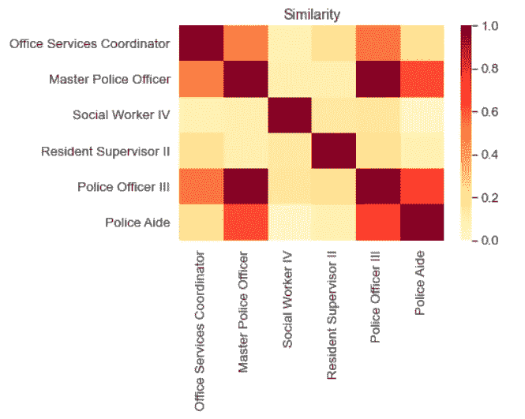
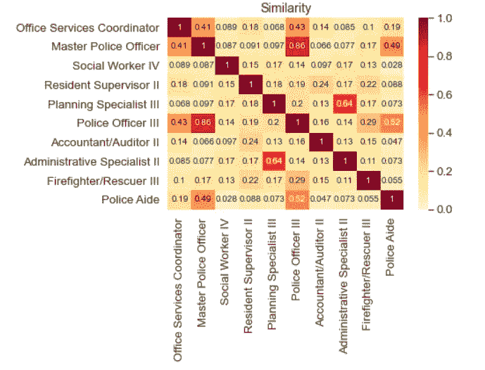
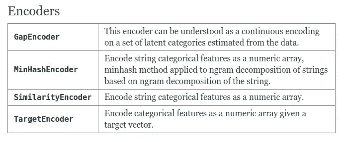

# 使用 dirty_cat 对脏类别进行相似性编码

> 原文：<https://towardsdatascience.com/similarity-encoding-for-dirty-categories-using-dirty-cat-d9f0b581a552?source=collection_archive---------14----------------------->

## [实践教程](https://towardsdatascience.com/tagged/hands-on-tutorials)

## 在对脏类别进行编码时，这是一种比一键编码更好的替代方法


作者图片

# 动机

假设您的任务是预测蒙哥马利县员工的工资。你的`employee_position_title`专栏看起来像这样:

```
Office Services Coordinator
Master Police Officer
Social Worker IV
Resident Supervisor II
Police Officer III
Police Aide
```

由于许多机器学习算法只处理数字数据，因此将`employee_position_title`变量转换为数字形式非常重要。

为此，一种常见的方法是使用一键编码来处理名义数据。当应用独热编码时，每个类别将被表示为 0 和 1 的数组。

例如，在下表中，`Office Service Coordinator`被表示为`[0,1,0,0,0,0]`。`Master Police Officer`表示为`[1,0,0,0,0,0]`。



作者图片

然而，单热编码不能捕捉脏类别之间的相似性，例如`Master Police Officer`和`Police Officer III`。

有没有一种方法，我们可以编码这些类别，同时捕捉它们之间的相似之处，如下所示？这时 dirty_cat 的相似性编码就派上用场了。



作者图片

# 什么是 dirty_cat？

[dirty_cat](https://dirty-cat.github.io/stable/) 帮助对脏类别进行编码。脏分类数据可以是:

*   拼写错误(*技术人员*而不是*技术人员*
*   额外信息(职位和级别*首席警官*，而不仅仅是职位*警官*
*   缩写(*高级*代替*高级*
*   级联分层数据(*国家-州-城市* vs *州-城市*)

在本文中，我将向您展示如何使用 dirty_cat 对脏类别应用相似性编码。要安装 dirty_cat，请键入:

```
pip install dirty_cat
```

# 相似性编码

## 开始

首先导入 employee _ salaries 数据集，该数据集包含蒙哥马利县 9000 多名雇员的年薪信息。

请注意，`employee_position_title`中的一些类别如`Accountant/Auditor I`和`Accountant/Auditor II`是相似的。为了捕捉脏类别之间的相似性，我们将使用 dirty_cat 的`SimilarityEncoder`。

让我们使用`SimilarityEncoder`对`employee_position_title`列的前 10 行进行编码。

```
array(['Office Services Coordinator', 'Master Police Officer',
       'Social Worker IV', 'Resident Supervisor II',
       'Planning Specialist III', 'Police Officer III',
       'Accountant/Auditor II', 'Administrative Specialist II',
       'Firefighter/Rescuer III', 'Police Aide'], dtype=object)
```

```
array([[0.05882353, 0.03125   , 0.02739726, 0.19008264, 1\.        ,
        0.01351351, 0.05555556, 0.20535714, 0.08088235, 0.032     ],
       [0.008     , 0.02083333, 0.056     , 1\.        , 0.19008264,
        0.02325581, 0.23076923, 0.56      , 0.01574803, 0.02777778],
       [0.03738318, 0.07317073, 0.05405405, 0.02777778, 0.032     ,
        0.0733945 , 0\.        , 0.0625    , 0.06542056, 1\.        ],
       [0.11206897, 0.07142857, 0.09756098, 0.01574803, 0.08088235,
        0.07142857, 0.03125   , 0.08108108, 1\.        , 0.06542056],
       [0.04761905, 0.3539823 , 0.06976744, 0.02325581, 0.01351351,
        1\.        , 0.02      , 0.09821429, 0.07142857, 0.0733945 ],
       [0.0733945 , 0.05343511, 0.14953271, 0.56      , 0.20535714,
        0.09821429, 0.26086957, 1\.        , 0.08108108, 0.0625    ],
       [1\.        , 0.05      , 0.06451613, 0.008     , 0.05882353,
        0.04761905, 0.01052632, 0.0733945 , 0.11206897, 0.03738318],
       [0.05      , 1\.        , 0.03378378, 0.02083333, 0.03125   ,
        0.3539823 , 0.02631579, 0.05343511, 0.07142857, 0.07317073],
       [0.06451613, 0.03378378, 1\.        , 0.056     , 0.02739726,
        0.06976744, 0\.        , 0.14953271, 0.09756098, 0.05405405],
       [0.01052632, 0.02631579, 0\.        , 0.23076923, 0.05555556,
        0.02      , 1\.        , 0.26086957, 0.03125   , 0\.        ]])
```

## 解释

请注意，输出中有 10 行和 10 列，这表示不同类别对之间的相似性。这有点类似于一键编码，但是相似性编码采用 0 和 1 之间的值**，而不是二进制值 0 或 1。**

**相同的字符串**将具有等于 1 的**相似度**，非常不同的字符串将具有接近 0 的**相似度。为了更好地理解这种关系，我们来形象化一下。**



作者图片

从上面的矩阵中我们可以看出，

*   相同的字符串如`Office Services Coordinator`和`Office Services Coordinator`之间的相似度为 1
*   有些相似的字符串如`Office Services Coordinator`和`Master Police Officer`之间的相似度为 0.41
*   两个非常不同的字符串如`Social Worker IV`和`Polic Aide`之间的相似度是 0.028

看起来相似性编码很好地捕捉到了每一对类别之间的相似性！两个字符串的差异越大，它们的相似性得分就越小。

# 一次性编码与相似性编码

现在，让我们比较一次性编码和相似性编码在预测雇员工资方面的性能。

为此，我们将对`employee_position_title`列应用两种不同的编码方法，即**一次性编码**和**相似性编码**。

我们使用一键编码来编码干净的分类列，如`gender`、`department_name`、`assignment_category`，并保持数字列`Year First hired`不变。

[源代码](https://dirty-cat.github.io/stable/auto_examples/02_fit_predict_plot_employee_salaries.html#sphx-glr-auto-examples-02-fit-predict-plot-employee-salaries-py)

然后我们使用`ColumnTransformer`将这些处理方法应用到每一列。

[源代码](https://dirty-cat.github.io/stable/auto_examples/02_fit_predict_plot_employee_salaries.html#sphx-glr-auto-examples-02-fit-predict-plot-employee-salaries-py)

现在我们将创建两个管道，一个使用一热编码，另一个使用相似编码来编码`employee_position_title`列。然后用`cross_val_score`来评估各个管道的性能。

[源代码](https://dirty-cat.github.io/stable/auto_examples/02_fit_predict_plot_employee_salaries.html#sphx-glr-auto-examples-02-fit-predict-plot-employee-salaries-py)

```
one-hot encoding
r2 score:  mean: **0.856**; std: 0.034

similarity encoding
r2 score:  mean: **0.915**; std: 0.012
```

酷！使用相似性编码的流水线的 R 分数比使用一位热码编码的流水线高 0.059。

# dirty_cat 是否提供其他编码方式？

是啊！还有其他的编码方法，我不能在这里介绍，包括`GapEncoder`、`MinHashEncoder`和`TargetEncoder`。我鼓励您在 [dirty_cat 的文档中阅读更多关于它们的内容。](https://dirty-cat.github.io/stable/)



作者图片

# 结论

恭喜你！您刚刚学习了如何使用 dirty_cat 的`SimilarityEncoder`对脏分类特征进行编码。下一次当你看到肮脏的分类列时，你就不会害怕它们，知道该怎么做了。

随意发挥，并在这里叉这篇文章的源代码:

[](https://github.com/khuyentran1401/Data-science/blob/master/feature_engineering/dirty_cat_example/employee_salaries.ipynb) [## khuyentran 1401/数据科学

### 有用的数据科学主题以及代码和文章的集合- khuyentran1401/Data-science

github.com](https://github.com/khuyentran1401/Data-science/blob/master/feature_engineering/dirty_cat_example/employee_salaries.ipynb) 

我喜欢写一些基本的数据科学概念，并尝试不同的算法和数据科学工具。你可以在 LinkedIn 和 Twitter 上与我联系。

如果你想查看我写的所有文章的代码，请点击这里。在 Medium 上关注我，了解我的最新数据科学文章，例如:

[](/human-learn-create-rules-by-drawing-on-the-dataset-bcbca229f00) [## 人类学习:通过绘图创建人类学习模型

### 使用您的领域知识来标记您的数据

towardsdatascience.com](/human-learn-create-rules-by-drawing-on-the-dataset-bcbca229f00) [](/introduction-to-weight-biases-track-and-visualize-your-machine-learning-experiments-in-3-lines-9c9553b0f99d) [## 权重和偏差介绍:用 3 条线跟踪和可视化你的机器学习实验…

### 无缝比较不同的实验，并使用 Python 重现您的机器学习实验

towardsdatascience.com](/introduction-to-weight-biases-track-and-visualize-your-machine-learning-experiments-in-3-lines-9c9553b0f99d) [](/how-to-create-mathematical-animations-like-3blue1brown-using-python-f571fb9da3d1) [## 如何使用 Python 创建类似 3Blue1Brown 的数学动画

### 利用您的 Python 技能创建美丽的数学动画

towardsdatascience.com](/how-to-create-mathematical-animations-like-3blue1brown-using-python-f571fb9da3d1) [](/streamlit-and-spacy-create-an-app-to-predict-sentiment-and-word-similarities-with-minimal-domain-14085085a5d4) [## Streamlit 和 spaCy:创建一个应用程序来预测情绪和单词的相似性，最小域…

### 只需要 10 行代码！

towardsdatascience.com](/streamlit-and-spacy-create-an-app-to-predict-sentiment-and-word-similarities-with-minimal-domain-14085085a5d4) 

# 参考

切尔达大学、瓦洛夸大学和凯格尔大学(2018 年)。脏分类变量学习的相似性编码。*机器学习，**107*(8–10)，1477–1494。doi:10.1007/10994–018–5724–2