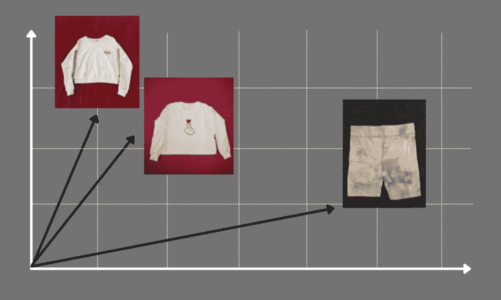
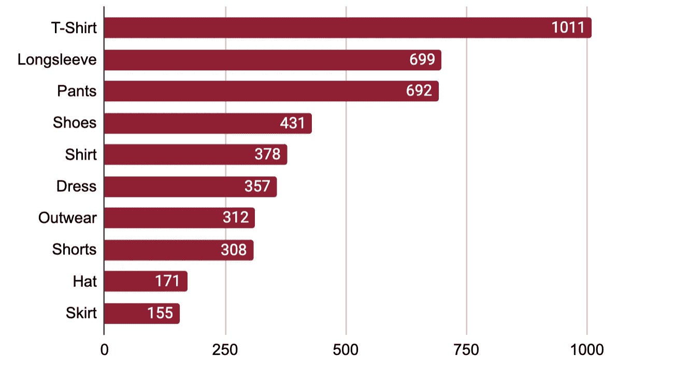
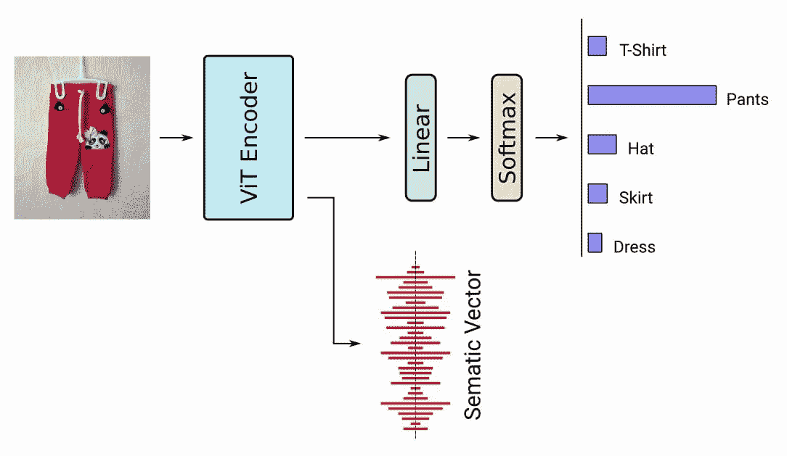
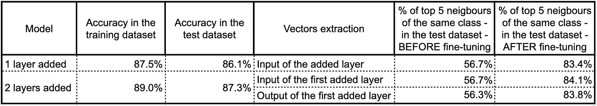
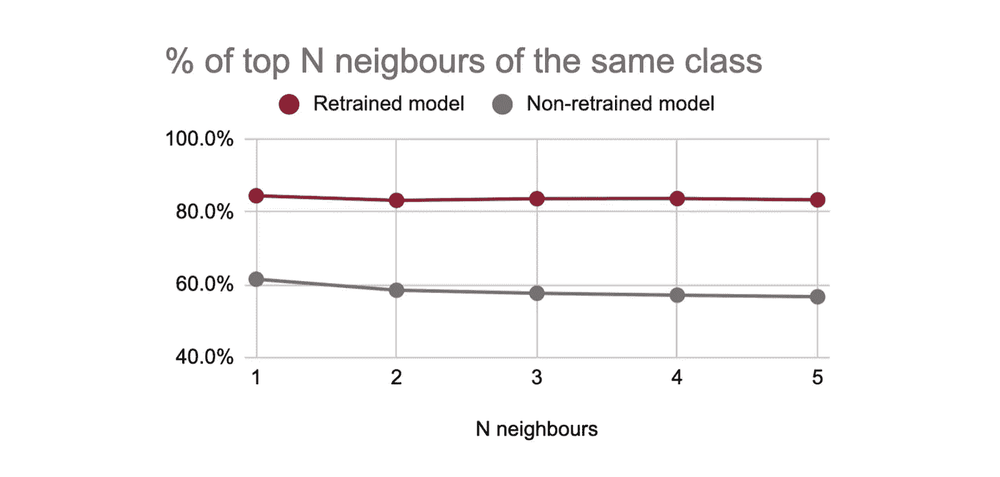
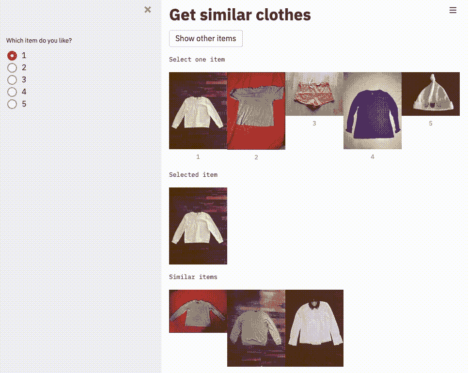
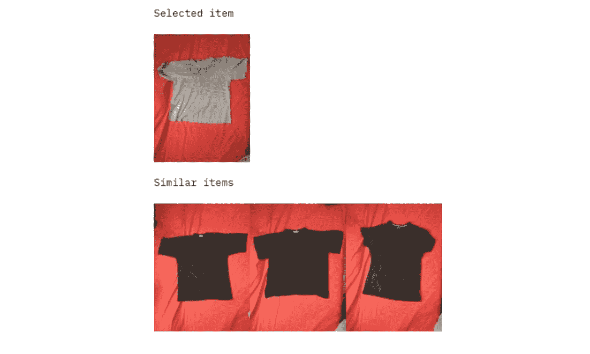

# 服装相似性学习:从零开始构建 web 服务

> 原文：<https://towardsdatascience.com/similarity-learning-for-clothing-building-a-web-service-from-scratch-350216830e21?source=collection_archive---------21----------------------->

## 涵盖从建模到部署的所有内容的简要指南

[自由股票](https://unsplash.com/@freestocks?utm_source=medium&utm_medium=referral)在 [Unsplash](https://unsplash.com?utm_source=medium&utm_medium=referral) 上的照片

## 动机

我曾多次想到可以找到相似衣服的神奇工具，这令人担忧。

让我们想象一种情况:你正在 Instagram 上滚动，突然看到一件惊艳的大衣。如果有一个“我想要这件外套”的按钮，Instagram 商店可以向你推荐这件外套以及一系列类似的外套，也许你会更喜欢。最重要的是，如果你能通过价格范围和品牌来筛选它们，并获得完整的网上购物体验，会怎么样？

也许我根本不用担心。有时候，当我在网上购物时，我唯一需要的就是有人或事来理解我和我的时尚需求。

> 如果您想获得数据科学方面的端到端经验，请阅读本文并查看 GitHub 上的[项目。您将练习从神经网络建模到 docker 部署的所有内容。](https://github.com/tatiana-grech/similar-clothes)

## 什么是相似性

在我的例子中，物品或衣服的特征，比如颜色、形状、类型，可以用数值来表示，它们一起形成一个向量。因此，我们可以构建一个向量空间，其中每一项都有一个对应的向量。

对象的“相似性”将简单地由该空间中这些对象之间的距离来定义。它们之间的距离越小，它们就越相似或相关。

2D 空间中向量的简化可视化，我*作者*的图像

## **项目的理念**

该项目旨在尽可能简单地实施。因此，为了构建图像向量，我会重新训练一个预先训练好的模型。为了向量存储和相似向量的搜索，我将应用向量搜索引擎。一个简单的 web 界面将建立在一个应用程序框架上，而后端将基于一个用于构建 API 的 web 框架。最后，整个项目将使用 Docker 容器部署在虚拟机上。乍一看，这可能听起来让人不知所措，然而，这并不困难，只需要一步一步地去做。

## 项目阶段:从想法到应用

关键阶段如下所示:

1.  查找数据集
2.  寻找相关的变压器型号
3.  重新训练模型并评估它
4.  将模型应用于所有数据并提取数据集的向量
5.  编码前端和后端，使一个简单的网络界面
6.  在虚拟机上部署项目。

让我们从第一阶段开始，然后进行其余的。

1 该数据集位于介质上，包含 20 类服装的 5000 张图片。从鞋子到帽子。前 10 个类每个都包含至少 150 个项目。

关于它是如何被收集的更多细节在[的文章](https://medium.com/data-science-insider/clothing-dataset-5b72cd7c3f1f)中。

前 10 个类别的每个类别中出现的项目数，按作者排序的图像

2 Vision Transformer (ViT)是一个基于 Transformer 架构的视觉模型，最初是为基于文本的任务设计的(你可能听说过 BERT)。这是一个非常新的模型，发布于 2020 年 12 月。更多细节在这里。

未经培训，通常不会使用变压器模型。从转换器中直接提取的嵌入或向量可能包含大量不同的参数，对于您正在解决的特定问题，其中一些参数可能比其他参数更重要。

因此，这种模型需要重新训练或微调。根据[笔记本](https://colab.research.google.com/github/NielsRogge/Transformers-Tutorials/blob/master/VisionTransformer/Fine_tuning_the_Vision_Transformer_on_CIFAR_10_with_the_%F0%9F%A4%97_Trainer.ipynb#scrollTo=JDefWdsUxEsK)中介绍的方法，我想出了以下再培训方案。

再培训计划，作者形象

该模型在预训练的 ViT 模型上使用了线性层。因此，我在[CLS]令牌的最后一个隐藏状态上放置了一个线性层，它很好地表现了整个图像。此外，辍学是为了正规化而增加的。最后一层返回属于某个类别的概率。所添加的线性层的输入可以准确地用作相似性搜索中的对象向量。

> 模特再培训的完整脚本可在[笔记本](https://colab.research.google.com/drive/17ftAEdu7diEavKGl5DbYFPFvuGKWp_2X#scrollTo=Ny9dBF89DlY0)中找到。

对于模型评估，我使用了两个指标:

*   比较训练数据集中和测试数据集中的准确性，
*   比较了微调前后属于同一类的前 N 个邻居的百分比。

我还试验了一些图层的添加和矢量提取。

评估表，作者图片

重新训练(微调)transformer 模型增加了最接近项目的类中的“相似性”:“属于同一类的前 5 个邻居的百分比”从 56.7%提高到 83.4%。

在 ViT 顶部添加 1 个线性层的模型的类别中的“相似性”,图片由作者提供

在模型上增加一个额外的线性层并没有改善任何指标。此外，在重新训练过程中，变压器的权重以及添加层中的权重都进行了调整。由于这个事实，我可以使用添加层的输入作为“相似性”搜索中对象的向量。

在本文的其余部分，我将只提到在预训练模型之上添加了一个线性层的模型。

为了保存添加的线性层的输入，我使用了一个向前的钩子。关于如何使用它的详细指南在[文章](/the-one-pytorch-trick-which-you-should-know-2d5e9c1da2ca)中提供。

5 为了制作一个简单的网络界面，使用了这个[文档](https://testdriven.io/blog/fastapi-streamlit/)。这项工作包括在本地机器上进行的以下步骤:

*   使用 [Streamlit](https://streamlit.io/) 创建了一个简单的界面来显示图像和维护图像选择。

*   我已经在 docker 容器中运行了 [Qdrant](https://qdrant.tech/documentation/quick_start/) (矢量搜索引擎)，创建了一个集合，并在那里添加了矢量。

*   后端部分使用 [FastAPI](https://fastapi.tiangolo.com/) 编码，包含搜索请求。

*   类似对象的呈现被添加到前端脚本中。

*   前端和后端都是在没有 dockers 的情况下调试的
*   添加了 Docker 文件和 docker-compose.yml，在后者中，我描述了所有的服务和依赖项。有 3 种服务:后端、前端和 qdrant。

*   我确保所有东西都在本地机器上工作，然后将项目推送到 GitHub 仓库，进入下一个阶段。

6 在虚拟机上部署项目包括以下步骤:

*   在 Amazon Web Services 上预订免费的 Linux 机器，并添加 HTTP 连接
*   将 images 和 vectors.json 从本地机器上传到虚拟机。
*   运行 docker for Qdrant 并使用 vector.json 中的点创建集合。但是，集合可以直接从本地机器上传。
*   从 GitHub 克隆存储库，调整 python 脚本和 docker-compose.yml。
*   构建和运行 docker-compose。
*   享受网络界面。

## **结果**

[网页](http://18.170.226.244/)包括:

*   5 件随机衣服的图片
*   项目选择器
*   所选项目的图像(默认情况下是第一个项目)
*   三件最相似的衣服的图片。

当你选择了一些你喜欢的物品时，页面会显示所选择的物品以及三个最相似的物品。如果你不喜欢任何赠送的衣服，只需点击“显示其他项目”，你会看到其他 5 个项目。即使是我们当中最挑剔的人，我们也希望你不会花太多时间找到真正特别的东西！

相似衣服搜索的网络服务，Gif 作者

# 下一个视角

类似的衣服有些单品不好看。例如，黑色 t 恤被识别为与灰色 t 恤相似，即使数据集中还有其他灰色 t 恤。我认为背景颜色在这种情况下可能起着关键作用。

表现不好的例子，图片作者

显然，这个模型可以通过对比学习来改进。如果手动选择的“错误”对在数据中被标记，模型可以并且应该学会忽略图像上的背景。

此外，搜索类似的项目可以实现一个全新的项目！只需将模型应用于新图像，接收相应的向量，并在当前基础上运行搜索。从编码角度来看，将这一功能添加到应用服务中非常容易。

如果我有一个网上商店，我也可以实现搜索类似的服装与基本的过滤器，如价格，品牌，交货时间，等等。这就是搜索变得更加有效和精确的原因。请注意，我使用的矢量搜索引擎支持在搜索中应用过滤器。

说了这么多……我相信，通过对我们零售习惯的理解，在人工智能的支持下，网上购物的未来将会得到显著改善。

## 在这个项目中，我学到了什么

对我来说，这是一次非常紧张和富有成效的旅程。我第一次用变形金刚。我第一次部署了 web 服务。以下是我想与你分享的重大发现:

1.  最好在本地计算机上调试模型训练，但是在 Google Colab 上训练一个模型。将图像上传到 Colab 需要一段时间，而在本地机器上训练模型则非常耗时。此外，我在 Colab 中对模型进行训练后下载了该模型，并将其应用于本地机器上提取向量。
2.  微调变压器时，会修正变压器层中的权重。我认为只有增加的层被训练。但是变压器内部也在发生变化。然而，可以配置设置，不允许变压器层改变。
3.  Streamlit 框架不能用于跟踪图片的点击，这就是我使用侧边栏解决方案的原因。该框架也有一些优点，例如，它有一个不错的移动版本，没有任何编码。
4.  Docker 合成是部署中最棘手的部分。原来，从前端到后端的请求可以在 mac 机器上工作，但不能在 amazon ec2 机器上工作。所以它需要一些调整，幸运的是，Linux 的解决方案在 Mac OS 上也能工作。