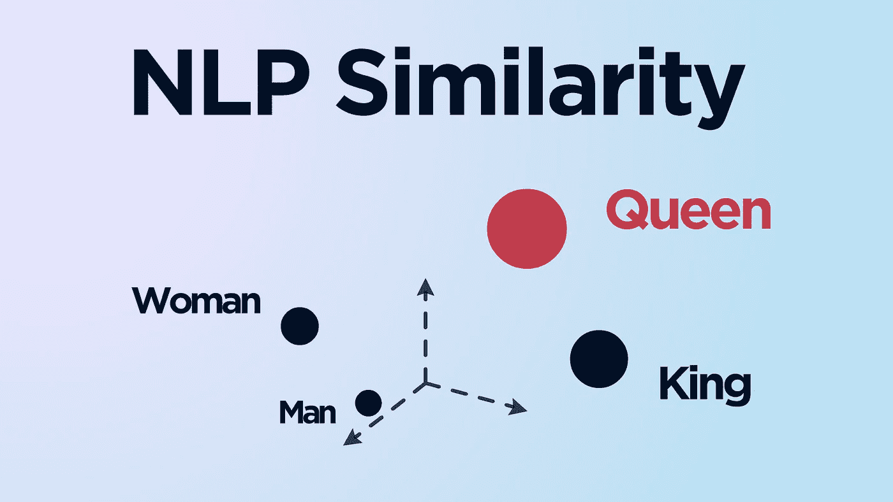
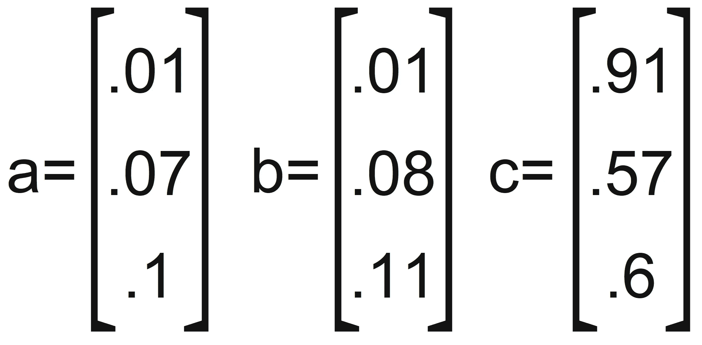
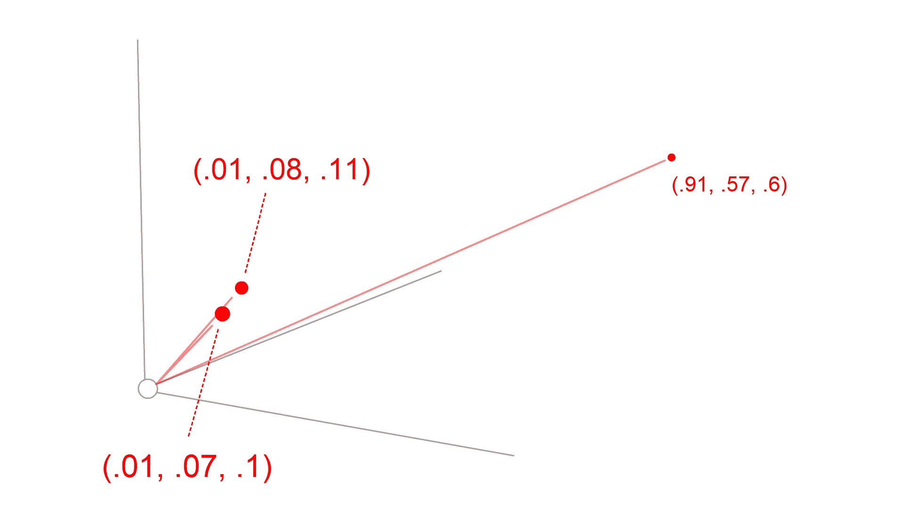
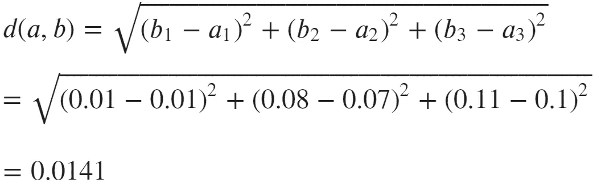
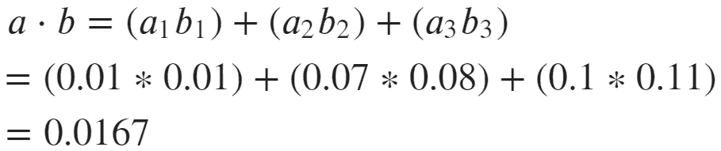
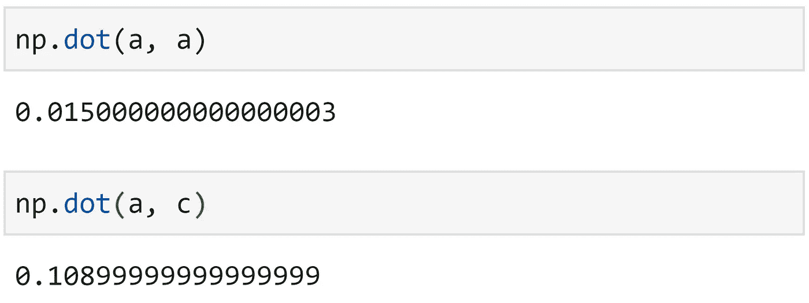
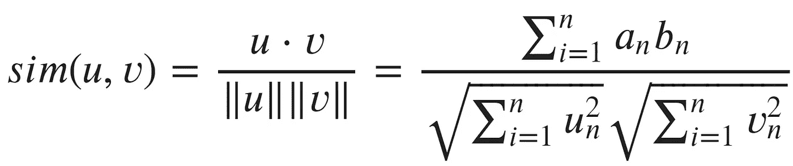
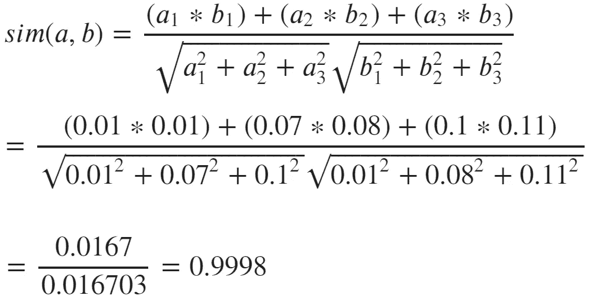
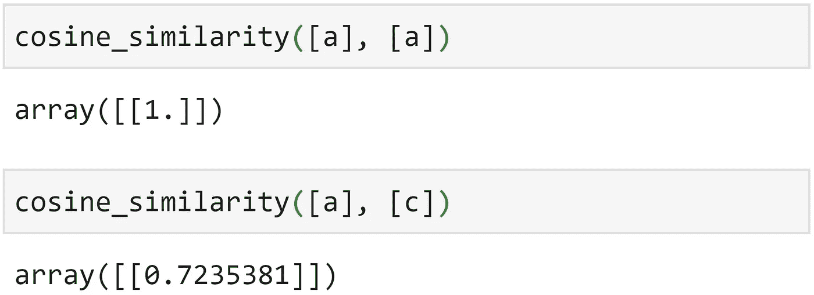

# 自然语言处理中的相似性度量

> 原文：<https://towardsdatascience.com/similarity-metrics-in-nlp-acc0777e234c?source=collection_archive---------13----------------------->

## 欧几里德距离、点积和余弦相似度

作者图片

当我们将语言转换成机器可读的格式时，*标准的*方法是使用密集向量。

神经网络通常生成密集向量。它们允许我们将单词和句子转换成高维向量——组织起来使得每个向量的几何位置都可以赋予意义。

众所周知的语言算术例子表明**女王=国王——男人+女人**

有一个特别有名的例子，我们取*国王*的向量，减去向量*男人*，加上向量*女人*。与合成向量最接近的匹配向量是*皇后*。

我们也可以将同样的逻辑应用于更长的序列，比如句子或段落——我们会发现，相似的意思对应于这些向量之间的接近度/方向。

所以，相似性是很重要的——我们将在这里介绍计算相似性的三个最常用的指标。

# 欧几里得距离

欧几里德距离(通常称为 L2 范数)是最直观的度量。让我们定义三个向量:

三个向量示例

仅仅通过观察这些向量，我们就可以自信地说 **a** 和 **b** 彼此更近——当我们在图表上可视化每个向量时，我们会看到这一点更加清晰:

矢量 **a** 和 **b** 离原点很近，矢量 **c** 远得多

显然， **a** 和 **b** 靠得更近，我们使用欧几里得距离计算:

欧几里德距离公式

为了将这个公式应用于我们的两个向量， **a** 和 **b，**我们做:

计算矢量 **a** 和 **b** 之间的欧几里德距离

并且我们得到距离 **0.014** ，对 **d(a，c)** 返回 **1.145** ， **d(b，c)** 返回 **1.136** 进行同样的计算。显然， **a** 和 **b** 在欧氏空间中更近。

# 点积

欧几里得距离的一个缺点是在计算中没有考虑方向，它仅仅基于大小。这是我们可以使用其他两个指标的地方。第一个是点积。

点积考虑方向(方位),也与矢量幅度成比例。

我们关心方向，因为相似的意思(我们经常会发现)可以用向量的方向来表示——不一定是向量的大小。

例如，我们可能会发现向量的大小与它在数据集中代表的单词的频率相关。现在，单词 **hi** 的意思与 **hello** 相同，如果我们的训练数据包含单词 **hi** 1000 次，而 **hello** 只有两次，这可能不会被表示出来。

因此，向量的方向通常被认为和距离一样重要(如果不是更重要的话)。

点积的计算公式如下:

点积公式

点积考虑向量之间的角度，其中角度为~0，公式的 **cosθ** 分量等于~1。如果角度接近 90 度(正交/垂直)，则 **cosθ** 分量等于~0 度，而在 180 度时 **cosθ** 分量等于~-1 度。

因此， **cosθ** 分量增加了两个向量之间角度较小的结果。因此，更高的点积与更高的方向相关。

同样，让我们将这个公式应用于我们的两个向量， **a** 和 **b** :

计算矢量 **a** 和 **b** 的点积

显然，点积计算很简单(三者中最简单的)，这在计算时间方面给我们带来了好处。

然而，有一个缺点。它不是归一化的，这意味着较大的矢量倾向于获得较高的点积，尽管不太相似。

例如，如果我们计算**a a**——我们会期望比 **a c** 更高的分数( **a** 与 **a** 完全匹配)。但不幸的是，事情并非如此。

当向量大小不同时，点积就没那么大了。

因此，实际上，点积用于确定两个向量的大致方向，因为:

*   指向相似方向的两个向量返回一个正的**点积。**
*   两个垂直向量返回**零**的点积。
*   指向相反方向的向量返回一个负的点积。

# 余弦相似性

余弦相似性考虑矢量方向，与矢量大小无关。

余弦相似公式

在这个公式中，我们应该注意的第一件事是，分子实际上是点积——它同时考虑了*大小*和*方向*。

在分母中，我们有奇怪的双竖线——这意味着*‘长度’*。因此，我们将 **u** 的长度乘以 **v** 的长度。长度当然要考虑*量级*。

当我们采用一个考虑*大小*和*方向*的函数，并将其除以一个只考虑*大小*的函数时，这两个*大小*相互抵消，留给我们一个考虑*方向* **与大小**无关的函数。

我们可以把余弦相似度看成是*归一化*点积！这显然是有效的。 **a** 和 **b** 的余弦相似度接近 **1** (完美):

计算向量 **a** 和 **b** 的余弦相似度

并且使用余弦相似性的`sklearn`实现来比较 **a** 和 **c** 再次给我们更好的结果:

余弦相似度通常可以提供比点积更好的结果。

这就是本文涵盖三个距离/相似性度量的全部内容——欧几里德距离、点积和余弦相似性。

了解每种方法的工作原理及其优缺点是值得的，因为它们都被大量用于机器学习，尤其是 NLP。

您可以在本笔记本中找到每个指标的 Python 实现。

我希望你喜欢这篇文章。如果您有任何问题或建议，请通过 [Twitter](https://twitter.com/jamescalam) 或在下面的评论中告诉我。如果你对更多类似的内容感兴趣，我也会在 YouTube 上发布。

感谢阅读！

# 来源

[🤖带变压器的 NLP 课程](https://bit.ly/nlp-transformers)

**所有图片均由作者提供，除非另有说明*