# PyTorch Lightning、MONAI 模型和 Rising augmentation 的简单 3D MRI 分类在 Kaggle 排行榜上排名铜牌

> 原文：<https://towardsdatascience.com/simple-3d-mri-classification-ranked-bronze-on-kaggle-87edfdef018a?source=collection_archive---------11----------------------->

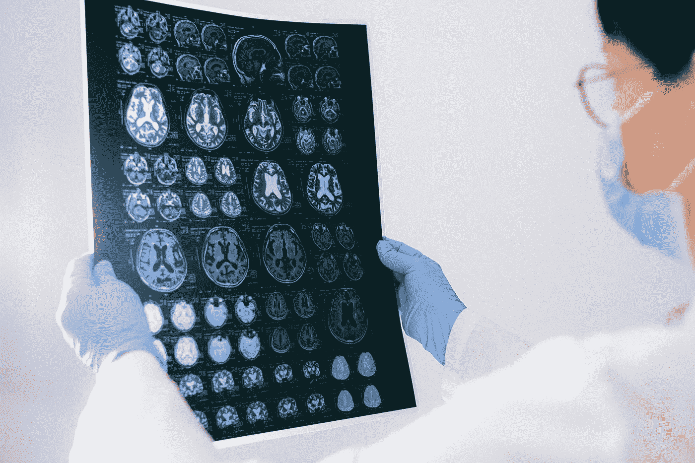

插图照片由[安娜·施韦茨](https://www.pexels.com/@shvetsa?utm_content=attributionCopyText&utm_medium=referral&utm_source=pexels)从[派克斯](https://www.pexels.com/photo/person-holding-black-and-white-wall-decor-4226219/?utm_content=attributionCopyText&utm_medium=referral&utm_source=pexels)拍摄

## 使用 MONAI 模型和 MedicalNet 预训练权重在 3D MRI 扫描上解决图像分类任务(脑瘤识别)，通过 Rising augmentation 和 Pytorch Lightning 训练获得分组，在 Kaggle 排行榜上获得铜牌基线。

这篇文章介绍了我们提交给最近的 Kaggle 竞赛:[RSNA-米卡脑肿瘤放射基因组分类](https://www.kaggle.com/c/rsna-miccai-brain-tumor-radiogenomic-classification)，旨在从 3D MRI 扫描中检测脑肿瘤。我简单描述一下比赛，提供数据。后来，我设计了一个简单的培训工作流程，它建立在几个成熟的框架之上，以产生一个健壮的[基线解决方案](https://www.kaggle.com/jirkaborovec/brain-tumor-classif-lightning-monai-resnet3d)。

> 尽管公共排行榜得分较低，但该基线在私人排行榜上获得了铜牌！我的观点是“简单比复杂好”,过多地关注公共排行榜是不明智的。

# 竞争概述

RSNA-密歇根大学脑肿瘤放射基因组分类竞赛解决了一个基本的医学筛查挑战——检测大脑中的恶性肿瘤。这是一种威胁生命的疾病，中位生存期不到一年。竞赛发起人声称，肿瘤中存在一种称为 MGMT 启动子甲基化的特定遗传序列，可以用作预后因素和对化疗反应性的强预测因子。挑战在于从给定的 MRI ( [磁共振成像](https://en.wikipedia.org/wiki/Magnetic_resonance_imaging))扫描及其结构参数化中预测每个病例的 MGMT 值。

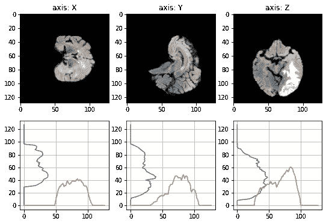

三轴切面，累积投影在完整 MRI 扫描的下方。

MRI 是一种用于放射学的非侵入性医学成像技术，用于获取活体组织中解剖和生理过程的图片。MRI 扫描仪依靠固体磁场来测量磁场梯度和无线电波，以产生人体或选定器官的人类可解读图像。

简单介绍一下竞赛的组织者和动机:北美放射学会(RSNA)与医学图像计算和计算机辅助介入学会(MICCAI)联手改进诊断。如果成功，你将帮助脑癌患者接受侵入性更小的诊断和治疗。

我们的投稿 Kaggle 笔记本是下面的 [**🧠Brain 肿瘤 Classif。~ lightning⚡monai-resnet3d**T3。](https://www.kaggle.com/jirkaborovec/brain-tumor-classif-lightning-monai-resnet3d)

 [## 🧠Brain 肿瘤分类。~ Lightning⚡MONAI-ResNet3D

### 使用 Kaggle 笔记本探索和运行机器学习代码|使用来自[私有数据源]的数据

www.kaggle.com](https://www.kaggle.com/jirkaborovec/brain-tumor-classif-lightning-monai-resnet3d) 

***随意分叉，进一步延伸！***

# 探索性数据分析

训练数据集包括 585 个病例(患者研究)。每个独立的病例都有一个由五位数标识的专用文件夹，其中每个病例文件夹包含四个对应于结构多参数 MRI (mpMRI)的子文件夹。特定的 MRI 扫描以 [DICOM 格式](https://en.wikipedia.org/wiki/DICOM)保存。

数据集中包含的 *mpMRI* 扫描有:

*   **T1w** : T1 加权预对比
*   **T1Gd** : T1 加权后对比
*   **T2w** : T2 加权
*   **FLAIR** :流体衰减反转恢复

简而言之:T1 加权更好地描绘了解剖，T2 加权自然地显示了病理。

> [**流体衰减反转恢复(FLAIR)**](https://radiopaedia.org/articles/fluid-attenuated-inversion-recovery) 是一种特殊的反转恢复序列，反转时间长。这将从生成的图像中去除脑脊液信号。FLAIR 图像上的脑组织看起来类似于 T2 加权图像，灰质比白质亮，但脑脊液是暗的而不是亮的。
> **物理学:**为了消除来自流体的信号，调节 FLAIR 脉冲序列的反转时间，使得在平衡状态下没有流体的净横向磁化。
> **临床应用:**FLAIR 序列是几乎所有脑部成像协议的一部分，尤其适用于检测大脑半球外围和靠近脑脊液的脑室周围区域的细微变化。

## 浏览注释

不管 mpMRI 如何，每个病例的注释都是二元分类，MGMT 为 0 或 1。在训练数据集中，正负 MGMT 观测值分布均衡，如下图所示。

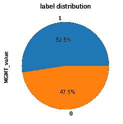

二元事例间的标号分布。

## 一维稀疏扫描

与任何真实数据集一样，并非所有扫描都具有相同的质量。我们观察到输入扫描尺寸的差异，在一维上从 512 到 52 个像素不等。与相同扫描中的其他 X 和 Y 轴相比，高稀疏性通常出现在 Z 轴中。

由于大多数深度学习模型依赖于固定大小的输入，我们有两种选择来处理扫描:
1。将所有扫描向下采样至最低分辨率或
2。将所有扫描插入(上/下采样，取决于原始尺寸和与目标尺寸的比率)到一个共同的尺寸。

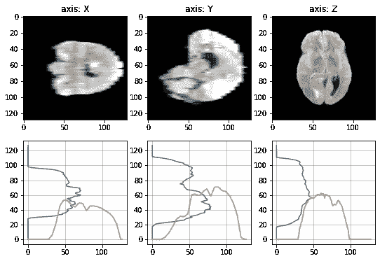

累积投影低于 MRI 扫描的三轴切面在 Z 维稀疏。

对于第一个选项，我们将丢失大量有价值的信息，对训练好的模型产生负面影响。所以我们决定把所有的扫描都插值成一个标准尺寸。虽然插值可能会在降级的扫描中引入一些噪声，但它会在其他地方保留完整的信息。

# 结构

我们使用 PyTorch 生态系统中的几个框架来解决深度学习过程的每个阶段:
1。将数据处理封装到由 [Pytorch Lightning](https://www.pytorchlightning.ai/)
2 提供的`[DataModule](https://pytorch-lightning.readthedocs.io/en/latest/extensions/datamodules.html)`中。通过[MONAI](https://monai.io/)3 创建卷积模型。从[医疗网](https://github.com/Tencent/MedicalNet)
4 加载预训练的重量。应用由[上升](https://rising.readthedocs.io/en/latest)
5 提供的基本 3D 增强。利用 [Pytorch](https://www.pytorchlightning.ai/) Lightning 的最佳实践无缝培训模型

> 所有代码快照和可视化都是这个示例库的一部分，可以作为`pip install [https://borda.github.io/kaggle_vol-3D-classify](https://borda.github.io/kaggle_vol-3D-classify)/archive/refs/heads/main.zip`安装。欢迎任何好的贡献！

## Pytorch 闪电

[PyTorch Lightning](https://www.pytorchlightning.ai/) 是一个用于高性能人工智能研究的轻量级 PyTorch 包装器，允许你缩放你的模型，而不是样板文件。它还分离了数据、模型和训练逻辑，使研究人员能够专注于这些阶段中的每一个(此外，这种分离的代码更容易与您的同事共享)。此外，训练完全由 Lightning `[Trainer](https://pytorch-lightning.readthedocs.io/en/stable/common/trainer.html)`和自动监控一起处理。

## 莫奈模型

[MONAI](https://monai.io/) 是一个基于 PyTorch 构建的开源医疗框架，专注于医疗保健成像领域的深度学习。我们选择它作为一个丰富的模型集合，还包括这个任务所需的 3D 模型。在大多数情况下，他们还提供预先训练的重量，以改善你的训练的最初表现。

## 来自 MedicalNet 的预训练重量

深度学习的性能受到训练数据量的显著影响。 [MedicalNet](https://github.com/Tencent/MedicalNet) 项目聚合了具有不同模态、目标器官和病理的数据集，以促进知识转移。基于该数据集，提供了一系列 3D-ResNet 预训练模型。特别是，作者参考了 [Med3D:用于 3D 医学图像分析的迁移学习](https://arxiv.org/abs/1904.00625)。

## 上升增强

[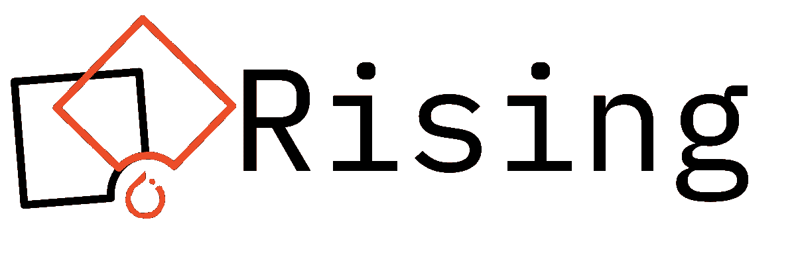](https://rising.readthedocs.io/en/stable/)

[Rising](https://rising.readthedocs.io/en/stable/) 是一个高性能的数据加载和增强库，用于 PyTorch 编写的 2D 和 3D 数据。它专注于提供与 PyTorch 生态系统的无缝集成，而不牺牲可用性或特性。一个很好的部分是，增强功能集成在`DataLoader`中，可以在 GPU 中应用，以显著提高训练，因为任何更高维度的变换/插值都需要计算。

# 数据准备和扩充

体积数据以 [DICOM 格式](https://en.wikipedia.org/wiki/DICOM)的标准 2D 图像的有序序列提供。DICOM(医学数字成像和通信)是一种典型的医学图像格式，通常用于存储和传输医学图像，实现医学成像设备的集成。为了加载这些图像，我们使用了`[pydicom](https://pypi.org/project/pydicom/)` Python 包:

[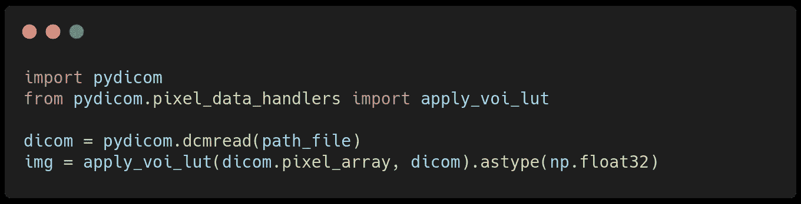](https://github.com/Borda/kaggle_brain-tumor-3D/blob/4c5898b2ef18783eb47810084dd97941747068f3/kaggle_brain3d/utils.py#L21-L29)

用于加载 DICOM 图像的样本[代码](https://github.com/Borda/kaggle_brain-tumor-3D/blob/4c5898b2ef18783eb47810084dd97941747068f3/kaggle_brain3d/utils.py#L21-L29)。

为了加载完整的卷，我们列出了特定文件夹中的所有图像，按照文件名中编码的切片索引对它们进行排序，并将它们全部连接到一个卷中:

[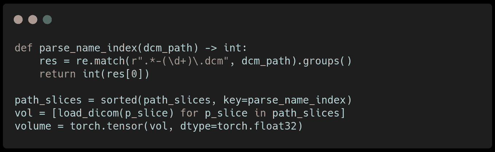](https://github.com/Borda/kaggle_brain-tumor-3D/blob/4c5898b2ef18783eb47810084dd97941747068f3/kaggle_brain3d/utils.py#L32-L48)

样品[代码](https://github.com/Borda/kaggle_brain-tumor-3D/blob/4c5898b2ef18783eb47810084dd97941747068f3/kaggle_brain3d/utils.py#L32-L48)用于装载完整的体积。

我们使用标准的最小-最大强度归一化使所有值都在范围(0，1)内，并在体积内插入一些缺失的切片，使所有轴相等。这种标准化简化了后期的增强，因此我们可以使用全方位翻转和旋转，而不会出现任何并发症。

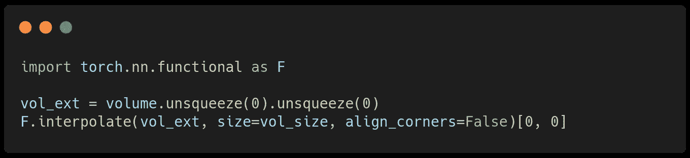

使用 PyTorch 进行体积插值的示例代码。

## 数据缓存

加载过程相对较慢，并且对存储 IO 要求很高。这很快成为未来培训工作流程的瓶颈。我们引入了简单的扫描缓存来加速数据加载——每幅图像只从原始 DICOM 图像序列中加载一次，然后保存在 PyTorch 3D tensor 中。

DICOM 图像在内部使用 JPEG 压缩来减小它们的大小，相比之下，我们使用默认参数(张量使用`torch.float64`)进行简单的保存，结果非常占用空间。所以我们将张量保存为`torch.float16`，它仍然保留了所有的图像信息，但是显著减小了缓存大小(大约 4 倍),并连续改善了加载时间。

## 裁剪扫描

我们观察到，所有扫描都包括覆盖每个扫描的重要部分的黑色/均匀背景，这使得模型学习能力的相当一部分被浪费，或者最终对不想要的噪声敏感。

作为一项实验，我们在每个扫描轴上进行简单的裁剪，以最大化大脑占用率。我们计算一个简单 1D 投影(强度总和)；从扫描边缘开始，当总强度超过给定阈值时，我们搜索第一个点。

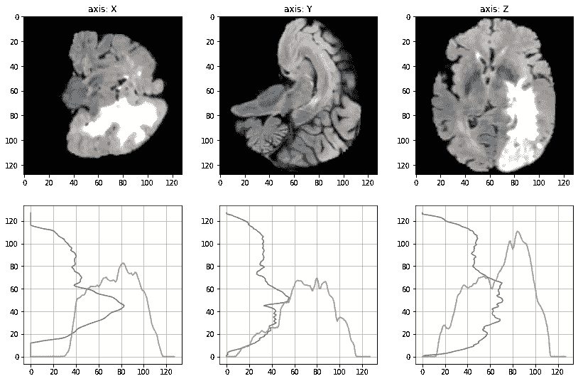

从各个方向裁剪体积

原则上，它运行良好；设置适当的数据集范围的阈值是非常敏感的，结果显示每次扫描之间略有不同。它还取决于实际的轴和特定的大脑质量的存在。

## 扫描增强

有许多方法可以通过各种图像/体积扩充来提高模型的鲁棒性。主要类别是基于强度的、几何变换和结论(最后一种可能对输入样本敏感，因为我们不会移除肿瘤部分)。

[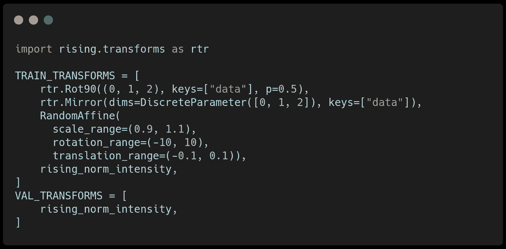](https://github.com/Borda/kaggle_brain-tumor-3D/blob/4c5898b2ef18783eb47810084dd97941747068f3/kaggle_brain3d/data.py#L26-L35)

用于培训的[培训/验证增强](https://github.com/Borda/kaggle_brain-tumor-3D/blob/1c13ddde884b40b5d4a181f1b063ba3dff49b471/kaggle_brain3d/data.py#L26-L35)。

我们已经使用了简单的镜像和[随机仿射变换](https://github.com/Borda/kaggle_brain-tumor-3D/blob/4c5898b2ef18783eb47810084dd97941747068f3/kaggle_brain3d/transforms.py#L95-L153)，对于移位和旋转具有保守的参数范围。作为最后一步，我们将强度归一化为在训练数据集上计算的零平均值。

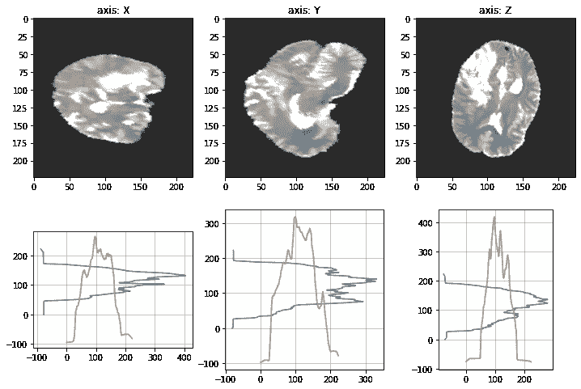

使用过的培训和验证[增强](https://github.com/Borda/kaggle_brain-tumor-3D/blob/4c5898b2ef18783eb47810084dd97941747068f3/kaggle_brain3d/data.py#L26-L35)。

# 微调基线模型

我们的基线选择使用来自 [MONAI](https://monai.io/) 包的 ResNet 模型，该模型加载了来自 [MedicalNet](https://github.com/Tencent/MedicalNet) 的权重，并在大约 23 个不同的医学数据集上进行了预训练。

唯一复杂的是，MONAI 模型中的根模块名与 MedicalNet 中的预期模型名不兼容，因此在调用`load_state_dict`之前必须对其进行重命名。

[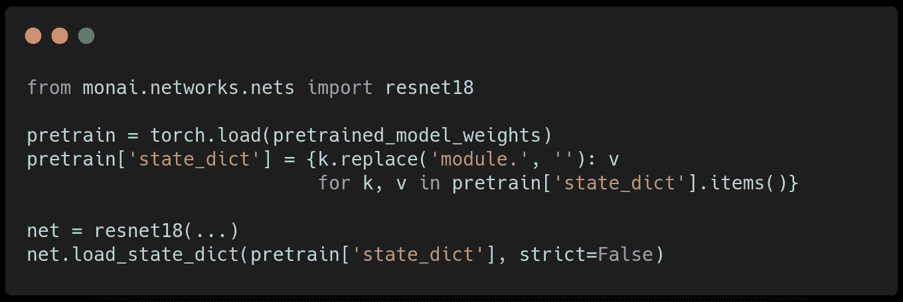](https://github.com/Borda/kaggle_brain-tumor-3D/blob/4c5898b2ef18783eb47810084dd97941747068f3/kaggle_brain3d/models.py#L19-L54)

简化的[权重加载](https://github.com/Borda/kaggle_brain-tumor-3D/blob/4c5898b2ef18783eb47810084dd97941747068f3/kaggle_brain3d/models.py#L19-L54)从 MedicalNet 到 MONAI ResNet 模型。

竞赛使用 [AUROC](https://glassboxmedicine.com/2019/02/23/measuring-performance-auc-auroc/) (接收器工作特性下的面积)作为主要指标。我们用重物将 MONIA 模型包裹在 [PyTorch-Lightning 模块](https://pytorch-lightning.readthedocs.io/en/latest/common/lightning_module.html)中，并添加了几个 [TorchMetrics](https://torchmetrics.readthedocs.io/en/stable/) 来监控模型性能，包括 AUROC。

对于培训，我们使用了 [Grid.ai sessions](https://docs.grid.ai/products/sessions) 和一个基本的英伟达 T4 显卡。我们对基线模型的参数化如下:
* **ResNet18** 模型架构
*体积大小设置为 **224px** 各维度
*自动混合精度训练( **AMP** )
*批量大小 **4**

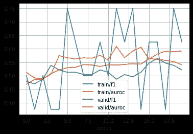

监控传输过程。

我们对微调进行了实验(所有预先训练的权重都被冻结)，并将其与从头开始训练模型进行了比较。比较这两个选项，我们没有观察到任何显著的改进(通过所描述的参数化)。对于微调，我们显著增加了批量大小，同时仍然适合 16GB GPU。

# 推理和提交

一个简单的模型推理迭代测试数据集中的图像，并生成预测，这些预测被汇总到竞争提交中。请注意，您需要首先将模型切换到`eval`状态，对于预测，您不需要跟踪梯度，这大大加快了预测速度并降低了内存需求。

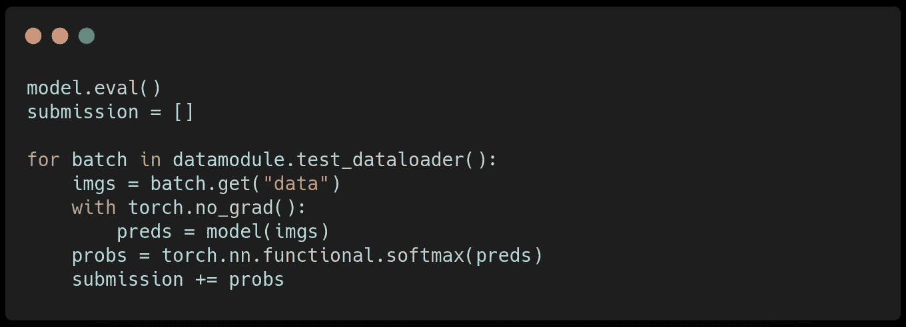

测试数据集上的简单[模型推断](https://github.com/Borda/kaggle_brain-tumor-3D/blob/4c5898b2ef18783eb47810084dd97941747068f3/kaggle_brain3d/models.py#L157-174)。

我们知道，训练数据集具有大约 52:48 的平衡标签分布比率。我们希望测试分布与训练数据集大致相似(因为模型的一部分是学习偏差)。

下面我们绘制了测试数据集预测的概率直方图，它似乎在一边形成了 0.5 左右的两个模式。

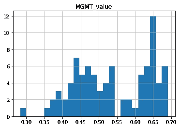

最终预测分布。

> 比赛期间，我在公开排行榜上排名第 757 位，后来在私人排行榜上跃升至第 134 位！公共测试分数基于总测试数据集的 1/3。

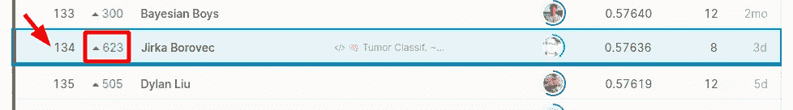

# 结论

这篇文章为最近的 Kaggle 竞赛提供了一个基线解决方案，旨在通过 MRI 扫描进行大脑分类。我挑选了几个方便的框架来取长补短，并从社区和学术研究中受益。

我介绍了数据集，并展示了一些如何通过缓存来增强训练的技巧。后来，我将预训练的模型权重加载到一个简单的 ResNet 模型中，并在带有 AMP 的英伟达 T4 显卡上对其进行了训练。我用这个解决方案在公共排行榜上排名居中，后来在私人排行榜上获得了铜牌。

通过交互式 [Grid.ai](https://grid.ai/) 会议和 [Github 项目](https://borda.github.io/kaggle_vol-3D-classify)查看培训，该项目包括作为简单 python 包和 iPython 笔记本提供的所有代码…

 [## Kaggle:脑肿瘤放射基因组分类

### 这项挑战旨在预测对脑癌治疗重要的遗传生物标志物的状态。与……

borda.github.io](https://borda.github.io/kaggle_brain-tumor-3D) 

***对更酷的 Pytorch 闪电集成感兴趣？
关注我，加入我们牛逼的***[***Slack***](https://join.slack.com/t/pytorch-lightning/shared_invite/zt-pw5v393p-qRaDgEk24~EjiZNBpSQFgQ)***社区！***

 [## 使用 PyTorch Lightning 和 Grid.ai Spot 实例对 Kaggle 竞争进行排名的最佳实践

### 通过交互式会话、超参数解决图像分类挑战的完整数据科学周期…

devblog.pytorchlightning.ai](https://devblog.pytorchlightning.ai/best-practices-to-rank-on-kaggle-competition-with-pytorch-lightning-and-grid-ai-spot-instances-54aa5248aa8e) 

# 关于作者

吉尔卡·博罗维克 拥有 CTU 大学的计算机视觉博士学位。他已经在几家 IT 创业公司和公司从事机器学习和数据科学工作几年了。他喜欢探索有趣的世界问题，用最先进的技术解决这些问题，并开发开源项目。

## 感谢

MRI 插图是基于提供的 [Kaggle 数据集](https://www.kaggle.com/c/rsna-miccai-brain-tumor-radiogenomic-classification/data)生成的，作为[RSNA-ASNR-米凯布拉特挑战赛 2021](https://www.med.upenn.edu/cbica/brats2021/)
U.Baid 等人的“RSNA-ASNR-米凯布拉特 2021 脑肿瘤分割和放射基因组分类基准”， [arXiv:2107.02314](https://arxiv.org/abs/2107.02314) ，2021。