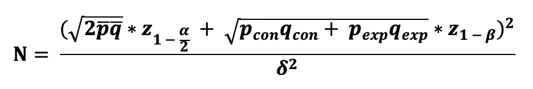
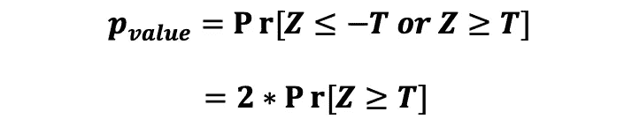

# A/B 测试设计、实施和缺陷的完整指南

> 原文：<https://towardsdatascience.com/simple-and-complet-guide-to-a-b-testing-c34154d0ce5a?source=collection_archive---------0----------------------->

## [实践教程](https://towardsdatascience.com/tagged/hands-on-tutorials)

## 为您的数据科学实验进行端到端的 A/B 测试，面向非技术专家和技术专家，提供示例和 Python 实现


[图片来源:卡罗琳娜·格拉博斯卡](https://www.pexels.com/nl-nl/foto/voedsel-bord-gezond-maaltijd-4397723/)

A/B 测试也称为**分割测试，**起源于统计学中的**随机控制试验**，是企业测试 UX 新功能、产品新版本或算法以决定你的企业是否应该推出新产品/功能的最受欢迎的方法之一。

> 《天下大 A/B 考》**肖恩·埃利斯**

本文面向技术和非技术受众，我将涵盖执行 A/B 测试时应该考虑和执行的以下主题:

```
**- What is A/B testing and when to use it?
- Questions to clarify before any A/B test
- Choice of Primary metric 
- Hypothesis of the test
- Design of the test (Power Analysis)
- Calculation of Sample Size, Test Duration 
- Statistical tests (T-test, Z-test, Chi-squared test)
- Analysing A/B test results in Python 
- Bootstrapping and Bootstrap Quantile Method for SE and CI
- Statistical Significance vs Practical Significance
- Quality of A/B test (Reliability, Validity, Potency)
- Common problems and pitfalls of A/B testing
- Ethics and privacy in A/B testing**
```

*如果事先没有统计知识，可以简单跳过统计推导和公式。但是，如果您想学习或更新基本统计概念的知识，您可以查看本文:* [***数据科学家和数据分析师的统计学基础***](/fundamentals-of-statistics-for-data-scientists-and-data-analysts-69d93a05aae7)

# 什么是 A/B 测试，什么时候使用？

A/B 测试背后的想法是，你向一个客户样本**(实验组)**展示产品的变体版本，向另一个客户样本**(对照组)**展示产品的现有版本。然后，跟踪实验组/治疗组相对于对照组的产品性能差异，以确定产品的新版本对产品性能的影响。因此，目标是在测试期间跟踪指标，并找出产品性能中是否存在*差异*以及差异的类型。

该测试背后的动机是测试新产品变体，这些变体将提高现有产品的性能，并将使该产品更加成功和最佳，从而显示出积极的治疗效果。

这种测试之所以伟大，是因为企业通过向他们展示现有的和变化的产品/功能选项，从他们的实际用户那里获得了直接的反馈，这样他们可以快速测试新的想法。如果 A/B 测试表明变化的版本/方法不是有效的，至少企业可以从中学习，并决定他们是否需要改进它或需要寻找其他想法。

**A/B 测试的好处**

*   允许以快速的方式了解什么有效，什么无效
*   您直接从实际/真实的产品客户那里获得反馈
*   由于用户不知道他们正在被测试，结果将是无偏见的

**A/B 测试的缺点**

*   向不同的客户呈现不同的内容/价格/功能，尤其是在相同的地理位置，可能有潜在的危险，导致**变化厌恶**(我们将在后面讨论如何解决这个问题)
*   需要大量的产品、工程和数据科学资源
*   如果处理不当，可能会导致错误的结论

> A/B 测试背后的动机是测试新产品变体，这些变体将提高现有产品的性能，并将使该产品更加成功和优化，显示出积极的治疗效果。

# 任何 A/B 测试前要问的问题

鉴于 A/B 测试需要大量的资源，并可能导致具有重大影响的产品决策，在开始运行测试之前，询问您自己、产品、工程团队和参与实验的其他利益相关者一些基本问题是非常重要的。

*   **样本人群**是什么样的，目标产品的**客户群**是什么样的？
*   我们能否使用探索性/历史数据分析(例如，使用因果分析)找到业务问题的答案？
*   我们想要测试目标产品的单个还是多个变体？
*   我们能否确保**真正随机的**对照组和实验组。两个样本都是真实用户群体的无偏见的真实代表？
*   在整个测试过程中，我们能否确保治疗效果与对照效果的完整性？

> A/B 测试的目标是在测试期间跟踪主要指标，并找出产品的性能是否存在*差异*以及差异的类型。


[图片来源:卡罗琳娜·格拉博斯卡](https://www.pexels.com/nl-nl/foto/voedsel-gezond-tafel-stapel-4397898/)

# **为 A/B 测试选择主要指标**

选择指标是 A/B 测试中最重要的部分之一，因为该指标将用于测量实验广告控制组的产品或功能的性能，并将用于确定这两组之间是否存在**统计显著差异**。

*成功*指标的选择取决于这个 A/B 测试所测试的基本假设。这是 A/B 测试中最重要的部分之一，因为它决定了测试将如何设计，以及提议的想法执行得如何。选择糟糕的度量标准可能会取消大量工作的资格，或者可能导致错误的结论。

收入并不总是最终目标，因此对于 A/B 测试，我们需要将主要指标与产品的直接目标和更高层次的目标联系起来。人们的期望是，如果产品赚更多的钱，那么这表明内容是伟大的。但是在实现这个目标的过程中，我们可以优化转换漏斗，而不是提高材料和写作的整体内容。测试您为 A/B 测试选择的指标的准确性的一种方法是回到您想要解决的确切问题。你可以问自己以下问题:

> **度量标准有效性问题:如果这个选择的度量标准显著增加，而其他一切保持不变，我们会实现我们的目标并解决这个问题吗？**

尽管您需要为您的 A/B 测试准备一个单一的主要指标，但是您仍然需要关注剩余的指标，以确保所有的指标都显示出变化，而不仅仅是目标指标。在你的 A/B 测试中有多个度量标准会导致误报，因为你会发现许多显著的差异，而没有影响，这是你想要避免的。

## **常见 A/B 测试指标**

经常在 A/B 测试中使用的流行性能指标是点击率、点击率和转化率。

**1:点击率**使用方法


其中考虑了总视图或会话的数量。这个数字是查看页面(印象)然后实际点击它(点击)的人的百分比。

**2:影响的点进概率(CTP)**


与 CTR 不同，CTP 考虑了重复点击，这意味着如果用户出于某种原因在单个会话中出于某种原因(例如，因为不耐烦)对同一项目执行了多次点击，则该多次点击在 CTP 中被计为单次点击。

为了计算 CTP，您需要与工程师合作修改网站的 s.t .对于每个页面视图，您捕获视图/印象事件和点击事件，将每个页面视图与每个页面的所有**子点击** **相匹配，以确保每个独特的页面视图只计算 1 个子点击。**

**3:转换率**

转换率，定义为以交易结束的会话比例。


所以，如果你想衡量网站的可用性，你可以使用 CTR 如果你想衡量功能的实际影响，你可以使用 CTP。CTR 不处理重复的点击，所以如果用户不耐烦地多次按下同一个按钮，这将不会被纠正为等于 1。

# 陈述测试的假设

A/B 测试应该总是基于一个需要测试的假设。这种假设通常是产品团队和数据科学团队的相关人员集思广益和协作的结果。这一假设背后的想法是决定如何“修复”产品中的潜在问题，这些问题的解决方案将影响感兴趣的关键性能指标(KPI)？

当你想挑选一个问题的时候，对要测试的产品问题和想法进行优先排序也是非常重要的。解决这个问题将会对产品产生最大的影响。

例如，如果产品的 KPI 是为了提高推荐系统的推荐质量，这可以通过例如添加**印象折扣**或者为推荐者建立**重新排序**模型来实现。但是，这两种解决方案对建议质量的改善程度可能会有所不同。也就是说，重新排序模型通过潜在地改变呈现给用户的推荐集来影响推荐的排序，这与印象折扣不同，印象折扣只是确保用户看不到之前向用户看过的推荐。


[图片来源:](https://www.pexels.com/nl-nl/foto/voedsel-rood-apple-paars-7172259/) [波琳娜·科瓦列娃](https://www.pexels.com/nl-nl/@polina-kovaleva)

对于这个特定的例子，我们可以决定建立一个重新排序的模型，我们希望它能够提高目标推荐系统的质量(让我们把这个假想的推荐系统命名为 RecSys)。此外，我们还进行了研究，发现 [XGBoost](https://en.wikipedia.org/wiki/XGBoost) 可用作重新排序模型，对 RecSys 建议进行重新排序。

最后，我们进行了探索性分析/离线测试，发现推荐质量有所提高(假设使用 [NDCG](https://www.youtube.com/watch?v=qG0wUgsEugw&t=31s&ab_channel=WayfairDataScience) 作为推荐质量的性能衡量标准),并确定了显著的影响。因此，作为最后一项检查，我们希望测试 XGBoost 重排序器在 RecSys 推荐质量方面与现有推荐器版本相比的有效性。因此，我们可以陈述以下假设:

> 假设:在现有的 RecSys 推荐器上增加一个 XGBoost re-ranker 模型，会提高推荐的 CTR，也就是说，会提高 RecSys 推荐的质量。

不要将多个想法合并到一个假设中，也不要限制测试中引入的变量，以便您可以了解它们各自的影响。否则，在考试结束时，你会留下许多问题和很少的答案。

# **设计 A/B 测试**

一些人认为 A/B 测试是一门艺术，其他人则认为这是一种商业调整的普通统计测试。但是边界是，为了正确地设计这个实验，你需要自律和有目的，同时记住这不是真正的测试——这是关于*学习*。以下是你需要采取的步骤，为你的 A/B 测试提供一个可靠的设计。

## 第一步:统计假设


## 步骤 2:电源分析

为了确保我们的结果是可重复的、稳健的，并且可以推广到整个群体，我们需要避免 [p-hacking](https://en.wikipedia.org/wiki/Data_dredging) ，以确保真正的统计显著性并避免有偏见的结果，我们希望确保我们收集了“足够”数量的观察值，并且我们在最短的预定时间内运行测试。因此，在运行测试之前，我们需要确定控制组和实验组的样本量，以及我们需要运行测试多长时间。这个过程通常被称为功效分析，它包括 3 个具体步骤:确定检验的功效，确定检验的显著性水平，以及确定最小可检测效应。A/B 测试功耗分析中涉及的参数的一个常用参考符号如下:


## **测试的功效**

统计检验的能力是正确拒绝零假设的概率。功效是当零假设为假时做出正确决定(拒绝零假设)的概率。

通常由(1-β)定义的功效等于不犯第二类错误的概率，其中第二类错误是当零假设为假时不拒绝零假设的概率。

通常的做法是选择 80%作为 A/B 测试的功效，也就是 20%的第二类误差，这意味着当存在一种效应时，我们可以不检测(不能拒绝无效)一种治疗效应。然而，该参数值的选择取决于测试的性质和业务约束。

## **测试的显著性水平**

显著性水平也是 I 型错误的概率，是拒绝零的可能性，因此检测到治疗效果，而零是真的并且没有统计学上显著的影响。该值通常由希腊字母 alpha，α定义，是做出错误发现的概率，通常被称为假阳性率。

通常，我们使用 5%的显著性值，这表明当没有实际差异时，我们有 5%的风险得出实验和控制变量性能之间存在统计显著差异的结论。因此，100 个病例中有 5 个检测到治疗效果，而没有效果，我们就没事了。这也意味着控制组和实验组之间有显著的结果差异，有 95%的*置信度*。

就像在测试能力的情况下，alpha 值的选择取决于测试的性质和业务约束。例如，如果运行这个 A/B 测试与高工程成本有关，那么企业可能会决定选择高 alpha，以便更容易检测处理效果。另一方面，如果生产环境中建议版本的实现成本很高，您可以选择一个较低的显著性水平，因为这个建议的功能应该确实有很大的影响来证明高实现成本的合理性，所以应该更难拒绝 null。

## **最小可检测效应(δ)**

从业务的角度来看，业务希望看到的新版本的最小影响的统计显著性**是什么，以发现该变体值得投资？**

这个问题的答案是，与现有版本相比，我们的目标是在新版本的指标中观察到什么形式的变化，以便向业务部门提出建议，该功能应该在生产中推出。这个参数的估计值就是所谓的**最小可检测效应**，通常由希腊字母 **delta、**定义，这也与测试的实际意义有关。MDE 是一个与**最小影响**相关的代理，这种最小影响在业务实践中很重要，通常由利益相关者设定。

> 通常的做法是选择 80%作为 A/B 测试的功效和 5%作为显著性水平，即 20%的第二类误差和 5%的第一类误差。然而，该参数值的选择取决于测试的性质和业务约束。

# 步骤 3:计算最小样本量


[图片来源:迈克尔·布伦斯](https://www.pexels.com/photo/faceless-person-near-basket-full-of-coffee-berries-in-countryside-7125739/)

A/B 测试的另一个非常重要的部分是确定控制组和实验组的最小样本量，这需要使用测试的定义的**功效**(1-beta)**显著性水平**(alpha)**最小可检测效应** (MED)以及两个相同大小的[正态分布](https://en.wikipedia.org/wiki/Normal_distribution)样本的方差来确定。样本量的计算取决于您为跟踪对照和实验版本的进展所选择的基本主要指标。这里我们区分两种情况；案例 1 中，A/B 测试的主要指标采用二元变量的形式(如点击量或无点击量)，案例 2 中，测试的主要指标采用比例或平均值的形式(如平均订单量)。

## 案例 1:用二进制度量计算样本量

当我们处理具有两个可能值的主要性能跟踪指标时，例如点击率，其中用户可以点击(成功)或不点击(失败)，如果用户对产品的响应可以被定义为“独立”事件，那么我们可以将此视为伯努利试验，其中点击事件(成功)以概率 **p_con** 发生在对照组的情况下，以概率 **p_exp** 发生在实验组的情况下。此外，在对照组的情况下，不点击事件(失败)以概率 **q_con** 发生，在实验组的情况下，以概率 **q_exp** 发生，其中:


因此，描述测试期间从用户处收到的成功(点击)次数的随机变量遵循二项式分布，其中样本大小是功能/产品给用户留下印象的次数，成功的概率分别是对照组和实验组的 **p_con** 和 **p_exp、****。**然后，使用具有预先指定的显著性水平、功效水平和 MID 的双边检验，比较这两个二项式比例所需的样本量可计算如下:



这里我们需要使用 **A/A 测试**(A/B 测试，除了给两组分配相同的处理)来获得 p_bar 和 q_bar 的估计值。

## 案例 2:使用连续指标计算样本量

当我们处理平均形式的主要绩效跟踪指标时，如*平均订货量*，我们打算比较对照组和实验组的平均值 *s，*，然后我们可以使用中心极限定理，说明对照组和实验组的平均抽样分布都遵循正态分布。因此，两组均数差的抽样分布也服从正态分布。那就是:


因此，使用具有预先指定的显著性水平、功效水平、MID 的双边检验，比较两个正态分布样本的平均值所需的样本大小可计算如下:


在这里，我们可以运行 A/A 测试来获得样本方差σ _con 和σ _exp。

> 描述测试期间从用户处收到的成功(点击)次数的随机变量遵循二项式分布，其中样本大小是特性/产品给用户留下印象的次数，成功的概率分别是对照组和实验组的 p_con 和 p_exp。

# 步骤 4:确定 A/B 测试持续时间

如前所述，这个问题需要在你进行实验之前回答，而不是在实验过程中，当你检测到统计显著性时，尝试停止测试。要确定持续时间的基线，常用的方法是使用以下公式:


例如，如果此公式的结果为 14，则表明测试运行了 2 周。然而，在选择运行测试的时间和时长时，将许多特定于业务的方面考虑在内是非常重要的，并且要有所保留地使用这个公式。

例如，如果一个人想在 2020 年 1 月初运行一个实验，当时新冠肺炎疫情震动了世界，这对页面使用产生了影响，对于一些企业来说，这意味着页面使用的高增长，而对于一些企业来说，可用性的巨大下降，那么在不考虑这一点的情况下运行 A/B 测试将导致不准确的结果，因为活动期不会是常见页面使用的真实表示。

## **测试持续时间过短:新奇效果**

用户倾向于对所有类型的变化做出快速而积极的反应，不管这些变化的性质如何。这种对实验版本的积极影响是完整的，因为有一个变化，不管变化是什么，被称为*新奇效应*，它随着时间的推移而消失，因此被认为是“虚幻的”。所以，把这种效应描述给实验版本本身，并期望它会在新鲜感消失后继续存在是错误的。

因此，当选择测试持续时间时，我们需要确保我们不要在太短的时间内运行测试，否则我们会有新奇的效果。新奇效应可能是 A/B 测试外部效度的主要威胁，因此尽可能避免它是很重要的。

## 测试持续时间过长:**成熟效应**

当计划一个 A/B 测试时，考虑一个更长的测试持续时间通常是有用的，这样可以让用户习惯新的特性或产品。通过这种方式，人们将能够观察到真正的治疗效果，这是通过给返回的用户更多的时间来从最初的积极反应或由于作为治疗的一部分而引入的改变而引起的兴趣高峰中冷却下来。这将有助于避免新奇效应，从而更好地预测测试结果。然而，测试时间越长，外部效应影响用户反应的可能性就越大，并可能污染测试结果，*成熟效应*。因此，运行 A/B 测试太长时间也是不推荐的，并且可以更好地避免以增加结果的可靠性。

> 测试时间越长，外部效应影响用户反应并可能污染测试结果的可能性就越大。

# 运行 A/B 测试

一旦准备工作完成，在工程的帮助下，你可以开始运行 A/B 测试。首先，工程团队需要确保控制组和实验组之间的完整性。其次，存储用户对治疗的反应的机制必须准确，并且对所有用户都相同，以避免**系统偏差**。您还需要避免一些事情，例如，一旦您检测到统计显著性(小 p 值),而您还没有达到开始测试前计算的最小样本量，就过早停止测试。


[图片来源:Lum 3N](https://www.pexels.com/nl-nl/foto/abrikozenvruchten-op-kom-1028599/)

# 用 Python 分析 A/B 测试结果

在解释 A/B 测试的结果时，您应该计算一组值来测试前面陈述的统计假设(测试控制组和实验组之间是否存在统计上的显著差异)。该套件包括:

*   选择合适的统计检验
*   计算测试统计量(T)
*   计算检验统计的 p 值
*   拒绝或未能拒绝统计假设(统计显著性)
*   计算误差幅度(实验的外部有效性)
*   计算置信区间(实验的外部有效性和实际意义)

## **选择合适的统计测试**

一旦收集了对照组和实验组的相互作用数据，您就可以通过选择适当的统计测试来更早地测试统计假设，这种测试通常分为**参数**和**非参数**测试。测试的选择取决于以下因素:

*   主要指标的格式(基础 pdf)
*   样本量(适用于 CLT)
*   统计假设的性质(表明两个组之间的关系仅仅存在或确定两个组之间的关系类型)

A/B 测试中最常用的**参数**测试有:

*   **2 样本 T-检验**(当 N < 30 时，度量遵循 *student-t* 分布，你要确定对照组和实验组之间是否存在关系以及*关系的类型*
*   **2 样本 Z-检验**(当 N > 30 时，度量遵循渐近*正态*分布，并且您想要识别对照组和实验组之间是否存在关系*和* *类型的关系*

A/B 测试中最常用的**非参数**测试有:

*   **Fishers 精确检验(**小 N，识别与你想要识别的对照组和实验组之间是否存在关系 **)**
*   **卡方检验**(大 N，识别和你想要识别的对照组和实验组之间是否存在关系)
*   **Wilcoxon 秩和/Mann Whitney 检验**(小 N 或大 N，偏斜采样分布，检验对照组和实验组之间中位数的差异)

## 双样本 T 检验

如果您想测试控制组和实验组之间是否存在统计意义上的显著差异，这些差异以平均值的形式表示(例如，平均购买金额)，指标遵循 *student-t* 分布，当样本量小于 30 时，您可以使用双样本 T 检验来测试以下假设:


其中对照组均值的抽样分布遵循自由度为 N_con-1 的 Student-t 分布。此外，实验组均值的抽样分布也遵循自由度为 N_exp-1 的 Student-t 分布。注意，N_con 和 N_exp 分别是控制组和实验组中的用户数量。


然后，两个样本的**合并方差**的估计值可以计算如下:


其中σ _con 和σ _exp 分别是对照组和实验组的样本方差。那么**标准误差**等于集合方差估计的平方根，可以定义为:


因此，带有前述假设的双样本 T 检验的**检验统计量**可计算如下:


为了检验样本均值间观察到的差异的**统计显著性**，我们需要计算检验统计量的 **p 值**。p 值是由于随机机会而观察到的值至少与普通值一样极端的概率。换句话说，假设零假设为真，p 值是获得至少与样本数据中的效应一样极端的效应的概率。那么检验统计的 p 值可以计算如下:


对 *p* 值的解释取决于所选的显著性水平α，该水平是在*功率分析*期间运行测试之前选择的。如果计算出的*p*-值似乎小于等于α(例如，对于 5%显著性水平为 0.05)，我们可以拒绝零假设，并声明对照组和实验组的主要指标之间存在统计学显著差异。

最后，为了确定获得的结果有多准确，也为了评价获得的结果的实际意义，您可以使用以下公式计算您的测试的**置信区间**:


其中，t(1-alpha/2)是与具有 alpha 显著性水平的双边 t 检验相对应的检验的临界值，可以使用 [t 表](https://www.sjsu.edu/faculty/gerstman/StatPrimer/t-table.pdf)找到。

## 双样本 Z 检验

如果您想要测试控制组和实验组的指标(以平均值(例如平均购买量)或比例(例如点击率)的形式)之间是否存在统计上的显著差异，指标遵循*正态*分布，或者当样本大小大于 30 时，您可以使用中心极限定理(CLT)来说明控制组和实验组的抽样分布是渐近正态的，您可以使用双样本 Z 检验。这里我们将区分两种情况:一种情况是主要指标采用比例形式(例如点击率)，另一种情况是主要指标采用平均值形式(例如平均购买量)。

**案例 1:比较比例的 Z 检验(双边)**

如果您想测试控制组和实验组之间的比例(如 CTR)指标是否存在统计学上的显著差异，以及点击事件是否独立发生，您可以使用双样本 Z 测试来测试以下假设:


其中每个点击事件可以由随机变量来描述，该随机变量可以取两个可能的值 1(成功)和 0(失败),遵循伯努利分布(点击:成功和没有点击:失败),其中 p_con 和 p_exp 分别是对照组和实验组的点击概率(成功概率)。那就是:


因此，在收集了控制用户和实验用户的交互数据后，您可以计算这两个概率的估计值，如下所示:


因为我们正在测试这些概率的差异，所以我们需要获得一个对联合成功概率的估计和一个对联合方差的估计，如下所示:


那么**标准误差**等于集合方差估计的平方根，可以定义为:


因此，比例差异的双样本 Z 检验的**检验统计量**可以计算如下:


那么这个检验统计的 p 值可以计算如下:


最后，您可以计算测试的**置信区间**，如下所示:


其中，Z(1-alpha/2)是与具有 alpha 显著性水平的双边 Z 测试相对应的测试临界值，可以使用 [Z 表](http://www.z-table.com/)找到。这种双边 2 样本 Z 检验的拒绝区域可以通过下图来显示。


图片来源:作者

**案例 2:比较平均值的 Z 检验(双边)**

如果您想测试对照组和实验组的平均值(如 CTR)是否存在显著的统计学差异，您可以使用双样本 Z 检验来测试以下假设:


其中对照组均值的抽样分布服从正态分布，均值为μ_ con 和σ _con/N_con，此外，实验组均值的抽样分布也服从正态分布，均值为μ_ exp 和σ _exp/N_exp。


然后，对照组和实验组的均值差异也遵循正态分布，均值为μ_ con-μ_ exp，方差为σ _con/N_con + σ _exp/N_exp。


因此，均值差异的双样本 Z 检验的**检验统计量**可计算如下:


**标准误差**等于混合方差估计值的平方根，可定义为:


那么这个检验统计的 p 值可以计算如下:



最后，您可以如下计算测试的**置信区间**:


**卡方检验**

如果您想测试控制组和实验组的绩效指标(例如它们的转化率)之间是否存在统计上的显著差异，并且您并不想知道这种关系的本质(哪一个更好)，您可以使用卡方检验来测试以下假设:


请注意，该指标应采用二进制变量的形式(例如，转换或无转换/点击或无点击)。数据可以用下表的形式表示，其中 O 和 T 分别对应于观察值和理论值。


那么卡方检验的检验统计量可以表示如下:


其中*observed***对应的是观测数据 *Expected* 对应的是理论值，我可以取值 0(不换算)和 1(换算)。重要的是要看到这些因素中的每一个都有一个单独的分母。当只有两个组时，测试统计的公式可以表示如下:**

****

**期望值等于产品的每个版本被浏览的次数乘以导致转化的概率(或者在点击率的情况下导致点击)。**

**请注意，由于卡方检验不是参数检验，其标准误差和置信区间不能像在参数 Z 检验或 T 检验中那样以标准方式计算。**

**这种双边 2 样本 Z 检验的拒绝区域可以通过下图来显示。**

****

**图片来源:作者**

## **非参数检验的标准误差和置信区间**

**在参数测试的情况下，标准误差和置信区间的计算是简单的。然而，在非参数测试的情况下，计算不再简单。为了计算旨在比较对照组和实验组的样本均值或样本中位数的非参数统计检验的标准误差和置信区间，需要使用重采样技术，如*和 ***Boostrap 分位数法、*** *分别为*。***

***Bootstrap 所做的是，它获取原始训练样本，并通过替换从中重新采样，从而产生 B 个不同的样本。因此，自举背后的想法是*用替换重新采样(*相同的观察结果可以在自举数据集 *)* 中出现不止一次。从两组的现有数据中，数据是在实验期间收集的，B 次这意味着你将最终得到两组的 B 个样本。然后，您需要计算对照组和实验组的样本均值/中位数 B 次，可由以下 Bx1 向量表示:***

******

***因此，您可以计算每对对照组和实验组的样本均值差异，从而得出 B 样本均值差异。然后，您还可以在样本平均值中绘制该差异的采样分布，它可以由以下 Bx1 向量表示:***

******

***然后，如果 B 较大(例如 B = 1000)，我们可以利用中心极限定理，假设对照组和实验组均值差的抽样分布服从正态分布，如下图所示。***

******

***图片来源:作者***

***然后，我们需要计算这 B 次的次数，平均值之差大于 0，以获得该测试的 p 值，如下所示:***

******

***如果 p 值大于所选的显著性水平，那么我们可以声明我们不能拒绝空值。因此，没有足够的证据表明对照和实验样本均值之间存在显著的统计学差异。*可以对样本中位数进行相同的自举测试。****

***为了计算 95%的置信区间，可以使用**百分位方法**，该方法使用估计值的 bootstrap 分布的 2.5 和 97.5 百分位作为区间的下限和上限。***

> ***如果 p 值大于所选的显著性水平，那么我们可以声明我们不能拒绝空值。因此，没有足够的证据表明对照和实验样本均值之间存在显著的统计学差异。***

# ***统计意义与实际意义***

***在 A/B 测试的统计分析阶段，当检测到一个小的 p 值时，我们称之为统计显著性。然而，仅有统计显著性并不足以提出关于推出一项功能或产品的建议。***

***检测出统计显著性后，下一步就是了解是否有 ***的实际显著性。******

***确定 A/B 测试是否具有实际意义的一种方法是使用置信区间，并将其下限与 MDE(经济意义的估计值)进行比较。更具体地说，如果 CI 的下限大于 MDE(δ),那么你可以声明你有实际意义。例如，如果 CI = [5%，7.5%]和 MDE = 3%，那么您可以得出结论，因为 5% > 3%，所以具有实际意义。***

***请注意，您还应该查看置信区间的宽度，并确保它不要太大，因为太宽的置信区间表明您的结果的精确度很低，并且结果不能概括到整个人群(外部有效性)。***

# ***A/B 测试质量***

***A/B 测试是实验设计的一个例子，与任何其他类型的实验一样，也需要满足 3 个因素才能做出可靠的结论和产品决策。这些因素是:***

*   *****可靠性/可复制性*****
*   *****有效期*****
*   *****效力*****

## *****可靠性**和可复制性***

***可靠性背后的理念是，实验结果必须不仅仅是一次性的发现，而且必须具有内在的可再现性和可重复性。最近，研究行业出现了*可复制性危机*的现象，因为研究人员无法重现实验结果。这可能是由不同的原因造成的，例如:***

*   ***当原始实验被改变或者有 p-hacking 时***
*   ***当原始实验中存在测量误差时***
*   ***当最初的实验存在系统误差时***
*   ***缺少用于执行实验的文档或源代码/数据***

***你可以做些什么来增加你的 A/B 实验的可复制性:***

*   ***将带有注释的源代码存储在安全的云上***
*   ***将带有注释的数据存储在安全的云上***
*   ***详细记录过程和结果***
*   ***检查系统误差(报告治疗反应的方式，因此你如何衡量治疗的影响)***
*   ***对另一个国家做同样的分析***
*   ***如果你使用抽样技术或模拟，使用*随机种子****

***所有这些步骤将使你的工作更具可复制性。***

## ***有效期***

***有效性包括您的实验的整个概念，并确定获得的结果是否符合随机对照试验的所有要求。就有效性而言，我们通常区分两种类型的有效性:***

*   *****内部有效性*****
*   *****外部有效性*****

*****内部效度**是指观察到的数据和用它得到的结果。那些结果是有效和可靠的还是不准确和有偏见的？因变量的变化仅仅是由于干预(自变量)而不是由于其他因素吗？下列问题会对你的 A/B 实验的内部效度产生负面影响:***

*   ***省略变量偏差(使用赫克曼两步流程)***
*   ***反向因果关系(使用 IV 或 2sl 方法)***
*   ***虚假变量(为目标变量寻找控制变量或仪器)***
*   ***使用不适当的替代变量(使用实际干预变量)***

*****外部效度**指的是你的实验结果对整个人群的可推广程度。它回答了这样一个问题:研究结果可以推广到更广泛的人群吗？外部效度可以通过在相似条件下重复实验来提高？下列问题会对你的 A/B 实验的外部效度产生负面影响:***

*   ***有偏样本(使用 [**实体抽样**](https://github.com/TatevKaren/mathematics-statistics-for-data-science/tree/main/Sampling%20Techniques) 技术随机抽取无偏样本)***
*   ***非代表性样本(使用高级统计抽样技术，如 [**加权或分层抽样**](https://github.com/TatevKaren/mathematics-statistics-for-data-science/tree/main/Sampling%20Techniques) 来生成一个样本，该样本不仅无偏，而且能代表您的总体)***

***特别是，如果你的人口被分成几个不同的亚人口，并且研究要求每个亚人口的大小相等， [**分层抽样**](https://github.com/TatevKaren/mathematics-statistics-for-data-science/tree/main/Sampling%20Techniques) 会非常有用。这样，每个亚群中的单位被随机化，但不是整个样本。然后，实验结果被可靠地从实验单元推广到更大的单元群体。***

***您还可以使用 Boostrapping 来计算结果的*标准误差/误差幅度*以及*置信区间*的宽度。也就是说，如果你的 A/B 测试的 SE 很大或者 CI 很宽，那么你可以得出结论，你的结果的精度很低，并且当应用于整个人群时，你的结果不会一般化。***

## ***效力***

***确保干预具有足够的**效力**以产生因变量的可测量变化是很重要的，否则你会错误地认为干预没有效果(*II 型错误*)。或者，这意味着因变量必须对治疗**敏感**。可以通过减少噪声(例如*测量误差*)来提高灵敏度，例如通过进行重复测量并对它们求平均(例如*自举* **)*****

******

***[图片来源:卡罗琳娜·格拉博斯卡](https://www.pexels.com/nl-nl/foto/voedsel-bord-gezond-natuur-4397754/)***

> ***如果您的 A/B 测试的 SE 很大或 CI 很宽，那么您可以得出结论，您的结果的精确度很低，并且您的结果在应用于整个人群时不会一般化。***

# ***A/B 测试的常见问题和陷阱***

***为了不使你的在线实验失败，重要的是要遵循指定的指导方针，并耐心地完成一系列应该发生的行动，以结束一个准备充分并执行良好的 A/B 实验。下面将介绍 A/B 测试中常见的问题和陷阱，以及相应的解决方法。***

## *****混杂效应*****

***重要的是要确保所有其他已知的对因变量有影响的可能因素保持不变。因此，你需要控制尽可能多的不想要的或不平等的因素(也称为*无关变量*)。当无关变量与自变量和因变量都相关时，它们就很重要。当考虑到某些虚假变量时，自变量和因变量之间的关系完全改变/逆转，这是该问题的一个特殊和极端的情况，这通常被称为**辛普森悖论*****

***需要控制这些效应的原因是，随机分配治疗单位有助于减少混淆，使治疗以外的因素产生的效应看起来像是治疗的结果。因此，混杂效应威胁到你的 A/B 实验的内在有效性。以下解决方案可以帮助您避免这个问题。***

*   ***混杂变量的控制***
*   ***可靠的仪器(IV 或 2SLS 估计)***
*   ***适当选择自变量和因变量***
*   ***随机样本的生成***

## ***选择偏差***

***A/B 测试的一个基本假设是，你的样本需要是无偏的，每种类型的用户都需要有相同的概率被包含在样本中。如果由于某种错误，你排除了人口中的特定部分。(例如，只对一个州的平均体重进行抽样:上次关于教育的例子)然后我们称之为选择偏差。***

****为了检查您的样本是否有偏差*在知道真实总体分布的情况下，您从您的样本中创建 B 个 bootstrapped 样本，并绘制样本均值的分布。如果这种分布不是以真实总体平均值为中心，那么你的样本是有偏差的，你应该使用更多的 [**固体抽样**](https://github.com/TatevKaren/mathematics-statistics-for-data-science/tree/main/Sampling%20Techniques) 技术来随机抽样一个无偏样本。***

## ***系统偏差***

***这个问题与衡量治疗效果的方式有关(产品的新版本或功能)。你在测量它的时候有系统地犯错误吗？这种类型的误差总是以相同的量或相同的比例影响测量，假设每次以相同的方式读取读数，因此它是可预测的。与主要影响估计结果精度的随机误差不同，系统误差影响结果的*精度*。***

## ***提前停止或黑客入侵***

***A/B 实验中的一个常见错误是，在 A/B 测试的功效分析阶段预先确定显著性水平和所有其他模型参数时，一旦观察到具有统计显著性的结果(例如，较小的 p 值),就提前停止实验，并假设实验将一直运行到达到最小样本量。***

***P-hacking 或提前停止会影响结果的内部有效性，使结果有偏差，还会导致假阳性。***

## *****溢出或网络效应*****

***这个问题通常发生在脸书、Instagram、抖音等社交媒体平台上进行 A/B 测试时，但也发生在其他产品中，例如，连接的实验组和控制组中的用户在同一个组或社区中，并影响彼此对实验和控制产品版本的反应。这个问题导致有偏见的结果和错误的结论，因为它违反了测试和控制效果的完整性。***

***为了检测网络效应，您可以执行*分层抽样*，然后将其分成两组。然后，您可以在一个样本上运行 A/B 测试，将聚类样本考虑在内，而另一个样本则不考虑。如果治疗效果有差异，那么就存在网络效应问题。***

## ***变化厌恶和新奇效应***

***当你正在测试产品的重大变化，而用户不希望这样，起初用户可能只是出于好奇而尝试，即使该功能实际上并不比受控/当前版本更好，这被称为*新奇效应*，它会影响你的结果的内部有效性。此外，新功能(实验产品版本)也可能影响整体用户体验，使一些用户流失，因为他们不喜欢这个新版本。这种现象通常被称为*厌恶变化*。***

***检验新奇效果最常用的方法之一是在*新老*中对用户进行细分。如果老用户喜欢这个特性，但新用户不喜欢，那么很可能你遇到的是新奇感。***

## ***样本比率不匹配***

***如果在您看来，控制组和实验组之间的划分看起来可疑，表明处理分配过程看起来可疑，因为分配到控制组/实验组的用户比分配到实验组/控制组的用户多，那么您可以执行卡方检验。该测试将帮助您正式检查样本比率不匹配。你可以在这里阅读更多关于这个测试的信息[。](https://www.searchdiscovery.com/blog/sample-mismatch-ratio/)***

## ***测试周期选择不当***

***A/B 测试的另一个常见错误是测试周期的选择。如前所述，A/B 测试的一个基本假设是，每种类型的用户都需要有相同的概率被包含在样本中。然而，如果你在一个没有考虑假期、季节性、周末和任何其他相关事件的时期运行你的测试，那么不同类型的用户被选择的概率将不再相同(例如周末购物者、假日购物者等。).例如，在周日早上运行测试与在周二晚上 11 点运行相同的测试是不同的。***

## ***同时运行太多测试***

***当您的产品有一个以上的实验变量需要测试时，您需要同时处理两个以上的变量，这样您就不能再使用相同的显著性水平来测试统计显著性。因此，需要调整与结果进行比较的 p 值或显著性水平。***

***在这种情况下，可以使用 ***Bonferonni 校正*** 根据样本数 n 调整显著性水平。因此，需要在多变量测试中使用的显著性水平应为 alpha/N。例如，如果显著性水平为 5%，则新调整的显著性水平应为 0.05/n***

******

***[图片来源:卡罗琳娜·格拉博斯卡](https://www.pexels.com/nl-nl/foto/voedsel-bord-gezond-maaltijd-4397725/)***

> ***检验新奇效果最流行的方法之一是将用户分为新用户和旧用户。如果这个特性被老用户喜欢，但是没有被新用户喜欢，那么，很有可能，你正在处理新奇效应。***

# ***A/B 测试中的道德和隐私***

***随着 A/B 测试越来越受欢迎，A/B 测试背后的隐私和道德问题也越来越受到关注。也就是说，下面的问题就派上用场了。***

*   ***用户是否被告知条件和风险？***
*   ***数据附带了哪些用户标识符？***
*   ***收集什么类型的数据？(个人自愿同意)***
*   ***测试和收集的数据的保密和安全级别是什么，每个人都知道吗？***

***在进行 A/B 实验时，您要确保在向一组用户(实验)提供治疗(更好的产品/更好的功能)而不向另一组用户(对照)提供治疗时，不会剥夺用户的权利。此外，要考虑的其他问题是用户可能拥有的其他服务，以及在时间、金钱、信息等方面的转换成本。***

***例如，如果你正在测试一个搜索引擎的变化，参与者总是可以选择使用另一个搜索引擎。主要问题是，参与者的选择越少，围绕强制的问题就越多，参与者是否真的可以选择是否参与，以及如何平衡风险和收益。***

# ***额外资源***

***<https://github.com/TatevKaren>  

**Github 库进行 A/B 测试:** [这里](https://github.com/TatevKaren/data-science-popular-algorithms/tree/main/AB_Testing)*** 

# ***如果你喜欢这篇文章，这里有一些你可能喜欢的其他文章:***

***<https://tatev-aslanyan.medium.com/bias-variance-trade-off-in-machine-learning-7f885355e847>  <https://tatev-aslanyan.medium.com/data-sampling-methods-in-python-a4400628ea1b>  </fundamentals-of-statistics-for-data-scientists-and-data-analysts-69d93a05aae7>  </simple-and-complet-guide-to-a-b-testing-c34154d0ce5a>  </monte-carlo-simulation-and-variants-with-python-43e3e7c59e1f>  <https://medium.com/analytics-vidhya/pyspark-cheat-sheet-big-data-analytics-161a8e1f6185>  <https://medium.com/mlearning-ai/using-customer-and-product-features-in-recommender-systems-2734258873cf>  

# 调查:完美的数据科学课程对你来说是什么样的？

*你是否也注意到，作为数据科学家，我们很难浏览多个博客和课程，即使在这种情况下，也没有一个地方涵盖所有主题。所以，我愿意为您打造这个* ***【一站式数据科学店】*** *课程。*

*为了为您定制本课程，我很想了解您的意见，以了解“完美的数据科学课程对您来说是什么样的？”。*

*因此，我想请您回答几个问题来完成这个* [***简短调查***](https://docs.google.com/forms/d/e/1FAIpQLSeRxugd3ACiD1wsC8H3y8Y29L4sk2fdysw1lxzGNedL5sPqUw/viewform)**，一旦课程开始，您将是第一个收到通知的人。也请* [***与你认为会对此课程感兴趣的人分享***](https://docs.google.com/forms/d/e/1FAIpQLSeRxugd3ACiD1wsC8H3y8Y29L4sk2fdysw1lxzGNedL5sPqUw/viewform) *？**

*预先感谢您，非常感谢您的参与！*

****为调查链接:*** [***点击此处***](https://docs.google.com/forms/d/e/1FAIpQLSeRxugd3ACiD1wsC8H3y8Y29L4sk2fdysw1lxzGNedL5sPqUw/viewform)*

****感谢阅读****

**我鼓励你* [***加入 Medium today***](https://tatev-aslanyan.medium.com/membership) *以拥有* *完整访问所有跨媒体发布的伟大锁定内容，并在我的 feed 上发布关于各种数据科学、机器学习和深度学习主题的内容。**

**关注我* [***中型***](https://medium.com/@tatev-aslanyan)**阅读更多关于各种数据科学和数据分析主题的文章。更多机器学习的动手应用，数学和统计概念查看我的*[***Github***](https://github.com/TatevKaren)**账号。
我欢迎反馈，可以联系*[***LinkedIn***](https://www.linkedin.com/in/tatev-karen-aslanyan/)*。****

*****快乐学习！********