# 简单的复制粘贴改变了计算机视觉问题的游戏规则

> 原文：<https://towardsdatascience.com/simple-copy-paste-is-a-game-changer-for-computer-vision-5858a9445caa?source=collection_archive---------14----------------------->

## [理解大数据](https://towardsdatascience.com/tagged/making-sense-of-big-data)

## 来参加使用 Google 的复制粘贴数据增强的 SoA 计算机视觉模型之旅吧

[张艺](https://unsplash.com/@kencheungphoto?utm_source=medium&utm_medium=referral)在 [Unsplash](https://unsplash.com?utm_source=medium&utm_medium=referral) 上拍照

如果你被要求建造一个书架，你对你需要什么的猜测应该不会太远，但是你能想象你需要什么来建造一个两层楼的房子，甚至像[圣家堂](https://sagradafamilia.org/en/virtual-tour)这样的建筑吗？我不知道每个积木是如何设计和雕刻的，直到我参加了一个旅行团。卷积神经网络(CNN)无疑是计算机视觉模型的主要组成部分，就像圣家族教堂的石头一样；然而，仅仅分析 SoA(最先进的)模型的架构是不够的。在这篇博文中，我想邀请你参观一下计算机视觉中当前 SoA 模型的每一个构建模块(截至 2021 年 2 月 1 日)。目标是不经常跟踪 SoA 模型的人，目的是在不显示数学公式的情况下提供现代模型架构的剖析，并引导读者根据他们的背景和热情找到他们想要进一步研究的任何领域。

在计算机视觉中，SoA 模型的架构已经变得越来越复杂，该领域的进步不仅来自于模型架构的改进，还来自于数据的增加。谷歌研究和大脑团队提交了[一篇应用随机复制粘贴数据增强](https://arxiv.org/abs/2012.07177)的论文，截至 2021 年 2 月 1 日，他们在 paperswithcodes.com 的[用 Yolov4-P7 的 COCO 测试开发数据集在目标检测上夺回了领先地位。](https://paperswithcode.com/sota)

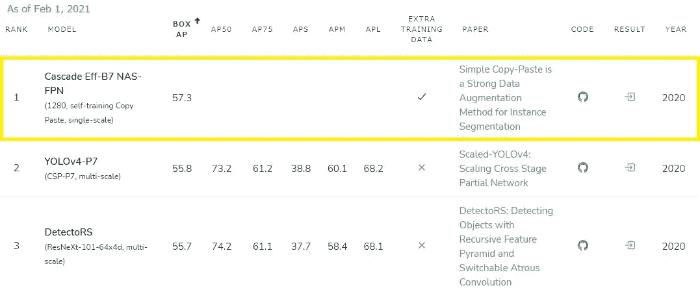

截图由作者于 2021 年 2 月 1 日在[paperswithcodes.com](https://paperswithcode.com/sota)拍摄。

该模型的名称是**级联 Eff-B7 NAS-FPN，具有自我训练和复制粘贴功能。**模型名称的每一项都包含了伟大研究者的贡献。为了以结构化的方式解释模型架构，我将主题分成了两个领域:模型架构和数据扩充。让我们深入了解每个构建模块。

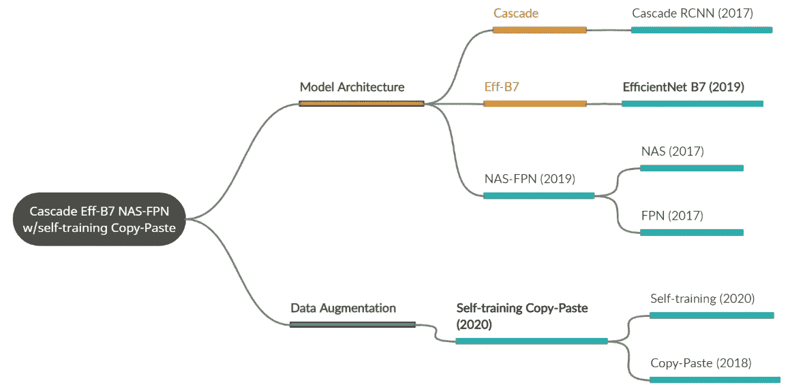

作者创建的图表。

首先，将这个冗长命名的模型分解为 **Cascade Eff-B7 NAS-FPN** (上半部分)和**自训练复制粘贴**(下半部分)。第二，级联 Eff-B7 NAS-FPN 进一步分解为 [Cacade R-CNN (2018)](https://arxiv.org/abs/1712.00726) 、[efficent net B7(2020)](https://arxiv.org/abs/1905.11946)、 [NAS-FPN (2019)](https://arxiv.org/abs/1904.07392) 。第三，NAS-FPN 包括两个组件: [NAS(神经架构搜索，2017)](https://arxiv.org/abs/1611.01578) 和 [FPN(特征金字塔网络，2017)](https://arxiv.org/abs/1612.03144v2) 。然后，让我们看看下半部分的数据扩充。[自我训练复制粘贴(2020)](https://arxiv.org/abs/2012.07177v1) 由两个研究贡献:[自我训练(2020)](https://arxiv.org/abs/2006.06882) 和[复制粘贴(2018)](https://arxiv.org/abs/1807.07428) 。我们参观这些组件的行程安排如下。

# **目录**

**一、数据扩充**

1.  复制粘贴增强
2.  自我训练复制粘贴
3.  什么时候我们应该应用自我训练复制粘贴？

**二。模型架构**

1.  效率网
2.  FPN(特征金字塔网络)
3.  神经结构搜索
4.  NAS-FPN
5.  级联 R-CNN

**三。关闭**

# **数据扩充**

数据扩充的目的是通过对现有图像应用合成变换来增加数据集的大小。数据扩充的传统方法是随机裁剪、旋转、缩放、水平或垂直变换的组合。其他方法是改变图像的对比度或亮度。更高级的方法可以是填充雨的效果，太阳耀斑，甚至敌对的噪音。当您组合这些转换方法时，增加的数据如下所示。由于适当的数据扩充，计算机视觉模型的性能有望变得更加稳健和准确。

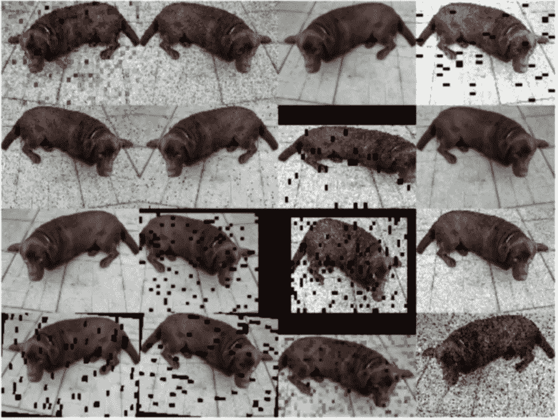

来源是 Alexandra Deis 帖子中的[图片。](/data-augmentation-for-deep-learning-4fe21d1a4eb9)

如果您没有使用过数据扩充，Sumit Sarin 的文章是一个很好的起点，因为它展示了带有代码的介绍性示例。此外，你可以在 [AgaMiko 的知识库](https://github.com/AgaMiko/data-augmentation-review)找到各种传统和现代的图像和音频数据增强方法。

## 复制粘贴增强

我们终于要去访问的文件，[“简单的复制粘贴是一个强大的数据增强方法，例如分割。”](https://arxiv.org/abs/2012.07177v1)一些一直在跟踪这个领域的读者会认为[复制粘贴方法自 2018 年](https://arxiv.org/abs/1807.07428)就已经存在了！作者讨论了与相关作品的不同之处:1)大规模抖动(LSJ)，2)自训练复制粘贴，3)不考虑图像背景的简单随机复制粘贴，以及 4)不应用几何变换(如旋转)。让我深入探讨一下前两点。如下图所示，一幅图像的裁剪实例(不是整个边界框)被粘贴到另一幅图像的随机位置上，抖动很大。通常，标准比例抖动从 0.8 到 1.25，但作者通过应用从 0.1 到 2.0 的大比例抖动获得了明显更好的模型性能，这非常有趣。

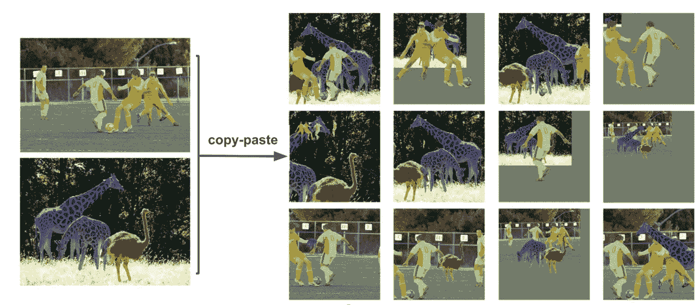

来源是[图 2 的简单复制粘贴纸。](https://arxiv.org/pdf/2012.07177v1.pdf)

## **自我训练复制粘贴**

复制-粘贴方法被应用于附加的未标记图像以及具有标记的监督数据。该研究使用了标记的 COCO 数据集(118K 图像)以及未标记的 COCO 数据集(120K 图像)加上 Objects 365 数据集(610K 图像)。这个过程非常简单。

1.  在标记数据上训练具有复制粘贴增强的监督实例分割模型；
2.  使用步骤 1 中训练的模型在未标记的数据上生成伪标签；
3.  将地面实况实例粘贴到伪标记和监督标记的图像中，并在此新数据上训练模型。

步骤 3 中的关键是我们只粘贴来自真实情况的实例，而不是伪标签实例。你可以从 Google Brain 的论文[反思预训练和自我训练](https://arxiv.org/abs/2006.06882)中了解更多关于自我学习的内容。根据这篇论文，自我训练可以使机器学习方法在更少的数据下更好地工作。对于一些复杂的情况，通过自我训练的伪标签可以比人类更好地标注。

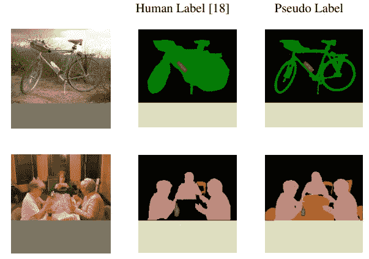

来源是[反思培训前和自我培训论文](https://arxiv.org/pdf/2006.06882.pdf)的图 4。

请查看附录中的“自我训练中伪标签的可视化”一节，因为有更多的伪标签示例。

## 什么时候我们应该应用自我训练复制粘贴？

正如您可能已经意识到的，您需要注释边界框和实例，即使您的最终目标是开发一个对象检测模型。作者发现，与相应的基线模型相比，当可用的标记数据集更少时，应用带有自我训练的复制-粘贴的 Box AP 的增加更高。当仅使用标记的 COCO 数据集的 10%时，在大规模抖动之上，效率是基线模型的 4.8 盒 AP(包围盒平均精度)。因为工作量非常大，所以当数据集很小时，并且项目中有足够的资源进行标注时，使用这种方法更现实。

# **模型建筑**

我们已经了解了在[中使用的数据扩充技术。“简单的复制粘贴是一种用于实例分割的强大的数据扩充方法。”](https://arxiv.org/abs/2012.07177v1)让我们继续我们的旅行，了解论文的引擎，**级联 Eff-B7 NAS-FPN** 。让我只关注每个组件的整体工作原理。我选择了以下主题的顺序，以便比其他主题更早地涵盖更重要的构建模块。

## 效率网

[EfficientNet](https://arxiv.org/abs/1905.11946) 是谷歌在 2019 年开发的一种非常强大的模型创建方法。它旨在确定与给定数据集相对应的神经网络的最佳架构。这些曾经是我们面临的常见问题。

*是否应该增加神经网络的深度？是否应该增加每层的通道数量？或者说，是不是应该提高每一层的分辨率？*

EfficientNet 控制深度、宽度和输入分辨率值，以有效地扩大基线神经网络。除了这些控制变量，我们还需要注意优化模型中的资源约束。例如，预算是收入优化模型的约束条件。如果我们可以忽略预算，我们应该选择更多的劳动力和更多的资本来达到更高的生产水平。在 EfficientNet 中，我们设置深度、宽度和分辨率值的乘积必须小于某个阈值。在这种资源约束下，我们可以通过限制所需的计算能力来有效地实现最佳的神经网络架构。例如，如果模型增加深度和宽度，它必须降低分辨率以满足资源约束，这样模型就不会要求超过我们所能承受的计算资源。

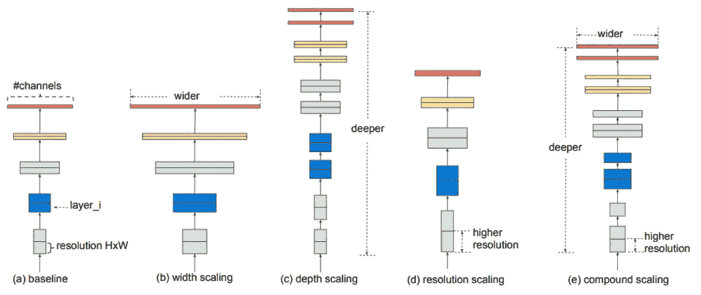

来源是效率网论文的[图 2。模型缩放。(a)是一个基线网络示例；(b)-(d)是仅增加网络宽度、深度或分辨率的一个维度的传统缩放。(e)是 paper 提出的复合缩放方法，它以固定的比例统一缩放所有三个维度。](https://arxiv.org/pdf/1905.11946.pdf)

[高效扩展的 conv net](https://www.youtube.com/watch?v=fC39F8AqPo0)是理解高效网络概念的重要资源。

***高效网-B7***

你仍然会有一个问题；什么是 **B7** 的结尾？模型的复杂程度可以用 FLOPs(每秒浮点运算次数)来定义。FLOPs 表示每秒执行的加法或乘法次数。例如，EfficientNet-B0 进行了 3.9 亿次浮点运算，而 B7 进行了 370 亿次浮点运算。这意味着 B7 在约束中有更高的预算/资源，但是 B7 也需要更高的计算能力来从搜索空间中找到最优值。您可以记住“B”之后的较大值需要更高规格的机器，并且通常需要更大容量的数据集作为输入来微调预训练的模型。

## **FPN(特征金字塔网络)**

检测图像中不同大小的物体一直是计算机视觉中的一个基本难题。人们过去常常使用[尺度不变特征变换](https://en.wikipedia.org/wiki/Scale-invariant_feature_transform)来解决没有神经网络的相同问题。要素金字塔用于检测不同比例的对象。FPN 致力于让系统识别照片中站在远处的小狗和坐在摄影师前面的大狗可以属于同一“狗”类别。 [SSD(单次多盒探测器，2016)](https://arxiv.org/abs/1512.02325) 是另一种通过创建不同比例的特征地图来克服这一问题的有用方法。根据 [FPN (2017)](https://arxiv.org/abs/1612.03144) 的论文，FPN 有两个优势。首先，它重用不同比例的功能图，以自下而上的方式继承 SSD 的优势。第二，FPN 合并两个编码的见解:一个具有来自自顶向下路径的语义强但粗糙的分辨率，另一个具有来自横向连接的语义弱但高的分辨率，以增强对象检测中的性能，从而提高模型性能。

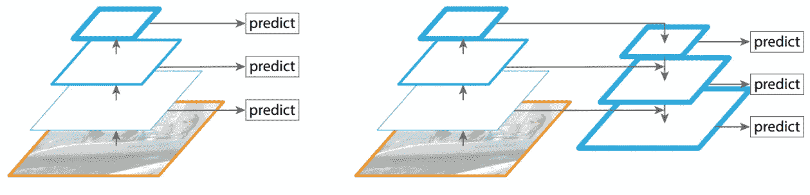

来源是 FPN 论文的[图 2。](https://arxiv.org/pdf/1612.03144.pdf)

## **NAS(神经架构搜索)**

[NAS (2017)](https://arxiv.org/abs/1611.01578) 是一种使用搜索算法从所有可能的架构中自动找到最大化关键指标的最佳架构的方法。对于不熟悉现代建筑的人来说，传统的神经网络是线性连接的(下面左边的模型)，但是现代的神经网络有分支和跳跃连接(下面右边的模型)。

来源是[图 3.2。神经架构搜索](https://link.springer.com/chapter/10.1007/978-3-030-05318-5_3)

让我用一个 [DARTS(可区分架构搜索)](https://arxiv.org/abs/1806.09055)的优化过程来说明一个单元搜索算法的例子。下面的四个图(a)到(d)显示了运行优化的步骤。首先，(a)是优化中的初始状态。每个带数字的方框就是一个节点，节点之间通过有向边连接，这是一条单向路径。节点 0 是输入，节点 1 是输出。

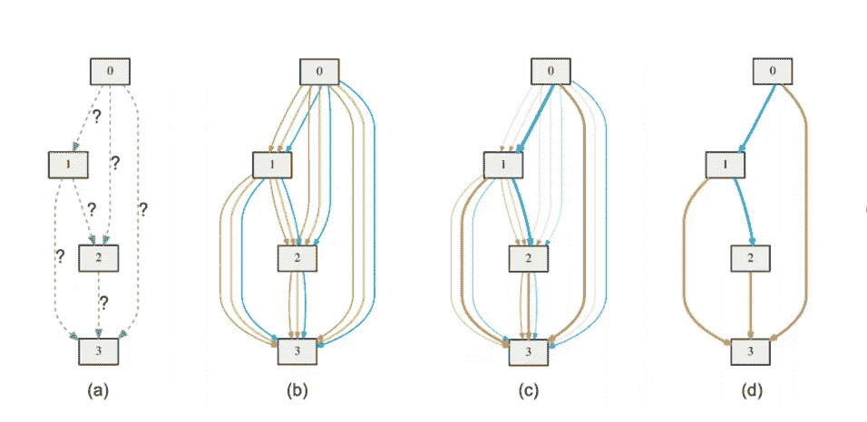

来源是[飞镖纸](https://arxiv.org/pdf/1806.09055.pdf)的图 1。

在运行搜索算法之前，我们不知道应该如何连接节点，包括跳过连接。跳过连接的一个例子是在节点 0 和 3 之间。跳过连接是 [ResNet (2015)](https://arxiv.org/abs/1512.03385) 中用来克服消失梯度问题的一个非常重要的概念，[这是研究它的一个很好的资源](https://theaisummer.com/skip-connections/)。节点之间不同颜色的边代表不同类型的卷积层和最大池层。DARTS 通过以下步骤确定最佳架构。在状态(a)中，飞镖不知道边缘。在状态(b)中，它在每个边上放置候选操作的混合，并且它使用状态(c)中的候选边来解决双层优化问题。最后，它归纳出状态(d)中的最终架构。EfficientNet 的基线网络由[MNAS](https://arxiv.org/abs/1807.11626)开发。

## NAS-FPN

[NAS-FPN (2019)](https://arxiv.org/abs/1904.07392) 的作者挑战优化 FPN 的架构。NAS-FPN 设计的体系结构不再像最初的 FPN 体系结构那样对称，但它仍然包含自上而下和自下而上的连接结构，以融合跨规模的功能。通过结合可扩展搜索空间和神经结构搜索(NAS)算法来实现结构优化，以克服金字塔结构搜索空间大的缺点。优化过程中的一个关键决策是两个任意特征图(具有强语义的高级特征和具有高分辨率的低级特征)是否需要通过两个二元操作中的一个来合并:求和或全局池。下面的图(a)是普通的 FPN，由 NAS 算法开发的不同 fpn 用平均精度(AP)表示，作为比较架构的检测精度。

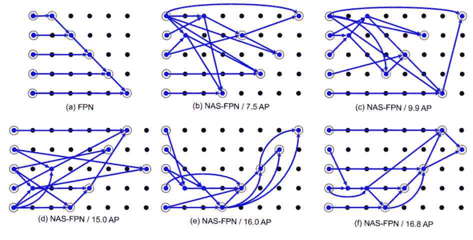

来源是 NAS-FPN 论文的[图 7。](https://arxiv.org/pdf/1904.07392.pdf)

强化学习用于优化模型架构。如何合并节点的决定由控制器递归神经网络(RNN)做出，因为构建块的顺序很重要。控制器对具有不同架构的子网络进行采样。可以想象，这些实验需要巨大的计算能力，作者在实验中使用了 100 个张量处理单元(TPU)。在保留验证集上产生的 AP 被用作更新控制器的奖励。大多数独特的架构在大约 8，000 步后就收敛了。最后，以下是在实验中 RL 训练期间所有采样架构中具有最高 AP 的架构。

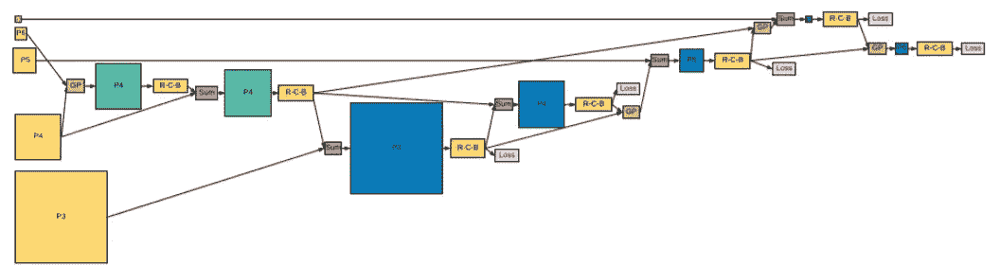

来源是美国国家科学院-FPN 论文的[图 6。该论文描述了“在 NAS-FPN 中发现的具有 5 个输入层(黄色)和 5 个输出特征层(蓝色)的 7-合并单元金字塔网络的架构”。GP 和 R-C-B 分别代表“全球统筹”和“conv-批处理”](https://arxiv.org/pdf/1904.07392.pdf)

## **级联 R-CNN(基于区域的 CNN)**

[级联 R-CNN](https://arxiv.org/abs/1712.00726) 于 2018 年研发。目标检测中的一个传统问题是选择正确的交集/并集(IoU)阈值来训练模型和运行推理。如果使用低 IoU 阈值(如 0.5)训练对象检测器，它通常会产生噪声检测，并且检测性能往往会随着 IoU 阈值的增加而下降，因为较高的 IoU 往往会通过收紧框来产生假阴性。级联 R-CNN 的主要贡献是缓解这个问题，因为一系列检测器可以基于其下面的架构适应越来越高的 iou。

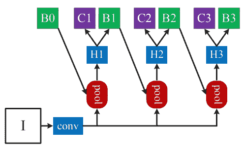

来源是[级联 RCNN 论文](https://arxiv.org/pdf/1712.00726.pdf)的图 3。本文描述了模型的体系结构。“I”是输入图像，“conv”主干卷积，“池”区域特征提取，“H”网络头，“B”边界框，以及“C”分类。“B0”是所有架构中的建议。

级联 R-CNN 具有四个阶段，一个 RPN 和三个 rcnn，用于以越来越高的阈值进行检测。本文中的实验在这些阶段使用 0.5、0.6 和 0.7 IoU 阈值。作者通过将一个粗略的结合盒方案交给下一阶段，通过增加每个阶段的 IoU 阈值来改进它，从而克服了过度拟合。结果，定位和检测的性能将优于具有一个 IoU 阈值的模型。详细的论文综述可在[阅读:级联 R-CNN——深入研究高质量物体探测(物体探测)](https://sh-tsang.medium.com/reading-cascade-r-cnn-delving-into-high-quality-object-detection-object-detection-8c7901cc7864)获得。

# **关闭**

我原本计划在 Yolo v4 成为对象检测领域的最佳模型后，写一篇关于[用交叉部分网络(CSP)](https://alexeyab84.medium.com/scaled-yolo-v4-is-the-best-neural-network-for-object-detection-on-ms-coco-dataset-39dfa22fa982) 扩展 Yolo v4 的博文；然而，Cascade Eff-B7 NAS-FPN 通过自我培训复制粘贴，在排行榜上压倒了其他车型。我很高兴看到它自 2020 年 12 月中旬以来一直排名第一。2020 年物体探测的竞争非常激烈，最初的模型通常每个月至少更换一次。在 CNN 模型的这些竞争之上， [Vision Transformer](/are-you-ready-for-vision-transformer-vit-c9e11862c539) 由谷歌推出，我预计这种基于 Transformer 的架构将在 2021 年繁荣起来。如果你对 NLP 中的 Transformer 架构感兴趣，请阅读我之前的文章。

我希望你喜欢我的旅行。尽管带有 CSP 的缩放 Yolo v4 不再是最好的模型，但我喜欢 Yolo 系列的框架来训练模型，因为它们非常用户友好。我对我们的下一次旅行有一些想法。它可能是关于使用 Scale Yolo v4 和 CSP 代码微调模型的教程，或者是关于基于 EfficientNet 的新模型(如 [EfficientNet Cascades](https://arxiv.org/abs/2012.01988) )的论文综述。我列出了我在本文中介绍的有用模型的 Github 资源库的链接，以便您可以使用它们！

## GitHub 仓库

*   [带自我培训的高效网络-B7-nasf pn](https://github.com/tensorflow/tpu/tree/master/models/official/detection/projects/self_training)
*   效率网([py torch](https://github.com/rwightman/pytorch-image-models))([tensor flow](https://github.com/tensorflow/tpu/tree/master/models/official/efficientnet))
*   [级联 R-CNN](https://github.com/zhaoweicai/cascade-rcnn)
*   [带 CSP 的 Yolo v4](https://github.com/WongKinYiu/ScaledYOLOv4/tree/yolov4-csp)