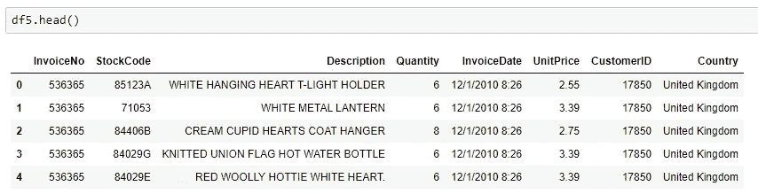
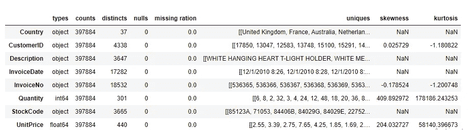
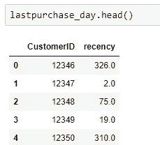
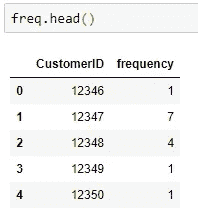
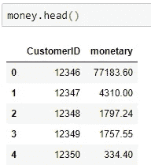
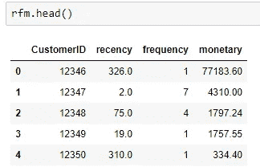
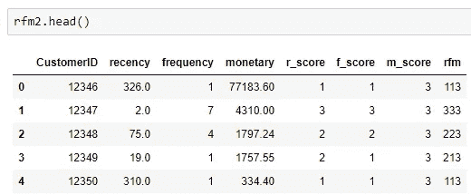

# 使用 RFM 分析进行简单的客户细分

> 原文：<https://towardsdatascience.com/simple-customer-segmentation-using-rfm-analysis-1ccee2b6d8b9?source=collection_archive---------7----------------------->


Jonathan Pielmayer 在 [Unsplash](https://unsplash.com?utm_source=medium&utm_medium=referral) 上的照片

# **什么是 RFM 分析？**

RFM 分析是一种客户行为细分技术。基于客户的历史交易，RFM 分析关注客户交易的 3 个主要方面:**最近**、**频率**和**购买金额**。了解这些行为将使企业能够将不同的客户分组。

# 我如何应用 RFM 分析？

## **数据集**

这是一家商店的数据集，其客户来自世界各地。它包括发票号、发票日期、客户 id、库存代码、产品描述、购买数量和客户所在国家等信息。在本文中，我将只向您展示我进行 RFM 分析的方法，而不是清理数据集的步骤。 ***下图 1 & 2*** 是我的数据集经过编辑变换后的结果。



图 1:我的数据集可视化(df5)



图 2: df5 信息

## RFM 分析

首先，我将在我的分析中澄清 RFM 的定义。

*   **Recency (R)** :顾客购买的时间。
*   频率(F) :顾客购物的频率。
*   **Monetary (M)** :顾客为他们的购买支付了多少钱。

接下来，我将为每个客户计算这 3 个组成部分。

**近因(R)**

```
import datetime###Calculate total_amount of money for each order
df5.InvoiceDate = pd.to_datetime(df5.InvoiceDate)df5['amount'] = df5.Quantity*df5.UnitPricedf6=df5.copy()###Taking a reference date to calculate the gap between this reference date and the last purchase date of each customer.
The gap can be referred as the recency of each customerreference_date = df6.InvoiceDate.max() + datetime.timedelta(days = 1)df6['days_from_last_purchase'] = (reference_date - 
df6.InvoiceDate).astype('timedelta64[D]')lastpurchase_day = df6[['CustomerID','days_from_last_purchase']].groupby('CustomerID').min().reset_index()lastpurchase_day.rename(columns={'days_from_last_purchase':'recency'}, inplace=True)
```

在计算每个客户最后一次购买后的天数后，我得到如下输出:



图 3:客户的新近度

**频率(F)**

```
###Calculate number of orders purchased by each customer
freq = df6[['CustomerID','InvoiceNo']].groupby(['CustomerID','InvoiceNo']).count().reset_index().\
groupby(["CustomerID"]).count().reset_index()freq.rename(columns = {'InvoiceNo':'frequency'}, inplace = True) 
```

客户频率的结果如下:



图 4:客户的频率

**货币(M)**

```
###Total amount of money spent per customer
money = df6[['CustomerID','amount']].groupby('CustomerID').sum().reset_index()
money.rename(columns = {'amount':'monetary'}, inplace = True) 
```

输出:



图 5:客户的货币

最终，当我将这 3 个指标结合起来时，这里是每个客户的 RFM 信息。



图 6:客户的 RFM

**RFM 得分**

在获得每个客户的 RFM 信息后，我会根据每个买家的 RFM 数据给她/他一个 RFM 分数。我的评分基准将取决于每个指标的百分比。详细的，可以看下面的代码做更多参考:

```
###Calculating quantile values
quintiles = rfm[['recency', 'frequency', 'monetary']].quantile([.2, .25, .3, .35, .4, .5, .6, .7, .8, .9]).to_dict()###Benchmark to give score for recency indicator
def r_score(r):
    if r < quintiles['recency'][.2]:
        return 3 
    elif r < quintiles['recency'][.8]:
        return 2
    else: 
        return 1###Benchmark to give score for frequency & monetary indicator.   
def fm_score(f): 
    if f > quintiles['frequency'][.8]:
        return 3
    elif f > quintiles['frequency'][.2]: 
        return 2
    else: 
        return 1
```

将此规则应用于数据框:

```
rfm2 = rfm.copy()
rfm2['r_score'] = rfm2.recency.apply(lambda x: r_score(x))
rfm2['f_score'] = rfm2.frequency.apply(lambda x: fm_score(x))
rfm2['m_score'] = rfm2.monetary.apply(lambda x: fm_score(x))
rfm2['rfm'] = rfm2['r_score'].map(str)+rfm2['f_score'].map(str) + rfm2['m_score'].map(str)
```

每个顾客现在都有一个 RFM 分数:



图 7: RFM 分数

## RFM 聚类

现在，这是我最喜欢的一步，因为我可以按照我想要的方式来分组。但是，在对客户进行分类时，考虑您的业务情况是很重要的。不同的商业目的会产生不同类型的分组，进而产生不同的策略。

在这一部分，我将把我的客户分成 7 组，每组标记如下:

```
###Loyal Customers, who are the champions of all the customers with highest score of RFM. 
rfm2_group1 = rfm2[rfm2['rfm']=='333']
rfm2_group1['label'] = 'champion'###Customers who have the most potential to become the Champions. They recently buy the products and they make their purchases quite frequently. Moreover, the amount they spent is quite great. rfm2_group2 = rfm2[rfm2['rfm'].str.contains('332|331|323|313')] 
rfm2_group2['label'] = 'potential1'###Customers whose frequency score and monetary score are slightly lower than potential 1 group
rfm2_group3 = rfm2[rfm2['rfm'].str.contains('321|322|311|312')] 
rfm2_group3['label'] = 'potential2'###Customers who used to pay a lot of money and come to the store frequently. They did not purchase recently. 
rfm2_group4 = rfm2[rfm2['rfm'].str.contains('233')]
rfm2_group4['label'] = 'needing_attention1'###Customers who do not come to store often and not frequently make purchases.
rfm2_group5 = rfm2[rfm2['rfm'].str.contains('223|213|212|231|232|211|221|222')]
rfm2_group5['label'] = 'needing_attention2'###Customers who haven't paid a visit to the store for a long time. However, once in a while, they do spend lot of money
rfm2_group6 = rfm2[rfm2['rfm'].str.contains('132|123|113|133')]
rfm2_group6['label'] = 'lost1'###Customers who churn
rfm2_group7 = rfm2[rfm2['rfm'].str.contains('111|112|121|122|131')]
rfm2_group7['label'] = 'lost2'
```

# **结论**

以上是对 RFM 的简单分析。然而，当结合其他深层分析时，RFM 可能更有意义。我希望这篇文章能对你今后的工作有所帮助。