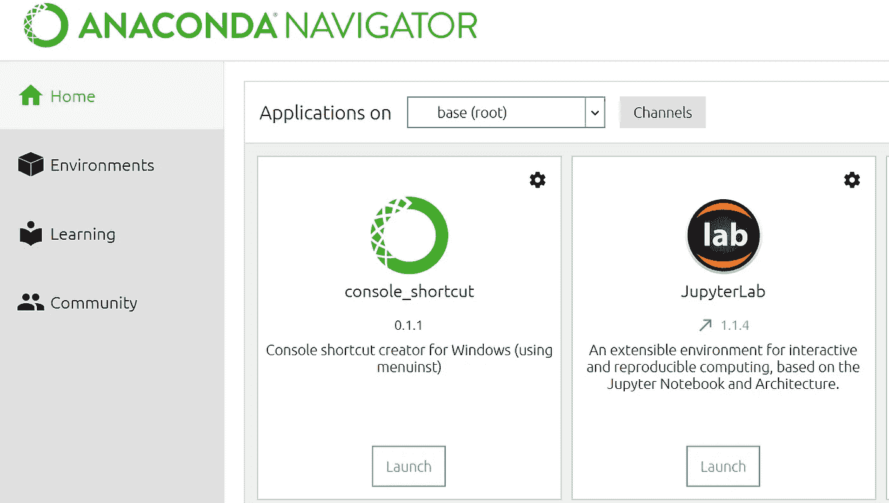
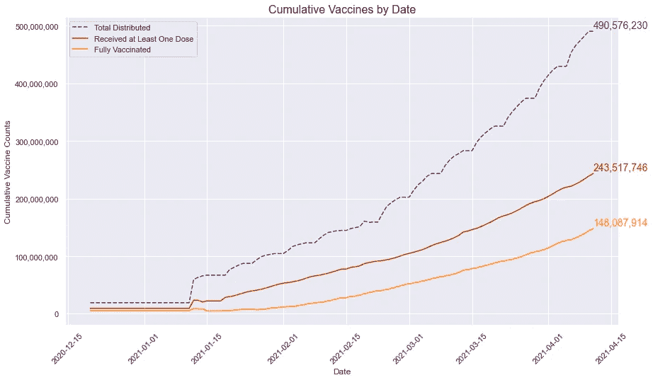
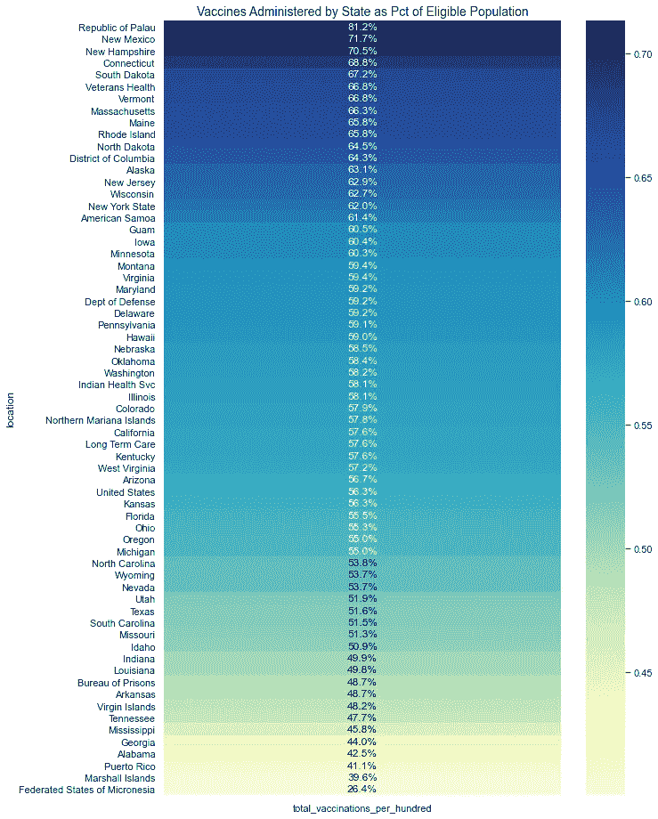
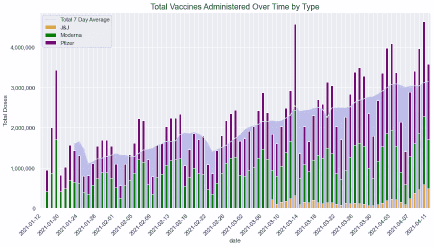

# 简单的仪表盘，只需 Jupyter

> 原文：<https://towardsdatascience.com/simple-dashboards-just-with-jupyter-187c4ea2502d?source=collection_archive---------14----------------------->

## 有时候一辆小型货车就够了，你却送来一辆卡迪拉克


[粘土银行](https://unsplash.com/@claybanks?utm_source=medium&utm_medium=referral)在 [Unsplash](https://unsplash.com?utm_source=medium&utm_medium=referral) 拍摄的照片

有一种东西叫做合适的工作工具。当您或您的组织可以使用昂贵的可视化软件，如 Tableau、Power BI 或 Domo 时，每个问题看起来都像钉子，您的程序就是锤子。如果你是这样一个组织的数据分析师，你将不可避免地在其中一个仪表板上花费无数的时间，并嵌入公司高级决策者可能提出的任何问题的每一个可以想象的答案，只是为了在一周后收到一封电子邮件，其中包含一些请求，表明甚至没有人在使用仪表板的最基本功能。我不能假装知道为什么有些人(尤其是高层管理人员)不喜欢交互式 Tableau 应用程序的美妙之处，因为条形图、传单和折线图都以完美的和谐方式同步在一起，但这可能是因为整天不处理数据的人天生不知道如何导航这样的东西，也不想花费任何宝贵的时间来试图弄明白它。

与其处理所有这些麻烦，不如考虑使用 Jupyter Lab，结合基本的 Python 和 markdown 来创建简单的可视化，导出到 HTML 或 PDF 文档中，直奔主题，基本上不需要任何维护成本，并且可以在几个小时内完成。我并不认为这样的东西适合所有情况，但它可能是箭筒中的一支箭，因为无论谁需要仪表板，快速浏览数据就可以了，而不是一个完美的视觉辅助工具的马赛克。我发现许多高层可以更容易地访问如此简单的东西，并意识到只需投入很少的资源来设置和维护它。

<https://github.com/mikekeith52/JupyterDashboard>  

# 安装和导入数据

## 蟒蛇

首先，我建议使用 Anaconda 来运行 Jupyter 实验室。有许多资源描述了如何做到这一点——我特别喜欢来自[熊猫](https://pandas.pydata.org/pandas-docs/stable/getting_started/install.html#installing-with-anaconda)的指南。我个人在 Windows 上使用 64 位图形安装程序 Anaconda 发行版(点击[这里](https://medium.com/r?url=https%3A%2F%2Frepo.anaconda.com%2Farchive%2FAnaconda3-2020.11-Windows-x86_64.exe)下载)来运行我的大部分 Python 应用程序，但是我知道还有其他的方法。使用对你的情况最有意义的东西。

安装 Anaconda 之后，您应该能够通过打开 Anaconda Navigator 并在 JupyterLab 应用程序框中选择 Launch 来运行 Jupyter Lab。



作者图片

您也可以通过在 Anaconda 提示符下键入“jupyter lab”来启动它。


## Nbconvert

接下来，您需要安装 Nbconvert。我推荐阅读整个[文档](https://nbconvert.readthedocs.io/en/latest/install.html)，以防你对我的总结有疑问。要安装它，请在 Anaconda 提示符下使用以下命令:

```
conda install nbconvert
```

## Pandoc

要将最终产品导出为 HTML 文档，您需要安装 Pandoc。对于 Windows，建议使用安装程序，但也有其他安装方法。你可以在这里找到所有的信息。

我更喜欢将结果导出为 HTML 格式——速度快，最终产品看起来也很棒。但是您可以探索其他导出选项，包括 PDF 和 Latex。这些工具的安装更加复杂。同样，所有这些都可以在 Nbconvert [文档](https://nbconvert.readthedocs.io/en/latest/install.html)中找到。

## 导入数据

最后，让我们导入数据。我认为这意味着为大多数用户建立一个到数据仓库的 SQL 连接(对我来说通常是这样)，但这也意味着从共享驱动器、API 等导入数据。这里重要的一点是，导入要在代码中没有警告的情况下完成。警告不会阻止您的代码工作，但它们会导出到最终的 HTML 文档中，除非您手动将它们从笔记本中清除。对于您运行的每个编码块都是如此。

对于这个例子，我将使用 GitHub 上的[数据中的新冠肺炎疫苗接种数据。](https://github.com/owid/covid-19-data/tree/master/public/data/vaccinations)

以下是所需进口的清单:

```
import datetime
import numpy as np
import pandas as pd
import matplotlib.pyplot as plt
import matplotlib.ticker as ticker
import seaborn as sns
from IPython.core.display import display, HTMLpd.options.display.max_rows = None # to print tables
pd.options.display.max_columns = None # to print tablesdata_state = pd.read_csv('us_state_vaccinations.csv')
data_manufac = pd.read_csv('vaccinations-by-manufacturer.csv')
```

# 添加视觉效果

现在我们已经安装了 Jupyter Lab 和所有必要的附加组件，并且我们已经读取了数据，我们可以开始制作数据可视化。

对于这个例子，我将构建三个图形，并在输出中包含两个表格。我还会在 Jupyter 上使用 Markdown，以便在不同部分之间轻松导航。

## 图 1——按日期累计接种的疫苗

对于这个图表，我使用了一个折线图，其中显示了三个统计数据:分发的疫苗总数、接种疫苗的人数以及从 2020 年 12 月 15 日到现在(2021 年 4 月 15 日)完全接种疫苗的人数。这是一个非常简单的可视化，唯一潜在的挑战是将最后一个数据点放在每一行的末尾，使用 matplotlib text()函数给出各个组的总数字。下面给出了 Python 代码。

首先，准备数据:

然后，构建图表:

输出如下所示:



作者图片

## 图 2——各州管理的疫苗

接下来，用一个图表来表示美国各州/地区的表现。许多人表示这些统计数据的第一个想法是活页图表，它基本上是您正在绘制的区域的区域地图，不同的区域用阴影表示不同的密度。但是，在这种情况下，这些数据可能很难生成，也不像简单的热图那样直接获得相关的比较。让我们看看热图是什么样子的。

我们可以使用为之前的图表准备的数据。创建视觉帮助的代码:

输出是:



我们还可以在表格中添加这些信息，以及每个州的疫苗接种总数。代码包含在上面 GitHub 链接的笔记本中。

## 图 3——由制造商管理的疫苗

最后，让我们按制造商细分数据。对于这个图表，我们可以尝试一些更高级的东西:一个叠加了阴影线的堆叠条形图，代表 7 天的滚动平均线。让条形图和折线图之间的日期对齐可能很棘手，因为底层 matplotlib 函数默认为两个图表的不同日期表示。

准备数据的代码如下所示:

进行可视化的代码:

输出:



作者图片

让我感到惊讶的一件事是，强生疫苗的使用量如此之少。考虑到这是一种单剂量疫苗，我预计它会更受欢迎。即使是简单的可视化，也可以从数据中发现有趣的见解。

# 导出结果

现在我们有了三个可视化效果，我们可以将笔记本导出到一个 HTML 文档中。理论上有一种方法可以通过在代码中使用“%matplotlib widget”命令来使这些图表都是交互式的，但是我还不能在我的系统上使用它。欢迎评论中的任何建议。无论如何，export 命令涉及使用 Anaconda 提示符来运行两个命令:

```
cd local/path/to/jupyter/notebook
jupyter nbconvert --to html --no-input dashboard.ipynb
```

这将把一个 HTML 文档放在与笔记本相同的本地目录中。有关本例中使用的完整代码，请参见此处的[。](https://github.com/mikekeith52/JupyterDashboard/blob/main/dashboard.ipynb)

# 刷新分析

要用新数据刷新分析，只需确保已经建立了数据的实时提要(在本例中，我使用了需要重新下载的平面文件)。然后，在 Jupyter 笔记本打开的情况下，在浏览器中选择“内核→重启内核并运行所有单元”就很容易了。确认您想要重新启动内核，然后在 Anaconda 提示符下重新运行上一节中给出的命令，您将获得新的输出，可以通过电子邮件发送给任何需要的人。这个过程比构建最先进的仪表板要简单得多，当您需要一些简单的东西并且您很快就需要它时，它会是一个有效的解决方案。