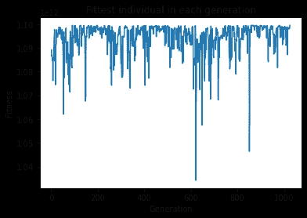

# 简单的开发人员开发的简单遗传算法(Python 语言)

> 原文：<https://towardsdatascience.com/simple-genetic-algorithm-by-a-simple-developer-in-python-272d58ad3d19?source=collection_archive---------16----------------------->


作者的《他们在进化》；由谢尔盖·塞明、[尤金·日夫奇克](https://unsplash.com/@eugenezhyvchik)和[美国宇航局](https://unsplash.com/@nasa)通过 [Unsplash](https://unsplash.com/) 拍摄的原始图像

在我们进一步讨论之前，尤其是在你开始评判我的代码之前，我需要做一些免责声明:

*   我不是 python 开发者；所以如果你觉得我的 python 很烂，那么，好吧，你可能是对的，
*   我绝不是进化算法方面的专家；接下来的代码只是我试图通过编写一个简单的实现来理解遗传算法，这是出于好奇心和多余的时间，
*   性能不是我的主要关注点；我想要实现的是一个相当容易理解的代码，可以很容易地映射到文献中描述的概念。

我已经决定从零开始实现一切，主要基于关于该主题的两本书[1][2]。术语*简单遗传算法*在这里与作者在【1】中描述的上下文相同。记住这一点，如果你在实现中发现任何错误，我将感谢反馈。

# 到底什么是遗传算法？

遗传算法是一种找到问题解决方案的方法，它受到生物学的启发，或者更准确地说是进化的启发([如果你需要的话，这里有](https://www.amazon.de/Origin-Species-Charles-Darwin/dp/1533556253)关于这个主题的不错的复习)。它也是更广泛的进化算法中最受欢迎的变体。基本的想法是从一组随机的解决方案开始(或者好的解决方案，如果你已经对这个领域有了相当的了解，并且知道一个好的解决方案可能是什么样子的话)。然后，对解决方案进行迭代评估，并从池中选择最佳方案，进行杂交和变异。这个过程重复固定的次数(代)，或者直到找到一个完美的解决方案，随着时间的推移导致(希望)更好的答案。

# 要解决的问题

我们将把这些原则一步一步地应用到一个简单的、有点人为的问题上。你可能会认为用遗传算法来解决它就相当于用坦克打死一只苍蝇。你不会错的。但是，为了这篇文章，让我们假设计算器还没有被发明出来，这是计算 0-1048575(包括 0-1048575)范围内的整数的最大平方的最好方法。

# **鸟瞰图**

在深入实施细节之前，让我们快速浏览一下该算法的高级概述:

1.  从一堆解决方案开始，可能是随机的。
2.  评估他们有多好。
3.  挑选一些将被用来创造新的，理想的更好的解决方案。
4.  从选定束创建对。每一对将产生两个新的解决方案。
5.  以一定的概率对新创建的解决方案进行小的随机更改。
6.  用新创建的解决方案替换以前的包。
7.  坚持下去，直到找到一个完美的解决方案，你终于厌倦了，或者你已经到达了宇宙的热寂。

# 个体、群体和健康

在进化算法的背景下，每个解决方案被称为一个个体。在给定时间被认为是解决方案的一组个体被称为**群体**。

每个个体可以通过其**基因型**来表征。基因型是算法直接操作的解的表示。问题领域中的实际解决方案被称为个体的**表型**(一个基因型总是转化为一个表型，然而一个特定的表型可能由多个不同的基因型获得)。

为了更具体一点，让我们考虑一下这在我们的问题中意味着什么。我们用来代表个体的基因型是一个二进制数。表现型是它的平方，用十进制整数表示。

为了表示我们操作的整数范围，我们需要一个长度为 20 的基因型(2 ⁰ = 1048576)，这意味着基因型在 0000000000000000000(二进制 0)和 11111111111111111(二进制 1048575)之间。例如，基因型为 00000000000000000101 的个体的表型将等于 25 (5)。

**适合度**是衡量解决方案有多好的指标。在我们的例子中，我们可以简单地用个体的表型作为它的适应度:代表个体基因型的数字的平方越大，它的适应度越高。在上面的例子中，个体的适应度等于 25。

让我们来看看一些代码:

`GenotypeDecoder`类用于在基因型(这里表示为二进制数字串)和相应的表现型之间进行转换。`FitnessEvaluator`评估给定基因型的适合度。在我们的例子中，这直接对应于个体的表型，所以使用解码器。

一个`Individual`有两个属性:`genotype`和`fitness`。`IndividualFactory`包装新的个人创作逻辑，并提供三种方法:

*   `with_random_genotype`创建一个具有随机基因型的个体——用于在最开始创建一个随机群体作为起点，
*   `with_set_genotype`创建具有提供的基因型的个体——当通过繁殖上一代的两个个体来创建新个体时使用。
*   `with_minimal_fitness`创建一个基因型仅由零组成的个体——用于创建一个适应度为 0 的个体群体的替代起点。

`Population`类持有个人的集合。它提供了一种通过`get_the_fittest`方法获得最适个体的方法。`PopulationFactory`是`IndividualFactory`的对应物，提供了用随机个体、给定个体和最小适应度个体创建群体的方法。

# 亲本选择和存活选择

创建新一代解决方案的第一步是从当前群体中选择将成为父母的个体(**父母选择**)。新创建的个体被称为**后代**。决定为下一代保留哪些个体被称为生存选择。

进行亲本选择有许多可能的方法。在我们的例子中，我们将采用**适合度比例选择**——个体成为父母的概率直接取决于他们的适合度。为此，我们将使用 [**随机通用抽样**](https://en.wikipedia.org/wiki/Stochastic_universal_sampling) 。

这里的基本思想是创建一个尺度，由群体中所有个体的适应值组成，然后从随机点 p 开始，以 1/池大小的步长遍历该尺度，使得`0 < p < 1/population size`。例如，假设我们的交配池由适应值为 1，5，3，12，9，6 的个体组成。为了形象化标尺，想象一把标有以下数值的尺子:

```
[0, 1, 6, 9, 21, 30, 36]
```

我们从 0 开始，并在标尺上的先前标记上添加一个新的适应值，因此 0 -> 0 + 1 = 1 -> 1 + 5 = 6 -> 6 + 3 = 9 ->等等。

现在，我们选择一个步骤，我们将沿着标尺移动。总的适应度等于 36 (1+ 5 + 3 + 12 + 9 + 6)，群体中有 6 个个体，所以我们准备从范围(0，36/6 = 6)中选取一个随机数作为初始偏移量。步长将等于 36/6 = 6。

假设我们的随机偏移量是 2。我们从 2 开始，并在我们的尺子上检查这对应于哪个个体——在这种情况下是指数为 1 的个体(尺子上的范围在 1 和 6 之间)——因此这个个体将被挑选到**交配池。**我们把步长加到当前位置，所以 2 + 6 = 8。我们重复与前面相同的过程，将第二个人添加到池中(范围在 6 和 9 之间)。我们不断重复这一过程，直到我们到达了统治者的尽头，并以产生下一代的 6 个个体的集合而结束。

被选中的个体构成了交配池**。**在我们的例子中，它的大小等于人口的大小。然而，这并不意味着我们选择每一个人。一些体能差的人根本无法游到泳池。另一方面，高度适合的人会不止一次出现在人才库中。这样，最佳解决方案更有可能产生后代，因此，平均而言，对下一代有更大的影响。

在我们的实现中，每一代都将完全取代上一代。这一点，加上每对父母将生育两个孩子的事实，将导致**人口规模**不变。

# 育种和突变

仅仅选择最合适的父母本身不会使我们走得很远。我们需要一种方法来将使个体适应下一代的特征传递给下一代。这就是**交叉**，或在我们的情况下**一点交叉**更准确地说，进来了。

杂交是另一个直接来自生物学的术语，意思是将两个个体(父母)的基因型结合成一对新的个体。例如，如果双亲的基因型为 000001111100000111111 和 111111110000000000，首先我们选择一个大于 0 且小于基因型长度(本例中为 20)的随机交叉点，比如 7。这意味着我们在第 7 位(0 索引)将两种基因型分开:

```
1a) 0000011   1b) 1110000011111
2a) 1111111   2b) 1110000000000
```

现在，我们通过将第一基因型的第一部分(1a)与第二基因型的第二部分(2b)以及第二基因型的第一部分(2a)与第一基因型的第二部分(1b)相结合来创建一对新的基因型:

```
1a) 0000011   2b) 1110000000000
2a) 1111111   1b) 1110000011111
```

新的基因型将成为后代。

除了使用现有的解决方案作为新个体的基础之外，我们还希望在这个过程中引入一些随机性(就像生物繁殖中的情况一样)。这是通过使用**突变**实现的。通过交叉创建的基因型中的每个位(**基因**)在创建新个体的最后阶段有小概率被翻转(0 变成 1，反之亦然)。在我们的例子中，我们将对每个基因突变使用 1/基因型长度的概率，因此在这种情况下 1/20 = 0.05。

我们将这两个概念封装在`Breeder`类中。它的`produce_offspring`方法以交配池为参数。

在每次迭代中，算法:

1.  从池中随机挑选两个人。
2.  通过杂交所选双亲的基因型来创造两个新个体。
3.  改变新产生的后代的基因型。
4.  将如此创建的个体添加到后代集合中，这些个体将成为下一代。

# 把所有的碎片放在一起

既然我们已经准备好了遗传算法所需的所有概念组件，我们可以将它们放在`Environment`类中。

它负责初始化群体，每次调用`update`方法时，它进行父代选择，产生后代，并用新的群体替换当前群体。此外，它还提供了一种通过`get_the_fittest`方法从当前群体中获得最合适个体的方法。

最后，我们需要实例化所有部分，决定一些参数(例如，世代数、基因型长度等。)，不断迭代，直到我们找到解决方案或者失去耐心。

我们将选择一个适中的 10000 代，人口为 50 人(如果您修改这个数字，请记住它必须是偶数)。最后，在算法完成后，我们打印出最适合的个体的基因型和它被创建时的代号，并绘制出每代中最适合的个体的适应度。



每一代中最适合的个体在 1024 代中结束。

# 结果

如果您有足够的勇气运行代码，并且不止一次地运行，您将会注意到找到解决方案的代在运行之间有很大的不同。这可以用算法固有的随机性来解释。

您可能希望调整算法的参数，如种群大小和突变概率(例如，增加种群大小很可能会更快地找到解决方案)。此外，您可能希望从最小适应度的群体开始，而不是从随机群体开始，并看看这如何改变几次运行所需的迭代次数(在`Environment`类中用`self.population = self.population_factory.with_minimal_fitness_individuals(size = population_size)`替换`self.population = self.population_factory.with_random_individuals(size = population_size)`行)。

希望这篇文章和代码能让遗传算法的一些核心概念更容易理解。该实现虽然远非完美，但应该足够模块化，并且易于通过根据需要切换算法的部分(例如，如何表示个体、适应度函数、单点交叉与 n 点交叉等)来修改。).作为一个 jupyter 笔记本，你可以在这里找到完整的代码。

参考资料:

[1] A.E .艾本，J.E .史密斯。 [*进化计算简介*](https://link.springer.com/book/10.1007/978-3-662-44874-8) *。*

[2]圣路加。 [*元启发式*](https://cs.gmu.edu/~sean/book/metaheuristics/) *要领。*