# 我如何在 VSCode 中为小型项目使用 GitHub

> 原文：<https://towardsdatascience.com/simple-github-integration-with-vscode-3d7a3db33047?source=collection_archive---------16----------------------->

## GitHub 是一个分享代码并保证其安全的好方法——vs code 是一个很棒的编辑器，可以与 GitHub 无缝协作

照片由 [Fotis Fotopoulos](https://unsplash.com/@ffstop?utm_source=medium&utm_medium=referral) 在 [Unsplash](https://unsplash.com?utm_source=medium&utm_medium=referral) 上拍摄

我不需要成为 GitHub 专家。我不需要在开发团队之间共享代码，也不需要拥有最终将被合并到一个产品中的多个版本的代码，或者做任何其他你可以用 Git 和 GitHub 做的美妙事情。

我所需要的就是为我创建的小项目准备一个可以与他人共享的存储库。我希望能够从不同的计算机和/或位置轻松访问我的代码。VSCode 和 GitHub 的结合简单而容易地做到了这一点。

使用 GitHub 还意味着我可以在多台机器上工作，随心所欲地使用 Windows 和 Linux，并且仍然可以在每台机器上保持代码同步和最新。

设置完成后，只需几次点击即可完成。

我将按照我自己的简单需求来运行我使用 GitHub 的步骤，所以如果你是 GitHub 专家或者你领导着一个远程工作的开发团队，在他们之间创建和共享文档和代码，那么你现在可能想要停止阅读——这不适合你。

但是如果你处在和我相似的位置，你创建了一些小项目，你想分享，同时保持你的代码安全可靠，并且你目前没有使用 GitHub，那么继续读下去。

## Git 基础

GitHub 使用版本控制系统 Git 管理代码，对该系统的支持内置于 VSCode 中。你可以从他们的[网站](https://git-scm.com/)下载 Git，一旦安装，VSCode 应该能找到它。

从根本上说，Git 会跟踪您在代码中所做的任何更改——编辑一个文件，Git 就会知道。但是为了更新一个项目，你需要*提交*变更。*提交*有两个部分，首先，您将您想要的文件添加到提交中——这被称为 staging——然后，您实际上用一条短消息提交更改(通常描述您所做的更改)。通过这种方式，Git 保存了一个代码库，其中包含最新版本的最新文件以及所做更改的历史记录。

一旦你的代码版本被提交，它就可以*被推*到一个像 GitHub 这样的远程仓库，并与全世界(或你的团队)共享。

相反，一个版本的代码可以从远程存储库被*拉*到本地机器上进行处理，然后当你完成后被推回到远程存储库。

这就是我在 Git 和 GitHub 中使用的全部内容，所以我就不多说了。但是你可以在他们的网站上找到关于 Git 和 T2 GitHub 的全面文档。

## 设置 Github 帐户

为了使用 GitHub，你需要一个帐户，而获得一个帐户是很简单的。您需要您的电子邮件地址和密码，并且您需要选择一个尚未使用的用户名。然后你必须解决一个难题，以确定你真的是一个人——这并不难。

接下来，他们会给你发送一个启动代码，你输入就可以开始了。

他们会询问你如何使用 GitHub 以及你的兴趣，并给你选择你可能感兴趣的不同账户。有些账户每月收取少量费用，但有一个免费账户可能是你想要的。你可以看看其他可用的细节，但免费的给了我所需要的一切。

## 创建存储库

一旦你整理好了你的账户，你会想要创建一个仓库(在 Git 圈子里也被称为“回购”)。在您的主页上，您应该会看到类似这样的内容:

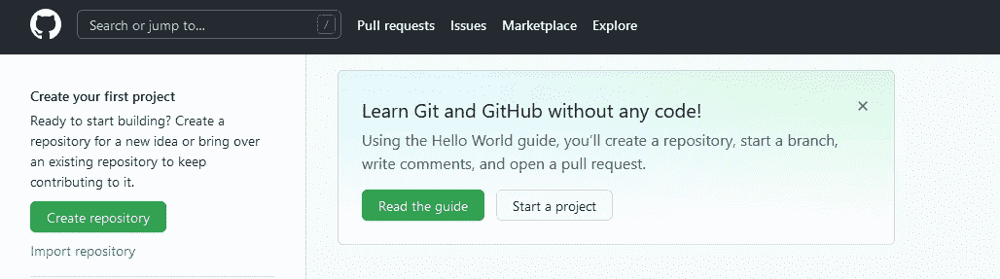

在 GitHub 中创建存储库—作者图片

点击“创建存储库”将弹出一个表单，您可以在其中命名回购，对其进行描述，并决定是公开还是私有。如果你把它公开，全世界都可以看到并下载你的代码。私有存储库是…它们是私有的。

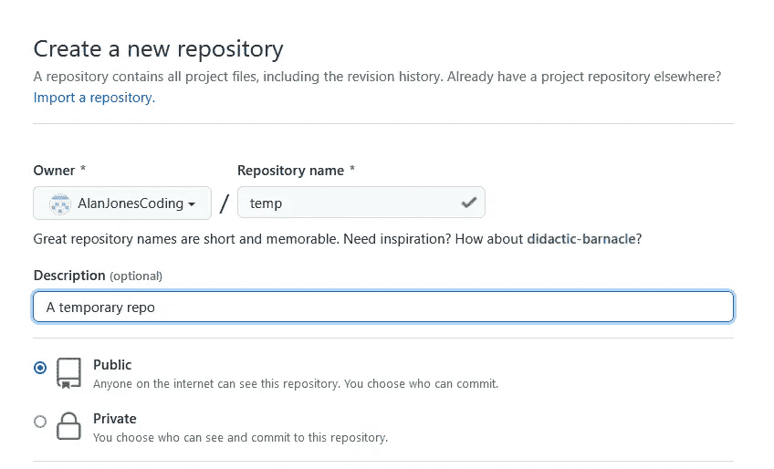

在 GitHub 中命名存储库——作者图片

然后会要求您指定一些选项。创建一个自述文件是一个好主意，您可以在其中描述回购的目的及其内容，因此选择该文件，它将自动为您创建。

我通常不关心*。gitignore* —这是一种指示 Git 忽略您不想包含在 repo 中的特定类型文件的方式。

最后，选择许可证。选择哪一个完全取决于你，但是 GitHub 公共回购应该是开源的。

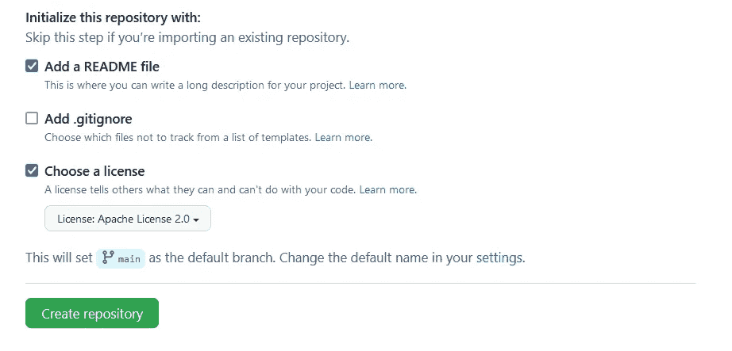

GitHub 中存储库的设置—按作者分类的图片

一旦你创建了你的回购，它会看起来像这样。README.md 文件是以回购协议的标题及其描述创建的，您可能希望以后更改它。

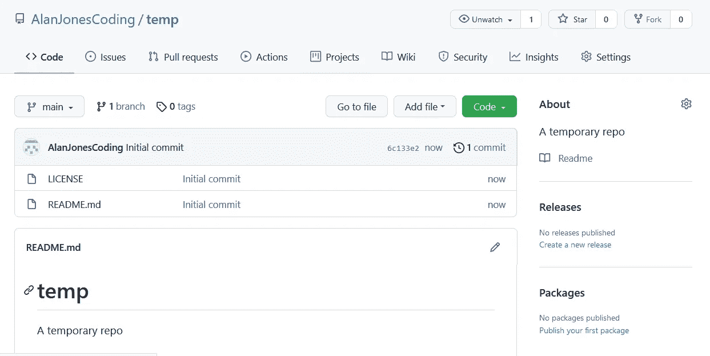

你在 GitHub 的第一个知识库——作者图片

现在，您已经有了一个可以下载到本地机器上的基本回购协议。为此，我们*克隆*回购。单击 code 按钮并复制 url —稍后您将在 VSCode 中使用它。

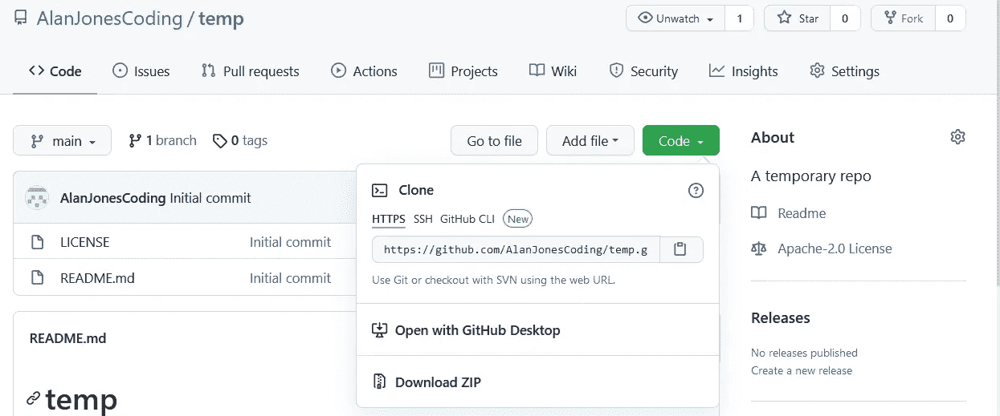

在 GitHub 中克隆存储库—图片由作者提供

## 在 VSCode 中克隆 repo

现在你需要打开 VSCode。关闭任何打开的文件或文件夹，并选择*源代码控制*图标。这使您可以选择打开一个现有的 Git repo 或克隆一个新的。我们要做的是后者。

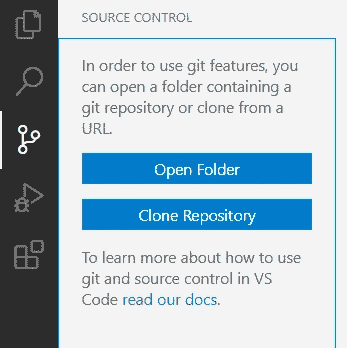

在 VSCode 中创建存储库—按作者排序的图像

所以，点击*克隆库*，你会被要求提供一个 URL——这是我们刚才从 GitHub 网页上复制的，所以粘贴进去吧！

在 VSCode 中克隆存储库—按作者排序的图像

*不要试图复制我的回购网址，因为虽然你可以克隆它，但你不能在以后把它推回 GitHub，而且你会浪费很多时间，因为你必须从头再来一遍！*

点击回车键，系统会询问你是否想打开回购——你当然想。然后它可能会问你是否信任回购协议的作者——同样，你信任(你信任自己，对吗？).

一两秒钟后，您应该会看到:

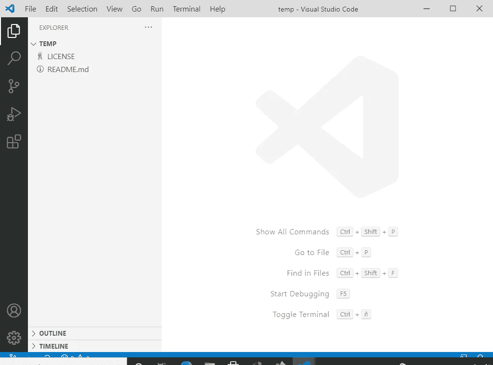

VSCode 中的一个新存储库—作者图片

这是一个新创建的报告，包含自述文件和许可证。

现在我们要创造一些新的东西。创建一个新文件并保存它。例如

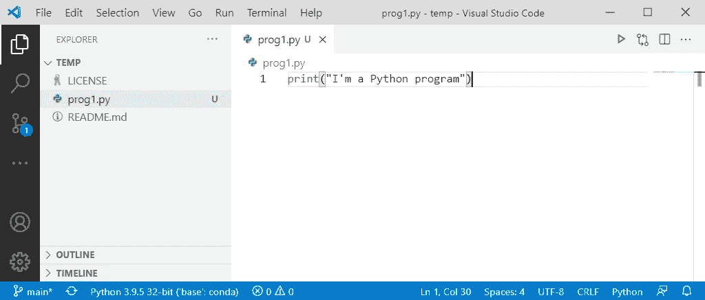

VSCode 中的新 Python 程序—作者图片

请注意，源代码管理图标现在有了一个通知—这是因为发生了一些变化。再次打开源代码控制图标，您可以看到*改变了*列表 *prog1.py* 。我们现在可以通过输入提交消息并点击`Ctrl+Enter`来提交这个更改。

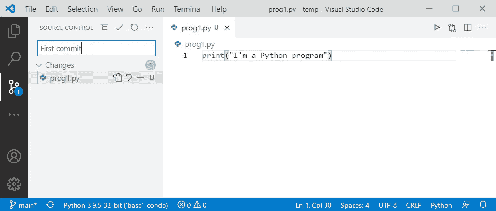

源代码管理更改了 VSCode 中的 y-按作者排序的图像

现在，由于我们还没有*转移*变更，VSCode 会询问您是否想要自动转移它们，以及您是否应该总是这样做(或者从不这样做)。我从不费心准备事情，因为我总是希望我的所有更改都在提交中——如果你也想这样，那么选择*是*或*总是*。如果您选择*从不*，您将不得不手动进行分段。

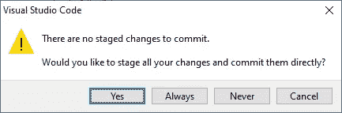

自动暂存—按作者分类的图像

您应该注意到通知已经消失了。

现在，我们做这一切的全部目的是将我们的代码保存在 GitHub 上，所以已经做了更改，我们现在需要将它推到那里。从`…`菜单中选择*按钮*。

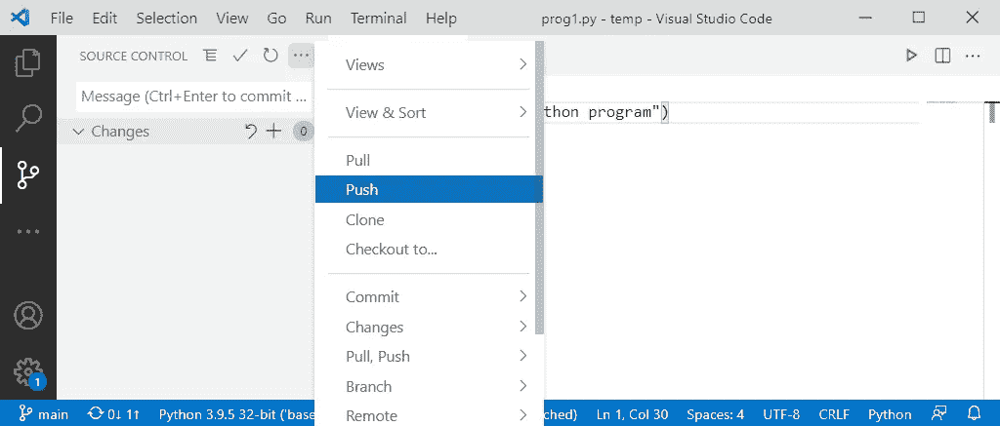

推送回购-按作者分类的图像

GitHub 需要知道你被授权推你的回购。下一步只会在你第一次连接 GitHub 时发生，之后它会自动连接。第一步:

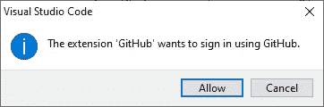

允许登录 GitHub —图片由作者提供

这将打开一个浏览器窗口，并要求您以通常的方式登录 GitHub，以确认 VSCode 可以使用您的帐户。

当你完成后，本地回购将被推送到 GitHub。打开它，您会看到在 GitHub 版本的 repo 中有一个新文件——即与您本地机器上的文件完全相同。

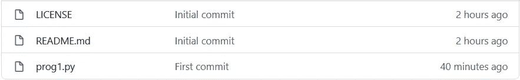

更新的远程报告—按作者排列的图像

让我们对 VSCode 中的 prog1.py 进行另一项更改:

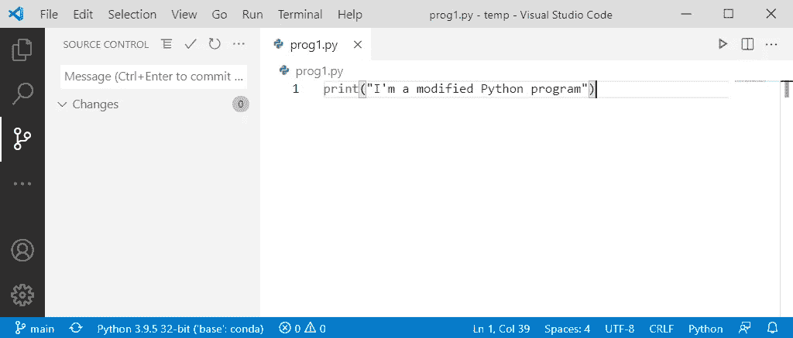

另一个变化——作者的图像

像以前一样提交并再次推动。这一次不应该有授权。推进应该会顺利进行。

在 GitHub 中点击 prog1.py，你应该会看到这个:

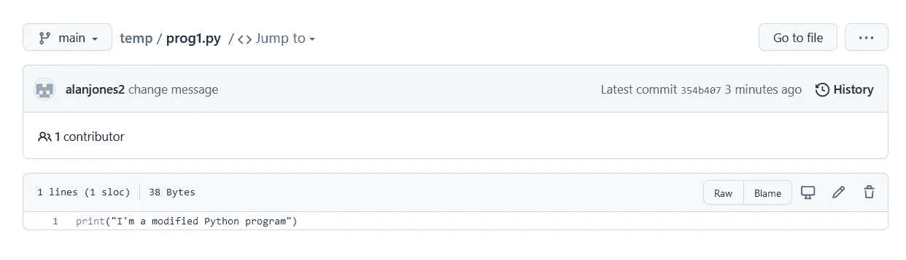

修改后的程序在 GitHub repo-image by author 中

程序的修改版本现在在远程存储库中。

现在，您可以在 GitHub 中对文件进行更改，并使用 Pull 命令将其恢复到 VSCode。要编辑文件，请单击铅笔图标。

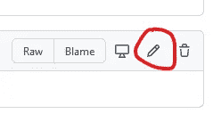

编辑 prog1.py —按作者编辑图像

进行一些更改，然后点击*提交更改*按钮(您可以选择添加注释)。

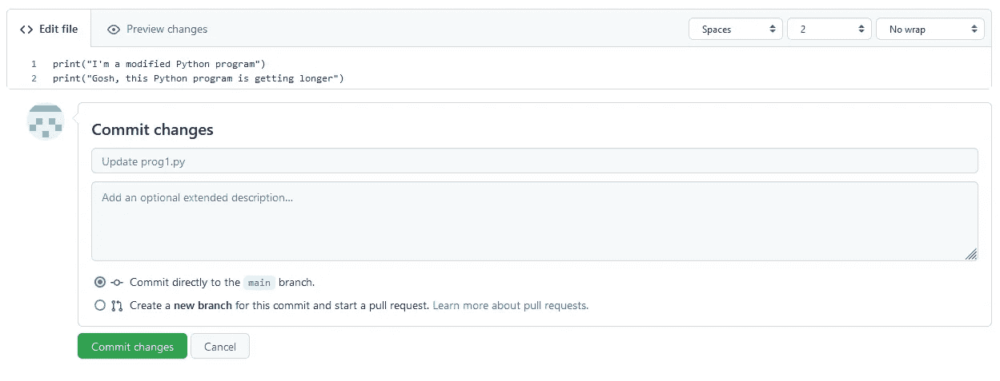

提交 GitHub 中的更改—作者图片

现在你可以回到 VSCode 并*拉*修改，这样你在本地就有了新修改的回购协议。

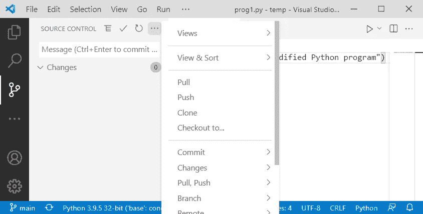

将 repo 拉至 VSCode —按作者排序的图像

嘿，很快！

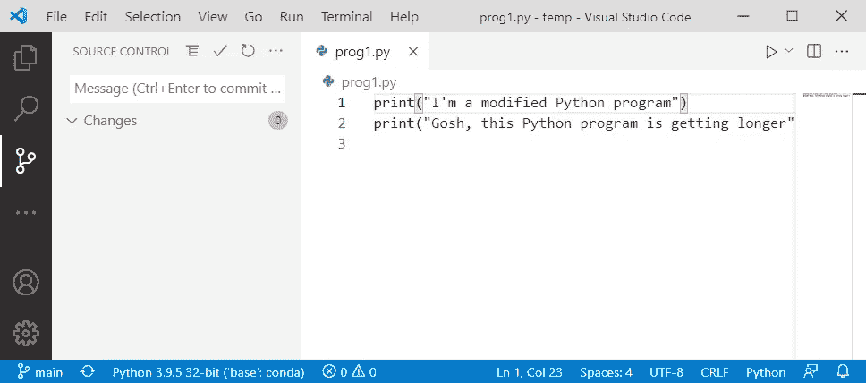

VSCode 中的提取文件—按作者排序的图像

因此，我们既可以远程进行更改，然后将它们拉至本地计算机，也可以在本地进行更改，然后推至远程存储库。

通过这些方法的组合，您可以让多台机器保持代码的最新版本。只需确保您的远程回购始终是最新的，方法是在编辑会话后将它作为您做的最后一件事来推送。

我希望演示我如何使用 Git 和 GitHub 是有用的。它只是触及了使用这些工具可以做的事情的表面，所以如果您有任何更好的想法或技术(或者如果您认为我做错了什么)，请在下面随意评论。

一如既往，感谢阅读。如果你想知道我什么时候发表新文章，请考虑在这里注册一个电子邮件提醒[。](https://alan-jones.medium.com/subscribe)

如果你不是一个媒体订阅者，那就注册吧，这样你就可以每月花 5 美元阅读尽可能多的文章。在这里注册,我会赚一点佣金。