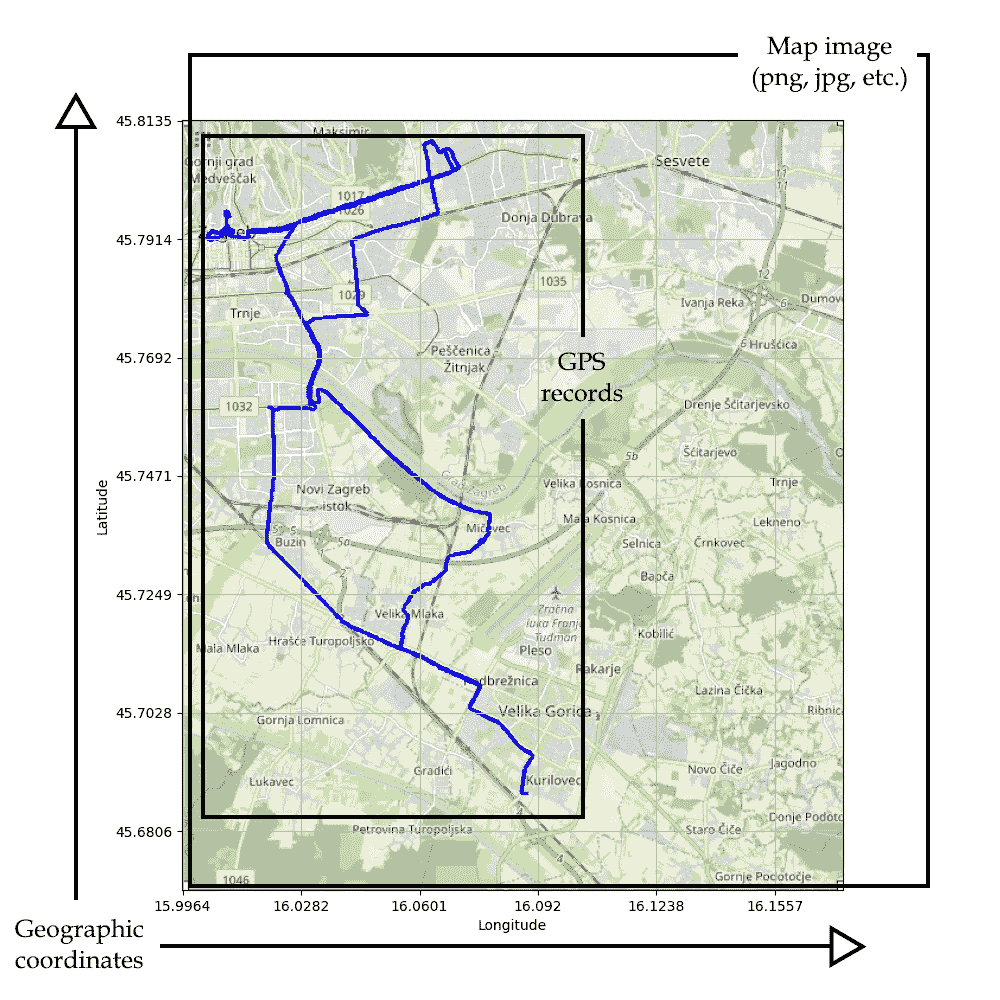
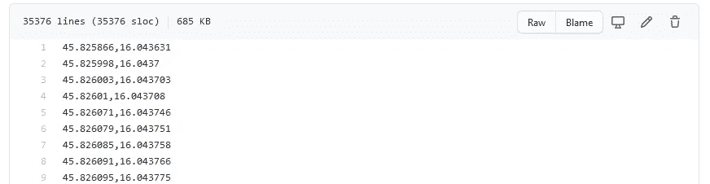
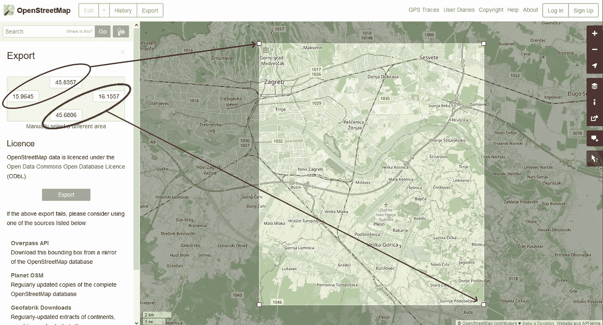
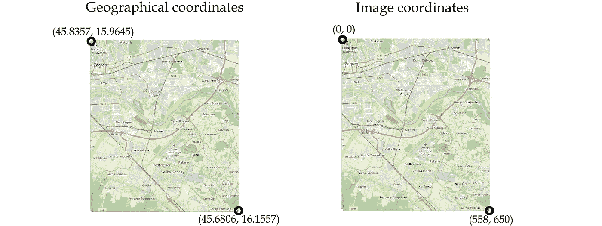
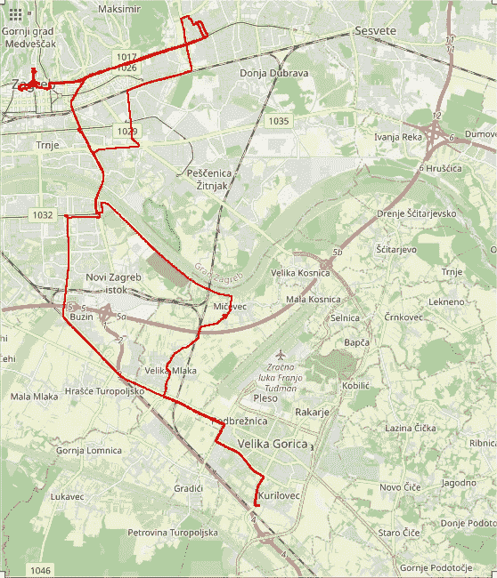
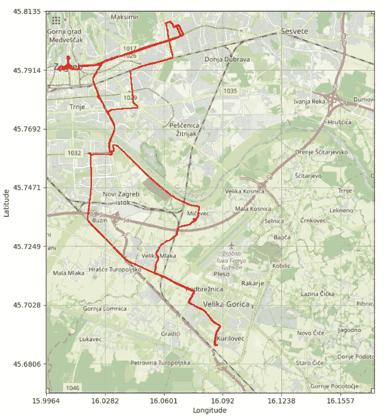

# 使用 Python 和开放街道地图实现简单的 GPS 数据可视化

> 原文：<https://towardsdatascience.com/simple-gps-data-visualization-using-python-and-open-street-maps-50f992e9b676?source=collection_archive---------2----------------------->

## 有一种简单的方法可以在地图上显示 GPS 数据。

蒂莫·维林克在 [Unsplash](https://unsplash.com?utm_source=medium&utm_medium=referral) 上的照片

当使用编程语言时，GPS 数据的可视化可能具有挑战性。一些有趣的 Python 包可以用于这种目的。但是，在某些情况下很难安装和使用它们，尤其是当你只有一个简单的任务要做的时候。本文将展示使用 Python 和开放街道地图(OSM)的简单而有效的 GPS 记录可视化方法。如果你想直接跳到代码，请访问 https://github.com/tisljaricleo/GPS-visualization-Python。

# 目标

下图显示了这种方法的目标。需要包括三个主要因素:

1.  地图图像—以某种图像格式显示的地图，如。png，。jpg 等。
2.  GPS 记录-由(纬度、经度)对组成的记录。
3.  地理坐标-从像素到地理坐标的转换。

GPS 可视化方法的最终结果(图片来源:作者)

# 设置和数据

使用下面代码最简单的方法是安装 VS 代码或其他一些 IDE 来编辑 Python 代码。Python Jupyter 笔记本用户可能会遇到一些问题或额外的设置。最简单的方法是直接从一个 ide 中运行 *main.py* 脚本。

对于本文，使用了一个小型 GPS 数据集，它是用我在口袋里放了两天的 [Columbus V-990](https://cbgps.com/v990/index_en.htm) 记录器收集的。数据可以在 [github 库](https://github.com/tisljaricleo/GPS-visualization-Python)获得。

这是一个简单的(纬度、经度)数据集，包含大约 35000 条记录，如下所示:

使用的数据集(图片作者:作者)

**重要提示:**要成功运行代码，数据必须按照上图所示的精确方式进行格式化。否则，代码将导致错误！

# 方法

在这里，我们将经历这个方法工作所需的所有步骤。完整代码，请访问 [github 库](https://github.com/tisljaricleo/GPS-visualization-Python)。

## 1.去拿地图

地图可以从[https://www.openstreetmap.org/export](https://www.openstreetmap.org/export)下载。只需点击“手动选择不同的区域”来选择您需要的地图部分在这种情况下，写下左上角和右下角的坐标(45.8357，15.9645)和(45.6806，16.1557)。

导出 OSM 地图(图片作者:作者)

然后使用右侧的“共享”按钮将其导出。不要忘记选择“设置自定义尺寸”选项，并将视图与所选区域对齐。

## 2.Python 代码

导入包和数据:

要在图像上绘制地理坐标，坐标必须转换为图像像素。方法*scale _ to _ img*(gps _ coordinate，(image_height，image_width))获取 GPS 坐标，并根据图像的宽度和高度将其转换为图像坐标(像素)。

下图显示了将地理坐标转换为影像坐标的需要:

地理坐标和图像坐标的区别(图片来源:作者)

现在，我们已经在地图上绘制了 GPS 记录！如果你看下面的图片，如果有一些其他的元素，比如网格和地理坐标，看起来会更好。

OSM GPS 坐标的可视化(图片来源:作者)

这些额外的元素将使用 matplotlib 包添加:

最后的结果在这里:

使用 Python 和 OSM 实现 GPS 记录可视化的最终结果(图片来源:作者)

# 结论

当使用编程语言来自动化 GPS 数据时，GPS 数据的可视化可能是具有挑战性的。有一些有趣的 Python 包可以用于这种目的。但是，在某些情况下，可能很难安装和使用它们，特别是如果您只有一个简单的任务要做。

本文提出了一种简单而有效的 GPS 数据集可视化方法。我们使用 Python 和 OSM 构建了一个框架。文章中展示了所有的步骤，但是你可以在这里找到完整的代码:【https://github.com/tisljaricleo/GPS-visualization-Python】T4

如有任何问题或建议，欢迎评论或联系我！

领英:[https://www.linkedin.com/in/leo-tisljaric-28a56b123/](https://www.linkedin.com/in/leo-tisljaric-28a56b123/)

# 参考

*   https://numpy.org/
*   熊猫[https://pandas.pydata.org/](https://pandas.pydata.org/)
*   https://matplotlib.org/
*   枕头[https://pillow.readthedocs.io/en/stable/](https://pillow.readthedocs.io/en/stable/)
*   打开街道地图【https://www.openstreetmap.org 