# 使用监督学习模型预测时间序列数据的简单指南

> 原文：<https://towardsdatascience.com/simple-guide-on-using-supervised-learning-model-to-forecast-for-time-series-data-a570720add84?source=collection_archive---------6----------------------->

## 用 XGBoost 预测时间序列数据的未来值


照片由[克里斯托弗·高尔](https://unsplash.com/@cgower)拍摄自 [Unsplash](https://unsplash.com/)

时间序列预测已经成为一个热门领域，因为许多预测问题涉及预测未来的时间，以允许更好的决策和更有效地管理资源。

在本文中，我们将发现如何使用监督学习模型 XGBoost 来预测未来的销售值，该模型使用的数据集来自[谷歌大查询-爱荷华州酒类零售预测的公共数据。(资料来源:爱荷华酒精饮料部)](https://console.cloud.google.com/bigquery(cameo:product/iowa-department-of-commerce/iowa-liquor-sales)?project=sue-gcp-learning-env)

**目录:**

*   什么是时间序列数据？
*   监督学习简介
*   了解我们的数据集(EDA)
*   预处理/格式化数据集
*   时间序列数据的特征工程
*   拟合模型

## 什么是时间序列数据？

时间序列数据通常由大多数公司生成，如销售数据、库存数据、财务数据、股票价格等。[时间序列通常是指在一段时间内连续产生的数据序列](https://www.investopedia.com/terms/t/timeseries.asp)，基于时间的属性在时间序列数据集中起着重要的作用。

一个简单的时间序列数据如下图所示。

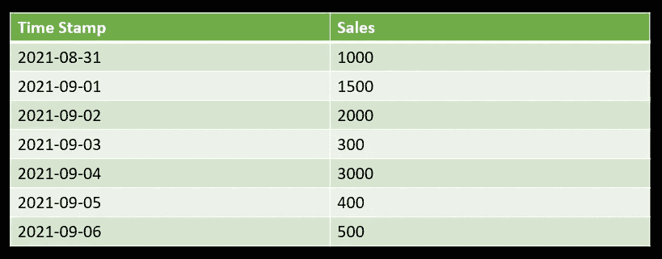

时间序列示例(图片由作者提供)

*   时间戳列指示收集值的时间。
*   Sales 列是当时产生的值。

预测模型将使用历史数据的知识来预测未来不同时间段会发生什么。有许多方法可以利用时间序列数据进行预测，如 SARIMA 萨里玛(自回归综合移动平均，季节性自回归综合移动平均)，指数平滑模型，神经网络模型-如 LSTM(长短期记忆)，以及机器学习方法，如决策树，SVM(支持向量机)，XGBoost 等。上述所有方法都是时间序列预测的常用方法。现在，让我们来理解监督学习的概念。

## 监督学习简介

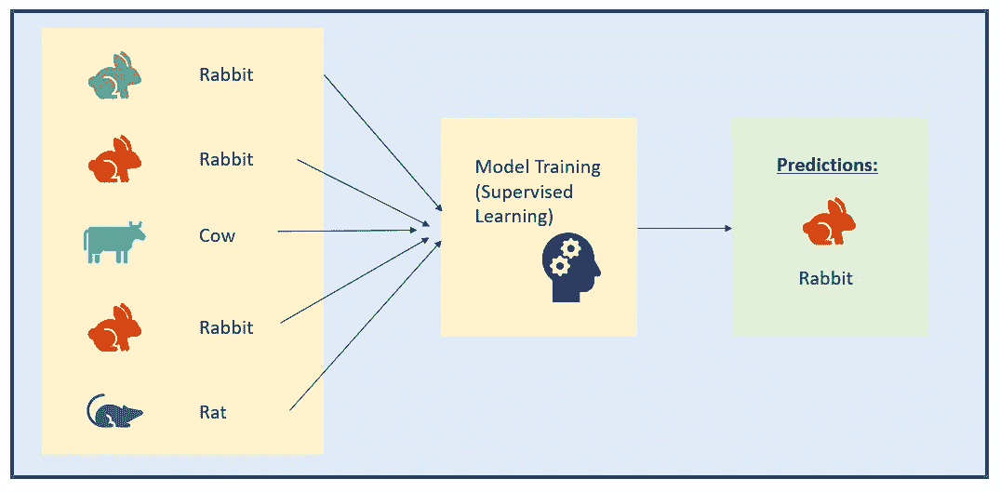

监督学习图解(图片由作者提供)

监督学习模型的目标是学习输入数据和输出数据(目标变量)之间的关系。[模型将根据与已知输出一起提供的数据进行训练，并进行多次迭代训练，直到模型能够检测到输入数据和输出数据之间的潜在模式，从而使模型能够以高精度预测未知数据](https://searchenterpriseai.techtarget.com/definition/supervised-learning)。

上图是预测这是什么动物的监督学习问题的简单例子。输入数据是动物的图像和细节，如大小、长度、颜色、耳朵长度等。连同输出值，以便模型可以知道兔子应该如何。

这种相同的方法可以应用于时间序列数据，方法是重新构建数据集，使其看起来像一个监督学习问题，例如时间序列数据集中以前的值将用作预测未来值的输入变量。

## 了解我们的数据集:

如前所述，我们将使用一组来自[谷歌大查询公共数据——爱荷华州酒类销售预测的数据。](https://console.cloud.google.com/bigquery(cameo:product/iowa-department-of-commerce/iowa-liquor-sales)?project=sue-gcp-learning-env)

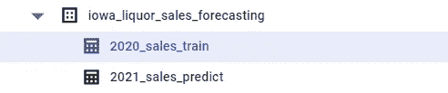

谷歌大查询公共数据—爱荷华州酒类销售预测

我们来看看数据集——“2020 _ 销售 _ 培训”

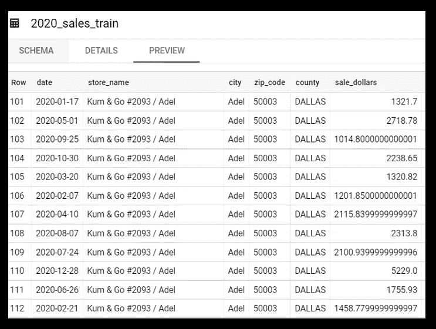

训练数据集的示例视图(作者提供的图片)

这是一个数据集，包含 2020 年爱荷华州每周批发购买的酒。如上图中训练数据的示例视图所示，我们可以注意到每周的零售额已经按县、邮政编码、城市和商店名称进行了细分。让我们执行一些简单的数据探索，以更好地了解我们在 Big Query 中的数据集。

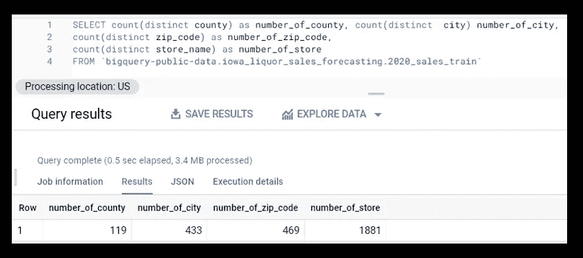

县、城市、邮政编码和商店数量的细分(图片由作者提供)

通过对数据集的简单查询，我们可以看到共有 119 个县的 1881 家不同的商店。

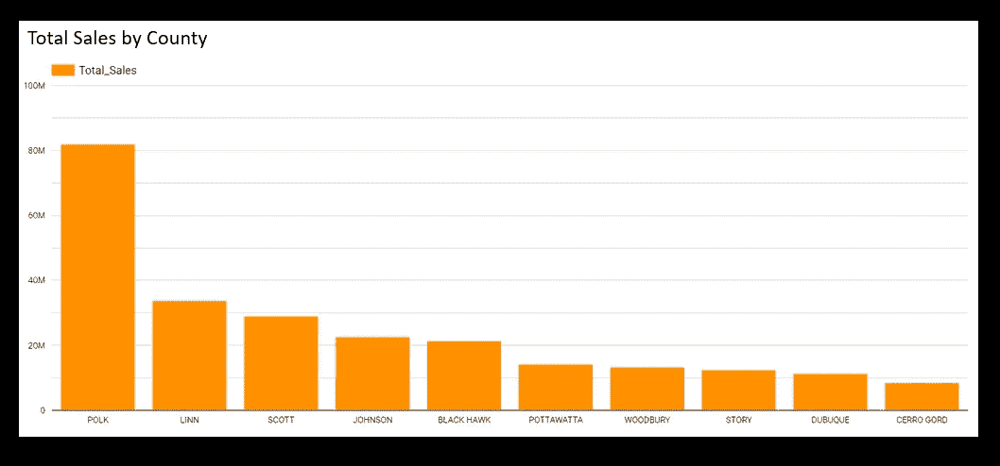

按国家/地区划分的总销售额—前 10 名(按作者划分的图片)

按国家对总销售额的进一步细分显示，“波尔克”的销售额在所有县中最高，其次是“林恩”和“斯科特”。我们将通过预测每周所有商店的总销售额来简化本教程，而不是预测每个商店、城市、邮政编码或商店的总销售额。下面是用于计算每周总销售额的 SQL 查询。

```
With Table_A as (
SELECT date,
EXTRACT(ISOYEAR FROM date) AS isoyear,
EXTRACT(ISOWEEK FROM date) AS isoweek,
sum(sale_dollars) as Total_Sales FROM `bigquery-public-data.iowa_liquor_sales_forecasting.2020_sales_train`
group by date, EXTRACT(ISOYEAR FROM date), EXTRACT(ISOWEEK FROM date)
order by date)
select min(date) as Week_date, isoyear, isoweek, sum(Total_Sales) as Total_Sales_dollars from Table_A
group by isoyear,isoweek
order by min(date)
```

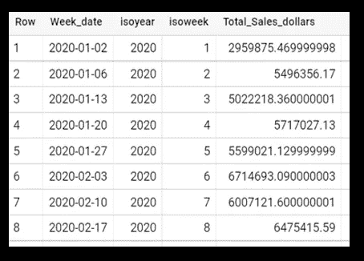

每周总销售额

上图显示了所有商店每周的总销售额。周值是根据 ISO 周编号从日期列中提取的。现在，让我们画出 2020 年每周的总销售量

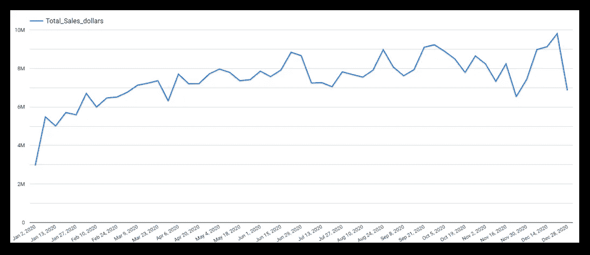

每周总销售额(图片由作者提供)

从上面的图中，我们可以看出全年的总销售额没有任何季节性趋势，但我们也注意到销售量随着时间的推移在逐渐增加。

> “季节性是在一段时间内重复的模式，具有影响时间序列信号的长期相关性。”

现在，让我们从预处理数据集开始，并确定我们可以为模型构建什么特征。由于我们使用的是监督学习模型方法，我们需要将数据框定为监督学习问题。

## 预处理/格式化数据集

首先，让我们进行最基本的检查，看看数据集中是否有缺失值。

```
print(Train_Table.isnull().sum())
```

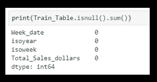

空记录的数量(按作者排列的图片)

从上面的结果中，我们可以看到数据集在所有列中都没有缺失值。接下来，如果您查看所提供数据的数据类型，您会注意到我们的日期列(“Week_date”)是字符串格式的。通过将数据类型更改为“日期”来格式化此列

```
Train_Table['Week_date'] = pd.to_datetime(Train_Table['Week_date'], errors="coerce")
```

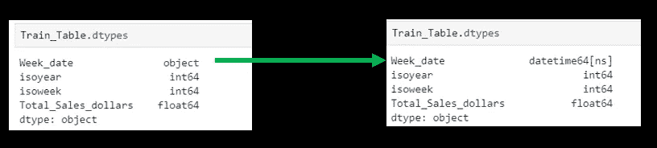

将 Week_date 列从“字符串”类型转换为“日期时间”(图片由作者提供)

日期列(“Week_Date”)是基于时间的列，需要转换为 DateTime 对象。使用正确的数据列格式，我们可以基于日期列索引数据框。

## 时间序列数据的特征工程

在构建模型之前，我们需要使用一组要素/输入变量(x)和输出变量(y 目标)来重新构建数据集。以下是在时间序列数据集上生成的常见特征:

*   **滞后期** : *滞后值* *(如昨天、上周、上月等。)*

在这个例子中，因为我们的数据集是按周的，所以数量值滞后一周。

```
#Python shift() function 
Train_Table['Total_Sales_Dollars_lag1'] = Train_Table['Total_Sales_dollars'].shift(1)
```

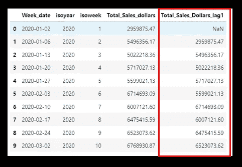

“Total_Sales_Dollars_lag1”功能已创建(图片由作者提供)

*   **移动平均滞后期** : *过去 X 小时/天/周的移动平均*

创建移动平均特征是为了消除特定时间段内异常值和波动的值和影响。在本例中，我们创建了一个滞后 1 周的滚动 2 周平均值，以避免数据泄漏。

```
#Python rolling().mean() function 
Train_Table['Total_Sales_Dollar_MA2_lag1'] = Train_Table['Total_Sales_dollars'].rolling(2).mean().shift(1).reset_index(0,drop=True)
```

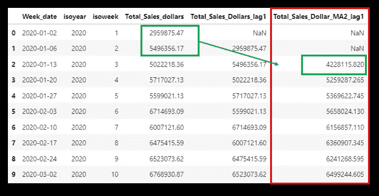

“Total_Sales_Dollar_MA2_lag1”功能已创建(图片由作者提供)

**差异** : *当前小时/日/周/月值减去前一小时/日/周/月值(例如，昨天的值与上周同一天的值的差异)*

计算与先前值之差的要素被视为趋势要素。在本例中，我们计算了本周与前一周的差值，相差 1 周。

```
#Python diff() function 
def difference(data, feature):
    # assume data is already sorted
    return data[feature] - data['Total_Sales_dollars'].shift(1)Train_Table['Total_Sales_Dollar_Difference_lag1'] = difference(Train_Table,'Total_Sales_dollars').shift(1)
```

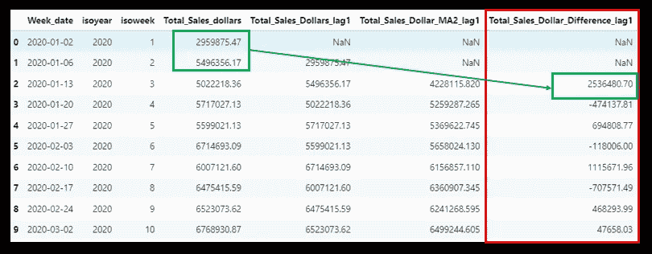

“Total _ Sales _ Dollar _ Difference _ la G1”功能已创建(图片由作者提供)

除此之外，我们还可以创建计算当前值和以前值之间的百分比变化的特性。在本例中，我们将计算当前周与前一周相差 1 周的百分比变化。

```
def difference_in_percentage(data, feature):
    # assume data is already sorted
    lag_by_1 = data[feature].shift(1)return (data[feature] - lag_by_1)/(lag_by_1)Train_Table['Total_Sales_Dollar_Difference_in_Percent_Lag1'] = difference_in_percentage(Train_Table,'Total_Sales_dollars').shift(1)
```

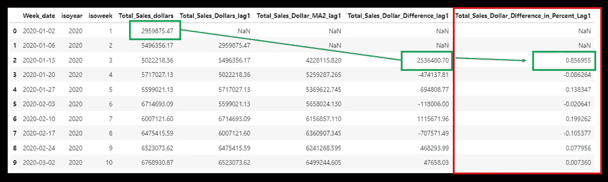

“Total _ Sales _ Dollar _ Difference _ in _ Percent _ la G1”功能已创建(图片由作者提供)

*   **时间戳分解** : *一周中的某天、一月中的某天、一年中的某月、工作日或周末。*

日期中的年、月、周和日的值也可以用作数字特征。在本例中，我们已经使用 SQL 查询提取了周和年。但是如果我们要使用 python 来执行，我们可以通过以下方法来实现:

```
Train_Table['week'] =Train_Table['Week_date'].dt.week
Train_Table['month'] =Train_Table['Week_date'].dt.month
Train_Table['year'] =Train_Table['Week_date'].dt.year
```

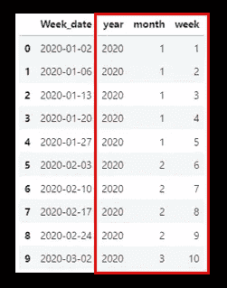

创建了“年”、“月”、“周”功能(图片由作者提供)

可以创建的其他特征是— **统计值，例如** *昨天、上周、前两周等的最小值、最大值、平均值、标准偏差值。*

到目前为止，我们应该已经生成了一组供模型使用的特性。现在让我们进入下一步——拟合模型。

## 拟合模型

首先，确定哪些是可以使用的特性，哪些应该被索引。在此处的示例中，我不会采用“Year”特性，因为培训数据属于同一年，并且将对“Week_date”列进行索引。

```
Train_Table = Train_Table [['Week_date', 'Total_Sales_dollars', 'Total_Sales_Dollars_lag1','Total_Sales_Dollar_MA2_lag1','Total_Sales_Dollar_Difference_lag1','Total_Sales_Dollar_Difference_in_Percent_Lag1', 'month','week']]Train_Table = Train_Table.fillna(0)Table = Train_Table.set_index('Week_date')
```

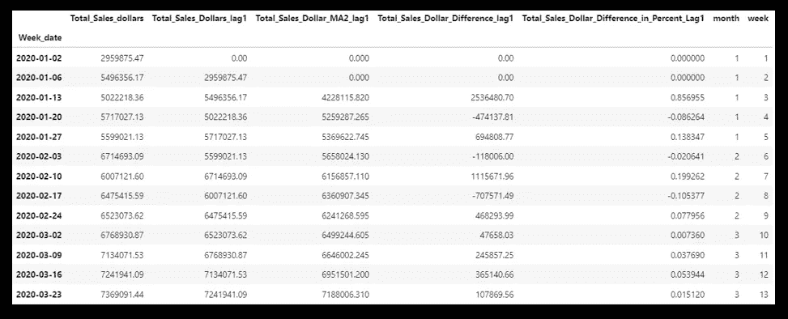

按“周日期”选择的功能和索引(图片由作者提供)

接下来，我们将根据 80:20 规则将数据分为训练集和测试集。

```
from sklearn.model_selection import train_test_splittraining_data, testing_data = train_test_split(Table, test_size=0.2)
print(f"No. of training examples: {training_data.shape[0]}")
print(f"No. of testing examples: {testing_data.shape[0]}")
```

将数据分为 x_train、y_train、x_test 和 y_test —输入(x)和输出(y)

```
x_train, y_train = training_data.drop("Total_Sales_dollars", axis=1), training_data['Total_Sales_dollars']
x_test, y_test   = testing_data.drop("Total_Sales_dollars", axis=1) , testing_data['Total_Sales_dollars']
```

将数据集分为输入(x)和输出(y)后，我们可以导入 XGBoost 模型库，并用训练集拟合模型。

```
import xgboost as xgb
from sklearn.metrics import mean_absolute_errormodel = xgb.XGBRegressor(n_estimators=1000)
model.fit(x_train, y_train,
        eval_set=[(x_train, y_train), (x_test, y_test)],
        early_stopping_rounds=50, #stop if 50 consequent rounds without decrease of error
        verbose=False) 
```

模型定型后，将模型应用于测试集并评估模型性能。这里使用的性能指标是平均绝对误差(MAE)。MAE 是基于预测误差值的平均值计算的，误差值被转换为正值。有许多不同的性能指标可供使用，如误差比、均方误差。如果你感兴趣，你可以参考这篇文章，它列出了不同的性能指标——时间序列预测的各种性能指标[。](https://machinelearningmastery.com/time-series-forecasting-performance-measures-with-python/)

```
preds = pd.DataFrame(model.predict(x_test))
```

衡量模型性能:

```
from sklearn.metrics import mean_absolute_percentage_errormean_absolute_percentage_error(y_test, preds)
```

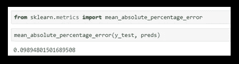

MAE 错误率(图片由作者提供)

为了获得更好的准确性，我们可以在维持集(模型看不到的另一个测试集)上测试我们的模型。我们可以使用在同一个 Google 大查询公开数据集下已经提供和可用的数据—[“2021 销售预测”](https://console.cloud.google.com/bigquery(cameo:product/iowa-department-of-commerce/iowa-liquor-sales)?project=sue-gcp-learning-env)。在将模型应用于测试集之前，应用相同的数据转换并创建用于训练模型的相同特征集。

在对维持数据集应用模型后，我们还可以绘制一个图表来比较实际值和预测值。

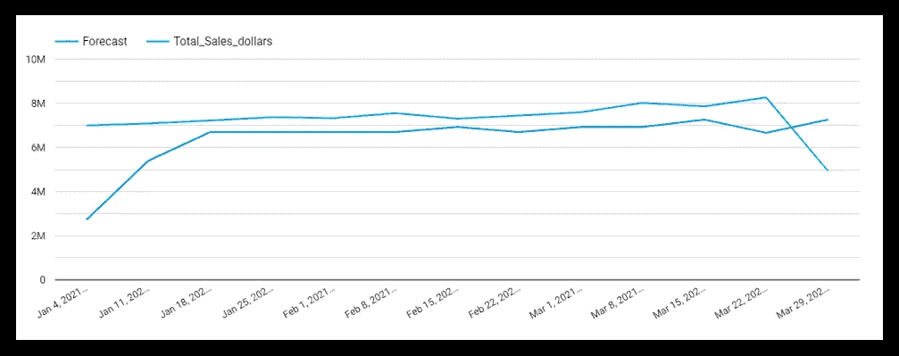

实际与预测的对比图(图片由作者提供)

正如你在上面的图中看到的，我们在 2021 年有几个星期的时间来测试模型。从图中，我们可以看到，模型预测在开始的几周并不匹配，但在接下来的几周内紧随其后，并在三月底偏离实际。模型表现不佳有几个原因，其中之一可能是由于训练数据不足，因为我们仅使用一年的数据来构建模型，并且没有足够的稳健特征供模型学习。

恭喜，我们已经理解了如何使用监督学习模型来构建时间序列预测。请注意，这只是一个简单的指南，现实生活中的示例将会更加复杂，您需要考虑创建许多不同的要素，例如用于捕捉假期/季节性趋势的 alpha 变量，从其他驾驶员的数据中生成有助于预测的要素，等等。

## 结论:

本文介绍了对时间序列数据特征的基本理解，以及如何将时间序列数据准备成可以应用监督机器学习模型(如 XGBoost)的预测问题。

感谢您阅读本文，希望本文对您有所帮助，能够帮助您踏上数据科学之旅的任何一步。

## 参考和链接:

[1]https://www.investopedia.com/terms/t/timeseries.asp

[2][https://machine learning mastery . com/xgboost-for-time-series-forecasting/](https://machinelearningmastery.com/xgboost-for-time-series-forecasting/)

[3][https://machine learning mastery . com/time-series-forecasting-supervised-learning/](https://machinelearningmastery.com/time-series-forecasting-supervised-learning/)

[4][https://search enterprise ai . tech target . com/definition/supervised-learning](https://searchenterpriseai.techtarget.com/definition/supervised-learning)

[5][https://towards data science . com/everything-you-need-known-to-know-about-time-series-5fa 1834 d5b 18](/everything-you-need-to-know-about-time-series-5fa1834d5b18)

[6][https://console . cloud . Google . com/big query(cameo:product/Iowa-department-of-commerce/Iowa-liquid-sales)](https://console.cloud.google.com/bigquery(cameo:product/iowa-department-of-commerce/iowa-liquor-sales))