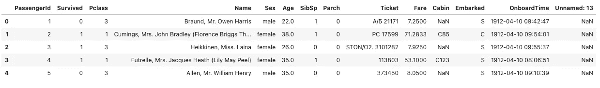
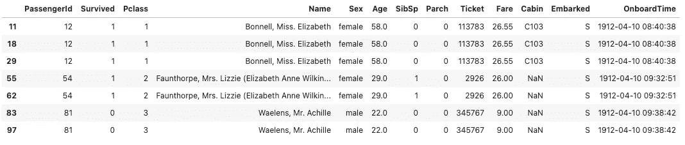
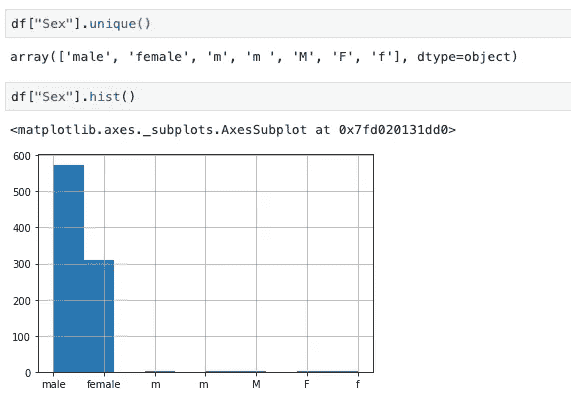
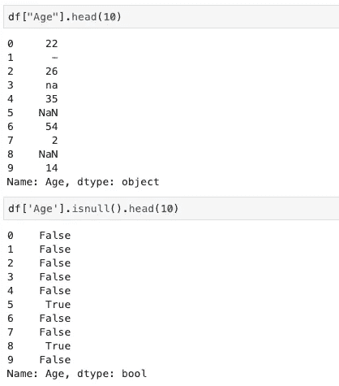
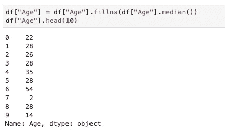

# 使用 Python 清理数据的简单指南

> 原文：<https://towardsdatascience.com/simple-guide-to-data-cleaning-with-python-39203a14afeb?source=collection_archive---------6----------------------->

## 我们不希望看到垃圾进来，垃圾出去…


由[万花筒](https://unsplash.com/@kaleidico?utm_source=unsplash&utm_medium=referral&utm_content=creditCopyText)在 [Unsplash](https://unsplash.com/s/photos/filter-data?utm_source=unsplash&utm_medium=referral&utm_content=creditCopyText) 上拍摄的照片

在任何项目中，数据清理都是最关键的一步，如果我们处理不好，可能会得出完全不同的结论。通常，在大多数项目中，我们可能会花一半的时间清理数据。

在本文中，我将分享一些 Python 函数，它们可以帮助我们进行数据清理，尤其是在以下方面:

*   删除未使用的列
*   删除重复项
*   数据映射
*   处理空数据

## 入门指南

我们将在这个项目中使用熊猫，让我们安装软件包，如果我们没有它。

```
conda install pandas
```

为了演示的目的，我修改了 Kaggle 著名的泰坦尼克号数据集，你可以在这里下载数据集。

让我们导入包并读取数据集。



df.head()的结果

`df.head()`将显示 dataframe 的前 5 行，您可以通过使用此功能快速浏览数据集。

## 删除未使用的列

根据我们的观察，有一个无效/空的`Unnamed: 13`列是我们不需要的。我们可以使用下面的函数来删除它。

如果您希望删除多个列，需要一个数组来传入`columns`参数。

`inplace = True`将直接对数据帧本身进行操作，默认情况下，它将创建另一个副本，你必须像`df = df.drop(columns="Unnamed: 13")`一样再次将其分配给数据帧。

## 删除重复项

让我们使用这个函数来检查数据集中的重复项。

```
df[df.duplicated(keep=False)]
```



df 的结果[df.duplicated(keep=False)]

`keep`允许一些参数检查重复项。

*   `first`:除第一次出现外，将重复标记为`True`。
*   `last`:除最后一次外，将重复标记为`True`。
*   `False`:将所有重复标记为`True`。

在这种情况下，我想显示所有的副本，所以将`False`作为参数传递。现在，我们已经看到该数据集中有重复项，我想删除它们并保留第一个重复项。下面的函数用于保存第一次出现的内容。

```
df = df.drop_duplicates(keep="first")
```

我们可以使用`len(df)`或`df[df.duplicated(keep=False)]`来检查重复项是否被删除。`df[df.duplicated(keep=False)]`如果删除重复项，将返回 null。

## 数据映射



在`df["Sex"].unique`和`df["Sex"].hist()`的帮助下，我们发现该列中还有其他值，如`m`、`m`和`F`。这可能是由于来自数据源的错误输入，我们必须假设这些值是正确的，并映射到`male`或`female`。

```
df["Sex"] = df["Sex"].map({
    "male": "male",
    "m": "male",
    "m ": "male",
    "M": "male",
    "F": "female",
    "f": "female",
    "female": "female"
})
```

上述函数用于将这些值映射到`male`或`female`。

> *注意:请确保映射中包含默认值* `*male*` *和* `*female*` *，否则在执行映射后将变成* `*nan*` *。*

## 处理空数据



在该列中，有 3 个值缺失:`-`、`na`和`NaN`。熊猫不承认`-`和`na`为空。在处理它们之前，我们必须用 null 替换它们。

`replace()`用于将`-`和`na`替换为空。

如果我们在读取数据时发现了这一点，我们实际上可以通过将丢失的值传递给`na_values`参数来处理这个丢失的值。结果是一样的。

现在我们已经用空值替换了它们，我们将如何处理那些丢失的值呢？

*   **解决方案 1:删除观察(行)/特征(列)**

如果我们确定丢失的数据没有用或者丢失的数据只是数据的一小部分，我们可以删除包含丢失值的行。

> 在统计学中，这种方法称为**列表式删除，**这是一种处理缺失数据的方法。在这种方法中，如果缺少任何单个值，将从分析中排除整个记录。

如果我们确信这个特性(列)没有提供有用的信息或者缺失值百分比很高，我们可以删除整个列。这在进行统计分析时非常有用，因为填充缺失值可能会产生意外或有偏差的结果。

*   **解决方案 2:估算缺失值**

这意味着根据其他数据计算缺失值。例如，我们可以用出生日期计算年龄的缺失值。

在这种情况下，我们没有出生日期，我们可以用数据的平均值或中值(分类值的模式)替换缺失值。

> 注意:当数据没有倾斜时，平均值最有用，而中位数更稳健，对异常值不敏感，因此在数据倾斜时使用。

在这种情况下，让我们使用 median 来替换缺失的值。



`df["Age"].median`用于计算数据的中值，而`fillna`用于用中值替换缺失值。

现在你已经学会了如何**用熊猫来清理 Python 中的数据。**希望这篇文章对你有用。如果我犯了任何错误或错别字，请给我留言。

可以在我的 [**Github**](https://github.com/chingjunetao/medium-article/blob/master/simple-guide-to-data-cleaning/data-cleaning.ipynb) 中查看完整的 Jupyter 笔记本。干杯！

**如果你喜欢读这篇文章，你可能也会喜欢这些:**

</how-to-rewrite-your-sql-queries-in-python-with-pandas-8d5b01ab8e31>  </how-to-master-python-command-line-arguments-5d5ad4bcf985>  

**你可以在 Medium 上找到我其他作品的链接，关注我** [**这里**](https://medium.com/@chingjunetao) **。感谢阅读！**