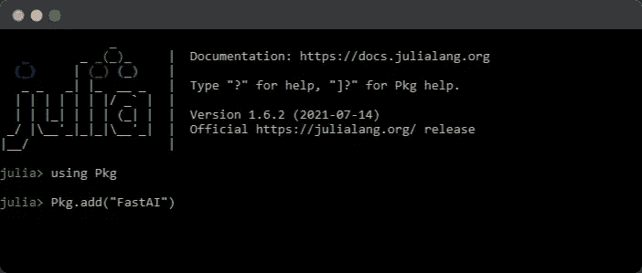
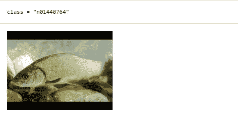
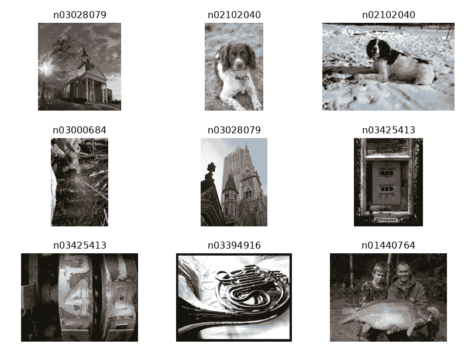
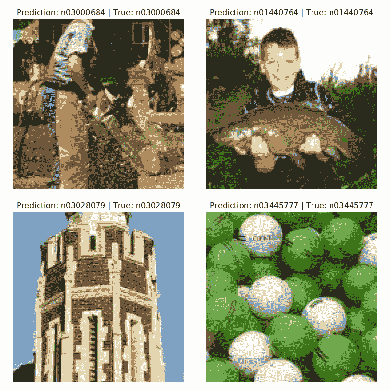

# 使用 FastAI.jl 进行简单的图像分类

> 原文：<https://towardsdatascience.com/simple-image-classification-using-fastai-jl-83960d1d2ce1?source=collection_archive---------32----------------------->

Fastai 库现在在 Julia 上，Python 中也有类似的特性。在这个项目中，我们将训练 Resnet-18 模型，通过几个步骤对 ImageNet 数据集中的图像进行分类。


图片作者|元素作者 [freepik](https://www.freepik.com/free-vector/hand-drawn-web-developers-working_12063788.htm#page=2&query=coding&position=39)

# FastAI.jl 简介

[FastAI.jl](https://github.com/FluxML/FastAI.jl) 库类似于 Python 中的 [fast.ai](https://github.com/fastai/fastai) 库，这是在 Julia 中试验深度学习项目的最佳方式。该库允许您使用最先进的模型，您可以通过使用几行代码来修改、训练和评估这些模型。FastAI.jl 为深度学习提供了一个完整的生态系统，其中包括计算机视觉，自然语言处理，表格数据，每个月都会添加更多的子模块 [FastAI (fluxml.ai)](https://fluxml.ai/FastAI.jl/dev/README.md.html) 。

在这个项目中，我们将使用 fastai 库在带有 [Apache License 2.0](https://github.com/fastai/imagenette/blob/master/LICENSE) 的[imagenette 2–160](https://github.com/fastai/imagenette)数据集上训练一个图像分类器。imagenette 2–160 数据集来自 fastai 数据集存储库，其中包含我们周围事物的较小尺寸图像，从动物到汽车。ResNet-18 模型架构在[用于图像识别的深度残差学习](https://arxiv.org/pdf/1512.03385.pdf)中可用。我们不会深入数据集或模型架构如何工作，相反，我们将专注于 fastai.jl 如何使深度学习变得简单。


图片 1

# Julia 中的 FastAI.jl 入门

欲了解更多详情，请访问 [Quickstart (fluxml.ai)](https://fluxml.ai/FastAI.jl/dev/notebooks/quickstart.ipynb.html) ，因为本项目中使用的代码来自 fastai 文档。

## 本地设置

如果您的系统中安装了 Julia，请键入:

```
using Pkg
Pkg.add("FastAI")
Pkg.add("CairoMakie")
```

如下图所示👇



作者图片

## 深度笔记

对于 Deepnote 环境，您必须创建一个 docker 文件并添加:

```
FROM gcr.io/deepnote-200602/templates/deepnote
RUN wget https://julialang-s3.julialang.org/bin/linux/x64/1.6/julia-1.6.2-linux-x86_64.tar.gz && 
    tar -xvzf julia-1.6.2-linux-x86_64.tar.gz && 
    sudo mv julia-1.6.2 /usr/lib/ && 
    sudo ln -s /usr/lib/julia-1.6.2/bin/julia /usr/bin/julia && 
    rm julia-1.6.2-linux-x86_64.tar.gz && 
    julia  -e "using Pkg;pkg"add IJulia LinearAlgebra SparseArrays Images MAT""
ENV DEFAULT_KERNEL_NAME "julia-1.6.2"
```

## Google Colab

对于 Google Colab，你可以在 GitHub[上关注我的报告，或者通过添加一个额外的单元格来创建一个 Julia 环境，如下所示。安装 Julia 软件包可能需要 15 分钟。](https://github.com/kingabzpro/Image-Classification-FastAI.jl)

1.  将运行时间更改为 GPU 以获得更快的结果。
2.  执行下面的代码。
3.  按 F5 重新加载此页面。

```
%%shell
set -e
#---------------------------------------------------#
JULIA_VERSION="1.6.2"
export JULIA_PACKAGES="CUDA IJulia CairoMakie"
JULIA_NUM_THREADS="2"
#---------------------------------------------------#
if [ -n "$COLAB_GPU" ] && [ -z `which julia` ]; then
  # Install Julia
  JULIA_VER=`cut -d '.' -f -2 <<< "$JULIA_VERSION"`
  echo "Installing Julia $JULIA_VERSION on the current Colab Runtime..."
  BASE_URL="https://julialang-s3.julialang.org/bin/linux/x64"
  URL="$BASE_URL/$JULIA_VER/julia-$JULIA_VERSION-linux-x86_64.tar.gz"
  wget -nv $URL -O /tmp/julia.tar.gz # -nv means "not verbose"
  tar -x -f /tmp/julia.tar.gz -C /usr/local --strip-components 1
  rm /tmp/julia.tar.gz
  # Install Packages
  echo "Installing Julia packages, this may take up to 15 minutes. "
  julia -e 'using Pkg; Pkg.add(["CUDA", "IJulia", "CairoMakie"]); Pkg.add(Pkg.PackageSpec(url="https://github.com/FluxML/FastAI.jl")); Pkg.precompile()' &> /dev/null
  # Install kernel and rename it to "julia"
  echo "Installing IJulia kernel..."
  julia -e 'using IJulia; IJulia.installkernel("julia", env=Dict(
      "JULIA_NUM_THREADS"=>"'"$JULIA_NUM_THREADS"'"))'
  KERNEL_DIR=`julia -e "using IJulia; print(IJulia.kerneldir())"`
  KERNEL_NAME=`ls -d "$KERNEL_DIR"/julia*`
  mv -f $KERNEL_NAME "$KERNEL_DIR"/julia  
  echo ''
  echo "Success! Please reload this page and jump to the next section."
fi
```

# 利用 FastAI.jl 实现图像分类

检查版本以确保你有一个和我相似的版本。

`versioninfo()`

```
Julia Version 1.6.2
Commit 1b93d53fc4 (2021-07-14 15:36 UTC)
Platform Info:
  OS: Linux (x86_64-pc-linux-gnu)
  CPU: Intel(R) Xeon(R) CPU @ 2.30GHz
  WORD_SIZE: 64
  LIBM: libopenlibm
  LLVM: libLLVM-11.0.1 (ORCJIT, haswell)
Environment:
  JULIA_NUM_THREADS = 2
```

## 导入库

```
using FastAI
import CairoMakie
```

## 下载数据集

我们使用`loaddataset`函数从 fastai 导入本地数据集。正如你所看到的，使用一行代码就可以下载数据集，并为您提供访问所有图像位置的标签。

`data, blocks = loaddataset(“imagenette2–160”, (Image, Label))`

```
┌ Info: Downloading
│   source = https://s3.amazonaws.com/fast-ai-imageclas/imagenette2-160.tgz
│   dest = /root/.julia/datadeps/fastai-imagenette2-160/imagenette2-160.tgz
│   progress = 1.0
│   time_taken = 2.69 s
│   time_remaining = 0.0 s
│   average_speed = 35.138 MiB/s
│   downloaded = 94.417 MiB
│   remaining = 0 bytes
│   total = 94.417 MiB
└ @ HTTP /root/.julia/packages/HTTP/5e2VH/src/download.jl:128
```

**数据**包含图像的位置，**块**包含结构和图像标签。

`data`

```
(mapobs(loadfile, ["/root/.julia/datadeps/fastai-imagenette2-160/imagenette2-160/train/n01440764/I…]), mapobs(parentname, ["/root/.julia/datadeps/fastai-imagenette2-160/imagenette2-160/train/n01440764/I…]))
```

`blocks`

```
(Image{2}(), Label{String}(["n01440764", "n02102040", "n02979186", "n03000684", "n03028079", "n03394916", "n03417042", "n03425413", "n03445777", "n03888257"]))
```

# 使用 FastAI.jl 探索用于图像分类的图像

通过使用 getobs，我们可以从数据中检查单个样本，并检查类。在我们的例子中，类名是 *n01440764* 您也可以将该类重命名为 *fish* ，但是为了简单起见，我们将为该类使用一个唯一的 Id。我们还可以看到样本 500 中的图像。

```
image, class = sample =  getobs(data, 500)
@show class
image
```



**或**

我们可以通过使用`getobs`和`plotsamples`来检查多张带有标签的照片。

```
idxs = rand(1:nobs(data), 9)
samples = [getobs(data, i) for i in idxs]
plotsamples(method, samples)
```



# 图像分类功能

为了加载我们的图像数据，我们需要首先创建一个将图像转换为 128X128 的函数，并对它们进行预处理以随机放大(剪切、拉伸、旋转、翻转)。对于标签，它将使用一键编码将字符串标签转换为整数。

```
method = BlockMethod(

blocks,

(

ProjectiveTransforms((128, 128)),

ImagePreprocessing(),

OneHot()

)

)
```

**或**

您可以使用`ImageClassificationSingle`功能来重现相同的结果。

```
method = ImageClassificationSingle(blocks)
```

# 利用 FastAI.jl 建立影像分类模型

1.  首先，我们需要使用数据加载器来加载图像链接，并使用转换方法。这将把图像和标签转换成整数数据。
2.  `methodmodel`采用 image loader 和 ResNet architect 的方法构建训练模型。
3.  我们可以简单地通过在`metholossfn`中添加方法来创建一个损失函数。默认情况下，损失函数为`CrossEntropy`。
4.  通过使用`Learner`,我们组合了方法、数据加载器、优化器(ADAM)、损失函数和度量(在我们的例子中是准确性)。

```
dls = methoddataloaders(data, method)
model = methodmodel(method, Models.xresnet18())
lossfn = methodlossfn(method)
learner = Learner(model, dls, ADAM(), lossfn, ToGPU(), Metrics(accuracy))
```

**或**

我们可以使用如下所示的一行代码简单地完成上述所有步骤。

```
learner = methodlearner(method, data, Models.xresnet18(), ToGPU(), Metrics(accuracy))
```

# 图像分类模型的训练与评估

我们将以 0.002 的学习率在 10 个时期上训练我们的模型。正如我们可以看到的，我们的训练和验证损失随着每次迭代而减少，但是在第 5 个时期之后，验证损失变得稳定。

**最终指标:**

训练=损失:0.07313 │准确率:98.38%

验证=损失:0.59254 │准确率:83.27%

> *这并不坏，因为我们还没有清理数据或执行超参数调整。*

`fitonecycle!(learner, 10, 0.002)`

```
Epoch 1 TrainingPhase(): 100%|██████████████████████████| Time: 0:05:50┌───────────────┬───────┬─────────┬──────────┐
│         Phase │ Epoch │    Loss │ Accuracy │
├───────────────┼───────┼─────────┼──────────┤
│ TrainingPhase │   1.0 │ 1.75345 │  0.43189 │
└───────────────┴───────┴─────────┴──────────┘Epoch 1 ValidationPhase(): 100%|████████████████████████| Time: 0:00:19┌─────────────────┬───────┬─────────┬──────────┐
│           Phase │ Epoch │    Loss │ Accuracy │
├─────────────────┼───────┼─────────┼──────────┤
│ ValidationPhase │   1.0 │ 1.54432 │  0.53701 │
└─────────────────┴───────┴─────────┴──────────┘Epoch 2 TrainingPhase(): 100%|██████████████████████████| Time: 0:03:34┌───────────────┬───────┬─────────┬──────────┐
│         Phase │ Epoch │    Loss │ Accuracy │
├───────────────┼───────┼─────────┼──────────┤
│ TrainingPhase │   2.0 │ 1.37105 │  0.56158 │
└───────────────┴───────┴─────────┴──────────┘Epoch 2 ValidationPhase(): 100%|████████████████████████| Time: 0:00:17┌─────────────────┬───────┬─────────┬──────────┐
│           Phase │ Epoch │    Loss │ Accuracy │
├─────────────────┼───────┼─────────┼──────────┤
│ ValidationPhase │   2.0 │ 1.23731 │  0.62673 │
└─────────────────┴───────┴─────────┴──────────┘Epoch 3 TrainingPhase(): 100%|██████████████████████████| Time: 0:03:32┌───────────────┬───────┬─────────┬──────────┐
│         Phase │ Epoch │    Loss │ Accuracy │
├───────────────┼───────┼─────────┼──────────┤
│ TrainingPhase │   3.0 │ 1.09463 │  0.65127 │
└───────────────┴───────┴─────────┴──────────┘Epoch 3 ValidationPhase(): 100%|████████████████████████| Time: 0:00:17┌─────────────────┬───────┬─────────┬──────────┐
│           Phase │ Epoch │    Loss │ Accuracy │
├─────────────────┼───────┼─────────┼──────────┤
│ ValidationPhase │   3.0 │ 1.11761 │  0.65932 │
└─────────────────┴───────┴─────────┴──────────┘Epoch 4 TrainingPhase(): 100%|██████████████████████████| Time: 0:03:31┌───────────────┬───────┬─────────┬──────────┐
│         Phase │ Epoch │    Loss │ Accuracy │
├───────────────┼───────┼─────────┼──────────┤
│ TrainingPhase │   4.0 │ 0.87518 │  0.71549 │
└───────────────┴───────┴─────────┴──────────┘Epoch 4 ValidationPhase(): 100%|████████████████████████| Time: 0:00:16┌─────────────────┬───────┬─────────┬──────────┐
│           Phase │ Epoch │    Loss │ Accuracy │
├─────────────────┼───────┼─────────┼──────────┤
│ ValidationPhase │   4.0 │ 0.95252 │   0.6995 │
└─────────────────┴───────┴─────────┴──────────┘Epoch 5 TrainingPhase(): 100%|██████████████████████████| Time: 0:03:29┌───────────────┬───────┬─────────┬──────────┐
│         Phase │ Epoch │    Loss │ Accuracy │
├───────────────┼───────┼─────────┼──────────┤
│ TrainingPhase │   5.0 │ 0.70251 │  0.77235 │
└───────────────┴───────┴─────────┴──────────┘Epoch 5 ValidationPhase(): 100%|████████████████████████| Time: 0:00:16┌─────────────────┬───────┬─────────┬──────────┐
│           Phase │ Epoch │    Loss │ Accuracy │
├─────────────────┼───────┼─────────┼──────────┤
│ ValidationPhase │   5.0 │ 0.77653 │  0.75314 │
└─────────────────┴───────┴─────────┴──────────┘Epoch 6 TrainingPhase(): 100%|██████████████████████████| Time: 0:03:29┌───────────────┬───────┬─────────┬──────────┐
│         Phase │ Epoch │    Loss │ Accuracy │
├───────────────┼───────┼─────────┼──────────┤
│ TrainingPhase │   6.0 │ 0.52883 │  0.82565 │
└───────────────┴───────┴─────────┴──────────┘Epoch 6 ValidationPhase(): 100%|████████████████████████| Time: 0:00:16┌─────────────────┬───────┬─────────┬──────────┐
│           Phase │ Epoch │    Loss │ Accuracy │
├─────────────────┼───────┼─────────┼──────────┤
│ ValidationPhase │   6.0 │ 0.76827 │   0.7698 │
└─────────────────┴───────┴─────────┴──────────┘Epoch 7 TrainingPhase(): 100%|██████████████████████████| Time: 0:03:28┌───────────────┬───────┬─────────┬──────────┐
│         Phase │ Epoch │    Loss │ Accuracy │
├───────────────┼───────┼─────────┼──────────┤
│ TrainingPhase │   7.0 │ 0.35174 │  0.88405 │
└───────────────┴───────┴─────────┴──────────┘Epoch 7 ValidationPhase(): 100%|████████████████████████| Time: 0:00:16┌─────────────────┬───────┬────────┬──────────┐
│           Phase │ Epoch │   Loss │ Accuracy │
├─────────────────┼───────┼────────┼──────────┤
│ ValidationPhase │   7.0 │ 0.7575 │  0.77955 │
└─────────────────┴───────┴────────┴──────────┘Epoch 8 TrainingPhase(): 100%|██████████████████████████| Time: 0:03:28┌───────────────┬───────┬─────────┬──────────┐
│         Phase │ Epoch │    Loss │ Accuracy │
├───────────────┼───────┼─────────┼──────────┤
│ TrainingPhase │   8.0 │ 0.20262 │  0.93675 │
└───────────────┴───────┴─────────┴──────────┘Epoch 8 ValidationPhase(): 100%|████████████████████████| Time: 0:00:16┌─────────────────┬───────┬─────────┬──────────┐
│           Phase │ Epoch │    Loss │ Accuracy │
├─────────────────┼───────┼─────────┼──────────┤
│ ValidationPhase │   8.0 │ 0.63952 │  0.81444 │
└─────────────────┴───────┴─────────┴──────────┘Epoch 9 TrainingPhase(): 100%|██████████████████████████| Time: 0:03:28┌───────────────┬───────┬─────────┬──────────┐
│         Phase │ Epoch │    Loss │ Accuracy │
├───────────────┼───────┼─────────┼──────────┤
│ TrainingPhase │   9.0 │ 0.11359 │  0.96763 │
└───────────────┴───────┴─────────┴──────────┘Epoch 9 ValidationPhase(): 100%|████████████████████████| Time: 0:00:15┌─────────────────┬───────┬─────────┬──────────┐
│           Phase │ Epoch │    Loss │ Accuracy │
├─────────────────┼───────┼─────────┼──────────┤
│ ValidationPhase │   9.0 │ 0.59102 │  0.82806 │
└─────────────────┴───────┴─────────┴──────────┘Epoch 10 TrainingPhase(): 100%|█████████████████████████| Time: 0:03:27┌───────────────┬───────┬─────────┬──────────┐
│         Phase │ Epoch │    Loss │ Accuracy │
├───────────────┼───────┼─────────┼──────────┤
│ TrainingPhase │  10.0 │ 0.07313 │  0.98377 │
└───────────────┴───────┴─────────┴──────────┘Epoch 10 ValidationPhase(): 100%|███████████████████████| Time: 0:00:16┌─────────────────┬───────┬─────────┬──────────┐
│           Phase │ Epoch │    Loss │ Accuracy │
├─────────────────┼───────┼─────────┼──────────┤
│ ValidationPhase │  10.0 │ 0.59254 │  0.83267 │
└─────────────────┴───────┴─────────┴──────────┘
```

# 评估模型预测

正如我们所看到的，所有四张照片都被正确预测了。您也可以使用“plotprediction”方法查看预测。

```
plotpredictions(method, learner)
```



# 结论

Julia 是数据科学的未来，如果你想成为未来的证明，你需要学习基础知识。随着 fastai.jl 的引入，对于 Julia 用户来说事情变得非常简单，因为他们只需编写几行代码来构建最先进的机器学习模型。fastai.jl 构建在 [flux.jl](https://github.com/FluxML/Flux.jl) 之上，后者完全构建在 Julia 之上，不像 Python 库集成了其他编程语言，如 C 和 Java 脚本。就连 Julia 用的 CUDA 都是用 Julia 语言搭建的，而不是 C，这就给了 Julia 在处理和安全性上的优势。正如我在之前的文章[Julia for Data Science:A New Age Data Science—Analytics vid hya](https://www.analyticsvidhya.com/blog/2021/07/julia-a-new-age-of-data-science/)中所讨论的，Julia 在许多方面都优于 Python。

在这个项目中，我们使用几行代码在 ImageNet 数据中构建了一个图像分类器模型，并且我们的模型表现超出了我们的预期。我们还发现了在图像分类中完成类似任务的不同方法，以及该库在探索和预测图像方面是多么强大。总的来说，我很喜欢使用这个库，其中有很多东西我没有在本文中讨论。

我希望你用这个库做实验，并展示已经准备好生产的令人惊奇的项目。

## 源代码

源代码可在 [**GitHub**](https://github.com/kingabzpro/Image-Classification-FastAI.jl) 和 [**Deepnote**](https://deepnote.com/project/Image-Classification-FastAIjl-fGgaWhdiTES-vgu7mOwP5g) 获得。

> 你可以关注我在 LinkedIn 和 T21 发表的关于数据科学和机器学习的惊人文章。

# 图像来源

**图片 1**-https://www . research gate . net/publication/314646236 _ Global-Attributes _ Assisted _ Outdoor _ Scene _ Geometric _ Labeling

本文中显示的媒体不归 Analytics Vidhya 所有，由作者自行决定使用。

*原载于 2021 年 9 月 9 日*[*【https://www.analyticsvidhya.com】*](https://www.analyticsvidhya.com/blog/2021/09/simple-image-classification-using-fastai-jl)*。*