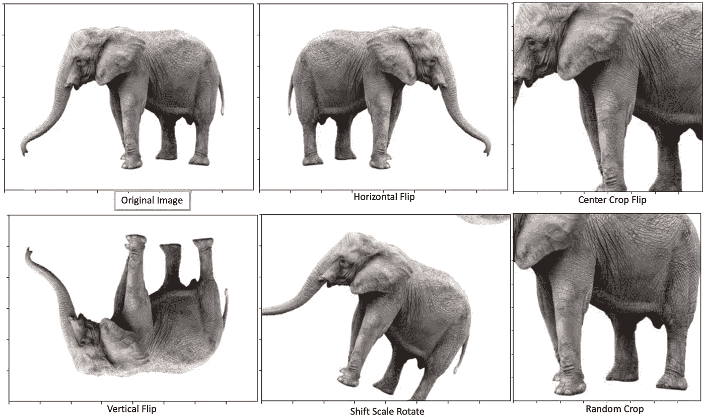

# 减轻计算机视觉中过拟合的五种简单图像数据增强技术

> 原文：<https://towardsdatascience.com/simple-image-data-augmentation-technics-to-mitigate-overfitting-in-computer-vision-2a6966f51af4?source=collection_archive---------12----------------------->

## 本文是对 ***的全面概述*** 的一些简单的图像增强技术

研究已经证明了深度卷积神经网络对于许多领域中的许多计算机视觉任务的效率，例如自主车辆、医学成像等。然而，这些网络严重依赖大质量数据，以便在现实世界的问题上表现出色。**但是，一个数据能有多大才能有一个好的模型呢？**关于数据，有一点很清楚:**我们拥有的高质量数据越多，它就越好**。为了消除任何疑虑，我们将使用一种称为 ***图像增强*** 的技术来增加我们的训练数据的数量，以便我们的模型 ***避免过度拟合*** 训练图像数据。

# 过度拟合是什么，什么时候发生？

在模型的训练期间，如果模型能够学习底层任务，则验证错误会减少。在某一点上，训练误差会不断减小，而测试/保留数据上的误差会增加，**这种情况称为过度拟合**，因为模型不断从训练数据中学习一些模式，而这些模式不会在测试数据上推广(图中所示)。

图片来自[维基百科](https://upload.wikimedia.org/wikipedia/commons/thumb/5/52/2d-epochs-overfitting.svg/730px-2d-epochs-overfitting.svg.png)

# **与有限图像数据相关的问题**

***获取数量非常有限的高质量训练数据*** 是过度拟合的根本原因之一。

*   我们拥有的高质量数据越多越好，但获取这样的数据可能非常昂贵和耗时。
*   健壮的计算机视觉模型对于图像中的微小变化(例如旋转、平移)应该是不变的。如果一个模型能够识别左边的大象，我们可能也希望它能够识别右边的大象，不幸的是，这不一定是已知的，除非这个模型被训练成这样。

(图片由作者提供)

# **图像增强方法**

图像扩充是使用训练集中已经存在的图像来增加训练数据大小的过程。正如我们从下图中看到的，有两种主要的图像增强方法

*   基本的图像操作:这将是我们文章的重点。
*   使用生成对抗网络(GAN)增强、风格转移和对抗训练的深度学习方法:这可能是另一个时间的主题。

图片由[康纳缩短](https://link.springer.com/article/10.1186/s40537-019-0197-0#auth-Connor_Shorten) & [塔希·米·科什戈夫塔尔](https://link.springer.com/article/10.1186/s40537-019-0197-0#auth-Taghi_M_-Khoshgoftaar)来自[斯普林格](https://link.springer.com/article/10.1186/s40537-019-0197-0/figures/2)

# 基本图像增强技术和插图

这五种主要的图像变换技术可以用来增加数据的大小。为了更好地理解，所有这些技术后面都会有例子。

*   几何变换
*   色彩空间转换
*   随机擦除
*   内核过滤器
*   混合图像

## 1.几何变换

在使用这种技术之前，重要的是要理解在保留标签方面什么样的转换对数据有意义(例如，对于数字识别，以某种方式翻转 **6** 可能会变成 **9** )。

(图片由作者提供)

## 2.色彩空间转换

这种技术有很多可能性，它为图像转换提供了更多的创造性空间，但亮度和对比度可能是最常见的技术。

(图片由作者提供)

## 3.随机擦除

与几何变换一样，这种技术也可能不保留标签。但它很有趣，因为它迫使模型关注整个图像，而不是子集。例如，模型不能通过只看它的脸来识别大象，因为那部分可能被遮住了，这实际上迫使模型看整个上下文。该技术受 dropout 方法的启发，dropout 方法是一种正则化技术，它将神经网络层中的随机部分权重归零。它还有助于克服测试图像的遮挡或不清晰部分的问题(例如，大象的某个部分被树或其他东西隐藏)。

(图片由作者提供)

## 4.内核过滤器

这些技术主要用于使用滤镜锐化或模糊图像。他们在引擎盖下使用了一个 ***NxN 内核*** ，类似于卷积神经网络(CNN)的内部工作方式。它们也非常有利于使模型对动作镜头更加鲁棒，尤其是当训练数据中的所有图像都具有相似的清晰质量时。

(图片由作者提供)

## 5.混合图像

像素平均(混合)和叠加裁剪(剪切混合)是混合图像的两种方式。让我们考虑把大象和右边的森林图像结合起来。

(图片由作者提供)

# 结论

通过前面的技术，我们能够从一个图像中获得多个图像。将这些技术应用于训练数据中的所有图像可以因此增加其大小。然而，为了应用保留标签的技术，理解数据是非常重要的。

我希望您喜欢这篇文章。如果您有任何问题或意见，我将很高兴欢迎他们进行进一步的讨论。如需进一步阅读，请随时查阅以下链接:

[https://link.springer.com/article/10.1186/s40537-019-0197-0](https://link.springer.com/article/10.1186/s40537-019-0197-0)

https://github.com/albumentations-team/albumentations

再见🏃🏾