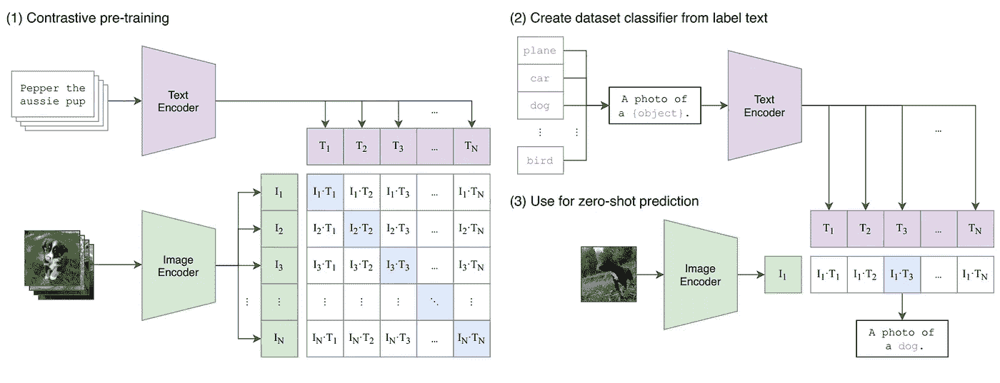
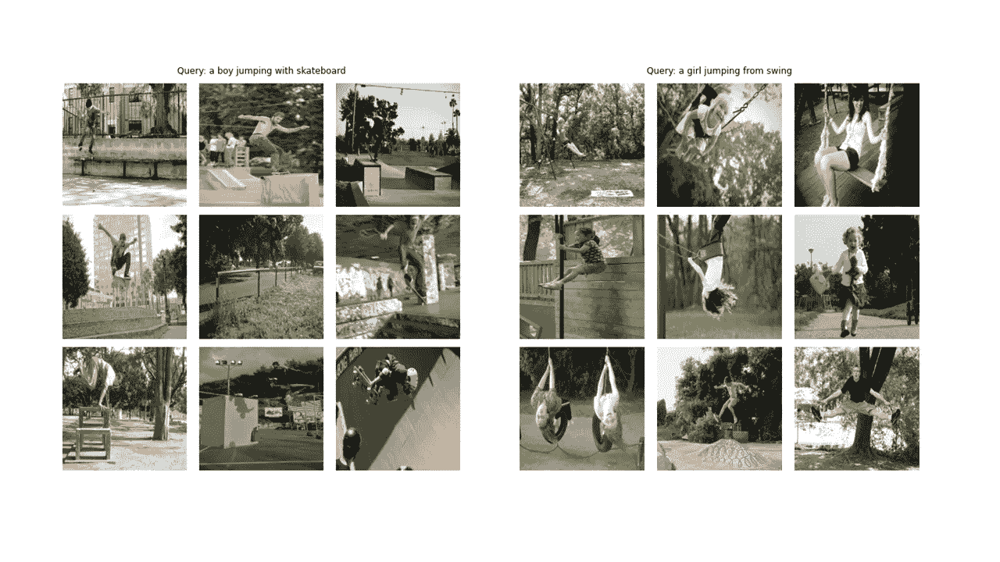
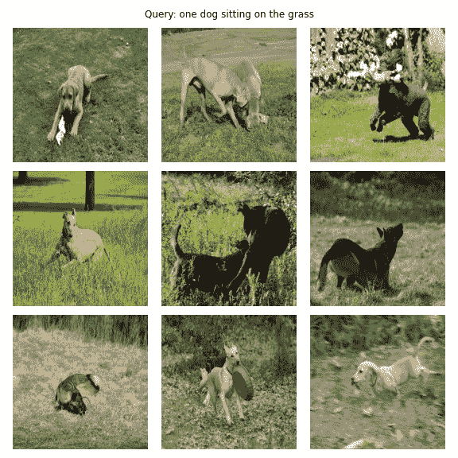
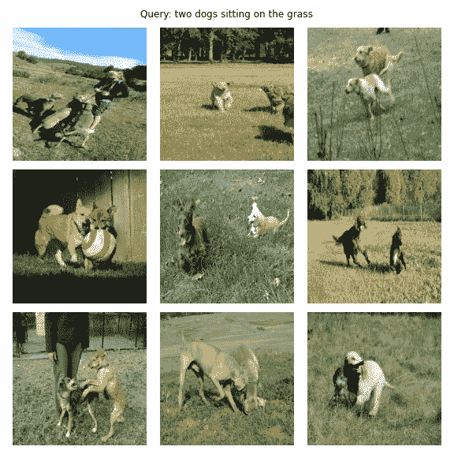
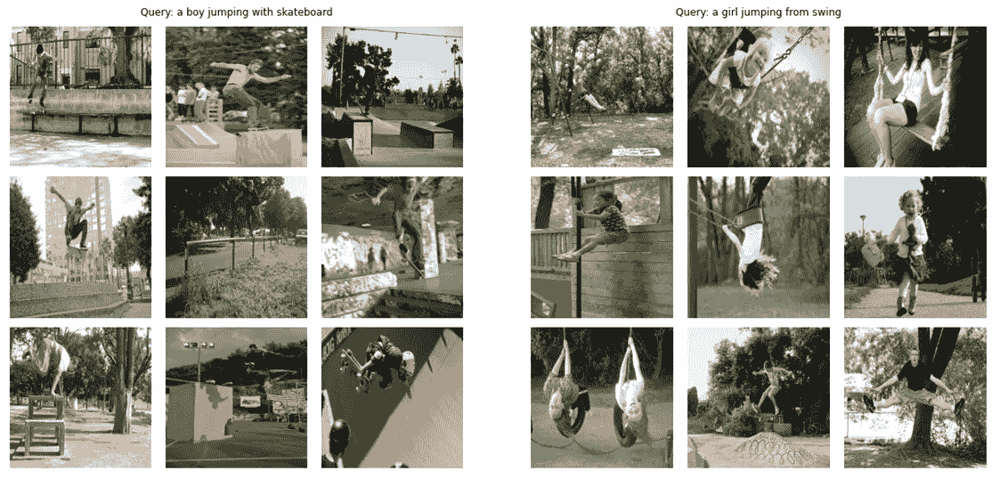
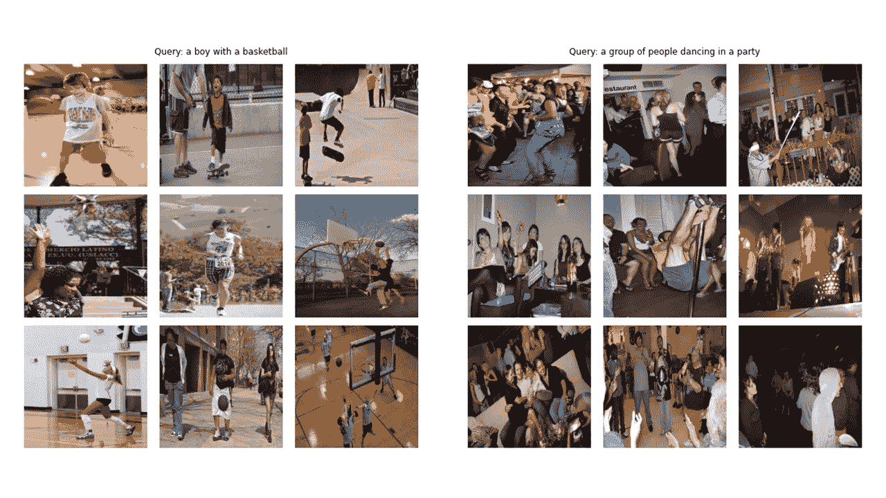
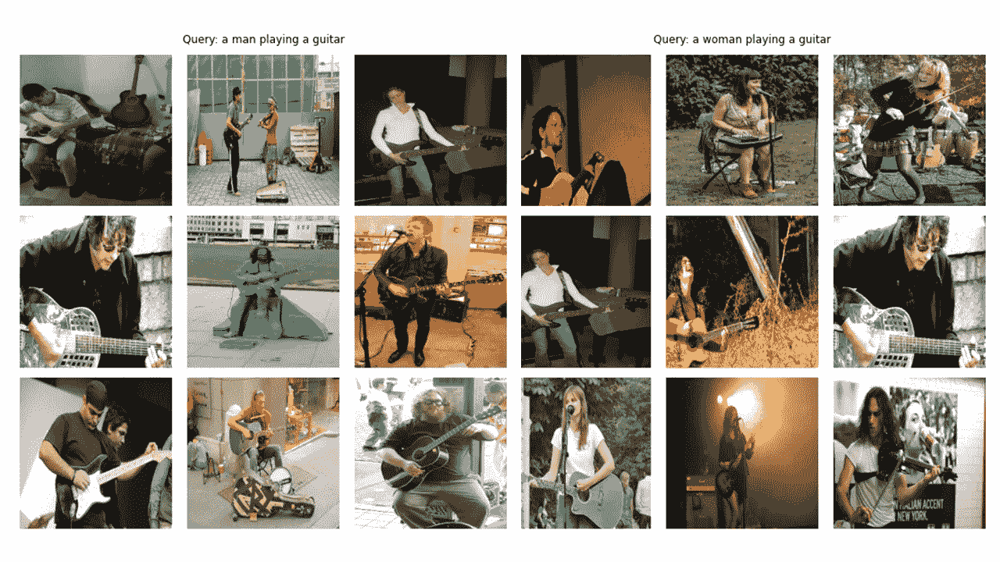

# OpenAI 剪辑模型的简单实现:教程

> 原文：<https://towardsdatascience.com/simple-implementation-of-openai-clip-model-a-tutorial-ace6ff01d9f2?source=collection_archive---------3----------------------->

摘要剪辑模型的方法，从[学习可转移的视觉模型从自然语言监督](https://arxiv.org/abs/2103.00020)论文

# 介绍

2021 年 1 月，OpenAI 宣布了两个新模型:DALL-E 和 CLIP，这两个多模态模型以某种方式连接文本和图像。在本文中，我们将在 **PyTorch** 中从头开始实现剪辑模型。OpenAI 已经开源了一些与 CLIP model 相关的代码，但我发现它令人生畏，而且它远非简单短小。我还看到了一个很好的教程，灵感来自 Keras 代码示例上的剪辑模型，我将它的一些部分翻译成 PyTorch，完全用我们心爱的 PyTorch 来构建这个教程！

**我把所有的代码都作为笔记本放在了**[**Google Colab**](https://colab.research.google.com/drive/1hYHb0FTdKQCXZs3qCwVZnSuVGrZU2Z1w?usp=sharing)**和**[**ka ggle**](https://www.kaggle.com/moeinshariatnia/openai-clip-simple-implementation)**上，也放在了我的**[**GitHub**](https://github.com/moein-shariatnia/OpenAI-CLIP)**上。**

# CLIP 是做什么的？为什么好玩？

在[从自然语言监督中学习可转移视觉模型](https://arxiv.org/abs/2103.00020)论文中，OpenAI 介绍了他们的新模型，名为 **CLIP** ，用于**对比语言-图像预训练**。简单来说，这个模型学习**一个整句**和它所描述的**形象**之间的关系；在某种意义上，当训练模型时，给定一个输入句子，它将能够检索对应于该句子的最相关的图像。这里重要的是，它是在完整的句子上训练的，而不是像汽车、狗等单一类别。直觉是，当对整个句子进行训练时，模型可以学习更多的东西，并在图像和文本之间找到一些模式。

他们还表明，当这个模型在一个巨大的图像数据集及其相应的文本上训练时，它也可以充当分类器。我鼓励您研究这篇论文，以了解更多关于这个令人兴奋的模型及其在基准数据集上的惊人结果。仅举一个例子，用这种策略训练的剪辑模型比那些在 ImageNet 上训练的 SOTA 模型更好地分类 ImageNet，ImageNet 本身被优化用于唯一的分类任务！

作为一个**引子(！)**，让我们看看我们将在本文中从头开始构建的最终模型有什么能力:给定一个查询，如“一个男孩用滑板跳跃”或“一个女孩从秋千上跳跃”，该模型将检索最相关的图像:

上述文本查询的最终模型输出|作者图片

敬请期待:)

# 入门指南

好吧。让我们直接看它的 PyTorch 实现。首先，我们需要一个包含图像和一些描述它们的文本的数据集。坦白地说，网上有很多。我们将使用 **Flickr 8k 数据集**(你可以使用更大的 30k 版本，最终模型的性能会更好)，它主要用于图像字幕任务。但是，没有限制，我们也可以用它来训练剪辑模型。

如果你用的是我写的[**Kaggle 笔记本**](https://www.kaggle.com/moeinshariatnia/openai-clip-simple-implementation) ，你不需要下载任何东西！数据已经在那里了../输入。

但是如果你正在使用 [**Colab**](https://colab.research.google.com/drive/1hYHb0FTdKQCXZs3qCwVZnSuVGrZU2Z1w?usp=sharing) 或者你想在你的**本地机器**上下载它，下面的代码将下载 8k(或者 30k，如果你不注释最后几行)并解压它们。您需要在下面的指定字符串中输入您的 Kaggle 用户名和密钥(如果您还没有 Kaggle 帐户，只需创建一个即可！)

关于这个数据集需要注意的一点是，每个图像有 5 个标题。这个我以后写损失函数的时候再讲！

# 资料组

正如您在本文的标题图片中所看到的，我们需要对图片及其描述文本进行编码。因此，数据集需要**返回图像和文本**。当然，我们不会将原始文本输入到我们的文本编码器中！我们将使用来自 **HuggingFace** 库中的 **DistilBERT** 模型(它比 BERT 小，但性能几乎和 BERT 一样好)作为我们的文本编码器；因此，**我们需要用 DistilBERT tokenizer 对句子**(标题)进行标记，然后将标记 id(input _ ids)和注意力屏蔽提供给 DistilBERT。因此，数据集也需要考虑标记化。下面你可以看到数据集的代码。下面我将解释代码中发生的最重要的事情。

*关于****config****和****CFG****的一个说明:我用 python 脚本写代码，然后转换成 Jupyter 笔记本。因此，在 python 脚本的情况下，config 是一个普通的 python 文件，我将所有的超参数放在其中，而在 Jupyter Notebook 的情况下，它是一个在 Notebook 的开头定义的类，用于保存所有的超参数。查看*[*GitHub repo*](https://github.com/moein-shariatnia/OpenAI-CLIP)*或笔记本，查看所有的超参数。*

在 __init__ 中，我们接收一个 tokenizer 对象，它实际上是一个 HuggingFace tokinzer 运行模型时将加载此标记器。我们将字幕填充和截断到指定的 max_length。在 __getitem__ 中，我们将首先加载一个编码的标题，这是一个带有键 input_ids 和 attention_mask 的字典，从它的值中提取张量，然后我们将加载相应的图像，转换并放大它(如果有！)然后我们把它做成张量，放在字典里，以“image”为关键字。最后，我们将带有关键字“caption”的标题的原始文本放在字典中，只是为了可视化的目的。

我没有使用额外的数据扩充，但如果你想提高模型的性能，你可以添加它们。

# 图像编码器

图像编码器代码非常简单。我在这里使用 PyTorch 图像模型库(timm ),它使许多不同的图像模型从 ResNets 到 EfficientNets 等等都可用。这里我们将使用一个 **ResNet50** 作为我们的图像编码器。如果不想安装新的库，可以很容易地使用 torchvision 库来使用 ResNets。

代码将每个图像编码为一个固定大小的矢量，该矢量具有模型输出通道的大小(在 ResNet50 的情况下，矢量大小将是 **2048** )。这是 nn 之后的输出。AdaptiveAvgPool2d()层。

# 文本编码器

正如我之前提到的，我将使用 DistilBERT 作为文本编码器。像它的哥哥伯特一样，两个特殊的标记将被添加到实际的输入标记中: **CLS** 和 **SEP** ，它们标记一个句子的开始和结束。为了获得一个句子的完整表示(正如相关的 BERT 和 DistilBERT 论文所指出的)，我们使用 CLS 令牌的最终表示，我们希望这个表示能够捕捉到句子的整体含义(标题)。以这种方式思考，它类似于我们对图像所做的，并将它们转换成固定大小的向量。

在 DistilBERT(还有 BERT)的情况下，每个令牌的输出隐藏表示是大小为 **768** 的向量。因此，整个字幕将被编码在大小为 768 的 CLS 令牌表示中。

# 投影头

我用投影头的 [Keras 代码示例实现](https://keras.io/examples/nlp/nl_image_search/)用 PyTorch 写了以下内容。

既然我们已经将图像和文本编码成**固定大小的矢量**(图像 2048，文本 768)**我们需要将它们(投影)到一个新的世界**(!)具有相似的尺寸，以便能够对它们进行比较，并推开不相关的图像和文本，将匹配的图像和文本放在一起。因此，下面的代码将把 2048 和 768 维向量带入一个 256 (projection_dim)维的世界，在那里我们可以比较它们:

“embedding_dim”是输入向量的大小(对于图像是 2048，对于文本是 768 ),而“projection_dim”是输出向量的大小，在我们的例子中是 256。要了解这部分的细节，您可以参考[回形针](https://arxiv.org/abs/2103.00020)。

# 剪辑模型

这部分是所有乐趣发生的地方！这里我也讲一下损失函数。为了撰写这一部分，我将 [Keras 代码示例](https://keras.io/examples/nlp/nl_image_search/)中的一些代码翻译成 PyTorch。看一下代码，然后阅读代码块下面的解释。

这里，我们将使用之前构建的模块来实现主模型。__init__ 函数是不言自明的。在正向函数中，我们首先**将**图像和文本分别编码成固定大小的向量(维度不同)。之后，使用独立的投影模块，我们**将它们投影到我之前提到的共享世界(空间)。在这里，编码将变成类似的形状(在我们的例子中是 256)。之后，我们将计算损失。我再次建议阅读回形针，以获得更好的效果，但我会尽力解释这一部分。**

在**线性代数**中，衡量两个向量是否具有相似特征(它们彼此相似)的一个常用方法是计算它们的**点积**(将匹配条目相乘并取其和)；如果最后的数字很大，他们是一样的，如果它很小，他们不是(相对而言)！

好吧！我刚才说的是理解这个损失函数最重要的事情。我们继续。我们讨论了两个向量，但是，这里有什么呢？我们有 image_embeddings，一个带有形状的矩阵(batch_size，256)和带有形状的 text _ embeddings(batch _ size，256)。很简单！这意味着我们有两组向量，而不是两个单独的向量。我们如何衡量两组向量(两个矩阵)彼此的相似程度？同样，使用点积(在这种情况下，PyTorch 中的@ operator 执行点积或矩阵乘法)。为了能将这两个矩阵相乘，我们**转置**第二个矩阵。好的，我们得到一个形状为(batch_size，batch_size)的矩阵，我们称之为 **logits** 。(在我们的例子中，温度等于 1.0，所以，没有区别。你可以玩玩它，看看它有什么不同。还要看看纸，看看为什么会在这里！).

希望你还和我在一起！如果没有也没关系，只需检查代码并检查它们的形状。现在我们有了逻辑，我们需要目标。我需要说的是，有一种更直接的方法可以获得目标，但是对于我们的情况，我必须这样做(我将在下一段中讨论为什么)。

让我们考虑我们希望这个模型学习什么:**我们希望它学习给定图像和描述它的标题的“相似表示(向量)”。这意味着我们要么给它一个图像，要么给它描述它的文本，我们希望它为两者产生相同的 256 大小的向量。**

因此，在最好的情况下，text _ embeddings 和 image_embedding 矩阵应该是相同的，因为它们描述的是相似的东西。现在让我们想想:如果发生这种情况，罗吉斯矩阵会是什么样的？我们用一个简单的例子来看！

所以 logits，在最好的情况下，将是一个矩阵，如果我们取它的 softmax，将在对角线上有 1.0(一个用花哨的词来称呼它的单位矩阵！).因为损失函数的工作是使模型的预测与目标相似(至少在大多数情况下！)，我们要这样一个矩阵作为我们的目标。这就是为什么我们在上面的代码块中计算图像相似性和文本相似性矩阵的原因。

现在我们已经得到了目标矩阵，我们将使用简单的**交叉熵**来计算实际的**损失**。我写了**交叉熵的完整矩阵形式**作为一个函数，你可以在代码块的底部看到。好吧！我们完了！这不是很简单吗？！好吧，你可以忽略下一段，但如果你好奇，有一个重要的注意事项。

**这就是为什么我没有使用更简单的方法**:我必须承认在 PyTorch 中有一种更简单的方法来计算这个损失；这样做: **nn。CrossEntropyLoss()(logits，torch.arange(batch_size))** 。为什么我没有在这里使用它？有两个原因。1-我们正在使用的数据集对于单个图像具有多个标题；因此，有可能一批中存在两个标题相似的相同图像(这种情况很少见，但也有可能发生)。用这种更简单的方法来承担损失将会忽略这种可能性，并且模型学会将实际上相同的两个表示(假设它们不同)分开。显然，我们不希望这种情况发生，所以我计算了整个目标矩阵，考虑到了这些边缘情况。2-按照我的方式做，让我更好地理解了这个损失函数中发生了什么；所以，我想这会给你一个更好的直觉！

# 火车

这里有一个方便的函数来训练我们的模型。这里没发生什么事情。只是加载批处理，将它们提供给模型，并步进优化器和 lr_scheduler。

你可以在 [Colab](https://colab.research.google.com/drive/1hYHb0FTdKQCXZs3qCwVZnSuVGrZU2Z1w?usp=sharing) 和 [Kaggle](https://www.kaggle.com/moeinshariatnia/openai-clip-simple-implementation) 笔记本或者我的 [GitHub repo 中找到更多的实用函数和类(比如 AvgMeter 和 get_lr)。](https://github.com/moein-shariatnia/OpenAI-CLIP)

好吧！我们已经完成了模型的训练。现在，我们需要进行推理，在我们的例子中，将为模型提供一段文本，并希望它从一个看不见的验证(或测试)集中检索最相关的图像。

# 获取图像嵌入

在这个函数中，我们加载训练后保存的模型，在验证集中输入图像，并返回带有形状(valid_set_size，256)和模型本身的 image _ embeddings。

# 查找匹配项

这个函数完成了我们希望我们的模型能够完成的最后一项任务:它获取模型、image _ embeddings 和一个文本查询。它将显示验证集中最相关的图像！是不是很神奇？看看它到底表现如何！

来看几个例子吧！在这一点上，当我看到输出时，我高兴地尖叫起来，并震惊地发现模型实际上正在学习图像和文本之间的关系！这种感觉简直难以置信。

这是我们如何使用这个功能。Aaaannnndddd 添加结果:

作者图片

我当时就想:哇！这个模特知道点什么！当然，它并不完美，因为在一些照片中有两只狗，但考虑到小的训练集和短的训练时间，我认为它很棒！

让我们看看其他一些输出。查询写在每个图像的顶部。

作者图片

看吧！它还会数数！把这个和前一个比较一下。该模型知道“two”的含义，并带来了包含两只狗的图像，与前面的查询形成了对比！这时我从第二次震惊中尖叫了出来:)

我们从文章开始的输出:

作者图片

作者图片

对于下一个，这个模型犯了一些错误，但总体来说，它显然对文本和图像都有很好的理解。

作者图片

# 最后的话

我希望你喜欢这篇文章。实现这篇论文对我来说是一次非常有趣的经历。我要感谢 [Khalid Salama](https://www.linkedin.com/in/khalid-salama-24403144/) 提供的伟大的 Keras 代码示例，它启发了我用 PyTorch 编写类似的代码。

**如文中所述，所有代码和结果均可在我的**[**GitHub repo**](https://github.com/moein-shariatnia/OpenAI-CLIP)**中获得，也可作为 Jupyter 笔记本上的**[**Kaggle**](https://www.kaggle.com/moeinshariatnia/openai-clip-simple-implementation)**和**[**Colab**](https://colab.research.google.com/drive/1hYHb0FTdKQCXZs3qCwVZnSuVGrZU2Z1w?usp=sharing)**。**