# 清理逻辑回归

> 原文：<https://towardsdatascience.com/simple-logistic-regression-a9735ed23abd?source=collection_archive---------32----------------------->

## 非数学家指南

在 [Unsplash](https://unsplash.com?utm_source=medium&utm_medium=referral) 上由 [Rots Marie-Hélène](https://unsplash.com/@machestla?utm_source=medium&utm_medium=referral) 拍摄的照片

# 介绍

YouTube 上有很多出色的数据科学内容创作者。如果我试图理解一个算法，他们中的一个通常会一针见血并完美地描述它。

用逻辑回归，我找不到一个完美的描述。人们似乎从不同的方向接近这个算法，这让我感到困惑。也可能是因为我没有深厚的数学背景。逻辑回归是相当重的数学符号，这可能是另一个原因，为什么我发现它很难理解了很长一段时间。

本文旨在以一种易于理解的格式解释逻辑回归，从其他解释中吸取精华，并给出引入新概念的逻辑顺序。

那么它是如何工作的呢？

# 目录

*   [示例数据](#9604)
*   [线性回归](#3817)
*   [物流功能](#338f)
*   [概率，赔率](#2e3e)
*   [重新排列方程式](#8c2e)
*   [什么是系数](#0c5f)
*   [对数赔率](#6725)
*   [最大似然估计](#11f2)

# 数据集

## 示例数据

对于这个例子，我们将使用我臭名昭著的水果数据集。实际上，我们将忽略这里的**葡萄**，而专注于**苹果**和**梨**。

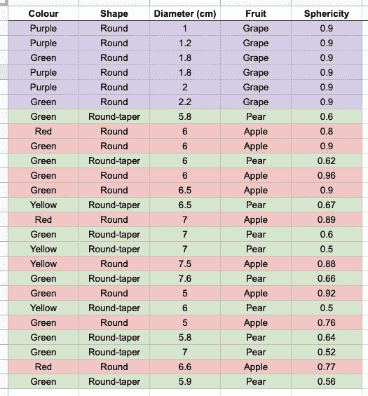

包含水果相关数据的示例数据集。图片作者。

如果我们对照实际的类/ *水果*绘制*球形度*(测量水果有多圆)就会发生这种情况(1 代表**苹果**，0 代表**梨**)

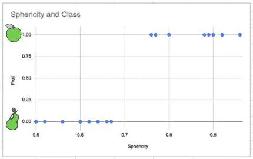

苹果和梨的球形度与水果的关系图。图片作者。

你将如何对这些数据进行分类？

*   我们可以在中间画一条垂直线，表示任何超过 0.7 的都是苹果。
*   我们可以创建一个回归模型，其中球形度的增加意味着苹果的球形度的增加？这真的没有意义
*   理想情况下，我们想说我们有多确信水果是苹果，给定关于*球形度*的数据，增大的*球形度*表示更大的可能性。

# 为什么我们不能对此使用线性回归

我们可以通过确定 y 轴是概率来把这个问题公式化为一个回归问题。回归输出会给我们一个**概率**， *p* ，我们可以说任何低于 0.5 的都是一个**梨**，高于 0.5 的都是一个**苹果**。

我们可以对数据拟合一条回归线，这将给出下面的回归线。记住线性回归方程是:

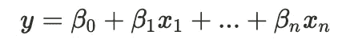

线性回归方程。图片作者。

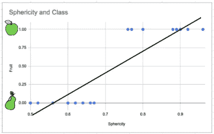

一个分类问题的线性回归。图片作者。

这种做法行不通有几个原因。最明显的是我们的回归模型可以预测低于 0 和高于 1 的值。这些值实际上意味着什么？它们真的是概率吗？

如果我们得到一个形状特别奇怪的梨会怎么样？

你可以在下面看到，如果我们添加一个**梨**和一个*球形度*为 0.2，我们真的想表明我们 100%确定这是一个**梨**。这实际上是将回归线拉向这个例子，意味着我们靠近中心的点现在被错误分类了。

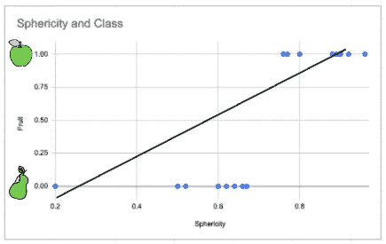

添加异常值。图片作者。

重申…

> 为了对数据进行分类，我们需要使用变量的线性组合来预测 0 和 1 之间的**概率**。

那么，我们如何将结果压缩在 0 和 1 之间呢？

# 物流功能

逻辑或 Sigmoid 功能是一个*激活功能。*

机器学习中的术语*激活函数*现在几乎专门用于神经网络。这基本上是一个函数，我们可以用它将数字压缩到一个合理的范围内。

我们可以使用激活函数将线性回归结果压缩到我们需要的范围内。

对于逻辑回归，使用 **Sigmoid** 函数。这有一个等式:

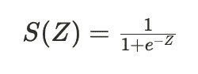

乙状结肠函数。图片作者。

为了将我们的函数映射到这里，我们将 Z 定义为回归方程。

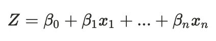

线性回归方程。图片作者。

这个等式的结果输出现在看起来像下面的曲线。值只能在 0 和 1 之间，在本例中，我们正确地对每个点进行了分类。

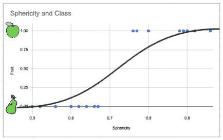

逻辑回归数据。图片作者。

我们现在有了一个等式，可以根据变量的线性组合对数据进行分类。然而，现阶段我们仍有许多不了解的地方:

*   逻辑回归中的**系数**是什么意思？
*   这个模型是如何计算出**系数**的？

为了解释这一点，我们需要再介绍几个概念。

# 赔率和概率

几率提供了一个特定结果的可能性的度量。它们被计算为产生结果的事件数量与不产生结果的事件数量之比。**赔率**常用于赌博和统计。

事件的**概率**是一个介于 0 和 1 之间的数字，其中，粗略地说，0 表示事件的不可能性，1 表示确定性。

使用掷骰子的例子:

图像我们有一个 6 面骰子，我们想掷出 6。

*   滚动 a6 的**概率**为 **1/6 (0.167%)。**
*   掷出 6 的**赔率**为 **1:5。**
*   掷出 a 6 的**赔率**为 **5:1。**

我们可以将**赔率**和**概率**与等式联系起来:

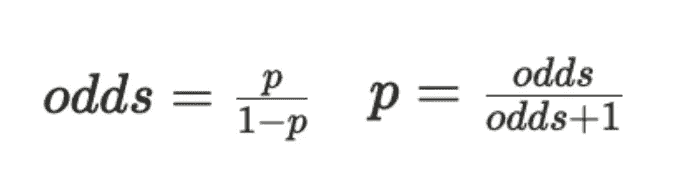

赔率和概率之间的转换。图片作者。

# 重新排列逻辑回归方程

我们将重新排列我们的等式，试图理解它的含义，这里有一个到目前为止我们所拥有的提示:

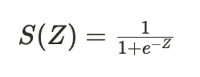

逻辑回归方程。图片作者。

其中 Z 是变量的线性组合；

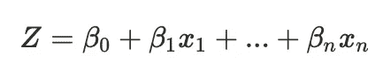

线性回归方程。图片作者。

而 S(Z)是**概率**；

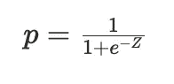

逻辑回归方程。图片作者。

我们可以按照下面的步骤重新排列等式。对于这个过程，我们的目标是分离出 *Z，*变量的线性组合。

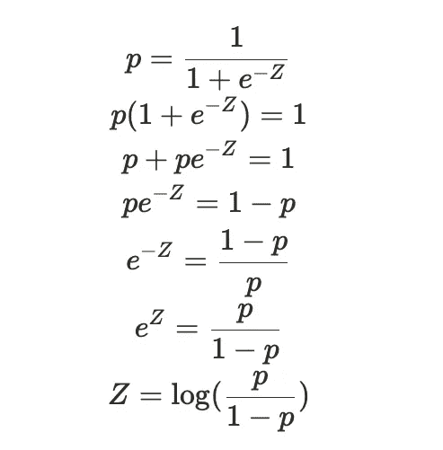

重新排列逻辑回归方程。图片作者。

让我们花点时间来看看结果，如果我们跳回赔率和概率，你会注意到这个等式是赔率的**对数！这也被称为 *logit* 功能。**

## 系数

> 这意味着我们方程中的系数是以**对数几率表示的。**

我们可以取这个的逆来得到以概率表示的系数，这允许我们量化系数在实际中的意义，例如

> “特性 X 将我们的数据被归类为苹果的几率提高了 3 倍”。

# 对数概率

## 对数概率背后的直觉

**对数赔率**是一种考虑我们赔率的有用方法，因为**赔率**是如何衡量的。看看下面的例子。

考虑在普通的六面骰子上掷出 6 和 5 或 6 的**几率**。我们可以在一条数轴上画出**赔率**，并观察事件发生和事件不发生的**赔率**。

我们可以看到，“未发生”端的值可以在 1 和无穷大之间，而“发生”端的值正好在 0 和 1 之间。

这是一个问题，因为就绝对值而言，一方有巨大的差异，另一方有非常小的差异。

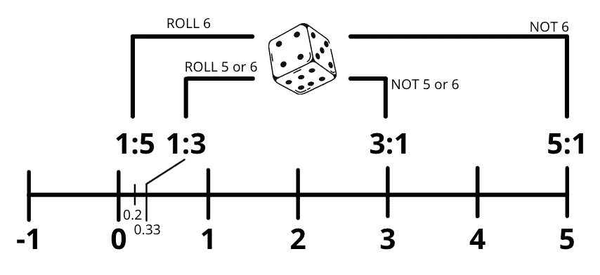

数字线上不同骰子滚动的几率。图片作者。

然而，如果我们将这些转换成对数赔率，我们会得到相反赔率之间的相等距离。

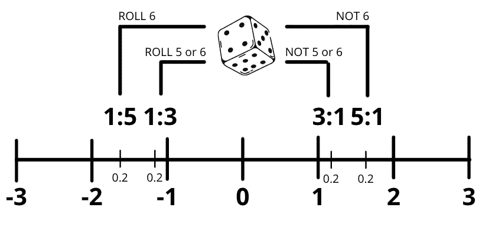

对数-一条数字线上不同骰子滚动的几率。图片作者。

这在复杂得多的统计建模中使用得更广泛，但它有助于将所有这些联系在一起。

## 逻辑回归中的对数优势

回到模型，假设我们已经对数据进行了建模，并从模型中提取了一些系数。如果我们继续使用回归方程计算**对数几率**，我们会得到下面的图表。

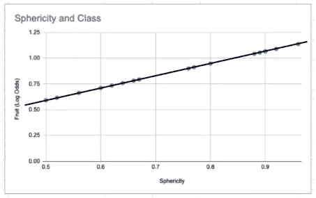

球形度的对数优势。图片作者。

**Log-odds** 给了我们一个线性模型，这可以追溯到我们之前如何重新安排等式。

我们仍然需要按照**概率**的数据，这样我们就可以分配一个类别，但这是一个将所有事情联系在一起的有用方法。

## 绑在乙状结肠上

那么为什么我们不能用对数概率来模拟我们的分类问题呢？为什么我们必须使用 sigmoid 函数？

**对数赔率**被称为 **logit** 函数。如果我们画出这个函数，我们最终会得到一条在 y 轴上没有定义的曲线。我们的目标变量是 y 轴，这意味着我们需要反转这个函数来建模。 **logit** 函数的逆函数就是 **sigmoid** 函数。

# 最大似然估计

现在我们知道了逻辑回归背后的数学原理，但是这个模型实际上是如何计算这些系数的呢？这就是**最大似然估计**出现的地方。

首先，让我们重温一下我们的数据。我们有*球形*对*水果，*标注1 对**苹果**，0 对**梨**。

在逻辑回归中，我们想要预测一个数据点是一个**苹果的概率。**

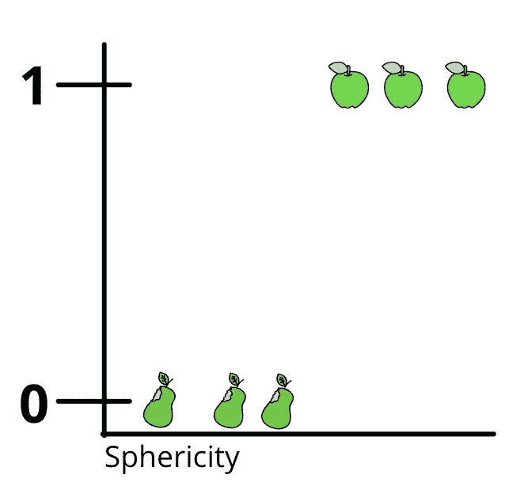

最大似然估计的图形表示的示例数据。图片作者。

首先，我们将这些数据转换成**对数几率**。我已经解释了逻辑回归和**对数概率**之间的关系，所以希望这看起来是一件明智的事情。

然而，这里有一个问题。0 和 1 的**对数几率**是正负无穷大！

此时，我们还绘制了一条随机线来拟合我们的数据。然而，我们不能像线性回归那样使用残差来计算直线与数据的拟合程度，因为我们所有点都在无穷远处。

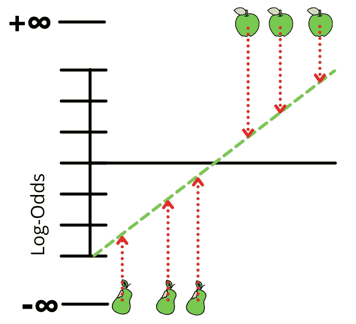

对数优势转换。1 和 0 概率最终为正负无穷大。图片作者。

所以，为了评估我们线的质量，我们把每个点都投射到它上面。从这里，我们可以读出每个点的对数概率。

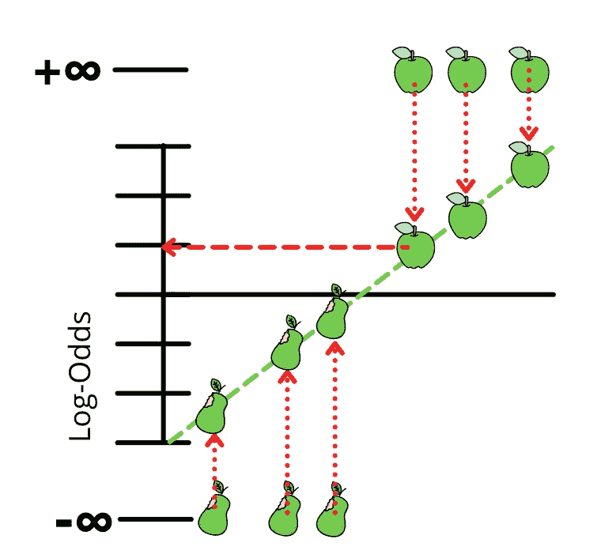

从投影点读取对数优势值。图片作者。

现在我们有了每个点的对数几率，给定我们的随机线，我们可以使用我们之前计算出的重新排列的逻辑回归方程将几率转换回概率。

我们的点现在在概率轴上，我们画的线现在是一个 sigmoid。

我们可以从图中读出每个点的概率，然后用它来计算这条线的总**可能性**。

**似然**一般以对数形式计算，但也可以用其他方式。

为此，我们对每个**苹果**点取**概率**的对数，对每个**梨**点取 1 — **概率**的对数。将这些相加以计算该线的对数似然。

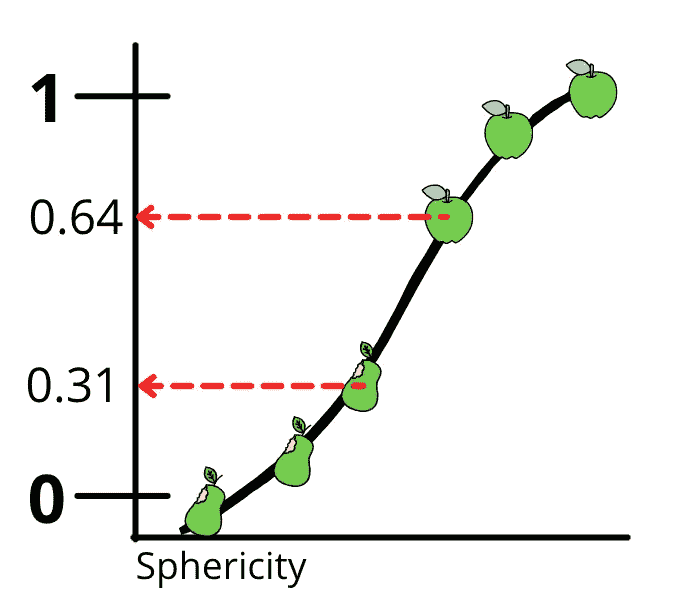

我们可以将数据转换回概率，然后计算出每个点的可能性。作者图片/

然后，我们旋转直线以找到更好的东西，重复相同的步骤来绘制我们的乙状结肠并计算它的**可能性**得分。

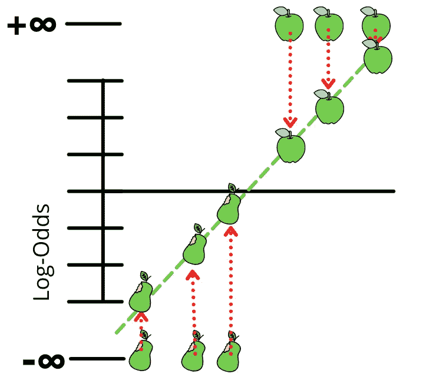

用新的一行重复上述步骤。图片作者。

更陡的直线产生更陡的 s 形曲线。我们可以不断旋转这条线，找到最大化对数似然的曲线。

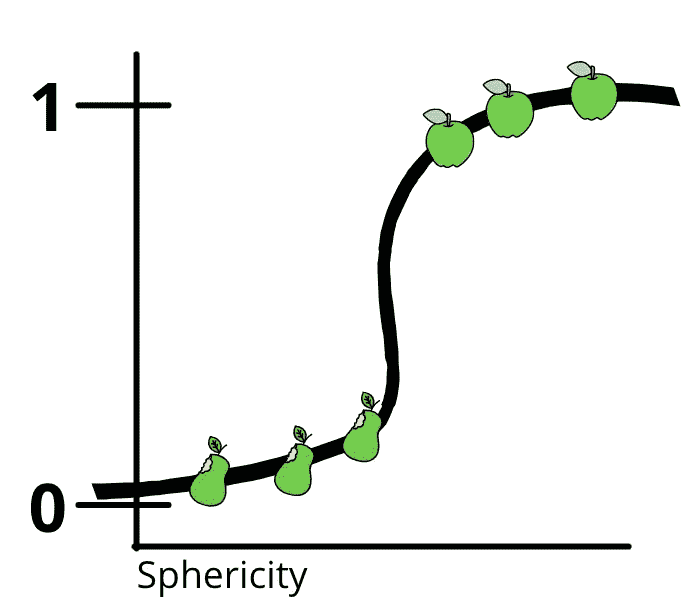

更陡的线产生更陡的 s 形。图片作者。

虽然第一条线是随机的，但最大似然估计能很快找到最佳线。

> 旋转线的算法能够以这样的方式做到这一点，即它总是提高**可能性**，使得该过程非常高效。

照片由 [Antoine Dautry](https://unsplash.com/@antoine1003?utm_source=medium&utm_medium=referral) 在 [Unsplash](https://unsplash.com?utm_source=medium&utm_medium=referral) 上拍摄

# 结论

逻辑回归是最简单和最广泛使用的分类算法之一。网上和教科书上有丰富的信息。我个人的经验是，我发现这个算法有各种不同的解释方式。这篇文章的目的是为数据科学家提供一个清晰有序的解释。

希望这已经按逻辑顺序理清了逻辑回归。如果你觉得有什么没有解释清楚或者需要更多的细节，请留下你的评论。我很想进一步讨论这个问题。

## 点击这里查看我的其他算法解释:

 [## 决策树的非技术性指南

### 现代的、基于树的模型的构建模块…

towardsdatascience.com](/decision-trees-ac091793070)  [## 面向非技术受众的随机森林

### 今天最广泛使用的算法之一实际上很难解释…

towardsdatascience.com](/random-forest-29cf337c68d4) 

## 联系我

 [## Adam Shafi -数据科学沉浸式大会| LinkedIn

### 拥有 4 年以上分析经验的数据科学家，包括管理团队、交付项目和转变…

www.linkedin.com](https://www.linkedin.com/in/adamshafi/)