# Python 中的简单逻辑回归

> 原文：<https://towardsdatascience.com/simple-logistic-regression-using-python-scikit-learn-86bf984f61f1?source=collection_archive---------5----------------------->

## 从数据预处理到模型评估的逐步指南

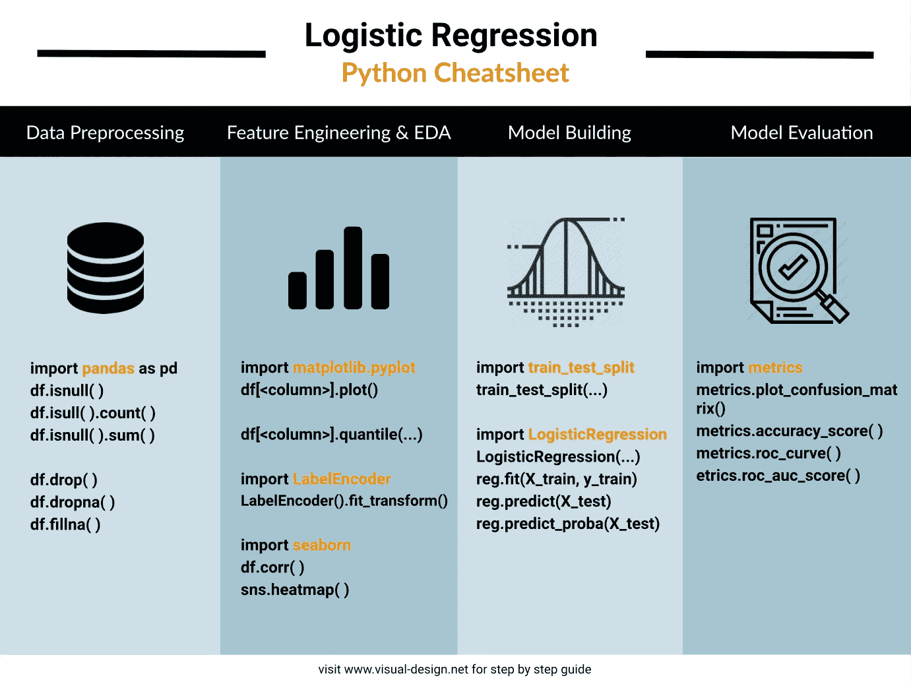

逻辑回归 python cheatsheet(图片作者来自[www.visual-design.net](http://www.visual-design.net)

## 什么是逻辑回归？

不要让逻辑回归这个名字欺骗了你，它通常属于分类算法而不是回归算法的范畴。

那么，什么是分类模型呢？简而言之，由分类模型生成的预测将是一个分类值，例如，猫或狗，是或否，真或假…相反，回归模型将预测一个连续的数值。

逻辑回归基于 Sigmoid 函数进行预测，Sigmoid 函数是一条曲线状的线，如下所示。尽管它返回概率，但最终输出将是通过将概率与阈值进行比较而分配的标签，这使它最终成为一种分类算法。

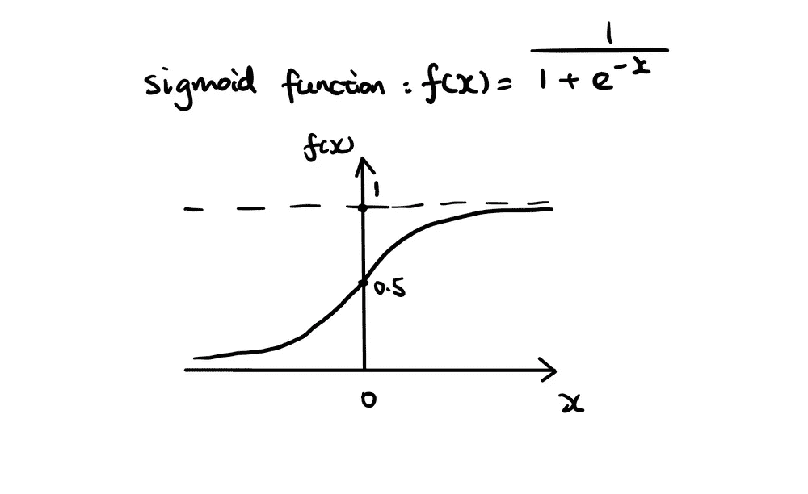

sigmoid 函数的简单说明(图片由作者提供)

在本文中，我将通过以下步骤使用 python scikit -learn 构建一个简单的逻辑回归模型:

1.  数据预处理
2.  特征工程和 EDA
3.  模型结构
4.  模型评估

数据取自 Kaggle 公共数据集[“澳大利亚的雨”](https://www.kaggle.com/jsphyg/weather-dataset-rattle-package)。目标是根据现有知识，如温度、湿度、风速等，预测二元目标变量“RainTomorrow”。在我的网站上的[文章末尾，您可以随意获取完整代码。](https://www.visual-design.net/post/simple-logistic-regression-using-python-scikit-learn)

## 1.数据预处理

首先，让我们加载库和数据集。

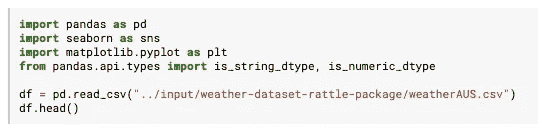

导入库和数据集(图片由作者提供)

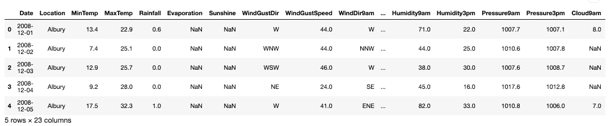

df.head()(图片作者提供)

使用`df.describe()`查看原始数据。

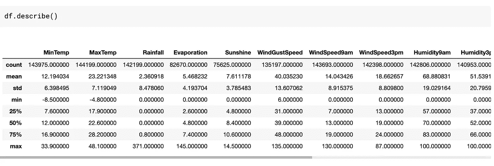

df.describe()(图片由作者提供)

我们不能总是期望所提供的数据对于进一步的分析是完美的。事实上，这种情况很少发生。因此，数据预处理至关重要，尤其是处理缺失值是确保数据集可用性的必要步骤。我们可以使用 *isnull()* 函数来查看缺失数据的范围。下面的代码片段计算每列缺失值的百分比。

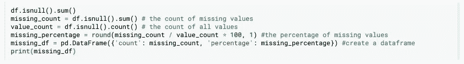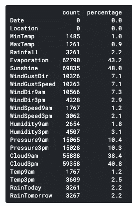

缺失值百分比(作者图片)

有四个字段丢失了 38%到 48%的数据。我删除了这些列，因为这些值很可能是**丢失的，而不是随机丢失的**。例如，我们遗漏了大量的蒸发数据，这可能会受到测量仪器容量的限制。因此，有更多极端蒸发措施的日子可能不会首先被记录下来。所以剩下的数字已经偏了**。**为此，保留这些字段可能会污染输入数据。如果您想区分三种常见类型的缺失数据，您可能会发现这篇文章[“如何处理缺失数据”](https://medium.com/analytics-vidhya/how-to-address-missing-data-531ed964e68)很有帮助。

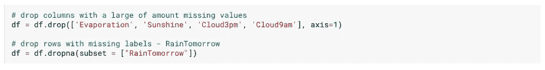

按列和按行删除(图片由作者提供)

在执行按列删除后，我删除了缺少标签的行，“RainTomorrow”，直到`dropna().`为了建立一个机器学习模型，我们需要标签来训练或测试模型，因此没有标签的行对这两个过程都没有太大帮助。但是，数据集的这一部分可以在模型实现后作为预测集分离出来。在处理缺失数据时，不可避免的是数据形状会发生变化，因此`df.shape`是一种方便的方法，可以让您跟踪数据的大小。在上面的数据操作之后，数据形状从 145460 行 23 列变成了 142193 行 19 列。

对于剩余的列，我分别估算了分类变量和数值变量。下面的代码将列分为分类列表和数字列表，这对后面的 EDA 过程也很有帮助。

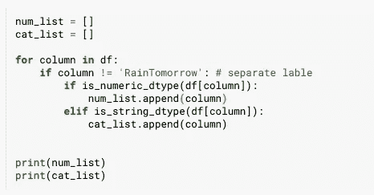

分离数值和分类变量(图片由作者提供)

*   **数值变量:**用变量的平均值估算缺失值。注意，组合`df.fillna()`和`df.mean()` 将足以只转换数字变量。

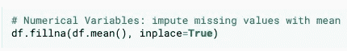

解决数值缺失问题(图片由作者提供)

*   **分类变量:**遍历 cat_list 并用“未知”替换缺失值

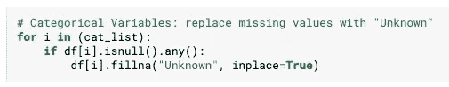

处理分类缺失值(图片由作者提供)

## 2.特征工程和 EDA

将这两个过程结合在一起有利于根据数据集的分布和特征选择适当的特征工程技术。

在这个例子中，我没有深入探索数据分析(EDA)过程。如果您有兴趣了解更多，请随意阅读我关于更全面的 EDA 指南的文章。

 [## Python 中的半自动探索性数据分析(EDA)

### 一键式全面数据探索流程

towardsdatascience.com](/semi-automated-exploratory-data-analysis-eda-in-python-7f96042c9809) 

我通过 FOR 循环自动进行单变量分析。如果遇到数字变量，将生成一个直方图来可视化分布。另一方面，为分类变量创建一个条形图。

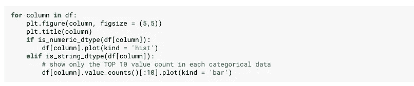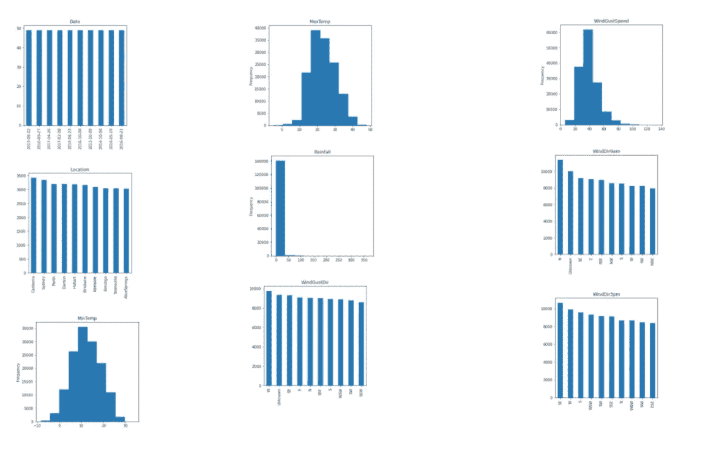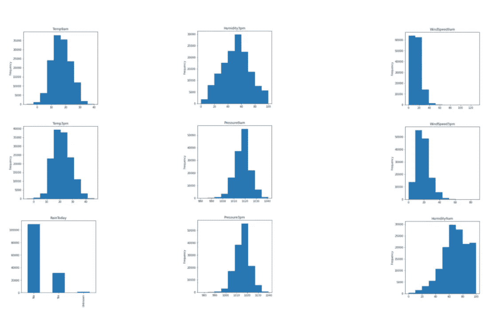

单变量分析(图片由作者提供)

**1)地址异常值**

现在我们有了数据分布的整体视图，发现异常值就容易多了。例如，*降雨量*有严重的右偏分布，表明至少有一个非常高的记录。

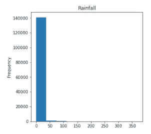

为了消除离群值，我使用*分位数(0.9)* 将数据集限制在数据集的 90%分位数内。因此，降雨量值的上限从 350 大幅降至 6。

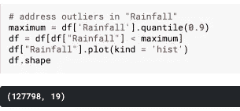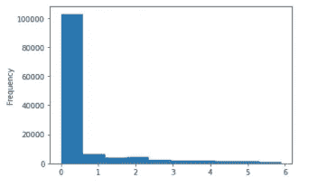

处理异常值(图片由作者提供)

**2)特征变换**

*日期*变量被转换成*月份*。这是因为日期具有如此高的基数，以至于不可能产生模式。而使用 month 可以给出一年中的某些月份是否更有可能下雨的建议。

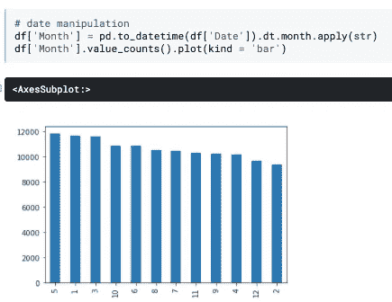

日期转换(图片由作者提供)

**3)分类特征编码**

逻辑回归只接受数值作为输入，因此，有必要将分类数据编码成数字。最常见的技术是一键编码和标签编码。我发现这篇文章很好地比较了这两者。

 [## 一键编码与使用 Scikit-Learn 的标签编码

### 什么是一键编码？什么时候应该使用一次性编码而不是标签编码？这些都是典型的数据科学…

www.analyticsvidhya.com](https://www.analyticsvidhya.com/blog/2020/03/one-hot-encoding-vs-label-encoding-using-scikit-learn/) 

以 *RainToday* 为例:

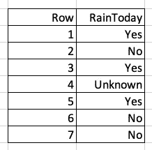

今天下雨的例子

*   **标签编码**更适合基数大的**序数数据**

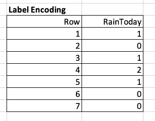

标签编码

*   **一个热编码**更适合低基数和非序数数据

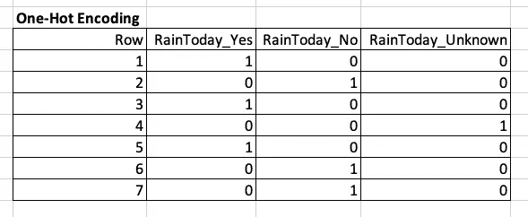

一个热编码

尽管这些列不是有序的，我还是选择了标签编码。这是因为大多数字段都有不少于 17 个唯一值，而一次性编码会使数据变得太大。

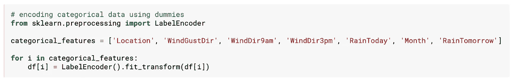

标签编码代码(图片由作者提供)

现在所有的变量都被转换成整数或浮点数。

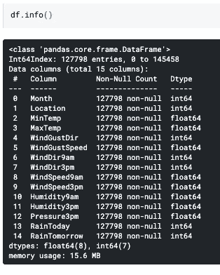

df.info()(图片作者提供)

**4)特征选择**

如果您想了解特性选择技术的详细信息，您可能会发现这很有帮助:

 [## Python 中的特征选择和 EDA

### 如何使用数据可视化来指导 ML 中的特征选择

towardsdatascience.com](/feature-selection-and-eda-in-python-c6c4eb1058a3) 

在这个练习中，我使用了上面文章中提到的相关性分析。相关性分析是一种常见的多变量 EDA 方法，有助于识别高度相关的变量。

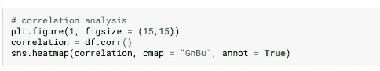

相关性分析(图片由作者提供)

例如:

*   *最小温度，最大温度，温度 9am* 和*温度 3pm*
*   *降雨*和*今日降雨*
*   *压力 9am* 和*压力 3am*

相关矩阵(图片由作者提供)

由于逻辑回归要求预测值之间几乎没有多重共线性，我试图在每组高度相关的变量中只保留一个变量。

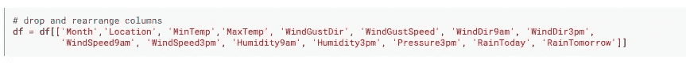

特征选择(图片由作者提供)

## 3.模型结构

之前，我提到过这个练习的目的是预测明天*的降雨*。因此，首要任务是分离输入要素(自变量— X)和标注(因变量— y)。`df.iloc[:, :-1]`是一个方便的函数，可以抓取除最后一行以外的所有行和所有列。

自变量和因变量(图片由作者提供)

其次，特征和标签都被分解成一个子集用于训练，另一个子集用于测试。结果，返回四个部分，X_train、X_test、y_train 和 y_test。为此，我们引入了 *train_test_split* 函数，并指定了参数 test_size。在下面的示例中，test_size = 0.33，因此大约 2/3 的数据用于训练，1/3 用于测试。

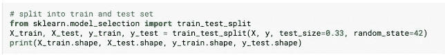

分为训练和测试(图片由作者提供)

多亏了 scikit-learn，我们可以避免从零开始实现所有数学和算法的繁琐过程。相反，我们需要做的只是从 sklearn 库中导入 LogisticRegression，并将训练数据拟合到模型中。然而，通过指定几个参数，例如 max_iter、solver、penalty，仍然有改变模型的灵活性。更复杂的机器学习模型通常会涉及超参数调整过程，该过程搜索可能的超参数值并找到最佳组合。

对于这个初学者友好的模型，我只改变了 max_iter 参数，以使逻辑回归收敛，但同时，该数字不应该太高，以导致过度拟合。

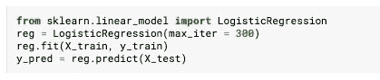

逻辑回归模型(图片由作者提供)

## 4.模型评估

**ROC、AUC、混淆矩阵和准确度**广泛用于评价 Logistic 回归模型。所有这些指标都是基于计算模型预测的 y 值与测试集的实际 y 值之间的差异，即 y_pred 和 y_test。比较差异时，有四种可能的情况:

1.  当预报下雨时，明天确实下雨
2.  真否定:当预测不下雨的时候，明天不下雨
3.  假阳性:当预报下雨时，明天不下雨
4.  假阴性:当预测不下雨的时候却下雨了

**混淆矩阵**

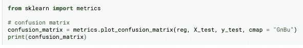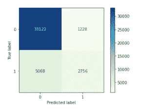

混淆矩阵

我使用了`plot_confusion_matrix()`来提供一个可视化的表示，清楚地指出上面提到的四个场景的数量。如图所示，真正的否定是 33122 例，表明该模型擅长在实际上不会下雨的时候预测明天不会下雨。然而，它仍然需要提高真阳性率，从而成功地预测明天下雨(只有 2756 例)。

**准确度**

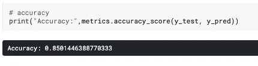

准确(性)

准确性计算所有正确预测的比率:(真阳性+真阴性)/(真阳性+假阳性+假阴性+假阳性)

**ROC 和 AUC**

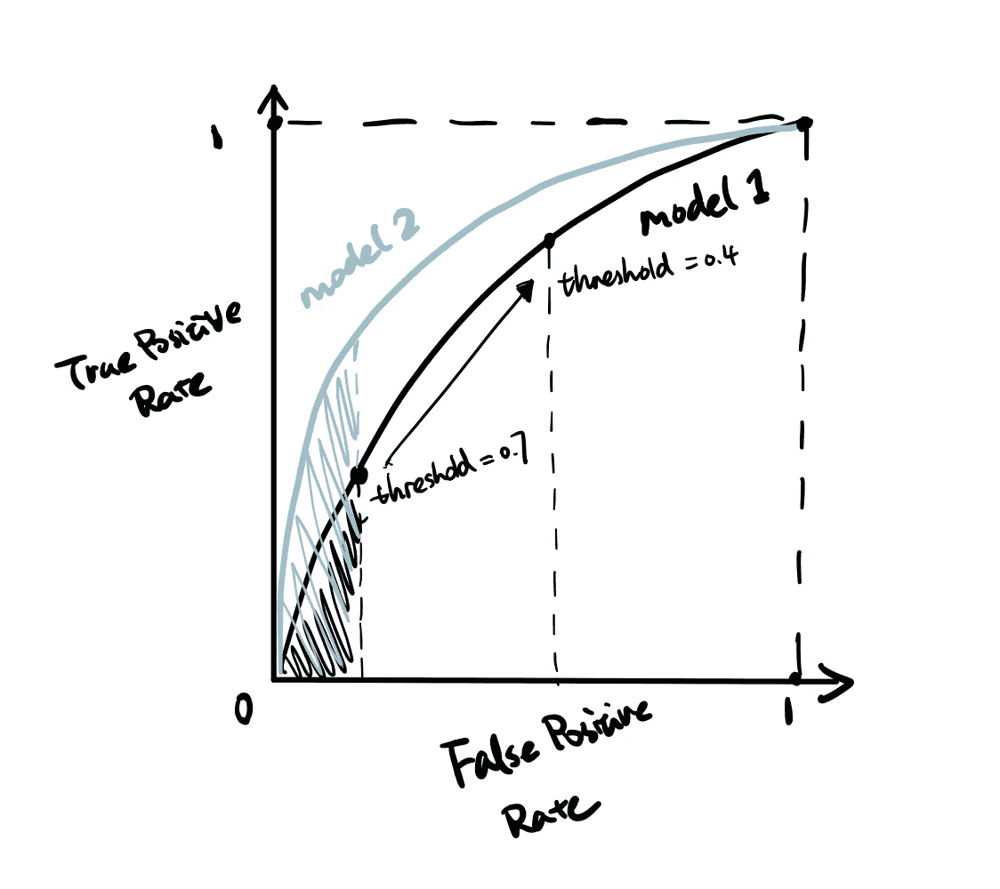

ROC、AUC 插图(图片由作者提供)

ROC 绘制了不同阈值下的真阳性率和假阳性率。例如，当阈值设置为 0.7 时，该点指示真阳性率和假阳性率，因此当预测概率大于 0.7 时，RainTomorrow = Yes。随着概率阈值下降到 0.4，更多的病例将被预测为阳性(RainTomorrow = Yes)，因此真阳性率和假阳性率都上升。AUC 代表曲线下面积，不同的模型具有不同的 ROC，因此 AUC 得分也不同。在这个例子中，模型 2 比模型 1 具有更大的 AUC，并且它是更好的模型。这是因为，在相同的假阳性率水平下，模型 2 具有更高的真阳性率。因此，模型 2 具有更高的 AUC 分数，这使其成为更好的模型。

三个函数用于绘制 ROC 图和计算 AUC:

*   predict_proba():为每个实例生成概率分数
*   roc_curve():返回假阳性率、真阳性率以及绘制曲线所必需的参数。
*   roc_auc_score():计算 auc 分数

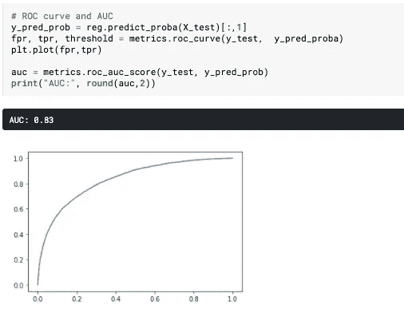

ROC，AUC 代码(图片由作者提供)

## 带回家的信息

本文涵盖了逻辑回归模型构建过程的基本步骤:

1.  数据预处理:重点是缺失值插补
2.  特征工程和 EDA:单变量分析和多变量分析:处理异常值和特征转换
3.  建模:分割数据集并拟合数据逻辑回归
4.  模型评估:混淆矩阵、准确性、ROC 和 AUC

然而，这只是一个基本的指南，旨在让你及时掌握如何实施逻辑回归。通过引入超参数调整、特性重要性和标准化，有足够的空间来改进当前的模型。一如既往，让我们继续学习。

## 更多这样的文章

 [## Python 中的半自动探索性数据分析(EDA)

### 一键式全面数据探索流程

towardsdatascience.com](/semi-automated-exploratory-data-analysis-eda-in-python-7f96042c9809)  [## 如何使用 SQL 建立机器学习模型

### BigQuery 中的机器学习和预测建模

towardsdatascience.com](/how-to-build-ml-model-using-bigquery-eced0107e4fd)  [## 2021 年数据科学家关注的 15 大网站

### 启发学习的网站和博客

medium.com](https://medium.com/analytics-vidhya/top-15-websites-for-data-scientists-to-follow-in-2021-67352092c54d) 

*原载于 2021 年 3 月 30 日*[*【https://www.visual-design.net】*](https://www.visual-design.net/post/simple-logistic-regression-using-python-scikit-learn)*。*