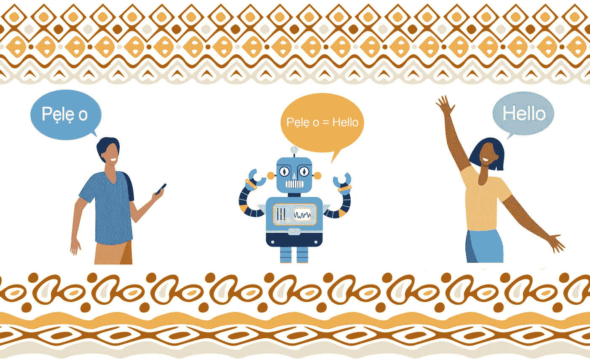
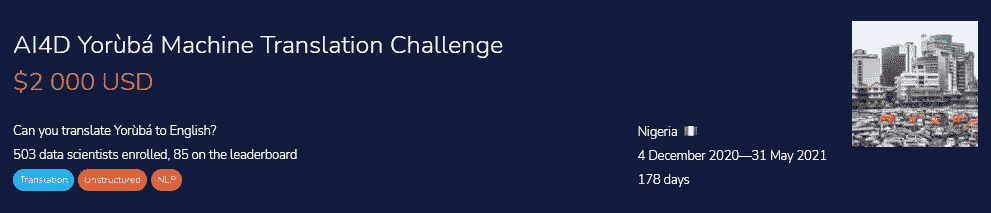

# 简单的机器翻译:英语

> 原文：<https://towardsdatascience.com/simple-machine-translation-yor%C3%B9b%C3%A1-to-english-1b958ccdc8a1?source=collection_archive---------16----------------------->



图片作者|元素作者 Freepik : [pch.vector](https://www.freepik.com/pch-vector) 、 [0melapics](https://www.freepik.com/0melapics) 、 [syarifahbrit](https://www.freepik.com/syarifahbrit)

## 微调赫尔辛基 NLP 多语言模型，将文本从约伯语翻译成英语。



约鲁巴语机器翻译挑战| [津迪](https://zindi.africa/competitions/ai4d-yoruba-machine-translation-challenge)

> ***针对西班牙语读者:****[*traducción automática simple:del yorba inglés*](https://www.ibidem-translations.com/edu/traduccion-automatica-yoruba-ingles/)*

# *介绍*

*在本文中，我们将构建一个机器翻译模型，将约鲁巴语句子翻译成英语。这些句子来自各种资源，如新闻文章、社交媒体上的对话、口头记录以及纯用约鲁巴语编写的书籍。*

*低资源语言的机器翻译非常少见，而且由于这些语言的可用训练数据有限，很难得到准确的结果。我们有一个可用于约鲁巴语文本(JW300)的数据集，但它是用来训练宗教领域的。我们需要一个一般化的模型，可以在多个领域中使用，这就是[**AI4D . ai**](https://ai4d.ai/)**带来更多一般化数据的地方，我们所要做的就是根据这些数据训练我们的模型，并产生一个准确的结果，以确保在**[AI4D yorübá机器翻译挑战赛— Zindi](https://zindi.africa/competitions/ai4d-yoruba-machine-translation-challenge) 中的领先地位。*****

*****在这个项目中，我们将使用赫尔辛基 NLP 模式，所以让我们把他们作为一个组织来讨论。*****

## *****赫尔辛基 NLP*****

*****赫尔辛基大学的语言技术研究小组训练了赫尔辛基 NLP 模型。他们的使命是为所有人类语言提供机器翻译。他们还研究和开发处理人类语言的工具，包括自动拼写和语法检查、[机器](https://translate.ling.helsinki.fi/)翻译和 ASR(自动语音识别)更多信息请访问[语言技术](https://blogs.helsinki.fi/language-technology/)。这些模型在 [HuggingFace](https://huggingface.co/Helsinki-NLP) 和 GitHub 上公开发售。*****

# *****导入基本库*****

# *****选择选项*****

*   *****要清理你的文本，你需要使 ***Clean*** 变量为真，因为现在我正在训练我的数据而没有清理。*****
*   *****如果你想训练你的模型，使 ***训练*** 变量**为真**。*****

# *****读取翻译数据*****

*****使用 pandas 阅读训练数据，对我们的数据集有初步的了解。*****

*****训练数据包括 10，054 个平行的约伯语-英语句子。我们有三列 **ID** :唯一标识符、**约鲁巴语**:包含约鲁巴语的文本和**英语**:文本包含约鲁巴语的英语翻译。数据看起来相当干净，没有丢失的值。*****

# *****清理数据*****

*****我们已经删除了标点符号，将文本转换为小写，并删除了文本中的数字，以使我们的模型性能更好。现在，我将关闭这个特性，但是我将在以后的实验中使用它。*****

# *****正在加载标记器和模型*****

*****我们使用了机器翻译中隐藏的宝石，它被训练成多种语言，包括约鲁巴语。赫尔辛基 NLP 模型是机器语言翻译领域最好的模型之一，它们具有迁移学习功能，这意味着我们可以使用相同的模型和相同的权重，并根据我们的新数据进行微调，以获得最佳结果。我们将使用[Helsinki-NLP/opus-mt-mul-en 拥抱脸](https://huggingface.co/Helsinki-NLP/opus-mt-mul-en)模型，并在由**人工智能促进发展-非洲网络(**[**ai4d . ai**](https://ai4d.ai/)**)提供的更一般化的约鲁巴语文本上对其进行微调。*******

*****这个模型可以在拥抱脸网站上公开获得，使用变形金刚库很容易下载和训练。我们将使用 GPU，添加`.to(cuda)`将激活该模型上的 GPU。*****

*   *******源组**:多种语言*****
*   *******目标人群**:英语*****
*   *******作品自述** : [多英](https://github.com/Helsinki-NLP/Tatoeba-Challenge/tree/master/models/mul-eng/README.md)*****
*   *******型号**:变压器*****

******如果你有良好的互联网连接，下载和加载模型不会花太多时间******

```
*****Downloading: 100% 1.15k/1.15k [00:00<00:00, 23.2kB/s]
Downloading: 100% 707k/707k [00:00<00:00, 1.03MB/s]
Downloading: 100% 791k/791k [00:00<00:00, 1.05MB/s]
Downloading: 100% 1.42M/1.42M [00:00<00:00, 2.00MB/s]
Downloading: 100% 44.0/44.0 [00:00<00:00, 1.56kB/s]
Downloading: 100% 310M/310M [00:27<00:00, 12.8MB/s]*****
```

# *****准备培训模型*****

## *****【计算机】优化程序*****

*****我们将使用 AdamW 优化器来使我们的模型快速收敛，并以 0.0001 的学习率提供更好的结果。我试验了 PyTorch 库中不同的优化器，AdamW 在这个问题上表现得更好。通过进行超参数调整，我以 0.0001 的学习率获得了最好的结果。*****

*****我使用了 [ekshusingh](https://www.kaggle.com/ekshusingh/helsinki-nlp-opus-mt-en-fr) 技术来微调赫尔辛基 NLP 模型。它训练速度快，并且只需要很少的样本就能产生更好的结果。*****

*****我做了一些超参数调整，得到了 27 个**时期**和 32 个**批量**的最终参数。*****

*****`model_train()`功能首先将批次分为`local_X`和`local_y`。我们使用来自记号赋予器的`prepare_seq2seq_batch`函数将文本转换成记号，这些记号可以用作我们模型的输入。然后，我们使用梯度下降来减少损失，并打印最终损失。*****

# *****培养*****

*****模型的训练花费 30 分钟，有 27 个时期，每个时期花费大约 38 秒来运行。最终损失为 0.0755，这相当不错，显然我们的模型表现良好，但我们仍需要在评估指标上检查它。*****

```
*****100% 125/125 [00:38<00:00, 3.84it/s]Loss: tensor(0.0755, device='cuda:0', grad_fn=<DivBackward0>)*****
```

# *****测试模型*****

*****对测试数据集中的单一样本进行测试。*****

*****模型表现得相当好，句子有道理。我们需要删除括号和其他不必要的标点符号`<pad>`，以进一步清理我们的数据集。*****

*****使用字符串`sub`和`replace`，我们从文本中移除了`<pad>,', [,]`。*****

*****最终的文本看起来很干净，对于最初的评估几乎是完美的。*****

# *****对测试数据集的预测*****

*****让我们从测试数据集进行预测，并检查我们的模型表现如何。我们将加载您可以从 Zindi 平台访问的测试数据集。*****

*****生成预测并将张量批量解码成文本。使用`.progress_apply`我们已经翻译了测试数据集中的所有约鲁巴语文本，并将其移动到名为`Label`的新列中*****

*****清除我们预测的翻译。*****

*****你可以看到我们测试数据集的最终版本，它非常准确。为了检查我们的模型在测试数据集上的表现，我们将尝试在 Zindi 平台上上传文件。*****

## *****公制的*****

*****比赛使用[胭脂分数](https://pypi.org/project/rouge-score/)指标，分数越高，你的模型表现越好。我们这款的排行榜分数是 0.3025 还不错，能让你进前 20。*****

**********

*****作者指标| Zindi 排行榜得分*****

# *****结论*****

*****利用迁移学习的能力，我们创建了一个在通用约鲁巴语文本上表现良好的模型。赫尔辛基 NLP 机器翻译多语言模型表现相当好。我在 HugginFace 和 [opus-mt-mul-en](https://huggingface.co/Helsinki-NLP/opus-mt-mul-en) 上试验了许多公开可用的模型，到目前为止，它们在我们的低资源语言上表现得最好。由于谷歌翻译，机器翻译研究已经衰落，但谷歌翻译不提供低资源语言的翻译，其中一些语言不太准确，所以微调您的机器翻译模型为您提供了使用转换器翻译任何低资源语言的自由。最后，这是我的起始代码，通过多次实验和预处理文本，我以 0.35168 的最终 Rogue 分数在比赛中获得了第 14 名。*****

**********

*****竞赛排行榜| [津迪](https://zindi.africa/competitions/ai4d-yoruba-machine-translation-challenge/leaderboard)*****

> *****你可以在[kingabzpro/Helsinki-NLP-opus-yor-mul-en 拥抱脸](https://huggingface.co/kingabzpro/Helsinki-NLP-opus-yor-mul-en)上找到我的模特*****