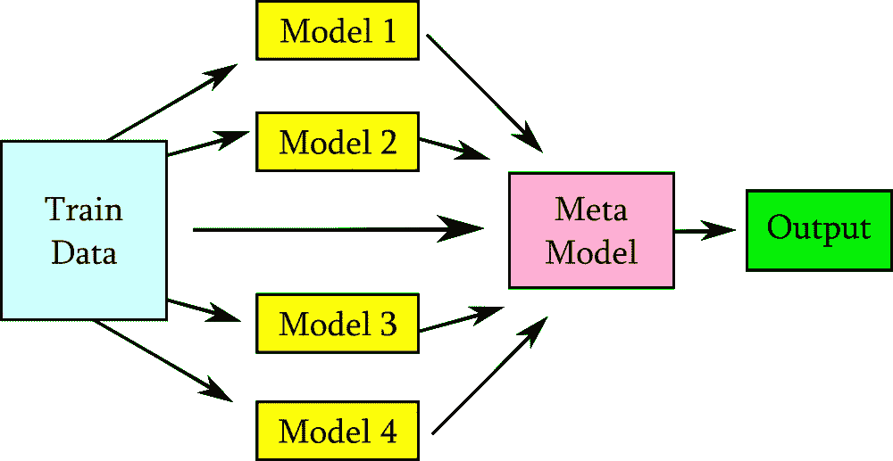
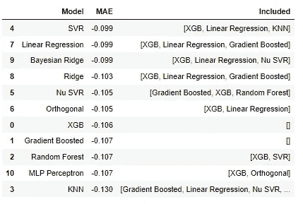

# 简单的模型堆叠，解释和自动化

> 原文：<https://towardsdatascience.com/simple-model-stacking-explained-and-automated-1b54e4357916?source=collection_archive---------6----------------------->

## [实践教程](https://towardsdatascience.com/tagged/hands-on-tutorials)

## 在这个循序渐进的教程中，通过叠加来提高模型性能


由 [La-Rel 复活节](https://unsplash.com/@lastnameeaster?utm_source=medium&utm_medium=referral)在 [Unsplash](https://unsplash.com?utm_source=medium&utm_medium=referral) 上拍摄的照片

# 模型堆叠概述

在模型堆叠中，我们不使用单个模型进行预测，而是使用几个不同的模型进行预测，然后使用这些预测作为更高级元模型的特征。它尤其适用于不同类型的低水平学习者，他们都对元模型有不同的贡献。模型堆栈可以用许多方法构建，使用堆栈没有一种“正确”的方法。它可以比今天的例子更复杂，有多个级别、权重、平均值等。我们今天将制作的基本模型堆栈如下所示:



具有原始训练特征的模型堆叠-图片由作者提供

在我们的堆栈中，我们将使用一系列中间模型对我们的训练数据进行非泄漏预测，然后将这些作为特征与元模型上的原始训练特征结合使用。

如果这听起来很复杂，不要被吓住。我将向您展示一种无痛的方法来自动化这个过程，包括选择最佳元模型、选择最佳堆栈模型、将所有数据放在一起，并对您的测试数据进行最终预测。

今天，我们使用位于 Kaggle 上的 [King County Housing](https://www.kaggle.com/harlfoxem/housesalesprediction) 数据集来处理一个回归问题。

# 起始位置

> 健全性检查:本文不涉及任何预处理或模型调优。您的数据集应该是干净的，随时可以使用，如果需要，您的潜在模型应该进行超参数调整。您还应该将您的数据拆分为一个训练/测试集或一个训练/验证/测试集。这篇文章还假设读者对交叉验证有基本的了解。

我们首先用任何可选的超参数实例化我们调优的潜在模型。一个有趣且成功的堆栈的关键是*越多越好—* 尽可能多地尝试您想要的模型！你*可以*节省时间，如果你事先对你所有的潜在模型进行交叉验证的抽查，以避免那些明显不能提供信息的模型。但是您可能会惊讶于一个糟糕的基本模型对一个堆栈的贡献有多大。请记住，您添加到可能性中的每个潜在模型都需要时间。但是在您的堆栈中可以尝试的模型数量没有限制，我们教程的关键是我们最终将只使用最好的模型，而不必手动选择任何模型。

对于我们的例子，我将只实例化五个潜在的模型。我们开始吧:

```
from sklearn.linear_model import LinearRegression, Ridge
from sklearn.svm import SVR
from sklearn.neighbors import KNeighborsRegressor
import xgboost as xgbsvr = SVR(gamma = 'scale', kernel = 'linear', C=10, epsilon=.05)ridge = Ridge(random_state = randomstate, tol=1e-3, normalize=False, solver='auto')neighbor = KNeighborsRegressor(n_neighbors = 11)linreg = LinearRegression()xgbr = xgb.XGBRegressor(n_estimators=1000, eval_metric='mae', max_depth = 7,eta = .1, min_child_weight = 5, colsample_bytree = .4, reg_lambda = 50)
```

接下来，我们将创建空列表来存储每个潜在的训练集预测(我们将以非泄漏的方式获得)。您需要为每个潜在模型列出一个列表，一致的命名约定将有助于保持有序。

```
svr_yhat, ridge_yhat, neighbor_yhat, linreg_yhat, xgbr_yhat = [], [], [], [], []
```

最后，我们将实例化的模型和它们的空预测列表放到一个存储字典中，我们将在各种堆栈函数中使用它。每个字典条目的格式是“标签”:[模型实例，预测列表]，像这样:

```
models_dict = {'SVR' : [svr, svr_yhat], 
                'Ridge' : [ridge, ridge_yhat],  
                'KNN' : [neighbor, neighbor_yhat], 
                'Linear Regression' : [linreg, linreg_yhat], 
                'XGB' : [xgbr, xgbr_yhat]}
```

> 健全性检查:为以下函数准备数组格式的训练/测试集。X 要素应该是(n，m)的数组形状，其中 n 是样本数，m 是要素数，y 目标应该是(n，)的数组。如果它们是数据帧，用 np.array(df)转换它们

# 获得非折叠预测

有一个超出折叠或超出样本的预测意味着什么？在模型堆叠中，我们使用对训练数据本身做出的预测来训练元模型。正确包含这些预测的方法是将我们的训练数据分成多个折叠，就像交叉验证一样，并使用剩余的折叠对每个折叠进行预测。通过这种方式，我们将拥有针对我们的训练数据的全套预测，但没有任何*数据泄漏*，如果我们只是简单地训练，然后在同一套数据上进行预测，就会出现这种情况。

这是我们的第一个函数，用来得到我们的非折叠预测。这个函数改编自[机器学习大师](https://machinelearningmastery.com/out-of-fold-predictions-in-machine-learning/)上的大折叠预测教程:

```
from sklearn.model_selection import KFolddef train_oof_predictions(x, y, models, verbose=True):
    '''Function to perform Out-Of-Fold predictions on train data
    returns re-ordered predictors x, re-ordered target y, and model dictionary with filled predictors
    Parameters:
    x: training predictors
    y: training targets
    models: dictionary of models in form of model name : [instantiated model, predictors list]
    verbose: if True, prints status update as the function works
    '''

    # instantiate a KFold with 10 splits
    kfold = KFold(n_splits=10, shuffle=True, random_state=randomstate)

    # prepare lists to hold the re-ordered x and y values
    data_x, data_y  = [], []

    # run the following block for each of the 10 kfold splits
    for train_ix, test_ix in kfold.split(x, y):

        if verbose: print("\nStarting a new fold\n")

        if verbose: print("Creating splits")
        #create this fold's training and test sets
        train_X, test_X = x[train_ix], x[test_ix] 
        train_y, test_y = y[train_ix], y[test_ix]

        if verbose: print("Adding x and y to lists\n")
        # add the data that is used in this fold to the re-ordered lists
        data_x.extend(test_X)
        data_y.extend(test_y)

        # run each model on this kfold and add the predictors to the model's running predictors list
        for item in models:

            label = item # get label for reporting purposes
            model = models[item][0] # get the model to use on the kfold

            # fit and make predictions 
            if verbose: print("Running",label,"on this fold")
            model.fit(train_X, train_y) # fit to the train set for the kfold
            predictions = model.predict(test_X) # fit on the out-of-fold set
            models[item][1].extend(predictions) # add predictions to the model's running predictors list

    return data_x, data_y, models
```

现在，我们已经准备好了，使用我们之前制作的模型字典，来获得非折叠预测。该函数默认为 verbose，并将提供有关其进度的状态更新。请记住，如果您的堆栈中有大量数据集或大量模型要尝试，那么获得 OOF 预测可能需要很长时间！

运行折叠外预测功能:

```
data_x, data_y, trained_models = train_oof_predictions(X_train, y_train, models_dict)
```

> 健全性检查:检查这个折叠函数的一致输出。字典中的所有 yhats 都应该返回普通的数字列表，没有任何数组。

我们现在有了 data_x 和 data_y，它们是与我们的 x_train 和 y_train 相同的数据，但是*被重新排序以匹配势的 yhat 预测*的顺序。我们返回的 trained_models 字典包含对整个训练集和每个潜在模型的预测。

# 运行堆栈选择器

堆栈选择器时间到了。这是我们的下一个函数。这个是基于大卫·戴尔[写的特征选择向前向后选择器:](https://datascience.stackexchange.com/questions/937/does-scikit-learn-have-a-forward-selection-stepwise-regression-algorithm)

```
from sklearn.model_selection import cross_validatedef model_selector(X, y, meta_model, models_dict, model_label, verbose=True):

    """ 
    Perform a forward model selection based on MAE improvement
    Parameters:
        X - baseline X_train with all features
        y - baseline y_train with all targets
        meta_model - meta_model to be trained
        models_dict - dictionary of models in format of model name : [model object, out-of-fold predictions]
        label - the label for the current meta model
        verbose - whether to print the sequence of inclusions(True recommended)
    Returns: list of selected models, best MAE 
    """print("\n\nRunning model selector for ", model_label)
    included_models = []

    while True:
        changed=False

        # forward step

        if verbose: print("\nNEW ROUND - Setting up score charts")
        excluded_models = list(set(models_dict.keys())-set(included_models)) # make a list of the current excluded_models
        if verbose: print("Included models: {}".format(included_models))
        if verbose: print("Exluded models: {}".format(excluded_models))
        new_mae = pd.Series(index=excluded_models) # make a series where the index is the current excluded_models

        current_meta_x = np.array(X)

        if len(included_models) > 0:
            for included in included_models:
                included = np.array(models_dict[included][1]).reshape((len(models_dict[included][1]), 1))
                current_meta_x = np.hstack((current_meta_x, included))# score the current model
        scores = cross_validate(meta_model, current_meta_x, y, cv=5, n_jobs=-1, scoring=('neg_mean_absolute_error'))
        starting_mae = round(scores['test_score'].mean(),3)
        if verbose: print("Starting mae: {}\n".format(starting_mae))

        for excluded in excluded_models:  # for each item in the excluded_models list:

            new_yhat = np.array(models_dict[excluded][1]).reshape(-1, 1) # get the current item's predictions
            meta_x = np.hstack((current_meta_x, new_yhat)) # add the predictions to the meta set

            # score the current item
            scores = cross_validate(meta_model, meta_x, y, cv=5, n_jobs=-1, scoring=('neg_mean_absolute_error'))
            mae = round(scores['test_score'].mean(),3)
            if verbose: print("{} score: {}".format(excluded, mae))

            new_mae[excluded] = mae # append the mae to the series field

        best_mae = new_mae.max() # evaluate best mae of the excluded_models in this round
        if verbose: print("Best mae: {}\n".format(best_mae))

        if best_mae > starting_mae:  # if the best mae is better than the initial mae
            best_feature = new_mae.idxmax()  # define this as the new best feature
            included_models.append(str(best_feature)) # append this model name to the included list
            changed=True # flag that we changed it
            if verbose: print('Add  {} with mae {}\n'.format(best_feature, best_mae))
        else: changed = False

        if not changed:
            break

    print(model_label, "model optimized")
    print('resulting models:', included_models)
    print('MAE:', starting_mae)

    return included_models, starting_mae
```

> 健全性检查:我的功能是对平均绝对误差进行评分，但是您可以根据您最喜欢的评分标准进行编辑，比如 R2 或 RMSE。

我们将最终使用我们的每个潜在模型作为函数的元模型来运行这个函数。当我们运行这个函数时，我们向它发送从 out-of-fold 函数中得到的 data_x 和 data_y，还有一个实例化的模型作为元模型，以及我们的字典和所有 out-of-fold 预测。然后，该函数使用折叠外预测作为特征运行向前选择。

对于被尝试作为元模型的模型，我们在训练集上获得基线分数(使用 CV)。对于每个其他潜在模型，我们迭代地将潜在的 yhat 预测附加到特征集，并使用该附加特征对元模型重新评分。如果我们的元模型得分随着任何特征的增加而提高，那么单个最佳得分潜力的预测将被永久地附加到特征集，并且提高的得分将成为基线。然后，该函数循环，再次尝试添加尚未在堆栈中的每个潜在值，直到没有潜在值可以提高分数。然后，该函数报告这个元模型的最佳包含模型，以及获得的最佳分数。

> 健全性检查:编写这个模型选择器是为了使用 CV 在训练集上进行优化。如果你足够幸运有一个验证集，你可以重写并执行选择。它会快得多——但要小心过度拟合！

我们如何为这个任务选择元模型？有趣的部分来了——我们将尝试我们所有的模型作为元模型。请记住，此功能可能需要很长时间才能运行。将 verbose 设置为 True 会给出频繁的进度报告。

我们制作了一个字典来存储我们将从测试中得到的所有分数。然后，我们在每个经过训练的模型上运行堆栈选择器，将该模型用作元模型:

```
# Set up a scoring dictionary to hold the model stack selector results
scores = {}
scores['Model'] = []
scores['MAE'] = []
scores['Included'] = []# Run the model stack selector for each model in our trained_modelsfor model in trained_models:

    meta_model = trained_models[model][0] resulting_models, best_mae = model_selector(data_x, data_y,  meta_model, trained_models, label, verbose=True)

    scores['Model'].append(model)
    scores['MAE'].append(best_mae)
    scores['Included'].append(resulting_models)
```

之后，我们将得到每个模型作为元模型的表现分数，以及它最好的附加部分。我们将字典转换成数据框架，并根据分数标准对结果进行排序:

```
# Look at the scores of our model combinationsbest_model = pd.DataFrame(scores).reset_index(drop=True)
best_model.sort_values('MAE', ascending=False) 
```

现在，我们可以确切地看到哪个元模型和堆叠模型执行得最好。



作者图片

# 把所有的放在一起

我们快完成了！很快我们将在我们的测试集上进行预测。我们已经选择了一个元模型(可能是在堆栈选择器上表现最好的一个！)和我们将包括的堆叠模型。

在我们将元模型与堆叠数据相匹配之前，在测试集上尝试没有添加特性的模型，这样您就可以比较堆叠模型的改进了！在原始训练/测试集上拟合和预测元模型。这是我们期望用堆叠模型打破的基线。

```
# Check our meta model on the original train/test set only# Instantiate the chosen meta model
meta_model =  SVR(gamma = 'scale', kernel = 'linear', C=10, epsilon=.05)meta_model.fit(X_train, y_train)
predictions = meta_model.predict(X_test)pred_exp = np.exp(predictions)
actual = np.exp(y_test)print("MAE: ",int(mean_absolute_error(pred_exp, actual)))
print("RMSE:",int(np.sqrt(mean_squared_error(pred_exp, actual))))
print(("R2:",r2_score(pred_exp, actual)*100)*Output:
MAE:  53130
RMSE: 82427
R2: 86.93570728212*
```

后退一步，将我们将在堆栈中使用的所有模型放入我们的原始训练数据集。我们这样做是因为我们将在测试集上进行预测(与单个模型相同！)并将预测作为元模型的特征添加到我们的测试集中。

```
print("Fitting Models")
linreg.fit(X_train, y_train)
xgbr.fit(X_train, y_train)
knn.fit(X_train, y_train)
```

现在我们准备模型堆栈。首先，手动创建一个列表，只存储我们在最终堆栈中使用的模型的折叠外预测。我们从先前使用折叠外预测函数生成的“trained_models”字典中获得这些预测:

```
yhat_predics = [trained_models['XGB'][1], trained_models['Linear Regression'][1], trained_models['KNN'][1]]
```

又到了一个功能的时间了。这一个接受我们重新排序的 train data_x 和包含 yhat 预测的列表，并把它们放在一个单一的元 train 集合中。我们在一个函数中这样做，因为稍后我们将对测试数据再次这样做。

```
def create_meta_dataset(data_x, items):
    '''Function that takes in a data set and list of predictions, and forges into one dataset
    parameters:
    data_x - original data set
    items - list of predictions
    returns: stacked data set
    '''

    meta_x = data_x

    for z in items:
        z = np.array(z).reshape((len(z), 1))
        meta_x = np.hstack((meta_x, z))

    return meta_x
```

现在调用这个函数传递 data_x 和预测列表，为我们的元模型创建一个元训练集:

```
# create the meta data set using the oof predictions
meta_X_train = create_meta_dataset(data_x, yhat_predics)
```

元训练集由我们的原始预测特征以及堆叠模型的非折叠预测作为附加特征组成。

制作一个列表来保存拟合的模型实例；我们将在下一个也是最后一个函数中用到它。确保这与您为元堆栈器列出的 yhat 预测顺序相同！

```
final_models = [xgbr, linreg, knn]
```

我们最后一次活动的时间到了。该函数接受我们的测试集和拟合模型，使用拟合模型对测试集进行预测，然后将这些预测作为特征添加到测试集。它发回一个完整的 meta_x 集合，供元模型进行预测。

```
def stack_prediction(X_test, final_models): 
    '''takes in a test set and a list of fitted models.
    Fits each model in the list on the test set and stores it in a predictions list. Then sends the test set and the predictions to the create_meta_dataset to be combined
    Returns: combined meta test set
    Parameters:
    X_test - testing dataset
    final_models - list of fitted models
    '''
    predictions = []

    for item in final_dict:
        print(item)
        preds = item.predict(X_test).reshape(-1,1)
        predictions.append(preds)

    meta_X = create_meta_dataset(X_test, predictions)

    return meta_X
```

这里我们调用函数，发送测试集和拟合模型:

```
meta_X_test = stack_prediction(X_test, final_models)
```

## 最终模型评估

关键时刻终于来了。使用堆叠模型进行预测的时间到了！

```
# fit the meta model to the Train meta dataset
# There is no data leakage in the meta dataset since we did all of our predictions out-of-sample!
meta_model.fit(meta_X_train, data_y)# predict on the meta test set
predictions = meta_model.predict(meta_X_test)pred_exp = np.exp(predictions)
actual = np.exp(y_test)print("MAE: ",int(mean_absolute_error(pred_exp, actual)))
print("RMSE:",int(np.sqrt(mean_squared_error(pred_exp, actual))))
print(("R2:",r2_score(pred_exp, actual)*100)*Output:
MAE:  47205
RMSE: 73973
R2: 90.03816032670765*
```

在我们的堆栈示例中，我们将测试集上的 MAE 从 53130 减少到 47205，提高了 11.15%。

我希望你能看到你的模型分数的提高，并能看到尝试堆叠模型的效用！我相信您已经学到了一些有价值的工具，可以添加到自动化模型选择和堆叠的工具包中。

参考资料:

1.  如何在机器学习中使用非折叠预测

2.[大卫·戴尔的前向-后向特征选择](https://datascience.stackexchange.com/questions/937/does-scikit-learn-have-a-forward-selection-stepwise-regression-algorithm)