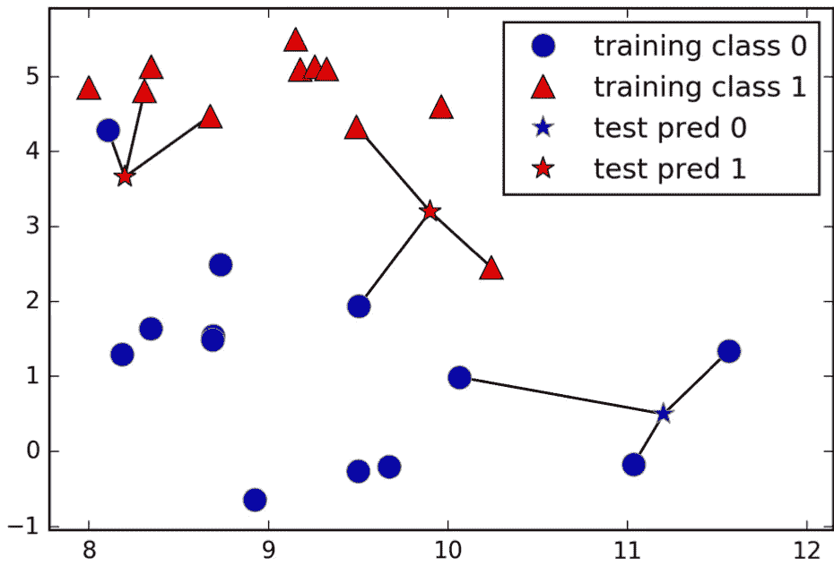
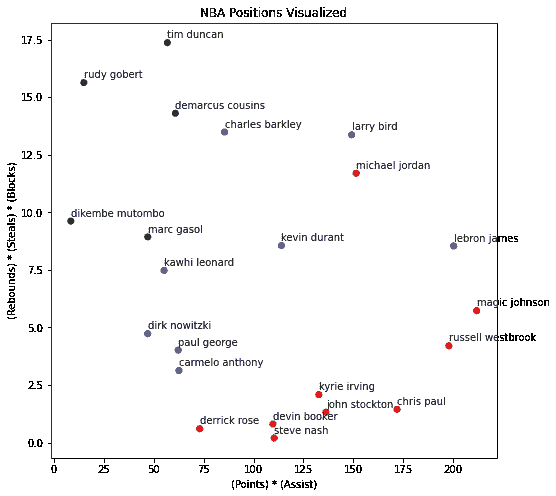

# 使用 K-最近邻机器学习算法的 NBA 位置的简单建模

> 原文：<https://towardsdatascience.com/simple-modeling-of-nba-positions-using-the-k-nearest-neighbors-machine-learning-algorithm-223b8addb08f?source=collection_archive---------20----------------------->

NBA 赛季再次升温，这意味着世界各地的篮球迷们正准备观看他们最喜爱的球员以远距离三分，海报扣篮和以往任何时候都不尊重的脚踝交叉球征服世界。

本着展示绝对统治地位的精神，我想分享一下计算机是如何利用机器学习在篮球知识上统治一般球迷(比如我自己)的。

在这篇博客中，我将向你展示如何创建一个机器学习模型(用 Python 编写)，它可以让**只从职业生涯得分、助攻、篮板、盖帽和抢断**中学习 NBA 位置和打球风格**。**

看看这里的配套视频:[https://www.youtube.com/watch?v=Va5X6zcNsPw](https://www.youtube.com/watch?v=Va5X6zcNsPw)


照片由 [JC Gellidon](https://unsplash.com/@jcgellidon?utm_source=medium&utm_medium=referral) 在 [Unsplash](https://unsplash.com?utm_source=medium&utm_medium=referral)

# 基本面

任何观看现代 NBA 篮球的人都知道，联盟是最丰富的数据资源之一。NBA 收集了大量关于球队、球员和比赛的数据。这些数据凸显了 NBA 引以为豪的一些声望和精英人才。以下是一些例子:

*   勒布朗·詹姆斯已经在 NBA 打了 18 个赛季。NBA 常规赛长达 82 场。常规赛结束后，16 支优秀的球队将在 NBA 季后赛中争夺总冠军的机会。迄今为止，勒布朗·詹姆斯已经打了 266 场 NBA 季后赛。这意味着勒布朗也有效地打了三个多赛季的比赛，仅仅是季后赛的出场。
*   丹尼斯·罗德曼连续 7 年在篮板上领先联盟，但是他直到 30 岁才第一次领先。
*   在 1961-1962 赛季，威尔特·张伯伦平均每场比赛上场 48.5 分钟。起初，这听起来像是一个适度的统计线，直到你意识到一场常规的 NBA 比赛在 48 分钟结束。他是怎么做到的？他在每场比赛中尽可能地打好每一分钟，包括几场进入加时赛的比赛。这在 NBA 的任何时代都是罕见的。

在这篇博客中，我们将引用一些更频繁引用的数据点。即:得分，助攻，篮板，盖帽，抢断。这些数据通常在讨论玩家在任何游戏中的表现时被提及。我想到了一些特别的表演:

*   在 NBA 历史上，一个球员在整个赛季中平均只有五次达到三双(在上面提到的五次统计中有三次达到两位数)。其中四次是由拉塞尔·威斯布鲁克提供的。
*   勒布朗·詹姆斯是第一个也是唯一一个在 NBA 总决赛场均三双的球员[。](https://bleacherreport.com/articles/2715326-lebron-james-becomes-1st-player-to-average-triple-double-in-nba-finals-history)
*   德雷蒙德·格林是第一个也是唯一一个没有得到两位数分数就获得三双的球员[。](https://www.sbnation.com/2017/2/10/14584492/draymond-green-triple-double-nba-history-warriors-vs-grizzlies)

到现在为止，你应该已经看到了这项运动的伟大之处。

回到基础——有组织的篮球比赛有五个位置:

*   控球后卫
*   得分后卫
*   小前锋
*   大前锋
*   中心

这就把我们带到了这个博客的目标——让一台计算机只使用得分、助攻、篮板、盖帽和抢断来学习这些位置。为了简单起见，我们将组合两个后卫位置和两个前锋位置，总共三个位置。

# 机器学习

为此，我们将使用 K 近邻(KNN)分类算法。KNN 通常被视为最简单的机器学习模型之一。如果你刚刚开始学习机器学习，下面是你需要知道的要点(如果你已经知道 KNN 是如何工作的，请随意跳到下图):

k-最近邻是一种*监督机器学习*技术。这意味着我们的*训练数据*由数据点的*特征*(即沿 x 轴和 y 轴的值)以及数据点所属的*类*(即数据点的颜色)组成。

该算法或模型首先通过绘制训练数据点来工作。接下来，绘制新的数据点(实际上，我们称之为*测试数据)*，其特征是已知的，但其类别是**未知的**。测量测试数据点和 N 个最近邻点(下图中 N=3)之间的距离。

从这里开始，这是一个多数规则过程，例如，如果大多数邻居是红色类的成员，则测试数据点被标记为红色数据点。就是这样！



三个最近邻的预测

在这个 KNN 的例子中，我们模型的特征将是职业生涯得分、助攻、篮板、盖帽和抢断。我们的班级将是三个篮球位置:后卫，前锋和中锋。

让我们进入代码。

从我们的导入开始，我们将使用科学计算包 numpy、数据操作和分析包 pandas、绘图和可视化包 matplotlib，以及来自 sklearn 包的 KNN 分类器。最后，我们将使用 PyPi 的 basketball_reference_scraper 包([如果需要的话可以在这里 pip 安装它](https://pypi.org/project/basketball-reference-scraper/))。basketball_reference_scraper 包从 https://www.basketball-reference.com/的[获取数据和统计数据。来自篮球 _ 参考 _ 铲运机。我们需要 players.get_stats 函数来检索职业统计数据，如场均得分或场均篮板。](https://www.basketball-reference.com/)

```
import numpy as np
import pandas as pd
import matplotlib.pyplot as plt
from matplotlib.pyplot import figure
from sklearn.neighbors import KNeighborsClassifier
from basketball_reference_scraper.players import get_stats
```

接下来是训练数据。同样，这是我们的特性和类已知的数据。这意味着我们需要从每个位置选择一些 NBA 球员。我选择了一些目前的球员，但是你可以选择任何在联盟中有一些重要经验的人(并且在他们的位置上是/曾经是特别好的！).

```
POSITION_TYPES = ['CENTER', 'GUARD', 'FORWARD']# Centers
centers=[
    'nikola jokic',
    'joel embiid',
    'anthony davis',
    'andre drummond',
    'bam adebayo'
]# Guards
guards=[
    'damian lillard',
    'stephen curry',
    'luka doncic',
    'jamal murray',
    'james harden'
]# Forwards
forwards=[
    'giannis antetokounmpo',
    'draymond green',
    'pascal siakam',
    'zion williamson',
    'blake griffin'
]
```

接下来，我们收集所有这些玩家的数据:

```
def fetch_player_career(player):
    career = get_stats(player, stat_type='PER_GAME', playoffs=False, career=False, ask_matches=False)

    # Drop rows containing 'Did Not Play' by only returning rows with digits in the "Games Played" field
    career_stats = career[career['G'].apply(lambda x: str(x).replace('.','').isdigit())]

    return career_statscareers = []
nba_players = centers + guards + forwards
for player in nba_players:
    print(player)
    careers.append(fetch_player_career(player))
```

现在我们准备好准备我们的训练数据。要做到这一点，我们需要每个赛季的平均数据。我们将求和，然后除以赛季。这会给我们每场比赛的平均值。我们使用每场比赛的平均水平，因为它将职业生涯长度纳入了模型。换句话说，如果一名球员在职业生涯中获得了 2000 次助攻，那么这名球员是在 7 年内还是在联盟中的 15 年内完成的都很重要，因为这将显示出他们在各自位置上的效率。

例如，如果一个球员在第一个赛季场均 15 分，第二个赛季场均 20 分，我们将 15 和 20 相加得到 35，然后除以 2 个赛季得到职业生涯场均 17.5 分。

还要注意的是，y_train 所发生的一切是，我声明了一个大小为(15)的数组，该数组保存的位置值经过编码，以匹配我们的训练数据中使用的 15 名球员:

*   中心= 0
*   防护= 1
*   向前= 2

```
def extract_stats(career_stats):
    '''
    extract_stats() takes a player's stats and returns a numpy array of [PTS, AST, TRB, STL, BLK]
    '''
    total_seasons = len(career_stats)

    career_ppg = (sum(career_stats['PTS'].astype(float)) / total_seasons)
    career_ast = (sum(career_stats['AST'].astype(float)) / total_seasons)
    career_trb = (sum(career_stats['TRB'].astype(float)) / total_seasons)
    career_stl = (sum(career_stats['STL'].astype(float)) / total_seasons)
    career_blk = (sum(career_stats['BLK'].astype(float)) / total_seasons)

    return np.array([career_ppg, career_ast, career_trb, career_stl, career_blk])X_train = np.zeros((15,5))
for i in range(len(careers)):
    X_train[i] = extract_stats(careers[i])

y_train = np.array([0]*5 + [1]*5 + [2]*5)
```

我们准备好训练我们的模型了！继续实例化一个 KNN 分类器的实例，并调用它的。对训练数据使用 fit()函数:

```
clf = KNeighborsClassifier()
clf.fit(X_train, y_train)
```

现在我们有了分类器，我将编写一个“预测”函数。该函数将采用我们的分类器，以及任何球员的统计数据(extract_stats()函数的返回值),并尝试基于我们之前查看的相同职业统计数据来预测该球员的位置。

```
def predict_position(stats, clf):    
    position_id = clf.predict(stats)[0]
    position = POSITION_TYPES[position_id]
    return position
```

让我们看看分类器在一些明星球员身上的表现如何…

```
more_players = [
    'michael jordan', # 1
    'magic johnson',  # 1
    'chris paul',  # 1
    'marc gasol',  # 0
    'dikembe mutombo',  # 0
    'russell westbrook',  # 1
    'kevin durant',  # 2
    'larry bird',  # 2
    'john stockton',  # 1
    'derrick rose',  # 1
    'charles barkley',  # 2
    'demarcus cousins',  # 0
    'kyrie irving',  # 1
    'rudy gobert',  # 0
    'kawhi leonard',  # 2
    'devin booker',  # 1
    'steve nash',  # 1
    'tim duncan',  # 0
    'dirk nowitzki',  # 2
    'carmelo anthony',  # 2
    'paul george',  # 2
    'lebron james'  # 2
]X_test = np.zeros((len(more_players),5))for i in range(len(more_players)):
    all_career_stats = fetch_player_career(more_players[i])
    stats = extract_stats(all_career_stats).reshape(1,-1)
    X_test[i] = (stats)y_test = [1, 1, 1, 0, 0, 1, 2, 2, 1, 1, 2, 0, 1, 0, 2, 1, 1, 0, 2, 2, 2, 2]correct_pred = 0for p in range(len(X_test)):
    predicted_position = predict_position(X_test[p].reshape(1,-1), clf)
    actual_position = POSITION_TYPES[y_test[p]]if predicted_position == actual_position:
        correct_pred += 1print(f'I think {more_players[p]} is a {predicted_position}. He played {actual_position} in his career')I think michael jordan is a GUARD. He played GUARD in his career
I think magic johnson is a GUARD. He played GUARD in his career
I think chris paul is a GUARD. He played GUARD in his career
I think marc gasol is a FORWARD. He played CENTER in his career
I think dikembe mutombo is a CENTER. He played CENTER in his career
I think russell westbrook is a GUARD. He played GUARD in his career
I think kevin durant is a GUARD. He played FORWARD in his career
I think larry bird is a CENTER. He played FORWARD in his career
I think john stockton is a FORWARD. He played GUARD in his career
I think derrick rose is a CENTER. He played GUARD in his career
I think charles barkley is a CENTER. He played FORWARD in his career
I think demarcus cousins is a CENTER. He played CENTER in his career
I think kyrie irving is a GUARD. He played GUARD in his career
I think rudy gobert is a CENTER. He played CENTER in his career
I think kawhi leonard is a FORWARD. He played FORWARD in his career
I think devin booker is a GUARD. He played GUARD in his career
I think steve nash is a FORWARD. He played GUARD in his career
I think tim duncan is a CENTER. He played CENTER in his career
I think dirk nowitzki is a FORWARD. He played FORWARD in his career
I think carmelo anthony is a FORWARD. He played FORWARD in his career
I think paul george is a FORWARD. He played FORWARD in his career
I think lebron james is a GUARD. He played FORWARD in his career
```

20 个位置中有 14 个预测正确。还不错！这是 70%的准确率。让我们花一点时间了解我们的缺点，并找出需要改进的地方。

```
I think larry bird is a CENTER. He played FORWARD in his career
I think charles barkley is a CENTER. He played FORWARD in his career
I think derrick rose is a CENTER. He played GUARD in his career
I think steve nash is a FORWARD. He played GUARD in his career
I think john stockton is a FORWARD. He played GUARD in his career
I think lebron james is a GUARD. He played FORWARD in his career
```

如果我们的错误预测是我们的模型预测的中心位置，则为 50%。这意味着模型可能会过度拟合到中心位置。这有助于从机器学习上下文以及篮球上下文中理解这一点。出现这种情况的几个原因可能是

*   众所周知，NBA 中锋比普通球员获得更多的篮板和盖帽，所以任何出色的，高大的，或高于平均水平的后卫前锋都可能获得盖帽和篮板，欺骗模型认为他们是中锋。
*   眼尖的人可能会注意到，在写这篇博客的时候，用于我们训练的 NBA 中锋的平均年龄是 20 多岁，这意味着这个模型并不完全理解中锋的位置是如何在职业生涯中发挥作用的。这将有助于包括一些已经打满职业生涯的中锋球员，如卡里姆·阿布杜尔·贾巴尔、哈基姆·奥拉朱旺或德怀特·霍华德。
*   我们也可以包括每个球员更多的数据点。当谈到 NBA 中锋时，抢断和助攻这样的统计数据往往不是亮点的一部分，所以模型不会从他们身上学到很多东西。一些好的候选人包括*防守篮板，三分球尝试，*或*投篮命中率*。
*   即使是我们的模型也不得不承认它的伟大。像勒布朗·詹姆斯这样真正杰出的球员在他们的职业生涯中打过好几个位置。在选择球员时，我们应该谨慎选择那些在最适合他们的位置上表现出色的球员——比如中锋沙克或者控卫达米恩·利拉德。

最重要的是，有了从 NBA 创建的所有数据，我们最大的收获可能来自于使用更多的训练数据来创建我们的模型。15 名球员是一个好的开始，但我们的模型可以通过训练 50 到 100 名球员来减少失误，其中更多的是 NBA 老将。

最后，下面是 NBA 球员测试集的一个剧情。因为这五个属性很难在二维空间中可视化，我们将把这些属性分为基于得分的属性和非基于得分的属性。你将开始看到某些职位是如何与他们的统计数据相关联的。然而，像迈克尔·乔丹或勒布朗·詹姆斯这样的特殊球员有足够的技术出现在他们“预期”的区域之外。要不是这样的人才，我们的数据早就线性可分了！



恭喜你！如果你做到了这一步，你就有了将机器学习应用于 NBA 数据分析的能力。如果你想要这个项目的完整源代码，请查看这个 Github repo:[Christophe brown/KNN _ NBA _ positions(github.com)](https://github.com/ChristopheBrown/knn_nba_positions)