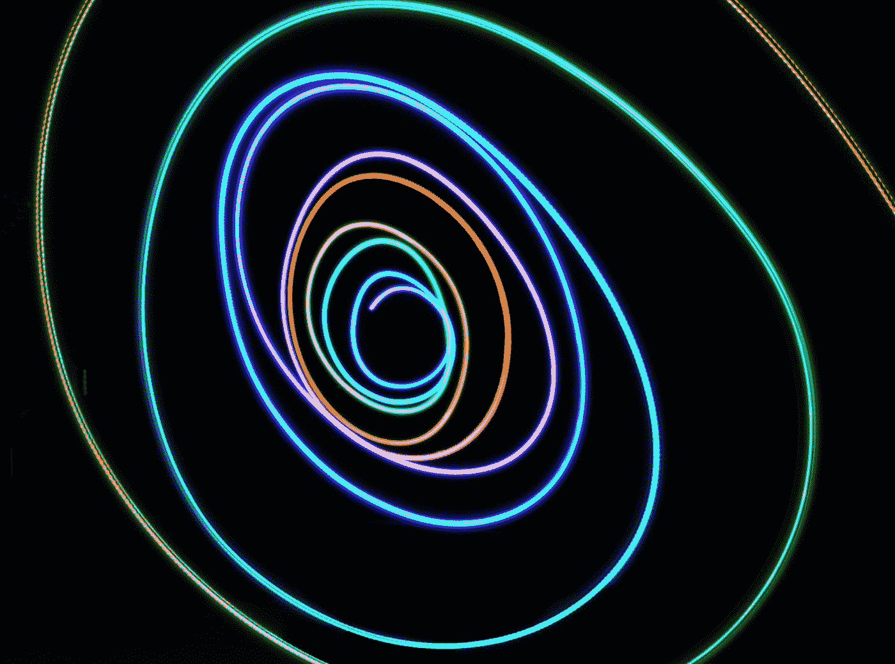
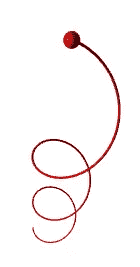
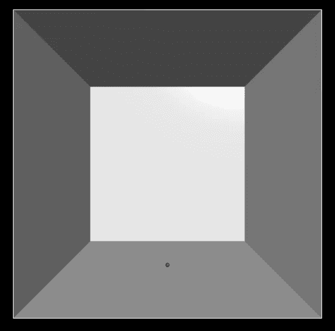
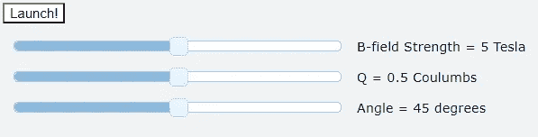
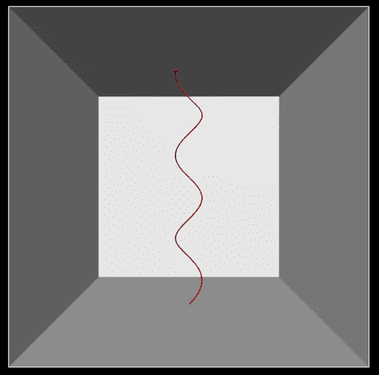
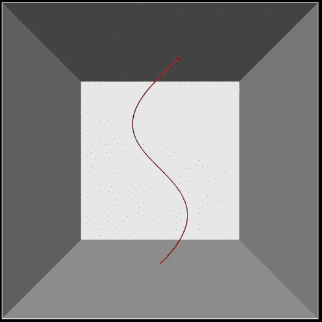
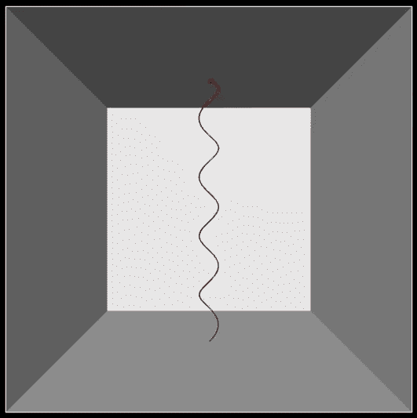

# 使用 VPython 的简单物理动画

> 原文：<https://towardsdatascience.com/simple-physics-animations-using-vpython-1fce0284606?source=collection_archive---------11----------------------->

## [实践教程](https://towardsdatascience.com/tagged/hands-on-tutorials)

## 使用 Python 和 GlowScript 创建 3D 物理模拟，以模拟带电粒子在磁场中的螺旋运动



摄影:[飞:D](https://unsplash.com/@flyd2069?utm_source=medium&utm_medium=referral) 上 [Unsplash](https://unsplash.com?utm_source=medium&utm_medium=referral)

在现实生活中，进行物理实验可能具有挑战性，通常涉及昂贵而又嘈杂的设备。随着今天的实验变得越来越复杂，模拟和建模已经成为产生和解释数据的一个有吸引力的新领域。本文旨在让您开始使用 VPython——一种用于模拟的 3D Python 环境——对物理系统建模。

## 模拟带电粒子在磁场中的运动

今天，我们要看看带电粒子是如何在磁场中运动的。电磁学是对电场和磁场如何相互作用的研究。当带电粒子以垂直于外部磁场的速度运动时，它执行圆周运动，因为恒定垂直于速度的磁力充当圆周运动的向心力。

如果速度不完全垂直于磁场呢？这意味着垂直于磁场的速度分量将继续为带电粒子做圆周运动提供向心的力。另一方面，平行于磁场的速度分量既不会经历任何向心加速度，也不会经历任何方向变化。因此，我们将观察到如下所示的螺旋路径。



带电粒子在磁场中的螺旋运动(图片由作者提供)

## VPython 简介

我们将使用 VPython 来重现这一物理现象。VPython 允许我们对这一现象进行 3D 可视化。我们将使用 GlowScript，这是一个用于 VPython 的在线代码编辑器。您可以在此处访问它:

<https://glowscript.org/>  

点击链接后，点击“登录”并使用您的 Google 帐户登录。然后在 GlowScript 页面点击“此处”按钮，再点击“创建新程序”即可开始！或者，您可能希望在本地运行 VPython，在这种情况下，您必须导入 VPython 模块。完整的 VPython / Glowscript 文档可以在[这里](https://www.glowscript.org/docs/VPythonDocs/index.html)找到。

## 创造环境

在我们开始处理任何运动的粒子之前，我们首先要定义我们的工作空间。下面的代码展示了我们如何通过定义画布的大小在 VPython 中创建场景。

```
scene = display(width=1500, height=600)
```

首先，我们要开始定义我们实验的边界。我们将在一个封闭的容器中进行实验，这个容器由一个立方体的各个侧面组成。换句话说，我们将绘制自己的容器。

```
xlen, ylen , zlen = 100, 100, 100
boundaries = [
    box(pos = vector(0,-ylen/2,0), size = vector(xlen, .2, zlen)),
    box(pos = vector(0,ylen/2,0), size = vector(xlen, .2, zlen)),
    box(pos = vector(-xlen/2,0,0), size = vector(.2, ylen, zlen)),
    box(pos = vector(xlen/2,0,0), size = vector(.2, ylen, zlen)),
    box(pos = vector(0,0,-zlen/2), size = vector(xlen, ylen, .2))
    ]
```

这里，我们将立方体容器的长度标准化为 100 个单位。我们还定义了一系列盒子(即长方体)来构成我们的容器的侧面。让我们来看看“盒子”中的每个参数是做什么的:

*   *pos* 参数接受一个向量，它表示盒子中心的位置向量。
*   *大小*参数接受另一个向量，它接受 3 个值，分别是盒子在 x、y 和 z 轴上的长度。请注意，对于每个盒子，其中一个轴的边长为 0.2 个单位，这表示我们容器的厚度。

万岁！现在我们有了一个容器来进行实验。在我们开始实际创建对象之前，让我们定义几个物理常数。这些常量背后的含义将在后面的章节中详细阐述，但是在这一点上对这些值的作用有一个粗略的概念就足够了。

```
dt = .001 #time step
Bfield = 5 #strength of magnetic field
v_mag = 20 # magnitude of velocity of proton
Q = 0.5 #charge of proton in arbitrary units
theta = pi/4 #angle of launch of proton
v = vector(v_mag*cos(theta), v_mag*sin(theta), 0) #velocity vector
B = vector(0,-Bfield,0) #vector of magnetic field
starting_point = vector(0,-ylen/2 + 1,0) #starting position vector of proton 
```

## 使用 Python 类定义对象

在下一部分，我们将使用 Python 类来表示质子在磁场中的运动。

```
class create_proton:
    def __init__(self, v): #v is a vector representing velocity
        self.v = v
        self.proton = sphere(pos = starting_point, color = color.red, radius = 1, make_trail=True, trail_type="curve")
        self.a = vector(0,0,0)

    def move(self): #moves proton by small step
        self.a = Q * cross(self.v, B) # F = ma = q v x B
        self.v += self.a * dt #a = dv/dt
        self.proton.pos += self.v * dt #v = dx/dt

    def reset_proton(self): #resets proton position and path
        self.proton.pos = starting_point 
        self.v = v
        self.proton.clear_trail()
        self.a = vector(0,0,0)

    def check_collision(self): #checks for boundaries
        if self.proton.pos.y < ylen / 2 and self.proton.pos.x < xlen/2 and self.proton.pos.y > -ylen/2 and self.proton.pos.x > -xlen/2 and self.proton.pos.z > -zlen/2 and self.proton.pos.z < zlen/2:
            return True
        else:
            return Falseproton = create_proton(v) #creates the variable 'proton'
```

在上面的 create_proton 类中有 4 个函数。以下是它们的功能:

*   *__init__*

这个函数将在创建类时被调用。这将质子的默认速度向量设置为 self.v。我们还创建了质子，它在 VPython 中建模为球体。我们定义了质子的半径，并打开了在质子路径后面绘制轨迹的设置。

*   *移动*

这个函数在特定的时间点以小的增量移动质子。加速度(self.a)是根据洛伦兹力定律计算出来的，该定律表述为*F*=*Q*(***v***x***B***)。因此，我们使用矢量 ***v*** 和 ***B*** 的叉积来计算合成加速度及其方向。不需要分解速度的单个分量。这也是我们的时间步长发挥作用的地方，因为我们每次移动质子一小步，我们逐渐更新速度和位移。因此，我们将小时间步长 *dt* 乘以质子的位移和速度。

基于上面定义的矢量 ***B*** ，假设磁场指向下方。初速度 **v** 也由之前定义的角度*θ*(θ)决定。

*   *复位 _ 质子*

该函数重置所有参数，以便我们可以在以后多次运行该实验。

*   *检查 _ 碰撞*

如果与容器壁没有碰撞，函数返回 True。如果不是，则返回 False，程序终止。

此时，如果您点击“运行此程序”，您将看到以下布局:



底部有红色球体质子的 3D 盒子(图片由作者提供)

你可以按住鼠标右键拖动盒子。

## 启动功能

下面我们定义主启动函数，它执行我们实验的一个实例。首先，我们重置系统中的所有变量，当质子不与容器的任何壁碰撞时，我们在等待每个小的时间步长 dt 后移动质子。时间步长的设置是为了提高算法的效率。

```
def launch():
    proton.reset_proton()
    while proton.check_collision():
        rate(1/dt) #basically a delay function
        proton.move()
```

之后，我们创建一个启动按钮，这样我们就可以按下它来开始实验。该按钮的代码如下:

```
button(text="Launch!", bind=launch) #link the button and function
```

## 使用滑块调整参数

在任何实验中，当我们这样做时，我们希望能够改变我们的参数来观察趋势。滑块在实现这一功能时非常有用。比如下面是调整磁场强度的代码( ***B*** )。

```
scene.append_to_caption("\n\n") #newlines for aesthetics
def adjustBfield():
    global Bfield #to update global value
    Bfield = BfieldSlider.value
    B = (0,-Bfield,0) #B directed downwards
    BfieldSliderReadout.text = BfieldSlider.value + " Tesla"BfieldSlider = slider(min=0, max=10, step=.5, value=5,
bind=adjustBfield)
scene.append_to_caption(" B-field Strength = ")
BfieldSliderReadout = wtext(text="5 Tesla")
```

该函数接收滑块的输入，并更新代码中的磁场强度值。当滑块被调整时，函数*adjust field*将被调用，代码中的所有值将被更新。屏幕上显示的 **B** 的值也会更新。创建滑块时，还可以指定滑块的范围和间隔。如果你想改变这些参数，你可以参考滑块的文档:[https://www.glowscript.org/docs/VPythonDocs/controls.html](https://www.glowscript.org/docs/VPythonDocs/controls.html)。

类似的滑块可以用于充电量( *Q* )和发射角度( *θ* )，下面已经提供了相关的代码。

```
#Adjust charge Q
scene.append_to_caption("\n\n")
def adjustQ():
    global Q
    Q = QSlider.value
    QSliderReadout.text = QSlider.value + " Coulumbs"QSlider = slider(min=0, max=1, step=.1, value=.5,
bind=adjustQ)
scene.append_to_caption(" Q = ")
QSliderReadout = wtext(text="0.5 Coulumbs")#Adjust angle theta
scene.append_to_caption("\n\n")
def adjustAngle():
    global theta
    theta = angleSlider.value * pi / 180 #degree - radian conversion
    angleSliderReadout.text = angleSlider.value + " degrees"
    proton.v = vector(v_mag*cos(theta), v_mag*sin(theta), 0)

angleSlider = slider(min=0, max=90, step=1, value=45,
bind=adjustAngle)
scene.append_to_caption(" Angle = ")
angleSliderReadout = wtext(text="45 degrees")
```

构建滑块后，它们应该出现在画布下方，如下所示:



启动按钮和滑块来调整实验参数(图片由作者提供)

您可以拖动滑块来修改参数，以改变质子的路径。

## 运行模拟

现在，你可以发射质子了！单击“运行该程序”,然后单击您创建的启动按钮。你会注意到质子以螺旋路径运行，就像我们之前学过的一样！



质子的螺旋路径(图片由作者提供)

您甚至可以使用滑块试验不同的值，并创建不同半径和螺距的螺旋！要尝试模拟，点击[这里](https://glowscript.org/#/user/jzh/folder/PublicFolder/program/HelicalPath)。



左图:大螺距大半径螺旋路径；右图:螺距和半径较小的螺旋路径(图片由作者提供)

## 结论

暂时就这样吧！VPython 的 3D 界面允许我们做各种很酷的实验和动画，并广泛用于物理模拟。VPython 有许多令人兴奋的应用，这只是其中之一。

接下来，你可以阅读更多关于如何使用 VPython(【https://www.glowscript.org/docs/VPythonDocs/graph.html】)绘制图表的内容，这对生成数据和观察实验趋势非常有用。